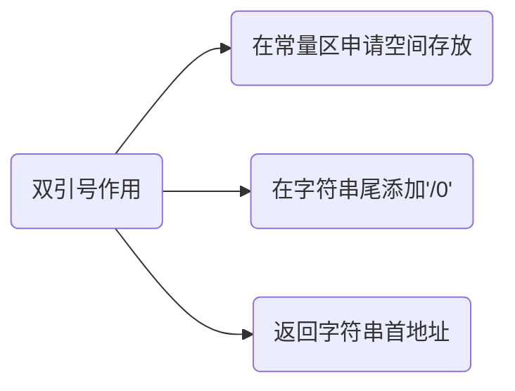
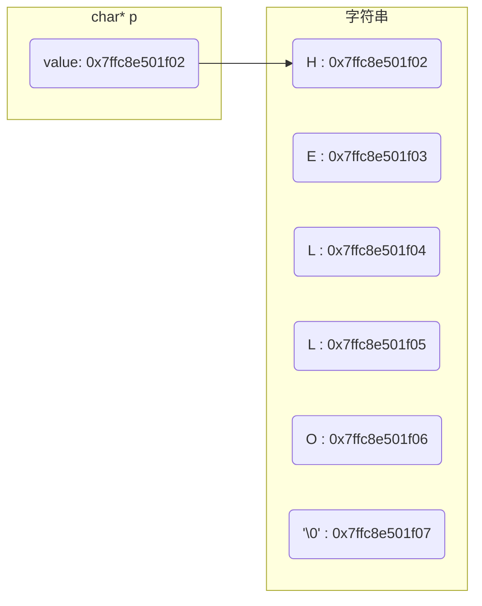

## 概念

### 声明

声明仅告诉编译器变量名称和类型, 不一定分配内存

变量可以声明`多次`

```c++
int i;

typedef int INT;

struct Node;
```

#### extern

```c
extern int var;
```

`extern`声明变量, 表示其已定义, 提示编译器遇到它时需在其它文件中寻找

### 定义

定义是给变量分配内存, 可以为变量赋初值

变量只能定义`一次`

c/c++ 中变量声明和定义区别并不大, 往往同时发生

```c++
// 声明 + 定义, 变量名为 value, 类型为 int, 分配 4 字节内存(不同编译器会有差异)
int value;

// 声明 + 定义
struct Node {
    int left;
    int right;
};

// 若给变量赋值, 即使有extern也是定义
extern int b = 10;
```

## 作用域

### 全局变量

```c
int g_value = 0xFF;
```

从静态存储区域分配, 作用域为全局, 生命周期与整个程序同在, 从程序开始到结束一直起作用

对于多源文件, 全局变量只需在一个文件中定义, 其他文件中通过`extern`声明后即可使用

#### 全局使用

- 示例, 使用全局变量

```c
// file_1.c
int g_value = 0xFF;
```

```c
// file_2.c
#include <stdio.h>

extern int g_value;

int main() {
    // 0xFF
    printf("%d\n", g_value);
    return 0;
}
```

### 全局静态变量

```c
static int g_value = 0xFF;
```

从静态存储区域分配, 作用域只在定义它的源文件内, 其他源文件不能使用

生命周期与整个程序同在, 从程序开始到结束一直起作用

#### 限制作用域

全局static变量只在定义它的文件内可见, 避免与其他文件中同名变量冲突

```c
// file_1.c
// 只能在当前文件访问
static int s_value = 10;

void modify_value() {
    s_value++;
}
```

```c
// file_2.c
#include <stdio.h>

// 无法访问, 因为s_value是static变量
extern int s_value;

int main() {
    printf("%d\n", s_value);
    return 0;
}
```

运行报错

```sh
undefined reference to `s_value'
```

### 局部变量

- 示例, 调用局部变量

```c
void func() {
    int i = 3;
}

// 错误
printf("%d\n", i);
```

从栈上分配, 作用域只在局部函数内, 出了函数局部变量就不再起作用

生命周期只和该函数同在

### 局部静态变量

```c
void func() {
    static int i = 3;
}

// 错误
printf("%d\n", i);
```

从静态存储区域分配, 作用域只在定义它的函数内可见, 出了该函数就不可见

生命周期与整个程序同在, 从程序开始到结束一直起作用

#### 保持状态

局部static变量在函数内部定义, 能够在多次调用之间保持其值, 它只在第一次调用时初始化, 之后调用将使用该变量的上一个值

- 示例, 打印static变量

```c
#include <stdio.h>

void counter() {
    // 初始化一次
    static int count = 0;
    // 会记录上次值
    count++;
    printf("count: %d\n", count);
}

int main() {
    counter();
    counter();
    counter();
    return 0;
}
```

```sh
count: 1
count: 2
count: 3
```

- 示例

```c
#include <stdio.h>
#include <malloc.h>

// 全局区 全局变量
int g_a = 1;
int g_b = 2;

// 全局区 静态变量
static int s_a = 3;
static int s_b = 4;

// 全局区 全局常变量
const int c_g_a = 5;
const int c_g_b = 6;

// 全局区 字符串常量
const char *s1 = "Hello World";

void test() {
    // 全局区 局部静态变量
    static int s_a = 3;
    static int s_b = 4;
    printf("局部静态变量 &s_a = %p\n", &s_a);
    printf("局部静态变量 &s_b = %p\n", &s_b);

    printf("-----------------栈区-----------------\n");
    // 栈区 局部变量
    int a = 1;
    int b = 2;
    printf("局部变量 &a = %p\n", &a);
    printf("局部变量 &b = %p\n", &b);

    const int c_a = 3;
    const int c_b = 4;
    printf("局部常量 &c_a = %p\n", &c_a);
    printf("局部常量 &c_b = %p\n", &c_b);

    printf("-----------------堆区-----------------\n");
    // 堆区
    char *p[3] = {NULL};
    for (int i = 0; i < 3; i++) {
        p[i] = (char *)malloc(4 * sizeof(char));
        printf("&p[%d] = %p\n", i, &p[i]);

        free(p[i]);
        p[i] = NULL;
    }
}

int main(void){
    printf("-----------------全局区-----------------\n");
    printf("全局变量 &g_a = %p\n", &g_a);
    printf("全局变量 &g_b = %p\n", &g_b);
    printf("全局静态变量 &s_a = %p\n", &s_a);
    printf("全局静态变量 &s_b = %p\n", &s_b);
    printf("全局常量 &c_g_a = %p\n", &c_g_a);
    printf("全局常量 &c_g_b = %p\n", &c_g_b);
    printf("全局字符串常量 &s = %p\n", &s1);

    test();
    return 0;
}
```

运行结果

```sh
-----------------全局区-----------------
全局变量 &g_a = 0x6198495bd010
全局变量 &g_b = 0x6198495bd014
全局静态变量 &s_a = 0x6198495bd018
全局静态变量 &s_b = 0x6198495bd01c
全局常量 &c_g_a = 0x6198495bb008
全局常量 &c_g_b = 0x6198495bb00c
全局字符串常量 &s = 0x6198495bd028
局部静态变量 &s_a = 0x6198495bd020
局部静态变量 &s_b = 0x6198495bd024
-----------------栈区-----------------
局部变量 &a = 0x7ffe6e5edd1c
局部变量 &b = 0x7ffe6e5edd20
局部常量 &c_a = 0x7ffe6e5edd24
局部常量 &c_b = 0x7ffe6e5edd28
-----------------堆区-----------------
&p[0] = 0x7ffe6e5edd30
&p[1] = 0x7ffe6e5edd38
&p[2] = 0x7ffe6e5edd40
```

## 类型

### 整形

#### 无符号类型

- unsigned int

无符号整型, 长32位

```c
unsigned int

uint32_t

// sizeof(uint32_t) = 32
```

- unsigned long long

```c
unsigned long long

unsigned long long int

uint64_t

// sizeof(uint64_t) = 64
```

- unsigned char

```c
unsigned char

uint8_t

// sizeof(uint8_t) = 8
```

### 浮点型

#### float

大小为4字节, 32位

#### double

大小为8字节, 64位

- 判断相等

```c
int a;
double b;

// 向下取整
printf("%.0lf\n", floor(a * b * 0.1));
```

- 相除余数

```c
double a, b;

scanf("%lf%lf", &a, &b);

int k = a / b;
double r = a - k * b;

printf("%g", r);
```

### 字符

`char`是字符数据类型, 占1个字节空间, 用于存储单个字符(如字母、数字或符号)

```c
char a = 'A';
```

变量a实际存储整数值65, 即'A'ASCII 码值

- 示例, 字符输入输出

```c
#include <stdio.h>

int main() {
    char a;
    scanf("%c", &a);
    printf("%c\n", a);

    return 0;
}
```

#### char[]

char[]是字符数组, 可存储多个字符, 以空字符`\0`作为结尾标志, 通常用以表示字符串

```c
char a[] = "HELLO";
```



#### '\0'

`'\0'`是 ASCII 码表中第 0 个字符, 它不能显示也无控制功能, 唯一作用是作为字符数组结束标志

##### 字符与字符串对比

'a'为字符, 单引号只能定义一个字符

"a" 为字符串, 双引号可以定义多个字符, 由`" "`所包围字符串会自动在末尾添加`'\0'`

##### 属性

字符数组长度可通过`strlen`函数获取, 不含`'\0'`

字符数组所占内存空间可通过`sizeof`关键字获取, 包含`'\0'`

- 示例, 打印字符数组长度和所占空间

```c
#include <stdio.h>
#include <string.h>

int main() {
    char a[] = "HELLO";
    int len_sizeof = sizeof(a);
    int len_strlen = strlen(a);

    // sizeof(a) = 6
    // strlen(a) = 5
    printf("sizeof(a) = %d\nstrlen(a) = %d\n", len_sizeof, len_strlen);
    return 0;
}
```

### char \*

`char *`字符指针, 存储字符变量地址或字符数组首地址

```c
// 将常量存储区字符串首地址赋值给p
char *p = "Hello";
```

- 示例, 定义字符指针指向字符串

```c
#include <stdio.h>
#include <string.h>

int main() {
    char a[] = "HELLO";
    char *p = a;
    printf("str first char's address = %p\n", p);
    for(int i = 0; i < strlen(a); i++) {
        printf("char address = %p, value = %c\n", &a[i], a[i]);
    }
    return 0;
}
```



##### const char *

`const char *` 是指向常量字符(存储常量地址), 指向字符内容不可修改(不能通过地址间接修改常量)

#### 使用

##### 显示

由于系统会先输出`char *`所指向字符串的首字符, 然后会自增指向下个字符, 直到`'\0'`

因此打印`char *`所指向字符串时, 不能用`*`, 否则只会输出首字符值

- 示例, 打印字符串

```c
#include <stdio.h>
#include <string.h>

int main() {
    char *p = "ABCDEF";
    // A
    printf("*p = %c\n", *p);
    // ABCDEF
    printf("p = %s\n", p);
    return 0;
}
```

##### 输入

输入时`char *`必须指向一段存在地址, 若未初始化调用, 运行时会报错 `Segmentation fault`

```c
char *p = (char *)malloc(sizeof(char) * 10);
scanf("%s", p);
```

##### 修改

- 指针在栈区, 分配字节在堆区, 可以通过指针修改

```c
char *p = (char *)malloc(sizeof(char) * 10);
scanf("%s", p);

// 可以
*(p + 2) = 'X';
```

- 指针在栈区, 字符串在常量区(只读), 不可修改

```c
char *p = "aaaaa";

// 错误, 指针只知道所指向内存单元地址, 而并不知道内存单元大小
*(p + 2) = 'X';
```

##### 转换

- `char[]` 到 `char *`

字符数组名(不带索引)可隐式转换为指向其首元素指针

#### 函数

包含头文件

```c
#include <string.h>
```

##### strcmp

比较两个字符串值

```c
int strcmp(const char *s1, const char *s2)
```

若 s1 = s2, 返回值 0

若 s1 < s2, 返回值小于 0

若 s1 > s2, 返回值大于 0

##### strstr

查找src在dest中首次出现位置并返回, 若未找到则返回NULL

```c
char *strstr(const char *dest, const char *src)
```

- 示例, strstr使用

```c
#include <stdio.h>
#include <string.h>

int main() {
    const char dest[20] = "RUNOOB";
    const char src[10] = "NOOB";
    // NOOB
    char *ret = strstr(dest, src);
    printf("%s\n", ret);
    return 0;
}
```

##### strcpy

把src所指向字符串复制到 dest所指向字符串

```c
char *strcpy(char *dest, const char *src)
```

- 示例, strcpy使用

```c
#include <stdio.h>
#include <string.h>

int main() {
    char dest[7] = "abcdef";
    char src[4] = "ABC";

    strcpy(dest, src);
    // ABC
    printf("%s\n", dest);
    return 0;
}
```

##### strcat

把 src 所指向字符串追加到 dest 所指向字符串结尾

```c
char *strcat(char *dest, const char *src)
```

- 示例, strcat使用

```c
#include <stdio.h>
#include <string.h>

int main() {
    char src[50];
    char dest[50];

    strcpy(src, "AAAA");
    strcpy(dest, "BBBB");
    strcat(dest, src);
    // BBBBAAAA
    printf("%s\n", dest);

    return 0;
}
```

##### strncpy

把 src 所指向字符串中最多n个字符复制到 dest 所指向字符串

当 src 长度小于 n 时, dest 剩余部分将用空字节填充

```c
char *strncpy(char *dest, const char *src, size_t n)
```

##### memset

将指定内存块前num个字符设置为value

```c
/**
* @brief 将指定内存块前num个字符设置为value
* @param ptr 指向要填充内存块指针
* @param value 要设置值(仅使用其低8位)
* @param num 要设置字节数
* @return 返回指向已填充内存块指针(与输入参数ptr相同)
* @note 使用时请确保ptr指向内存区域足够大, 以容纳num个字节. 否则可能会导致未定义行为(如内存越界)
* @example
* char buffer[10];
* // 将buffer所有字节设置为0
* memset(buffer, 0, sizeof(buffer));
*/
void *memset(void *ptr, int value, size_t num)
```
