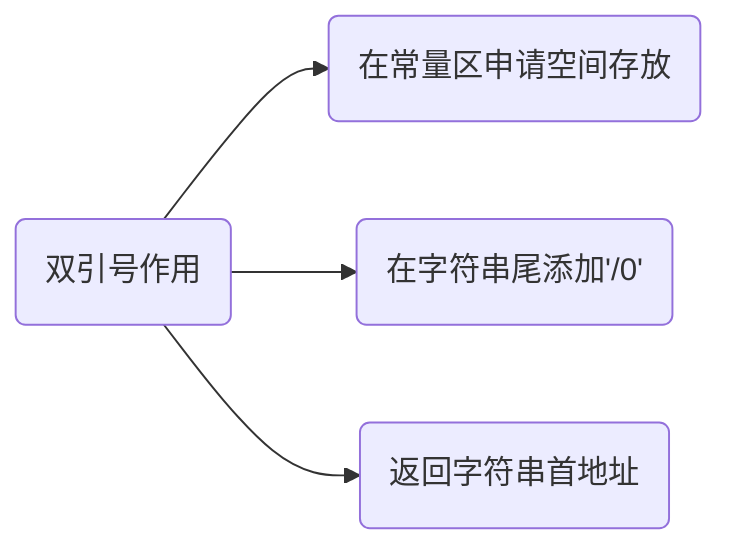
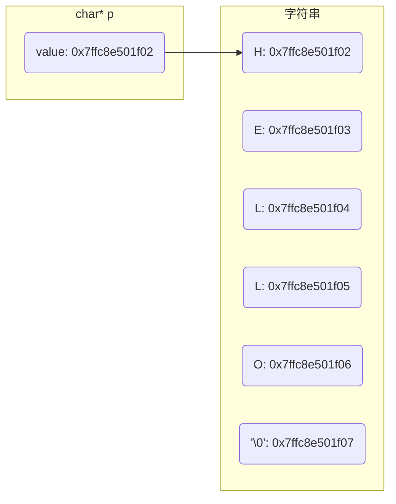

## 概念

### declaration(声明)

告知编译器变量的名称和类型, 不分配内存

变量可以被多次声明

```c++
// 声明整型变量i
int i;

// 声明类型别名
typedef int INT;

// 声明结构体类型
struct Node;
```

`extern` 声明, 告知编译器该变量在其他文件中定义, 当前文件只引用, 不分配内存

```c
extern int var;
```

### definition(定义)

为变量分配内存, 并可赋初值

变量在同一个作用域内只能定义一次

```c++
int i;             // 定义(未初始化)
int j = 10;        // 定义并初始化
extern int k = 20; // 带初始化的 extern 声明等同于定义
```

> 注: typedef 和 struct Node; 属于类型声明, 而非变量声明

## 作用域与生命周期

### 全局变量

全局变量在静态存储区分配内存, 作用域为整个程序, 生命周期从程序开始到结束

```c
int g_value = 1;
```

多个源文件, 全局变量只需在一个文件中定义, 其他文件中通过`extern`声明后即可使用

```c
// file_1.c
int g_value = 1;
```

```c
// main.c
#include <stdio.h>

extern int g_value;

int main() {
    printf("%d\n", g_value);
    return 0;
}
```

### 全局静态变量

从静态存储区域分配, 仅限当前源文件(内部链接), 避免与其他文件同名变量冲突

生命周期与整个程序同在

```c
static int g_value = 0xFF;
```

#### 限制作用域

生命周期与程序同在, 作用域仅限定义所在文件, 避免与其他文件同名变量冲突

```c
// file_1.c
// 只能在当前文件访问
static int s_value = 10;

void modify_value() {
    s_value++;
}
```

在main.c中无法访问到s_value

```c
// main.c
#include <stdio.h>

// 无法访问, 因为s_value是static变量
extern int s_value;

int main() {
    printf("%d\n", s_value);
    return 0;
}
```

运行报错

```sh
undefined reference to `s_value'
```

### 局部变量

栈上分配, 作用域仅在函数内部, 生命周期随函数调用开始而创建, 结束而销毁

```c
void func() {
    int i = 3;
}

// 错误
printf("%d\n", i);
```

### 局部静态变量

静态存储区分配, 作用域仅在函数内部, 生命周期程序运行期间, 只在第一次执行到该处时初始化, 后续调用保留上次的值


```c
#include <stdio.h>

void counter() {
    // 初始化一次
    static int count = 0;
    // 会记录上次值
    count++;
    printf("count: %d\n", count);
}

int main() {
    counter();
    counter();
    counter();

    return 0;
}
```

```sh
count: 1
count: 2
count: 3
```

### 内存分区示例

```c
#include <stdio.h>
#include <stdlib.h>

int g_var = 1;                  // 全局区(数据段)
static int g_static = 2;        // 全局区(数据段)
const int g_const = 3;          // 全局区(只读数据段/数据段, 视编译器而定)
const char *str = "Hello";      // str 在全局区, 指向只读数据段

void test_memory() {
    static int local_static = 4;// 全局区(数据段)
    int local_var = 5;          // 栈区
    char *heap_mem = (char *)malloc(10); // 堆区

    printf("全局变量: %p\n", (void*)&g_var);
    printf("全局静态: %p\n", (void*)&g_static);
    printf("字符串常量: %p\n", (void*)str); // 打印字符串所在的只读区地址
    printf("局部静态: %p\n", (void*)&local_static);
    printf("局部变量: %p\n", (void*)&local_var);
    printf("堆区内存: %p\n", (void*)heap_mem);

    free(heap_mem);
}
```

## 数据类型

### 整形

推荐使用 `<stdint.h>` 中的定长整型, 避免跨平台字节数差异

类型                              | 字节数 (sizeof)	| 位数	| 说明
----------------------------------|----------------|-------|-----------
`uint8_t` / `unsigned char`	      |`1`	           |`8`	   | 无符号 8 位
`uint32_t` / `unsigned int`	      |`4`	           |`32`   | 无符号 32 位
`uint64_t` / `unsigned long long` |`8`	           |`64`   | 无符号 64 位

### 浮点型

- `float`: `4` 字节(32 位)

- `double`: `8` 字节(64 位)

#### 判断相等

浮点数存在精度丢失, 绝对不能使用 `==` 直接比较, 应使用误差范围(epsilon)判断

```c
#include <math.h>
#define EPSILON 1e-6

double a = 0.1 + 0.2;
double b = 0.3;
if (fabs(a - b) < EPSILON) {
    printf("a 和 b 相等\n");
}
```

#### 浮点取余

浮点数不能直接使用 % 运算符, 需使用 `<math.h>` 中的 `fmod` 函数:

```c
#include <math.h>
double a = 5.5, b = 2.0;
double r = fmod(a, b); // 结果为 1.5

```

### 字符与字符串

`char`是字符数据类型, 占`1`个字节空间, 用于存储单个字符(如字母、数字或符号)

```c
char a = 'A';
```

变量a实际存储整数值65, 即`A`的ASCII 码值

- 示例, 字符输入输出

```c
#include <stdio.h>

int main() {
    char a;
    scanf("%c", &a);
    printf("%c\n", a);

    return 0;
}
```

#### char[]

`char[]`是字符数组, 可存储多个字符, 以空字符`\0`作为结尾标志, 通常用以表示字符串

```c
char a[] = "HELLO";
```


```mermaid
graph LR;
    A(双引号作用)
    A-->B(在常量区申请空间存放)
    A-->C(在字符串尾添加'/0')
    A-->D(返回字符串首地址)
```

- `'\0'`

`'\0'`是 `ASCII` 码表中第 `0` 个字符, 它不能显示也无控制功能, 唯一作用是作为字符数组结束标志

- 字符与字符串对比

`'a'`为字符, 单引号只能定义一个字符

`"a"` 为字符串, 双引号可以定义多个字符, 由`" "`所包围字符串会自动在末尾添加`'\0'`

- 属性

字符数组长度可通过`strlen`函数获取, 不含`'\0'`

字符数组所占内存空间可通过`sizeof`关键字获取, 包含`'\0'`

```c
#include <stdio.h>
#include <string.h>

int main() {
    char a[] = "HELLO";
    int len_sizeof = sizeof(a);
    int len_strlen = strlen(a);

    // sizeof(a) = 6
    // strlen(a) = 5
    printf("sizeof(a) = %d\nstrlen(a) = %d\n", len_sizeof, len_strlen);

    return 0;
}
```

### char \*

`char *`字符指针, 存储字符变量地址或字符数组首地址

```c
// 将常量存储区字符串首地址赋值给p
char *p = "Hello";
```

```c
#include <stdio.h>
#include <string.h>

int main() {
    char a[] = "HELLO";
    char *p = a;
    printf("str first char's address = %p\n", p);
    for(int i = 0; i < strlen(a); i++) {
        printf("char address = %p, value = %c\n", &a[i], a[i]);
    }
    return 0;
}
```


```mermaid
graph LR
    subgraph 字符串
        direction TB
        a0(H: 0x7ffc8e501f02)
        a1(E: 0x7ffc8e501f03)
        a2(L: 0x7ffc8e501f04)
        a3(L: 0x7ffc8e501f05)
        a4(O: 0x7ffc8e501f06)
        a5('\0': 0x7ffc8e501f07)
    end
    subgraph char* p
        v(value: 0x7ffc8e501f02)
    end
    v-->a0
```

- `const char *`

`const char *` 是指向常量字符(存储常量地址), 指向字符内容不可修改(不能通过地址间接修改常量)

#### 使用

- 显示

由于系统会先输出`char *`所指向字符串的首字符, 然后会自增指向下个字符, 直到`'\0'`

因此打印`char *`所指向字符串时, 不能用`*`, 否则只会输出首字符值

```c
#include <stdio.h>
#include <string.h>

int main() {
    char *p = "ABCDEF";
    // A
    printf("*p = %c\n", *p);
    // ABCDEF
    printf("p = %s\n", p);
    return 0;
}
```

- 输入

输入时`char *`必须指向一段存在地址, 若未初始化调用, 运行时会报错 `Segmentation fault`

```c
char *p = (char *)malloc(sizeof(char) * 10);
scanf("%s", p);
```

- 修改

1. 指针在栈区, 分配字节在堆区, 可以通过指针修改

```c
char *p = (char *)malloc(sizeof(char) * 10);
scanf("%s", p);

// 可以
*(p + 2) = 'X';
```

2. 指针在栈区, 字符串在常量区(只读), 不可修改

```c
char *p = "aaaaa";

// 错误, 指针只知道所指向内存单元地址, 而并不知道内存单元大小
*(p + 2) = 'X';
```

- 转换

`char[]` 到 `char *`

字符数组名(不带索引)可隐式转换为指向其首元素指针

#### 字符串处理函数

使用前需包含头文件 `#include <string.h>`

- `strcmp`

比较两个字符串值

```c
int strcmp(const char *s1, const char *s2)
```

若 s1 = s2, 返回值 0

若 s1 < s2, 返回值小于 0

若 s1 > s2, 返回值大于 0

- `strstr`

查找src在dest中首次出现位置并返回, 若未找到则返回NULL

```c
char *strstr(const char *dest, const char *src)
```

```c
#include <stdio.h>
#include <string.h>

int main() {
    const char dest[20] = "RUNOOB";
    const char src[10] = "NOOB";
    // NOOB
    char *ret = strstr(dest, src);
    printf("%s\n", ret);
    return 0;
}
```

- `strcpy`

把src所指向字符串复制到 dest所指向字符串

```c
char *strcpy(char *dest, const char *src)
```

```c
#include <stdio.h>
#include <string.h>

int main() {
    char dest[7] = "abcdef";
    char src[4] = "ABC";

    strcpy(dest, src);
    // ABC
    printf("%s\n", dest);

    return 0;
}
```

- `strcat`

把 src 所指向字符串追加到 dest 所指向字符串结尾

```c
char *strcat(char *dest, const char *src)
```

```c
#include <stdio.h>
#include <string.h>

int main() {
    char src[50];
    char dest[50];

    strcpy(src, "AAAA");
    strcpy(dest, "BBBB");
    strcat(dest, src);
    // BBBBAAAA
    printf("%s\n", dest);

    return 0;
}
```

- `strncpy`

把 src 所指向字符串中最多n个字符复制到 dest 所指向字符串

当 src 长度小于 n 时, dest 剩余部分将用空字节填充

```c
char *strncpy(char *dest, const char *src, size_t n)
```

- `memset`

将指定内存块前num个字符设置为value

```c
/**
* @brief 将指定内存块前num个字符设置为value
* @param ptr 指向要填充内存块指针
* @param value 要设置值(仅使用其低8位)
* @param num 要设置字节数
* @return 返回指向已填充内存块指针(与输入参数ptr相同)
* @note 使用时请确保ptr指向内存区域足够大, 以容纳num个字节. 否则可能会导致未定义行为(如内存越界)
* @example
* char buffer[10];
* // 将buffer所有字节设置为0
* memset(buffer, 0, sizeof(buffer));
*/
void *memset(void *ptr, int value, size_t num)
```
