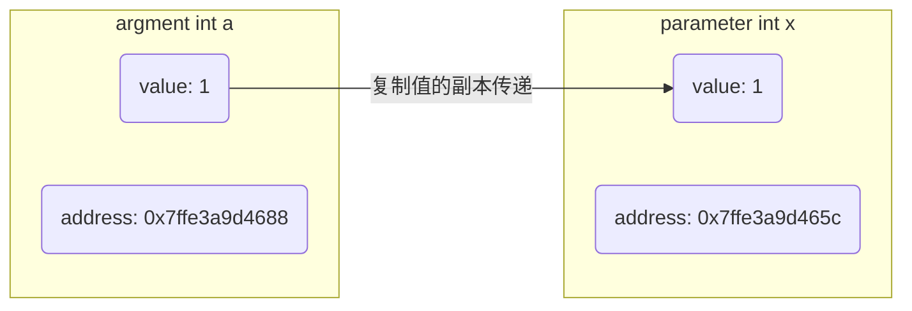
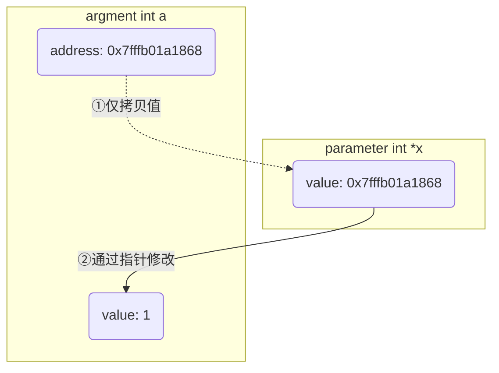
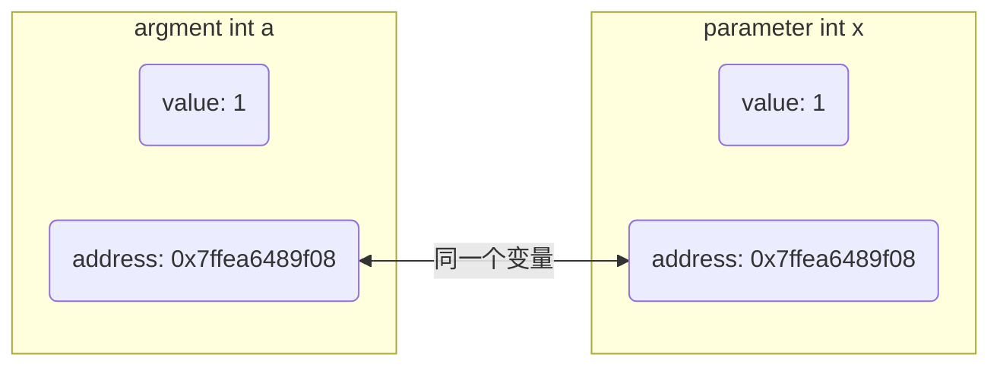

函数是一段独立代码块, 用以执行特定任务或计算, 并可能返回结果

```c
void hello() {
    printf("hello world\n");
}
```

## 概念

### 组成

- 示例, 求和函数

```c
int add(int x, int y) {
    return x + y
}
```

- 函数头, 由三部分组成

返回类型: 指定函数返回值类型, 可为 `void`

函数名: 标识符, 用于调用函数

参数列表: 括号内列出输入参数类型和名称

- 函数体

包含执行任务的语句序列, 并以 `return`(如果有返回值)或大括号结束

例如, 对于上述求和函数, 其返回类型为`int`, 函数名为`add`, 包含两个`int`类型参数

### 声明与定义

#### 声明

函数声明是告诉编译器函数接口信息, 不包含实现代码, 通常出现在`.h`中

- 示例, 声明add函数

```c++
// add_module.h
#ifndef __ADD_MODULE_H__
#define __ADD_MODULE_H__

int add(int x, int y);

#endif // __ADD_MODULE_H__
```

#### 定义

函数定义包含函数完整实现, 通常出现在`.c`/`.cpp` 中

- 示例, 定义`add`函数

```c++
#include "add_module.h"

int add(int x, int y) {
    return x + y;
}
```

#### 联系

声明提供函数接口信息, 定义实现功能

二者必须保持一致: 函数名、返回类型、参数类型和顺序一致

#### 区别

函数声明不分配存储空间, 只告诉编译器函数存在和接口信息

函数定义则分配存储空间, 并包含函数完整实现代码

## 参数

- 示例, add函数

```c
int add(int x, int y) {
    return x + y;
}

int a = 1;
int b = 2;

int r = add(a, b);
```

- `parameter`

例如示例中`x`、`y`, 指函数定义中所使用的参数、占位符, 用于在函数体内引用传入数据作用域仅在函数内部

- `argument`

例如示例中`a`、`b`, 指函数调用时传入的实际参数, 与`parameter`一一对应

### 参数传递

在函数调用时, `argument`值转递给`parameter`值, 传递方式分为:

#### pass by value(值传递)

调用时, 复制`argument`的副本传递给`parameter`, 所以操作`parameter`不会影响原本`argument`

值传递适用于基本数据类型(如 `int`, `float`, `char` 等)和`struct`

- 示例, 值传递示例

```c
#include <stdio.h>

void add(int x) {
    printf("parameter x address = %p\n", &x);
    x += 1;
}

int main() {
    int a = 1;
    printf("argument a address = %p\n", &x);

    add(a);
    printf("a = %d\n", a);

    return 0;
}
```

运行结果

```sh
argument a address = 0x7ffe3a9d4688
parameter x address = 0x7ffe3a9d465c
a = 1
```

可见`argument`与`parameter`变量地址不同, 说明是两个变量, 因此函数内部对变量x的操作不会影响变量a



- 优点

函数内部对参数修改不会影响到外部值

提供参数封装性, 使函数可以安全地使用参数而不必担心外部副作用

- 缺点

对于大型结构体或类实例, 因为需要复制整个对象, 拷贝可能会导致性能问题

无法直接修改调用者变量

#### pass by pointer(指针传递)

本质上还是一种值传递, 函数接收变量地址, 但是可通过指针的特性使得修改`parameter`间接影响`argument`

```c
#include <stdio.h>

void add(int *x) {
    printf("parameter x value = %p\n", x);
    *x += 1;
}

int main() {
    int a = 1;
    printf("argument a address = %p\n", &a);

    add(&a);
    printf("a = %d\n", a);

    return 0;
}
```

运行结果

```sh
argment a address = 0x7fffb01a1868
parameter x value = 0x7fffb01a1868
a = 2
```

`argument`和`parameter`类型为指针, 函数调用时会传递变量地址值拷贝, `parameter`可通过指针特性间接操作`argument`变量, 因此在函数内可以通过指针修改指向对象内容



#### pass by reference(引用传递)

引用传递, `parameter`和`argument`是同一个变量, 对`parameter`修改会影响`argument`



```c
#include <iostream>

void add(int &x) {
    printf("parameter x address = %p\n", &x);
    x += 1;
}

int main() {
    int a = 1;

    printf("argment a address = %p\n", &a);
    add(a);
    printf("a = %d\n", a);

    return 0;
}
```

运行结果

```sh
argment a address = 0x7ffea6489f08
parameter x address = 0x7ffea6489f08
a = 2
```

## 特殊函数

### 内联函数

内联函数是在编译时展开到调用点的函数, 以减少函数调用开销, 通常用于短小且频繁调用函数

```c
inline int add(int x, int y) {
    return x + y;
}
```

### lambda函数

可作为参数传递或立即调用

```c++
auto sum = [](int a, int b) { return a + b; };
cout << sum(2, 3);
```

### 模板函数

```c++
template<typename T>
T add(T a, T b) { return a + b; }
```

### c变长参数

```c
#include <stdarg.h>
```

```c++
void func(char *fmt, ...)
```

```c
#include <stdio.h>
#include <stdarg.h>

void mini_print(char *fmt, ...) {
    va_list ap;
    va_start(ap, fmt);
    for (char* p = fmt; *p; p++) {
        if (*p == '%' && *(p+1)) {
            p++;
            if (*p == 'd') printf("%d", va_arg(ap,int));
            else if (*p == 'f') printf("%f", va_arg(ap,double));
            else if (*p == 's') printf("%s", va_arg(ap,char*));
        } else putchar(*p);
    }
    va_end(ap);
}

int main() {
    mini_print("name=%s, age=%d, weight=%f\n", "dmjcb", 21, 98.2);

    return 0;
}
```

## function stack frame 函数栈帧

函数调用栈帧(`function stack frame`)是在程序执行过程中当函数调用发生时, 由操作系统或运行时环境为该函数所分配一块内存区域

用于存储函中局部变量、参数、返回地址等信息, 为函数执行提供必要环境

### 功能

存储局部变量、函数参数

存储返回地址, 支持函数返回

支持递归与嵌套调用, 保证独立空间

### 结构

- 局部变量区: 函数内部变量

- 参数区: 存储调用参数

- 返回地址区: 存储函数返回位置

- 帧指针 (`frame pointer`): 指向栈帧底部

- 寄存器: 基址指针 `%ebp`/`%rbp`、栈指针 `%esp`/`%rsp`

## 函数调用过程

调用函数时, 系统在栈中创建栈帧

参数压栈、返回地址压栈

局部变量分配在栈帧内

函数执行完毕后返回, 弹出栈帧

### 调试

```sh
clang *.c -g -o 可执行程序
```

```sh
lldb 可执行程序
```

#### 设置断点运行

```sh
break 函数名
```

```sh
run
```

#### 查看调用栈

使用`backtrace`(或简写为bt)命令来查看当前函数调用栈

显示一个函数调用栈列表, 包括每个函数名称和地址

#### 切换特定栈帧

使用`frame`命令来切换到特定栈帧

例如, `frame N`会切换到编号为`N`栈帧

#### 查看栈帧信息

`info frame`, 查看当前栈帧详细信息, 包括栈帧地址、大小和上一个栈帧指针等

`info args` 查看当前函数参数

`info locals` 查看当前函数局部变量

`info registers` 查看当前寄存器值

- 示例, gdb显示栈帧

```c
// main.c
#include <stdio.h>

int add(int a, int b) {
    int sum = a + b;
    return sum;
}

int main() {
    int result = add(3, 5);
    printf("result = %d\n", result);

    return 0;
}
```

编译为可执行文件

```sh
gcc main.c -c -o main
```

gdb调试

```sh
gdb main
```

终端输出

```sh
GNU gdb (Ubuntu 15.0.50.20240403-0ubuntu1) 15.0.50.20240403-git
Copyright (C) 2024 Free Software Foundation, Inc.
License GPLv3+: GNU GPL version 3 or later <http://gnu.org/licenses/gpl.html>
This is free software: you are free to change and redistribute it.
There is NO WARRANTY, to the extent permitted by law.
Type "show copying" and "show warranty" for details.
This GDB was configured as "x86_64-linux-gnu".
Type "show configuration" for configuration details.
For bug reporting instructions, please see:
<https://www.gnu.org/software/gdb/bugs/>.
Find the GDB manual and other documentation resources online at:
    <http://www.gnu.org/software/gdb/documentation/>.

For help, type "help".
Type "apropos word" to search for commands related to "word"...
Reading symbols from main...
(No debugging symbols found in main)
```

在main()设置断点

```sh
break main
```

终端输出

```sh
Breakpoint 1 at 0x116f
```

运行

```sh
run
```

终端输出

```sh
The program being debugged has been started already.
Start it from the beginning? (y or n) y
Starting program: /home/dmjcb/Documents/code/main
[Thread debugging using libthread_db enabled]
Using host libthread_db library "/lib/x86_64-linux-gnu/libthread_db.so.1".

Breakpoint 1, 0x000055555555516f in main ()
```

显示frame

```sh
info frame
```

```sh
Stack level 0, frame at 0x7fffffffdb30:
 rip = 0x55555555516f in main; saved rip = 0x7ffff7c2a1ca
 Arglist at 0x7fffffffdb20, args:
 Locals at 0x7fffffffdb20, Previous frame's sp is 0x7fffffffdb30
 Saved registers:
  rbp at 0x7fffffffdb20, rip at 0x7fffffffdb28
```

(1) main函数被调用时, 系统会创建一个栈帧, 包含main函数局部变量和参数

(2) main函数中调用Add函数时, 会将add函数参数3和5压入栈中, 并将add函数返回地址也压入栈中

(3) 系统会为Add函数创建一个新栈帧, 包含add函数局部变量(如sum)和参数(从栈中弹出3和5)

(4) add函数执行完毕后, 会将结果8放入其栈帧返回位置, 并弹出其栈帧, 返回到main函数

(5) main函数从栈中弹出add函数返回值8, 并将其存储在局部变量result中

(6) 最后main函数打印出结果并返回
