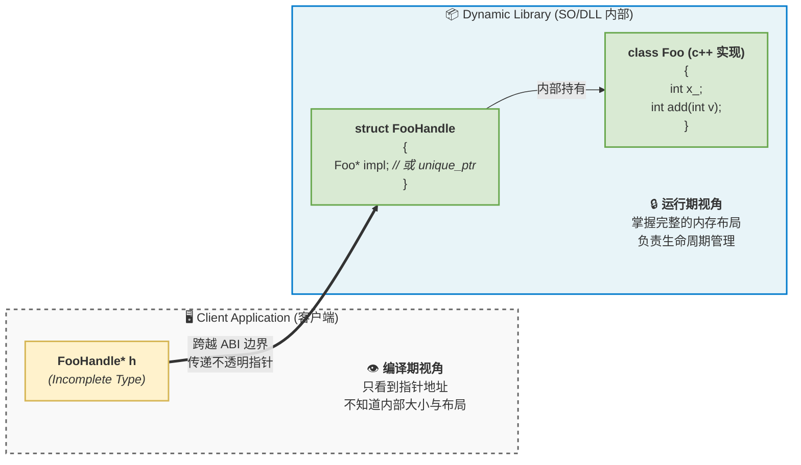
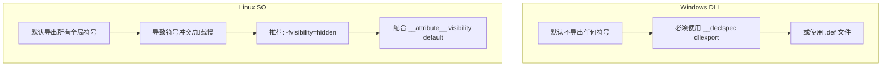

## 定义

### API

`API`(`application programming interface`)是人与人、源码与源码之间的契约, 决定程序员如何调用代码

受众是开发者和编译器的前端

#### 表现形式

- 头文件 (`.h` / `.hpp`): 

函数签名、类定义、宏定义、枚举

- 文档

参数说明、返回值含义、线程安全性、错误码约定

#### 规定

- 逻辑语义

这个函数叫什么名字？需要传入什么类型的数据？会返回什么结果？

- 抽象边界

隐藏了内部的实现细节(黑盒), 只暴露功能

```c
// API 契约: 计算两个整数的和
int add(int a, int b); 
```

程序员看到只需要写 add(3, 5) 即可, 不需要关心底层实现

#### 破坏 API 后果

编译期阻断

如果把 `add(int a, int b)` 改成了 `add(int a, int b, int c)`, 旧代码在编译阶段就会直接报错(`error: too few arguments to function`)

解决方式: 修改源码, 重新编译

### ABI

`ABI`(`application binary interface`) 是机器与机器、模块与模块之间的契约, 决定了编译器、链接器、加载器和操作系统如何执行代码, 受众是编译器后端、链接器、OS内核和CPU

当源代码被编译成机器码后, API 就消失了, 取而代之的是 ABI

#### ABI 约束

- 编译器 (compiler)

决定指令如何生成

编译器必须遵循 ABI 才能生成正确的机器码

ABI 规定了: 

(1) 调用约定 (calling convention)

参数是放在寄存器还是压入栈中？是由调用者还是被调用者清理栈？

例如: x86_64 Linux (System V ABI) 规定前 6 个整数参数放入 rdi, rsi, rdx, rcx, r8, r9；而 Windows x64 ABI 规定放入 rcx, rdx, r8, r9

(2) `data layout`: 结构体的内存对齐规则(Padding)、大小端序(Endianness)

(3) `name mangling`: c++ 编译器如何将 void foo(int) 编码为 _Z3fooi, 以便链接器识别重载函数

(4) `object model`: c++ 虚函数表(vtable)的内存结构、RTTI 的布局、异常处理(如 DWARF 或 SEH)的底层实现

- 链接器 (linker)

决定符号如何拼接

(1) 目标文件格式: ABI 定义了 `.o` / `.obj` 结构(如 ELF、PE/COFF、Mach-O)

(2) 符号解析: 链接器根据 ABI 规定的符号表格式, 将多个目标文件"缝合"在一起

如果两个库的 c++ ABI 不同(比如 `gcc` 和 `MSVC` 编译的), 链接器会因为找不到匹配符号而报 `undefined reference` 错误

- 加载器 (loader)

决定运行时如何映射

(1) 动态链接: 当程序运行时, 操作系统的加载器(如 Linux 的 `ld-linux.so`)负责将 `.so` / `.dll` 映射到内存

(2) 重定位 (relocation): 加载器根据 ABI 规定的 PLT(过程链接表)和 GOT(全局偏移表)机制, 在运行时动态绑定函数地址

- 操作系统 (OS)

决定如何与硬件/内核交互

(1) 系统调用 (system call): 用户态程序如何陷入内核态？ABI 规定了触发中断的指令(如 int 0x80 或 syscall)以及系统调用号(如 sys_read 是 0 还是 3)和参数传递的寄存器

(2) 进程初始化: 程序启动时, 栈的初始布局是什么样的？环境变量和命令行参数在栈顶如何排列？

### 破坏

- 场景

操作	                         | 为什么破坏 ABI?
------------------------------- | -----------------------------------------------------------------------
❌ 改函数参数顺序	            | 导致寄存器/栈中的参数错位, 读取到垃圾数据
❌ 改参数类型 (如`int` → `long`)	| 在 `64` 位系统上, `int` 是 `4` 字节, `long` 是 `8` 字节, 导致栈帧偏移错乱
❌ 改返回类型	                | 调用方预期的返回值寄存器(如 EAX vs EDX:EAX)或内存写入位置发生改变
❌ 删除导出函数	                | 客户端在加载动态库时找不到符号, 直接导致 `LoadLibrary/dlopen` 失败
❌ 改 `struct` 布局	            | 在中间插入字段会导致后续字段的内存偏移量(`offset`)全部改变
❌ 改 `enum` 值含义	            | 虽然二进制没变, 但逻辑语义改变, 属于隐式 ABI 破坏
❌ 增删虚函数 (c++)	            | 导致 `vtable` 布局改变, 虚函数调用会跳转到错误地址(直接 segfault)

✅ 以下操作 = ABI 安全

操作	                     | 为什么安全？
---------------------------- | --------------------------------------------------------
✔ 新增函数	                 | 旧客户端根本不知道新函数的存在, 不影响原有符号和布局
✔ 新增 `enum` 值 (不改旧值)	  | 旧客户端依然使用旧的整数值, 逻辑不受影响
✔ 新增 `struct` 字段 (在末尾) | 只要配合 size 字段或保证向后兼容, 旧代码访问旧偏移量依然安全
✔ 修复实现 bug	             | 只要函数签名和内存布局不变, 内部逻辑修改是绝对安全的

- 破坏后果

运行期灾难

如果修改结构体内部字段顺序, 或改变虚函数声明顺序, 源码依然能完美编译通过(因API 没变)

但在运行时, 旧二进制程序会去错误的内存偏移量读取数据, 或者跳转到错误虚函数地址, 直接导致 `segmentation fault` 或数据损坏

- 解决方式

必须将所有依赖该库的下游代码全部重新编译(这在大型项目中是灾难性的)


## 安全策略

如何设计健壮的 `c ABI`

`c++` 的 ABI 是极其脆弱且未标准化的(`gcc` 和 `MSVC` 的 `c++` `ABI` 完全不同)

因此工业界跨平台/跨语言暴露接口的黄金法则是: 永远只暴露 `c` `ABI`

### opaque handle(不透明指针/句柄模式)

最经典的 `c ABI` 封装模式(类似 c 中 `pimpl` 模式)

通过暴露一个不完整的结构体指针, 将 `c++` 的实现细节完全隐藏在 `.cpp` 文件中

头文件设计 (暴露给客户端)

```c++
// foo_c_api.h
#pragma once

#ifdef _WIN32
    #ifdef FOO_EXPORTS
        #define FOO_API __declspec(dllexport)
    #else
        #define FOO_API __declspec(dllimport)
    #endif
#else
    #define FOO_API __attribute__((visibility("default")))
#endif

#ifdef __cplusplus
extern "C" {
#endif

// 1. 声明不透明句柄(Incomplete Type)
typedef struct FooHandle FooHandle;

// 2. 生命周期管理
FOO_API FooHandle* foo_create(int x);
FOO_API void foo_destroy(FooHandle* h);

// 3. 业务接口
FOO_API int foo_add(FooHandle* h, int v);

#ifdef __cplusplus
}
#endif

```

内部实现 (c++ 侧)

```c++
// foo.cpp
// foo.cpp
#include "foo_c_api.h"
#include <iostream>
#include <memory>

// 内部 c++ 类, 客户端完全不可见
class Foo {
public:
    explicit Foo(int x) : x_(x) {}
    int add(int v) { return x_ + v; }
private:
    int x_;
};

// 完整定义不透明句柄
struct FooHandle {
    std::unique_ptr<Foo> impl; // 使用智能指针管理生命周期
};

extern "C" {

FOO_API FooHandle* foo_create(int x) {
    try {
        auto* handle = new FooHandle();
        handle->impl = std::make_unique<Foo>(x);
        return handle;
    } catch (...) {
        return nullptr; // C ABI 边界必须捕获所有异常
    }
}

FOO_API void foo_destroy(FooHandle* h) {
    delete h; // unique_ptr 会自动清理内部 Foo 对象
}

FOO_API int foo_add(FooHandle* h, int v) {
    try {
        if (!h || !h->impl) return -1;
        return h->impl->add(v);
    } catch (...) {
        return -1; // 返回错误码
    }
}

} // extern "C"

```

图解 Opaque Handle 内存边界: 



### struct Versioning (结构体版本化)

当需要传递复杂配置时, 直接传递结构体容易因为后续增加字段而破坏 ABI

❌ 天真写法(不可扩展)

```c
typedef struct {
    int a;
    int b;
} FooConfig;
// 如果未来加了 int c, 旧版客户端传入的内存大小不够, 读取 c 会越界！
```

✅ 工业级写法(带 size 和 version)

```c++
#include <stdint.h>
#include <stddef.h>

typedef struct {
    uint32_t size;      // 【必须】结构体的实际字节大小
    uint32_t version;   // 【可选】结构体的版本号
    int a;
    int b;
    // 未来可以在这里安全地追加字段: int c;
} FooConfig;

```

客户端使用方式

```c++
FooConfig cfg = {0};
cfg.size = sizeof(FooConfig); // 让库知道客户端编译时的结构体大小
cfg.version = 1;
cfg.a = 10;
cfg.b = 20;

foo_init(&cfg);
```

c++ 内部安全解析

```c
extern "C" FOO_API void foo_init(const FooConfig* cfg) {
    if (!cfg || cfg->size < offsetof(FooConfig, a) + sizeof(int)) {
        return; // 连最基础的字段都不完整, 直接拒绝
    }

    int a_val = cfg->a;
    int b_val = 0;
    
    // 安全访问 b: 检查客户端传入的 size 是否包含了 b 的偏移量
    if (cfg->size >= offsetof(FooConfig, b) + sizeof(int)) {
        b_val = cfg->b;
    }

    // 假设未来新增了 int c;
    int c_val = 0;
    // if (cfg->size >= offsetof(FooConfig, c) + sizeof(int)) { c_val = cfg->c; }
    
    // 业务逻辑...
}
```

### 核心 FAQ: C/c++ ABI

- 为什么不用 `c++ class` 直接导出?

c++ 没有标准 ABI

`MSVC` 和 `gcc` 的虚函数表(`vtable`)布局、异常处理机制、名字修饰完全不同, 甚至同一个编译器的不同版本(如 `gcc 4` 和 `gcc 5`) `ABI` 都不兼容

- `extern "C"` 解决了什么?

解决`name mangling`问题, 让 c++ 函数拥有 c 风格符号名

不解决调用约定、数据布局、异常和 STL 的 ABI 复杂性

- 为什么用不透明指针?

1. 隐藏实现: 客户端不需要包含内部类的头文件
   
2. ABI 稳定: 内部类增加字段、改变大小, 不会影响客户端编译出的二进制文件(因为客户端只存一个指针)

- c 能不能 new/delete?

❌ 绝对不能

c 没有 `new`/`delete`, 更重要的是, 跨模块的内存分配必须遵循"谁分配, 谁释放"原则, 否则会导致堆损坏

- `c++` 异常怎么处理?

c 没有异常机制(只有 `setjmp`/`longjmp`)

如果 `c++` 异常穿透了 `extern "C"` 边界, 会导致程序直接 `std::terminate` 崩溃

必须在边界处 `catch(...)` 并转换为错误码返回

- `STL` 能不能出现在头文件?

❌ 绝对不行

`std::string`、`std::vector` 的内部实现在不同编译器/标准库(`libstdc++` / `libc++`)中完全不同

头文件中只能出现 c 原生类型(`int`, `char*`, `struct`)

## 差异

虽然 C ABI 是跨平台的, 但动态库的构建和加载机制在 Windows 和 Linux 上有显著差异



跨平台宏定义最佳实践: 

```c++
#if defined(_WIN32) || defined(_WIN64)
    #ifdef MYLIB_EXPORTS
        #define MYLIB_API __declspec(dllexport)
    #else
        #define MYLIB_API __declspec(dllimport)
    #endif
#else
    #define MYLIB_API __attribute__((visibility("default")))
#endif
```

## 跨 SO 内存分配策略 (malloc/new 问题)

这是 c/c++ 动态库开发中最容易导致 segfault 的深水区

- 核心问题: heap corruption

在 `windows` 下, 如果 `.dll` 和 `.exe` 链接了不同的 `c runtime`(例如 exe 用了 /MT 静态链接, dll 用了 /MD 动态链接), 它们拥有各自独立的堆(heap)

如果在 `.dll` 中 `malloc` 分配内存, 在 `.exe` 中 `free`, 会因为跨堆释放直接导致程序崩溃

`linux`下如果使用 `jemalloc` 或 `tcmalloc` 等自定义分配器, 也会遇到类似问题

- 解决方案

方案 1: 谁分配谁释放(推荐)

永远不要让用户去 free 返回的指针, 而是提供配套的销毁函数

```c
// 正确做法
FOO_API char* foo_get_name(FooHandle* h);      // 内部分配
FOO_API void foo_free_string(char* str);       // 内部释放

// 客户端
char* name = foo_get_name(h);
printf("%s", name);
foo_free_string(name); // 绝对不能直接 free(name)
```

- 方案 2: 客户端提供 buffer

让客户端分配内存, 库只负责填充, 彻底避免跨模块分配

```c
// 库接口
FOO_API int foo_get_name(FooHandle* h, char* buffer, int buffer_size);

// 客户端
char buf[256];
foo_get_name(h, buf, sizeof(buf));
```

方案 3: 统一 CRT (仅限 Windows)

强制要求 exe 和所有 dll 都使用 /MD(动态链接多线程 CRT), 确保大家共用 msvcrt.dll 中的同一个堆

但这限制了库的部署灵活性

## dlopen + ABI 运行时检测

在插件系统中, 常常需要在运行时动态加载 `.so` / `.dll`

如果插件是用旧版 ABI 编译的, 直接加载可能会导致崩溃

可以通过导出版本检测函数来实现安全的 ABI 握手

1. 库侧: 导出 ABI 版本接口

```c
// 定义当前的 ABI 版本
#define FOO_ABI_VERSION_MAJOR 2
#define FOO_ABI_VERSION_MINOR 1

// 导出获取版本的函数
FOO_API uint32_t foo_get_abi_version() {
    return (FOO_ABI_VERSION_MAJOR << 16) | FOO_ABI_VERSION_MINOR;
}

```

2. 宿主侧: 动态加载与检测 (Linux dlopen 示例)

```c++
#include <dlfcn.h>
#include <iostream>
#include <cstdint>

typedef uint32_t (*GetAbiVersionFunc)();
typedef void* (*CreateFunc)(int);

int main() {
    // 1. 动态加载
    void* handle = dlopen("./libfoo.so", RTLD_NOW | RTLD_LOCAL);
    if (!handle) {
        std::cerr << "Load failed: " << dlerror() << std::endl;
        return -1;
    }

    // 2. 获取 ABI 版本检测函数
    auto get_version = (GetAbiVersionFunc)dlsym(handle, "foo_get_abi_version");
    if (!get_version) {
        std::cerr << "Symbol not found: foo_get_abi_version" << std::endl;
        dlclose(handle);
        return -1;
    }

    // 3. 校验 ABI 兼容性 (这里假设 Major 版本必须一致)
    uint32_t plugin_version = get_version();
    uint32_t plugin_major = plugin_version >> 16;
    
    if (plugin_major != FOO_ABI_VERSION_MAJOR) {
        std::cerr << "ABI Mismatch! Expected Major: " << FOO_ABI_VERSION_MAJOR 
                  << ", Got: " << plugin_major << std::endl;
        dlclose(handle);
        return -1; // 拒绝加载不兼容的插件
    }

    // 4. 安全获取业务函数并使用
    auto create_func = (CreateFunc)dlsym(handle, "foo_create");
    if (create_func) {
        void* obj = create_func(42);
        std::cout << "Plugin loaded and object created successfully!" << std::endl;
        // ... 使用 obj ...
    }

    dlclose(handle);
    return 0;
}
```

### 总结

设计一个健壮的 C/c++ 跨平台动态库, 核心原则可以浓缩为以下几点: 

- C ABI 是唯一的跨平台通用语言

头文件只用 C 语法, 用 `extern "C"` 包裹

- 隐藏一切实现细节

使用 opaque handle(不透明指针)隔离 c++ 对象布局

- 防御性内存管理

坚持"谁分配谁释放", 绝不在边界传递 STL 容器

- 敬畏异常

在 `extern "C"` 边界捕获所有 c++ 异常, 转换为错误码

- 为未来留后路

结构体传递必须带 size 字段, 动态加载必须进行 ABI 版本握手

掌握这些原则, 就能写出像 SQLite、OpenGL、Vulkan 那样生命周期长达数十年、ABI 坚如磐石的工业级 `C/c++` 库