> 参考
>
> - [cmake使用详细教程(日常使用这一篇就足够了)](https://blog.csdn.net/iuu77/article/details/129229361)

## 配置

CMake 是一个跨平台的 C/C++ 构建系统生成工具, 通过解析 CMakeLists.txt 文件自动生成适用于不同平台的构建文件（如 Makefile、Ninja 文件、Visual Studio 工程文件等）

它将项目源文件、依赖库和编译器选项统一管理, 使构建过程标准化、跨平台化

### 安装

#### 命令行

```sh
sudo apt install -y cmake
```

- 卸载

```sh
sudo apt --purge remove cmake
```

#### 源码

- 示例, 安装amd64架构cmake-3.31

```sh
sudo apt install libssl-dev

sudo wget https://cmake.org/files/v3.31/cmake-3.31.4.tar.gz

sudo tar -xvzf cmake-3.31.4.tar.gz

cd cmake-3.31.4 && mkdir build && cd build

sudo ../bootstrap

sudo make -j && make install

sudo cp bin/* /usr/bin/
```

验证版本

```sh
cmake --version
```

## 构建流程

- 配置(configure)

读取 CMakeLists.txt, 检查系统环境、依赖库和编译器

- 生成(generate)

生成平台对应的构建文件(如 Makefile)

- 构建(build)

使用构建工具(如 make 或 cmake --build)编译和链接, 生成可执行文件或库


`CMakeLists.txt`是cmake配置文件, 用于定义项目构建过程

cmake根据其中指令生成构建系统(如 Makefile 等), 随后通过构建工具进行编译和链接, 生成可执行文件或库

### 编写

- 示例

```c
// main.c
#include <stdio.h>

int main() {
    printf("Hello\n");
    return 0;
}
```

对应 CMake 配置

```cmake
# CMakeLists.txt
cmake_minimum_required(VERSION 3.10)
project(main)

# 指定 C++11 标准
set(CMAKE_CXX_STANDARD 11)

# 定义可执行文件
add_executable(main main.c)

# 安装位置
install(TARGETS main RUNTIME DESTINATION ${CMAKE_SOURCE_DIR}/bin)
```

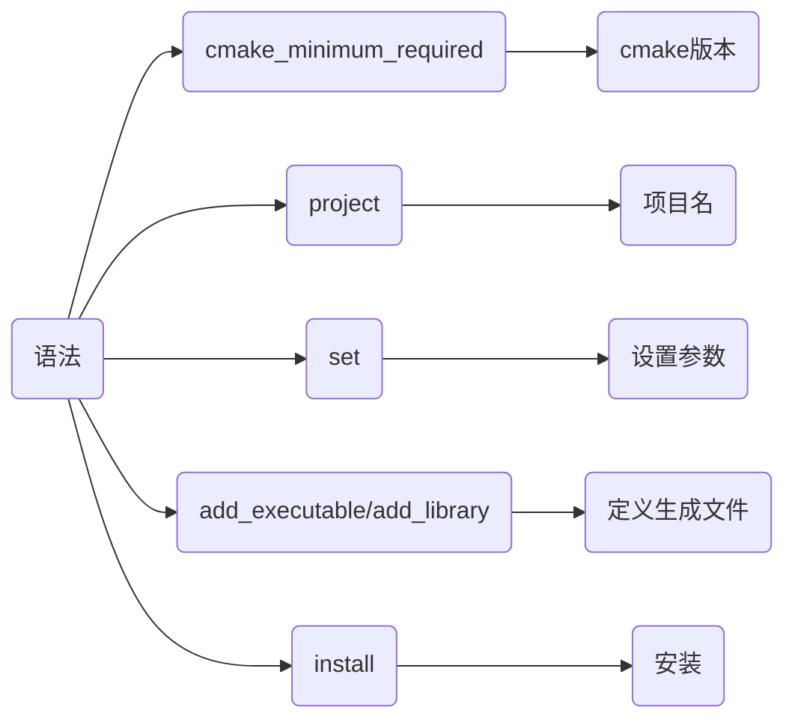

### 生成

cmake读取解析CMakeLists.txt, 检查系统环境、依赖库、编译器等设置, 生成对应平台构建文件

例如在Unix系统上会生成Makefile


#### 命令

##### 当前目录生成(不推荐)

```sh
.
├── CMakeLists.txt
└── main.c
```

会产生大量中间文件, 影响整洁

```sh
cmake .
```

##### 在build/下生成(推荐)

```sh
.
├── CMakeLists.txt
├── build
└── main.c
```

```sh
cmake -B build
```

或

```sh
mkdir build && cd build
cmake ../
```

此时将所有中间文件都生成到build/下

##### 使用其他目录CMakeLists.txt

使用source/CMakeList.txt, 在build/下生成构建文件

```sh
.
├── source
│   ├── main.c
│   └── CMakeLists.txt
└── build
```

```sh
cmake -S source -B build
```

### 构建

构建工具(如make)调用构建文件进行实际编译和链接


#### 命令

##### cmake调用

- 使用当前目录下的构建文件

```sh
cmake --build .
```

构建后生成可执行文件

- 使用build/下的构建文件

```sh
cmake --build build
```

##### make调用

进入构建文件目录, 执行

```sh
make
```

和上面一样生成可执行文件

### 安装

将构建产物按CMakeLists.txt中设置安装到指定位置

#### 命令

##### cmake调用

```sh
cmake --install 构建目录 (--prefix 安装根路径, 仅在CMakeLists.txt中未指定安装根路径时)
```

- 示例, 构建目录build/, 安装构建产物

```sh
cmake --install build
```

```cmake
.......
install(TARGETS main RUNTIME DESTINATION ${CMAKE_SOURCE_DIR}/bin)
......
```

执行后可执行文件就安装到bin/目录下

- 示例

若CMakeLists.txt中未指定安装根路径, 可通过`--prefix`手动指定

```cmake
install(TARGETS main RUNTIME DESTINATION bin)
```

设构建目录build/, 以test/为根路径安装

```sh
cmake --install build --prefix test
```

可执行文件会安装到test/bin/下

##### make调用

构建目录内执行

```sh
make install
```

执行后可执行文件就安装到bin/下

## 语法

### 设置

#### cmake最低版本

```cmake
cmake_minimum_required(VERSION major.minor)
```

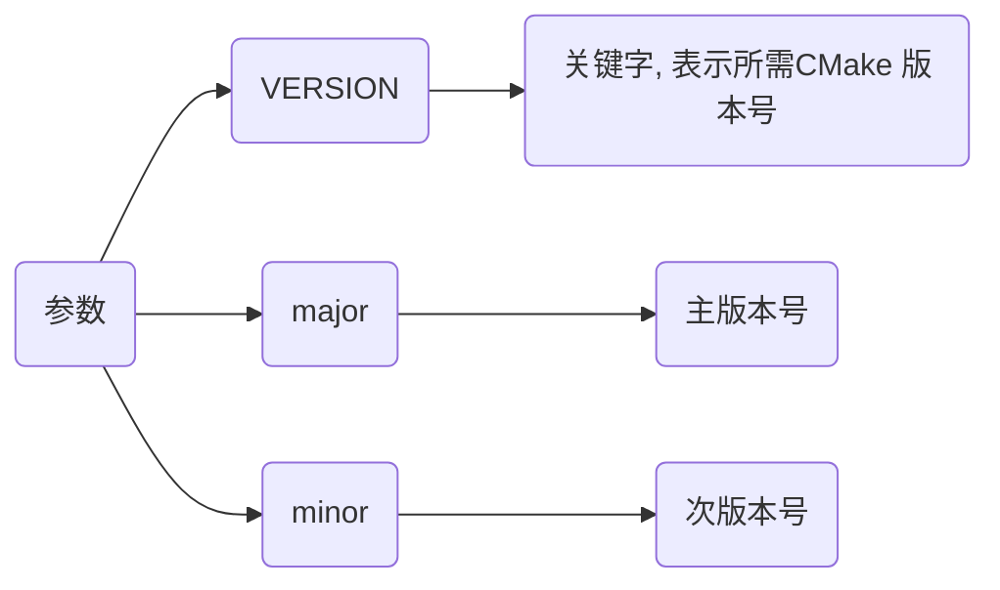

- 示例, 设置工程最低cmake版本为3.10

```cmake
cmake_minimum_required(VERSION 3.10)
...
```

#### 项目名

```cmake
project(项目名 (VERSION 版本信息, 可选))
```

- 示例, 设置项目名为main

```cmake
cmake_minimum_required(VERSION 3.10)
project(main)
...
```

#### 变量

```cmake
set(variable value [PARENT_SCOPE])
```

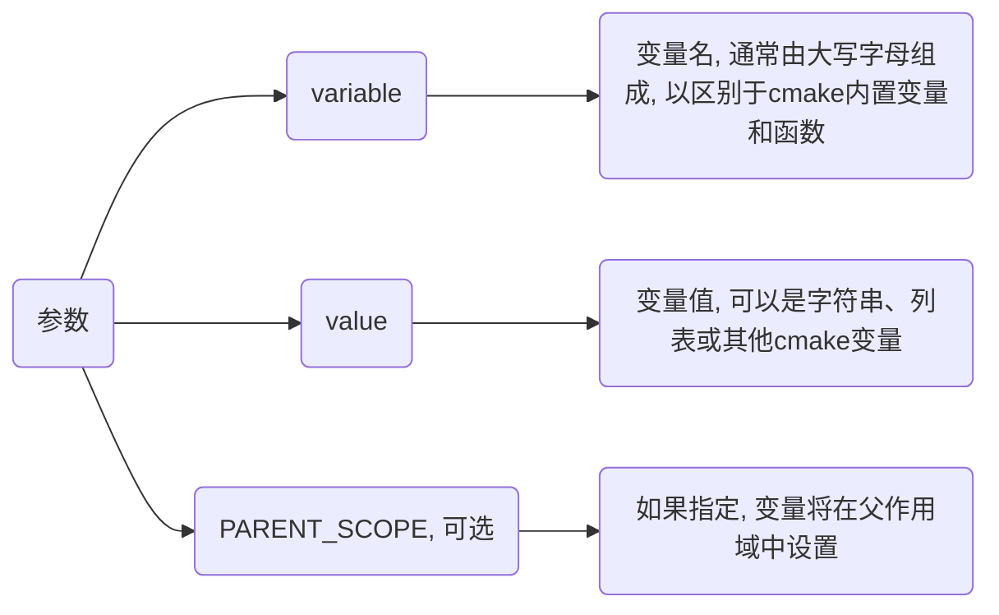

##### 一般变量

- 示例, 设置变量MY_VAR

```cmake
set(MY_VAR "Hello, World!")
```

##### 列表变量

- 示例, 设置SRC_LIST存储源文件名

```cmake
set(SRC_LIST main.cpp test.cpp)
```

```cmake
set(MY_LIST "item1" "item2" "item3")

foreach(item IN LISTS MY_LIST)
    message(STATUS "List item: ${item}")
endforeach()
```

##### 父作用域中设置

- 示例, 父作用域设置变量

```cmake
function(my_func)
    set(MY_VAR_INSIDE "inside function" PARENT_SCOPE)
endfunction()

my_func()
message(STATUS "The value of MY_VAR_INSIDE after function call is: ${MY_VAR_INSIDE}")
```

my_func 函数内指定 PARENT_SCOPE 选项在父作用域中设置 MY_VAR_INSIDE 变量

即使在函数调用之后, MY_VAR_INSIDE 也可以在外部作用域中访问

#### 使用

cmake中通过`${变量名}`获取变量值

- 示例, 使用变量ANOTHER_VAR

```cmake
set(ANOTHER_VAR "Another Value")

set(MY_VAR2 ${ANOTHER_VAR})
```

### 常量

#### 运行环境

##### 项目名

对应指令project所声明项目名称

```sh
PROJECT_NAME
```

- 示例, 指定项目名为main

```cmake
project(main)

message(${PROJECT_NAME})
```

##### 目标平台

cmake编译生成目标文件所运行操作系统名称, 交叉编译时可用来指定目标平台类型

```sh
CMAKE_SYSTEM_NAME
```

- 示例, 指定目标平台为linux

```sh
cmake -DCMAKE_SYSTEM_NAME=Linux ..
```

或者

```cmake
# CMakeLists.txt
...
set(CMAKE_SYSTEM_NAME "Linux")
...
```

#### 编译器

##### c/c++ 编译器

```sh
CMAKE_C_COMPILER

CMAKE_CXX_COMPILER
```

- 示例, 指定编译器为`aarch64-linux-gnu-gcc`

```sh
cmake -DCMAKE_C_COMPILER=/usr/bin/aarch64-linux-gnu-gcc -DCMAKE_CXX_COMPILER=/usr/bin/aarch64-linux-gnu-g++
```

或者

```cmake
# CMakeLists.txt
...
set(CMAKE_C_COMPILER "/usr/bin/aarch64-linux-gnu-gcc")
set(CMAKE_CXX_COMPILER "/usr/bin/aarch64-linux-gnu-g++")
...
```

#### 路径

##### 编译目录

```sh
CMAKE_BINARY_DIR

PROJECT_BINARY_DIR
```

如果是在源代码目录中编译, 指工程顶层目录

如果是在源代码目录之外的目录中编译, 指工程编译发生的目录

##### 工程根目录

```sh
CMAKE_SOURCE_DIR

PROJECT_SOURCE_DIR
```

##### 当前路径

CMakeLists.txt文件所在完整路径

```sh
CMAKE_CURRENT_SOURCE_DIR
```

### 创建

#### 可执行文件

将一组源文件编译成可执行文件

```cmake
add_executable(target item1 ...)
```

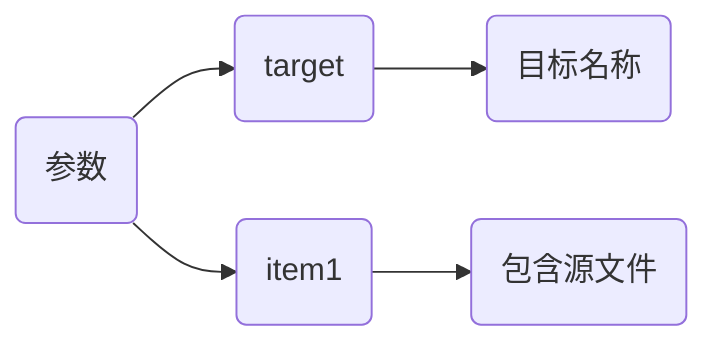

- 示例, 生成可执行文件main

```c
// main.c
#include <stdio.h>

int main() {
    printf("hello\n");
    return 0;
}
```

```cmake
# CMakeLists.txt
cmake_minimum_required(VERSION 3.10)
project(main)

add_executable(main main.c)
```

执行后会在build/目录下生成可执行文件

#### 库文件

创建库文件

库名对应于逻辑目标名称, 在工程全局域内必须唯一

```cmake
add_library(target [STATIC | SHARED | MODULE] [EXCLUDE_FROM_ALL] source1 source2 ...)
```

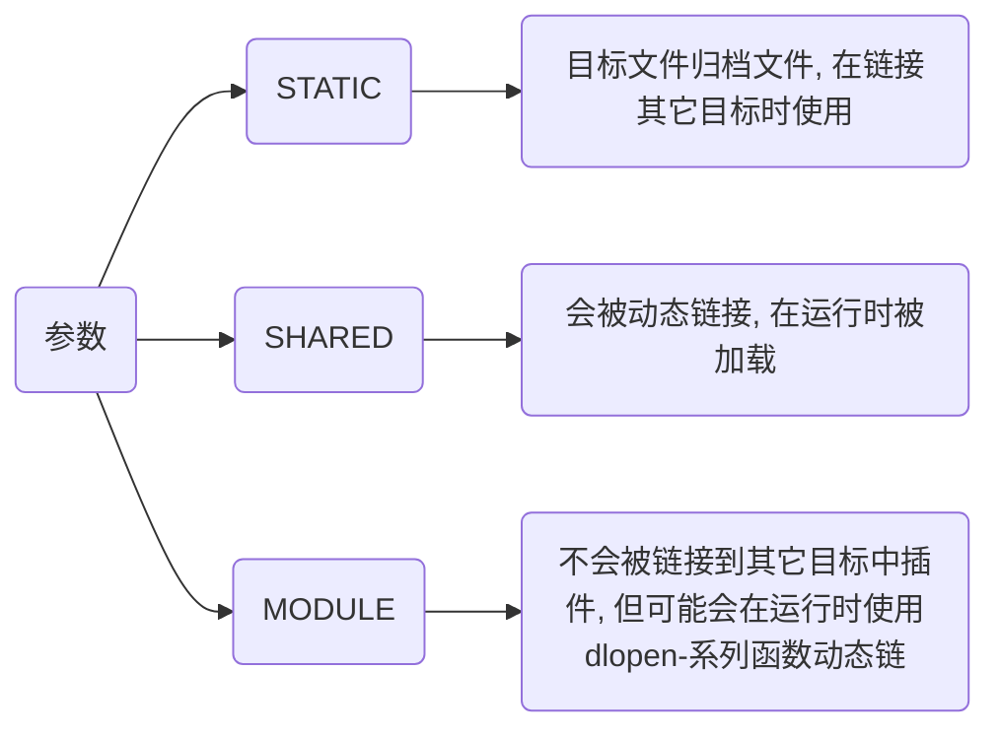

- 示例, 生成

```c++
// test.h
#include <stdio.h>

void  hello();
```

```c++
// test.c
#include "main.h"

void hello() {
    printf("Hello\n");
}
```

```cmake
# CMakeLists.txt
cmake_minimum_required(VERSION 3.10)
project(test)

add_library(test SHARED test.c)
```

编译

```sh
cmake -B build

cmake --build build
```

之后会在build/目录下生成libtest.so

### 添加

#### 头文件路径

指定编译目标(可执行文件或库)应包含头文件目录

```cmake
target_include_directories(
    target
    [SYSTEM]
    [AFTER|BEFORE]
    <PRIVATE|PUBLIC|INTERFACE>
    <directories>
)
```

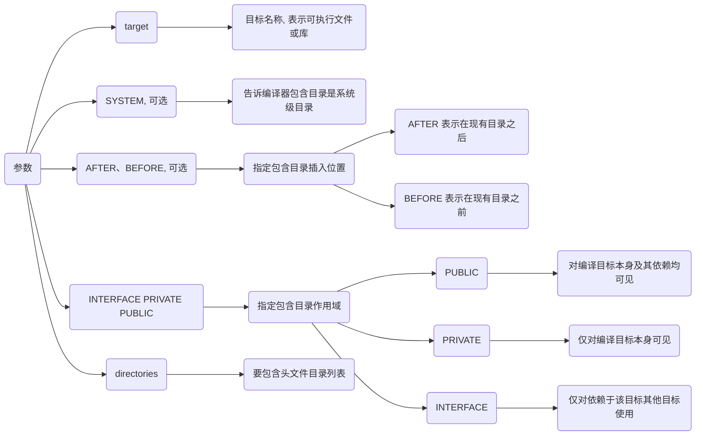

- 示例, 为目标文件添加所依赖的头文件目录

```sh
.
├── CMakeLists.txt
├── src
│   ├── main.c
│   └── module
│       └── test_api
│           └── test_api.h
└── third_party
    └── hello_lib
        └── hello.h
```

```c++
// third_party/hello_lib/hello.h
#include <stdio.h>

extern int lib_version;

int lib_version = 0xFFF;
```

```c++
// src/module/test_api/test_api.h
#include <stdio.h>

extern int api_version;

int api_version = 0x111;
```

cmake里会添加依赖头文件目录, 可省略头文件所在目录路径

```c++
// src/main.c
#include "hello.h"
#include "test_api.h"

int main() {
    printf("%d\n%d\n", lib_version, api_version);
    return 0;
}
```

```cmake
# CMakeLists.txt
cmake_minimum_required(VERSION 3.10)
project(main)

add_executable(${PROJECT_NAME} src/main.c)

target_include_directories(${PROJECT_NAME} PRIVATE
    ${CMAKE_SOURCE_DIR}/third_party/hello_lib
    ${CMAKE_SOURCE_DIR}/src/module/test_api
)
```

构建后运行即可打印变量值

#### 源文件

给目标文件添加依赖源文件路径

```cmake
target_sources(<target> <INTERFACE|PUBLIC|PRIVATE> [items1...])
```

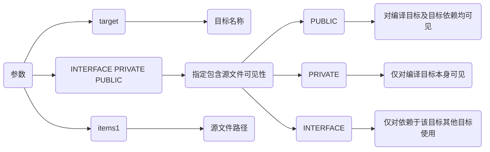

- 示例, 添加源文件hello.c、main.c编译

```sh
.
├── CMakeLists.txt
└── src
    ├── hello
    │   ├── hello.c
    │   └── hello.h
    └── main.c
```

```c
// src/hello/hello.h
#include <stdio.h>

void hello();
```

```c
// src/hello/hello.c
#include "hello.h"

void hello() {
    printf("hello\n");
}
```

```c
// src/main.c
#include "hello/hello.h"

int main() {
    hello();
    return 0;
}
```

```cmake
# CMakeLists.txt
cmake_minimum_required(VERSION 3.10)
project(main)

add_executable(${PROJECT_NAME} "")
target_sources(${PROJECT_NAME} PRIVATE
    ${CMAKE_SOURCE_DIR}/src/main.c
    ${CMAKE_SOURCE_DIR}/src/hello/hello.c
)
```

构建后即可生成可执行文件

#### 链接依赖

指定链接给定目标和/或其依赖项

```cmake
target_link_libraries(<target> <INTERFACE|PUBLIC|PRIVATE> items...)
```

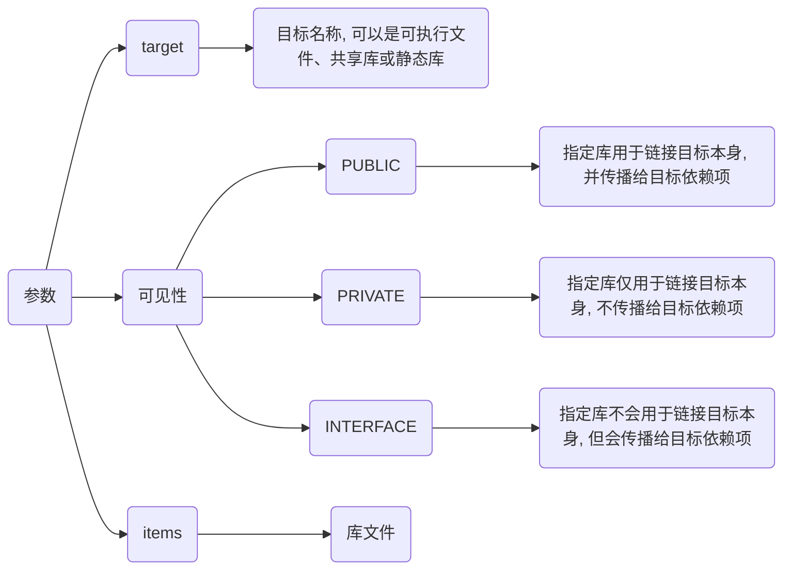

如果项目需要链接系统库, 可以直接使用库名称(如 pthread、dl、m 等)或系统库变量(如 ${CMAKE_THREAD_LIBS_INIT})

- 示例, 链接系统POSIX线程库

```c++
// main.c
#include <stdio.h>
#include <pthread.h>
#include <unistd.h>

void* thread_function(void* arg) {
    int thread_num = *(int*)arg;
    printf("Hello from thread  %d!\n", thread_num);
    sleep(1);
    return NULL;
}

int main() {
    const int threads_num = 5;
    pthread_t threads[threads_num];
    int thread_args[threads_num];

    for (int i = 0; i < threads_num; ++i) {
        thread_args[i] = i;
        pthread_create(&threads[i], NULL, thread_function, &thread_args[i]);
    }

    for (int i = 0; i < threads_num; ++i) {
        pthread_join(threads[i], NULL);
    }

    std::cout << "all threads completed\n";
    return 0;
}
```

```cmake
# CMakeLists.txt
cmake_minimum_required(VERSION 3.10)
project(main)

add_executable(${PROJECT_NAME} main.c)

# 链接 POSIX 线程库
target_link_libraries(${PROJECT_NAME} pthread)
```

### 生成

#### 子路径生成

为构建添加一个子路径

```cmake
add_subdirectory([source_dir] [binary_dir] [EXCLUDE_FROM_ALL])
```

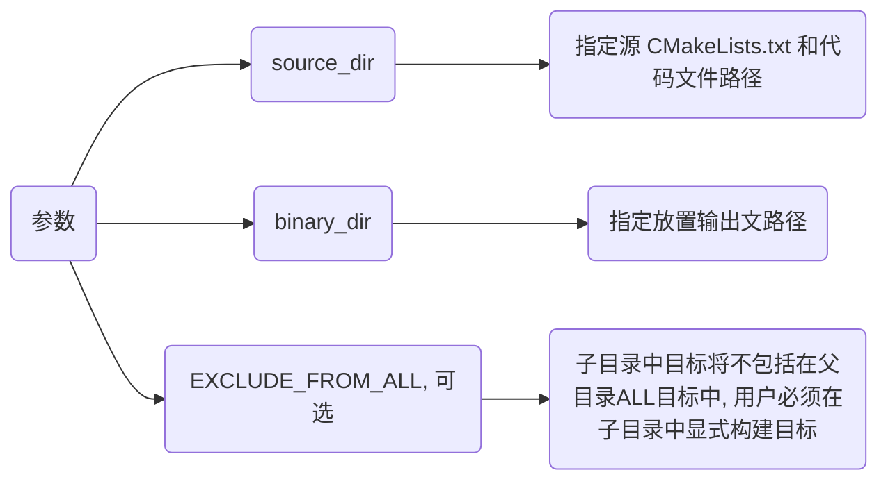

- 示例, 子路径调用

```sh
.
├── CMakeLists.txt
└── src
    ├── hello
    │   ├── CMakeLists.txt
    │   └── hello.c
    └── main.c
```

```c
// src/hello/hello.c
#include <stdio.h>

int main() {
    printf("Hello\n");
    return 0;
}
```

```cmake
# src/CMakeLists.txt
cmake_minimum_required(VERSION 3.10)
project(hello)

add_executable(${PROJECT_NAME} hello.c)
```

```c++
// src/main.c
#include "hello/hello.h"

int main() {
    hello();
    return 0;
}
```

```cmake
# CMakeLists.txt
cmake_minimum_required(VERSION 3.10)
project(main)

# 执行子目录cmake
add_subdirectory(src/hello)
add_executable(${PROJECT_NAME} src/main.c)
```

构建会会生成build/main与build/src/hello/hello 两个可执行文件

### 安装

#### 目标文件

##### 可执行文件

```sh
install(TARGETS 文件名 RUNTIME DESTINATION 安装路径)
```

- 示例, 安装可执行文件到根目录bin/下

```c++
// main.c
#include <stdio.h>

int main() {
    printf("Hello\n");
    return 0;
}
```

```cmake
# CMakeLists.txt
cmake_minimum_required(VERSION 3.10)
project(main)

add_executable(${PROJECT_NAME} main.c)

install(TARGETS ${PROJECT_NAME} RUNTIME  DESTINATION ${CMAKE_SOURCE_DIR}/bin)
```

执行构建与安装

```
cmake -B build
cmake --build build
cmake --install build
```

main即被安装到bin/下

##### 动态库

```cmake
install(TARGETS LIBRARY DESTINATION )
```

##### 静态库

```cmake
install(TARGETS ARCHIVE DESTINATION )
```

#### 目录

```cmake
install(DIRECTORY DESTINATION )
```

##### 文件匹配过滤

```cmake
install(DIRECTORY DESTINATION FILES_MATCHING PATTERN )
```

- 示例, 仅安装.h和.hpp

```cmake
install(DIRECTORY ${CMAKE_SOURCE_DIR}/src DESTINATION shared FILES_MATCHING PATTERN "*.h" PATTERN "*.hpp")
```

## 示例

### 单文件

将单个源文件生成可执行文件

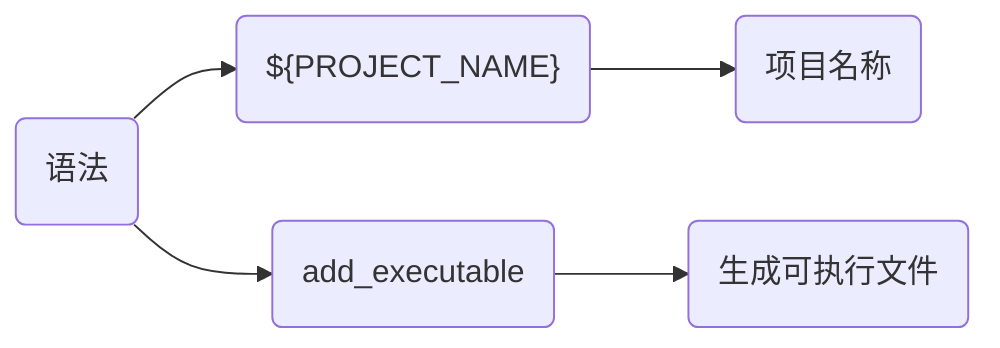

- 示例

```c++
// main.cpp
#include <iostream>

int main() {
    std::cout << "Hello World" << std::endl;
    return 0;
}
```

```cmake
# CMakeLists.txt
cmake_minimum_required(VERSION 3.16)
project(main)

add_executable(${PROJECT_NAME} main.cpp)
```

### 多目录

将多个目录下源文件生成可执行文件

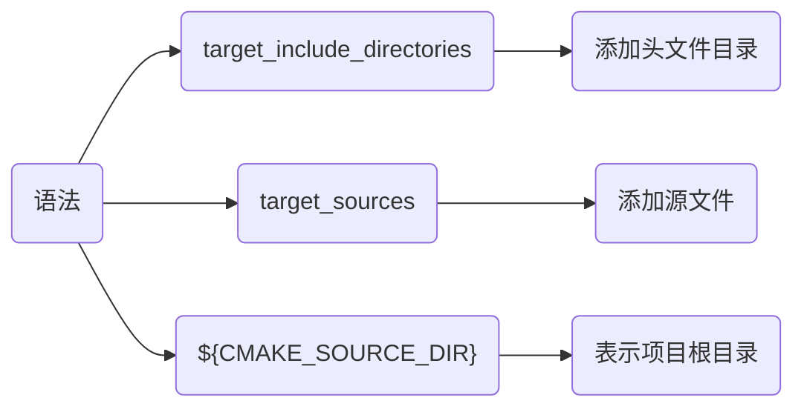

- 示例, 将hello_1/、hello_2/下源文件生成可执行文件

```sh
.
├── CMakeLists.txt
└── src
    ├── hello_1
    │   ├── hello_1.cpp
    │   └── hello_1.hpp
    ├── hello_2
    │   ├── hello_2.cpp
    │   └── hello_2.hpp
    └── main.cpp
```

```c++
// src/hello_1/hello_1.hpp
#include <iostream>

void hello_1();
```

```c++
// src/hello_1/hello_1.cpp
#include "hello_1.hpp"

void hello_1() {
    std::cout << "hello_1" << std::endl;
}
```

```c++
// src/hello_2/hello_2.hpp
#include <iostream>

void hello_2();
```

```c++
// src/hello_2/hello_2.cpp
#include "hello_2.hpp"

void hello_2() {
    std::cout << "hello_2" << std::endl;
}
```

```c++
// main.cpp
#include "hello_1.hpp"
#include "hello_2.hpp"

int main() {
    hello_1();
    hello_2();
    return 0;
}
```

```cmake
# CMakeLists.txt
cmake_minimum_required(VERSION 3.16)
project(main)

add_executable(${PROJECT_NAME} "")

target_include_directories(${PROJECT_NAME} PRIVATE
    ${CMAKE_SOURCE_DIR}/src/hello_1
    ${CMAKE_SOURCE_DIR}/src/hello_2
)

target_sources(${PROJECT_NAME} PRIVATE
    ${CMAKE_SOURCE_DIR}/src/hello_1/hello_1.cpp
    ${CMAKE_SOURCE_DIR}/src/hello_2/hello_2.cpp
    ${CMAKE_SOURCE_DIR}/src/main.cpp
)
```

### 生成库

将源文件生成库文件

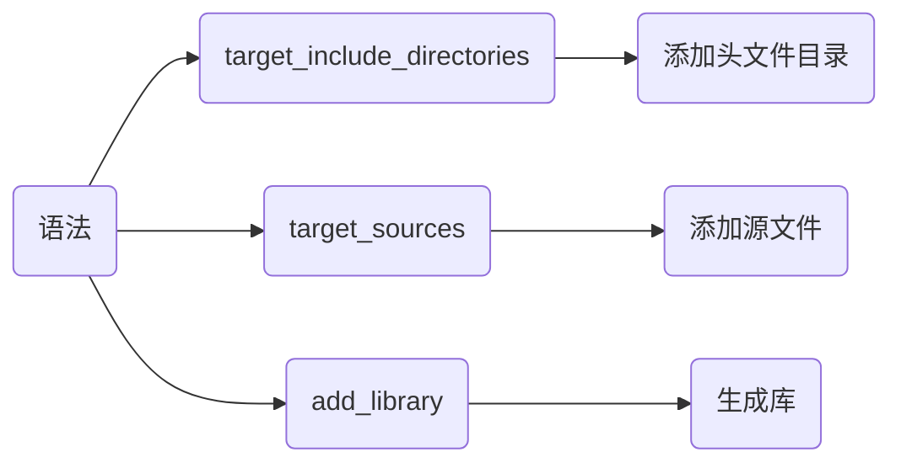

- 示例, 生成静态库与动态库

```sh
.
├── CMakeLists.txt
└── src
    └── test_api
        ├── test_api.hpp
        └── test_api.cpp
```

```c++
// src/test_api/test_api.hpp
#ifndef __INCLUDE_TEST_API_HPP__
#define __INCLUDE_TEST_API_HPP__
#include <iostream>

#ifdef _WIN32
    #define __EXPORT __declspec(dllexport)
#else
    #define __EXPORT __attribute__((visibility("default")))
#endif

extern "C" {
    void display();
    int add(int x, int y);
}
#endif // __INCLUDE_TEST_API_HPP__
```

```c++
// src/test_api/test_api.cpp
#include "test_api.hpp"

void display() {
    std::cout << "Print test_api success!" << std::endl;
}

int add(int x, int y) {
    return x + y;
}
```

```cmake
# CMakeLists.txt
cmake_minimum_required(VERSION 3.16)
project(test_api)

set(LIBRARY_OUTPUT_PATH ${CMAKE_SOURCE_DIR}/lib)

add_library(${PROJECT_NAME}_shared SHARED "")
add_library(${PROJECT_NAME}_static STATIC "")

# 将动态库与静态库名称保存在LIB_NAME变量中
foreach(LIB_NAME ${PROJECT_NAME}_shared ${PROJECT_NAME}_static)
    target_include_directories(${LIB_NAME} PRIVATE ${CMAKE_SOURCE_DIR}/src/test_api)
    target_sources(${LIB_NAME} PRIVATE ${CMAKE_SOURCE_DIR}/src/test_api/test_api.cpp)
    # 设置库名
    set_target_properties(${LIB_NAME} PROPERTIES OUTPUT_NAME ${PROJECT_NAME})
endforeach()
```

生成libtest_api.a与libtest_api.so

### 链接库

生成可执行文件并链接现有库文件

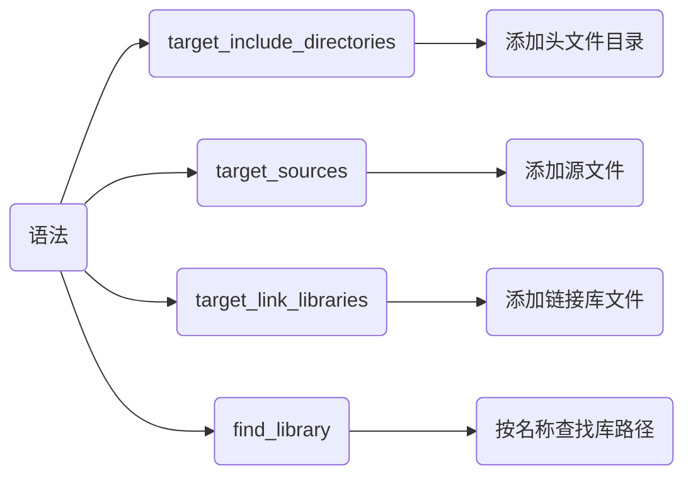

- 示例, 生成可执行文件main, 链接lib/下动态库

```sh
.
├── CMakeLists.txt
├── lib
│   ├── libtest_api.a
│   └── libtest_api.so
└── src
    ├── main.cpp
    └── test_api
        ├── test_api.cpp
        └── test_api.hpp
```

```c++
// main.cpp
#include "test_api.hpp"

int main(void) {
    display();

    int res = add(1, 2);
    std::cout << "res = " << res << std::endl;
    return 0;
}
```

```cmake
# CMakeLists.txt
cmake_minimum_required(VERSION 3.16)
project(main)

# 查找test_api库路径, 并存储在FUNC_LIB中
find_library(FUNC_LIB test_api ${CMAKE_SOURCE_DIR}/lib)

add_executable(${PROJECT_NAME} "")
target_include_directories(${PROJECT_NAME} PRIVATE ${CMAKE_SOURCE_DIR}/src/test_api)
target_sources(${PROJECT_NAME} PRIVATE ${CMAKE_SOURCE_DIR}/src/main.cpp)

target_link_libraries(${PROJECT_NAME} PRIVATE ${FUNC_LIB})
```

### 子目录编译

通过划分子目录与主目录CMakeLists.txt, 实现构建文件生成树结构

例如通过多CMakeLists.txt, 实现生成库并链接库生成可执行文件


- 示例, 子目录test_api/中生成动态库,链接到src/下可执行文件中

```sh
.
├── CMakeLists.txt
└── src
    ├── main.cpp
    └── test_api
        ├── CMakeLists.txt
        ├── test_api.cpp
        └── test_api.hpp
```

```c++
// src/test_api/test_api.hpp
#ifndef __INCLUDE_TEST_API_HPP__
#define __INCLUDE_TEST_API_HPP__
#include <iostream>

#ifdef _WIN32
    #define __EXPORT __declspec(dllexport)
#else
    #define __EXPORT __attribute__((visibility("default")))
#endif

extern "C" {
    int add(int x, int y);
    void print();
}
#endif // __INCLUDE_TEST_API_HPP__
```

```c++
// src/test_api/test_api.cpp
#include "test_api.hpp"

void print() {
    std::cout << "Print test_api success!" << std::endl;
}

int add(int x, int y) {
    return x + y;
}
```

```c++
// src/main.cpp
#include "test_api.hpp"

int main(void) {
    display();

    int res = add(0xFF, 0xAA);
    std::cout << "res = " << res << std::endl;
    return 0;
}
```

```cmake
# src/test_api/CMakeLists.txt
cmake_minimum_required(VERSION 3.16)
project(test_api)

add_library(${PROJECT_NAME} SHARED "")
target_sources(${PROJECT_NAME} PRIVATE ${CMAKE_SOURCE_DIR}/src/test_api/test_api.cpp)
```

```cmake
# CMakeLists.txt
cmake_minimum_required(VERSION 3.16)
project(main)

# 执行子目录cmake
add_subdirectory(src/test_api)

add_executable(${PROJECT_NAME} "")
target_include_directories(${PROJECT_NAME} PRIVATE ${CMAKE_SOURCE_DIR}/src)
target_sources(${PROJECT_NAME} PRIVATE ${CMAKE_SOURCE_DIR}/src/main.cpp)
target_link_libraries(${PROJECT_NAME} test_api)
```

构建后生成build/main与build/src/test_api/libtest_api.so

### 三方库

通过cmake使用三方库中内容

#### find_library

- 示例, 调用三方库opencv(假设其安装在系统目录下)

```c++
#include <opencv2/core.hpp>
#include <opencv2/opencv.hpp>

#include <iostream>

int main() {
    cv::Mat image = cv::imread("./a.png");
    cv::imshow("test", image);
    return 0;
}
```

```cmake
cmake_minimum_required(VERSION 3.20 FATAL_ERROR)
project(main)

set(CMAKE_CXX_STANDARD 17)
set(CMAKE_SYSTEM_NAME Linux)

find_package(OpenCV REQUIRED)

add_executable(${PROJECT_NAME} "")
target_sources(${PROJECT_NAME} PRIVATE ${CMAKE_SOURCE_DIR}/main.cpp)

target_link_libraries(${PROJECT_NAME} "${OpenCV_LIBS}")
```

#### FetchContent

cmake 3.11及以上版本引入`FetchContent`模块, 可直接下载第三方库编译

- 示例, 下载编译三方库`fmt`

```c++
// main.cpp
#include "fmt/core.h"

int main(){
    std::string world = fmt::format("Hello {0}", "World");
    fmt::print("{}\n", world);

    return 0;
}
```

##### 方式1 CMakeLists.txt调用

```sh
.
├── CMakeLists.txt
├── main.cpp
└── extern
```

```cmake
# CMakeLists.txt
cmake_minimum_required(VERSION 3.17)
project(main)

set(CMAKE_CXX_STANDARD 14)

# 引入FetchContent
include(FetchContent)

FetchContent_Declare(fmt
    GIT_REPOSITORY https://github.com/fmtlib/fmt.git
    GIT_TAG 9.1.0
    SOURCE_DIR ${CMAKE_SOURCE_DIR}/extern/fmt
)

FetchContent_MakeAvailable(fmt)

add_executable(${PROJECT_NAME} "")
target_include_directories(${PROJECT_NAME} PRIVATE ${CMAKE_SOURCE_DIR}/extern/fmt/include)
target_sources(${PROJECT_NAME} PUBLIC main.cpp)
target_link_libraries(${PROJECT_NAME} PRIVATE fmt::fmt)
```

示例显示

```sh
......
-- Version: 9.1.0
-- Build type:
-- CXX_STANDARD: 14
......
```

##### 方式2 模块调用

可通过`.cmake`文件实现三方库下载过程, 并在主CMakeLists.txt中调用

```sh
.
├── CMakeLists.txt
├── main.cpp
├── cmake
│   └── FMT.cmake
└── extern
```

```cmake
# cmake/FMT.cmake
include(FetchContent)

set(FMT_LIB fmt)

FetchContent_Declare(${FMT_LIB}
    GIT_REPOSITORY https://github.com/fmtlib/fmt.git
    GIT_TAG 9.1.0
    SOURCE_DIR ${CMAKE_SOURCE_DIR}/extern/${FMT_LIB}
)
FetchContent_MakeAvailable(${FMT_LIB})
```

修改根目录CMakeLists.txt, 将fmt库安装逻辑解耦

```cmake
# CMakeLists.txt
cmake_minimum_required(VERSION 3.17)
project(main)

set(CMAKE_CXX_STANDARD 14)
set(CMAKE_MODULE_PATH ${CMAKE_SOURCE_DIR}/cmake)

# 导入FMT.cmake模块
include(FMT)

add_executable(${PROJECT_NAME} "")
target_include_directories(${PROJECT_NAME} PRIVATE ${CMAKE_SOURCE_DIR}/extern/fmt/include)
target_sources(${PROJECT_NAME} PUBLIC ${CMAKE_SOURCE_DIR}/main.cpp)
target_link_libraries(${PROJECT_NAME} PRIVATE ${FMT_LIB}::${FMT_LIB})
```

### cross compiling(交叉编译)

通过交叉编译器可在AMD64平台编译生成ARM架构文件

#### 配置工具链

```sh
# 32位
sudo apt install -y arm-linux-gnueabihf-g++

# 64位
sudo apt install -y g++-aarch64-linux-gnu
```

查看版本

```sh
aarch64-linux-gnu-gcc -v
```

查看工具链路径

```sh
whereis aarch64-linux-gnu-gcc
```

- 示例, 交叉编译aarch64架构可执行文件

```c++
// main.c
#include <stdio.h>

int main() {
    printf("Hello World\n");
    return 0;
}
```

```cmake
# CMakeLists.txt
cmake_minimum_required(VERSION 3.16)
project(main)

add_executable(${PROJECT_NAME} main.c)
```

#### 构建

##### 命令调用

通过条件编译宏指定交叉编译器

```sh
cmake -DCMAKE_C_COMPILER=gcc路径 -DCMAKE_CXX_COMPILER=g++路径 -DCMAKE_SYSTEM_NAME=Linux -DCMAKE_SYSTEM_PROCESSOR=aarch64 -B build
```

- 示例, 使用aarch64-linux-gnu-gcc与aarch64-linux-gnu-g++

```sh
cmake -DCMAKE_C_COMPILER=/usr/bin/aarch64-linux-gnu-gcc -DCMAKE_CXX_COMPILER=/usr/bin/aarch64-linux-gnu-g++ -DCMAKE_SYSTEM_NAME=Linux -DCMAKE_SYSTEM_PROCESSOR=aarch64 -B build
```

##### 模块调用

创建交叉编译工具链, 设置编译环境, 通过`-DCMAKE_TOOLCHAIN_FILE`指定工具链路径

```cmake
# 指定 c 编译器
set(CMAKE_C_COMPILER 编译器路径)

# 指定 c++ 编译器
set(CMAKE_CXX_COMPILER 编译器路径)

# 指定目标系统(可选)
set(CMAKE_SYSTEM_NAME 平台)
set(CMAKE_SYSTEM_PROCESSOR 架构)
```

```sh
cmake -DCMAKE_TOOLCHAIN_FILE=工具链路径 ...
```

- 示例, 使用工具链交叉编译

新建cmake/toolchain.cmake

```cmake
# cmake/toolchain.cmake
set(CMAKE_C_COMPILER /usr/bin/aarch64-linux-gnu-gcc)
set(CMAKE_CXX_COMPILER /usr/bin/aarch64-linux-gnu-g++)

set(CMAKE_SYSTEM_NAME Linux)
set(CMAKE_SYSTEM_PROCESSOR aarch64)
```

```sh
cmake -DCMAKE_TOOLCHAIN_FILE=cmake/toolchain.cmake -B build
```

构建后可用`file 文件`指令查看可执行文件架构, 类似显示

```sh
......
ELF 64-bit LSB shared object, ARM aarch64
......
```
