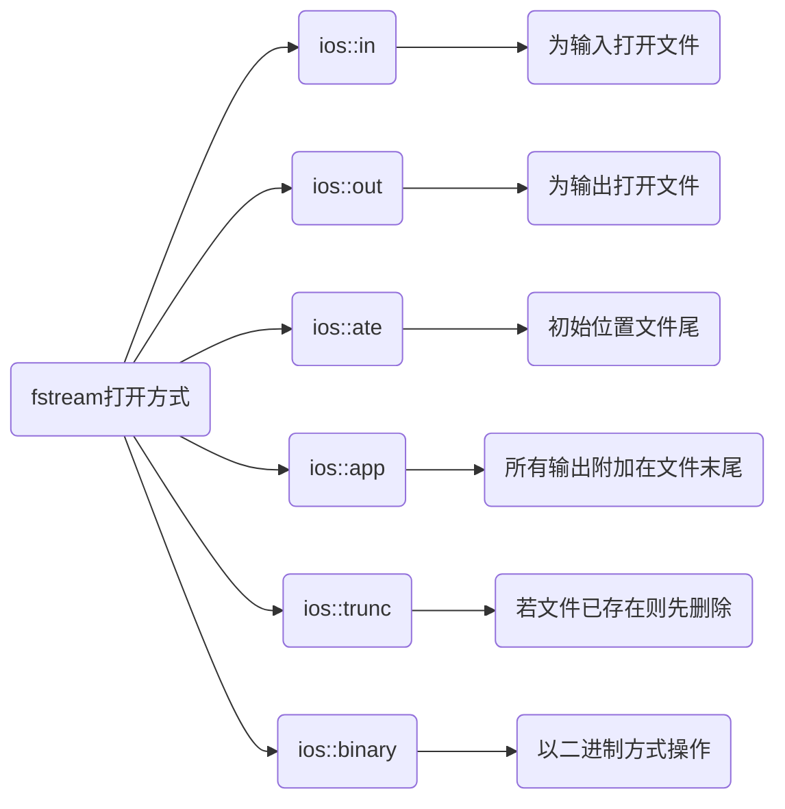
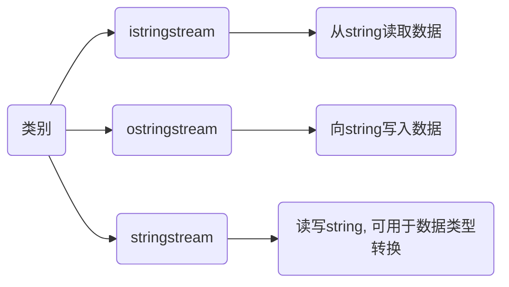

## 核心概念

在 `c++` 中, 流(`stream`) 是数据输入/输出的抽象

数据像水流一样在内存与外部设备(控制台、文件、字符串等)之间传输

- 输出流

流数据从内存传送到某个载体或设备中(如 `std::cin`)

- 输入流

数据从某个载体或设备传送到内存缓冲区变量中(如 `std::cout`)

`c++` 的 `I/O` 流库基于面向对象设计, 核心基类为 `std::ios_base` 和 `std::ios`, 派生出 `std::istream`(输入)和 `std::ostream`(输出)

## 种类

### 标准I/O流

用于内存与标准输入/输出设备(通常是键盘和显示器)之间的数据交互

- `istream` 从流读取数据

- `ostream` 向流写入数据

- `iostream` 读写流

#### cin

输入流

```c++
std::cin
```

- 回车结束输入

```c++
std::vector<T> v;

T value;

while (std::cin >> value) {
    v.push_back(value);
    if (std::cin.get() == '\n') {
        break;
    }
}
```

- 正确读取一行输入

原生的 `std::cin >>` 会跳过前导空白符, 且在读取多个数据时判断回车容易出错

推荐使用 `std::cin.peek()` 检查下一个字符:

```c++
#include <iostream>
#include <vector>

int main() {
    std::vector<int> v;
    int value;
    
    std::cout << "请输入数字(回车结束): ";
    while (std::cin >> value) {
        v.push_back(value);
        // 使用 peek() 偷看下一个字符, 如果是换行符则结束
        if (std::cin.peek() == '\n') {
            // 消耗掉换行符, 防止影响后续输入
            std::cin.ignore();
            break;
        }
    }
    std::cout << "共读取 " << v.size() << " 个数字\n";
    return 0;
}
```

#### cout

输出流

```c++
std::cout
```

#### cerr

错误输出

`cerr`不经过缓冲而直接输出,一般用于迅速输出出错信息,是标准错误

#### clog

有缓冲, 用于常规日志记录

### 文件I/O流

用于内存与外部文件之间的数据交互, 需包含 `<fstream>` 头文件

- `ifstream` 从文件读取数据

- `ofstream` 向文件写入数据

- `fstream` 读写文件



文本文件读写

```c
#include <fstream>
#include <iostream>
#include <string>

int main() {
    const std::string path = "test.txt";

    // 1. 写入文件 (追加模式)
    std::ofstream out(path, std::ios::out | std::ios::app);
    if (out.is_open()) {
        out << "Hello C++ Stream\n";
        // 显式关闭, 或利用 RAII 机制在析构时自动关闭
        out.close();
    }

    // 2. 读取文件 (按行读取)
    std::ifstream in(path, std::ios::in);
    std::string line;
    if (in.is_open()) {
        while (std::getline(in, line)) {
            std::cout << line << '\n';
        }
    }
    return 0;
}
```

#### 写入

普通文件

```c
<<
```

```c++
const std::string path = "main.txt";

ofstream out(path, ios::out|ios::app);

out << "Hello ";

out << "World\n";
```

#### 二进制文件

处理图像、音频或自定义结构体时, 必须使用 `std::ios::binary`, 并使用 `read()` / `write()` 方法

```c
#include <fstream>
#include <cstdint>

int main() {
    uint32_t value = 0xFF00FF00;
    const std::string path = "data.bin";

    // 写入二进制 (必须加 ios::binary)
    std::ofstream out(path, std::ios::out | std::ios::binary);
    // 使用 reinterpret_cast 替代 C 风格强制转换, 使用 sizeof 替代硬编码
    out.write(reinterpret_cast<const char*>(&value), sizeof(value));
    out.close();

    // 读取二进制
    uint32_t read_val = 0;
    std::ifstream in(path, std::ios::in | std::ios::binary);
    in.read(reinterpret_cast<char*>(&read_val), sizeof(read_val));
    
    return 0;
}
```

### 字符串I/O流

用于在内存中的字符串与基本数据类型之间进行转换和解析, 需包含 `<sstream>` 头文件



- 传统类型转换 (`stringstream`)

```c++
#include <iostream>
#include <sstream>

template <class SourceType, typename TargetType>
void change_type(SourceType &source, TargetType &target){
    std::stringstream ss;
    ss << source;
    ss >> target;
    ss.str("");
    ss.clear();
}

int main() {
    std::string source = "123456";
    int32_t target = 0;

    change_type(source, target);
    // 123456
    std::cout << target << std::endl;
    return 0;
}
```

## 流状态与格式控制

流状态检查

流在操作过程中可能会出错, 通过以下成员函数检查状态: 

- `good()`: 流状态正常

- `eof()`: 到达文件末尾(end of file)

- `fail()`: 操作失败(如类型不匹配, 提取数字时遇到字母)

- `bad()`: 发生严重错误(如底层设备故障)

重置状态: 当流进入 `fail` 或 `eof` 状态后, 后续操作会失效, 需调用 `ss.clear()` 清除错误标志

### 格式控制

使用 `<iomanip>` 库中的操作符可以精确控制输出格式

```c
#include <iostream>
#include <iomanip>
#include <cmath>

int main() {
    double pi = M_PI;
    int num = 255;

    // 1. 控制浮点数精度与格式
    std::cout << std::fixed << std::setprecision(4) << pi << '\n'; 
    // 输出: 3.1416

    // 2. 控制对齐、宽度与填充字符
    std::cout << std::setw(10) << std::setfill('*') << std::left << "Hello" << '\n'; 
    // 输出: Hello*****

    // 3. 进制转换
    std::cout << "Hex: " << std::hex << std::showbase << num << '\n'; 
    // 输出: Hex: 0xff

    return 0;
}
```