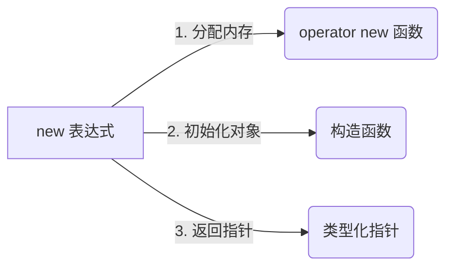
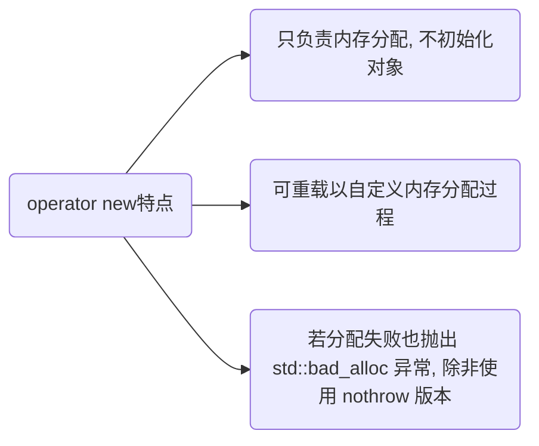

> 参考
>
> - [c++ 中 malloc 和 new 区别](https://murphypei.github.io/blog/2021/03/malloc-new-diff.html)

## 概念

在 `c++` 中, 讨论 `new` 时必须严格区分两个极易混淆的概念: `new` 表达式(`new expression`) 和 `operator new` 函数

- `new` 表达式: 是 `c++` 语言层面的操作符(如 T* p = new T();)

它负责完整的对象创建流程, 包括分配内存和调用构造函数

- `operator new`: 是 `c++` 标准库提供的全局函数(或类成员函数)

它仅负责分配原始内存, 不涉及对象的构造, 类似于 c 语言中 `malloc`

### new



### 执行流程

当执行 `T* p = new T(args);` 时, 编译器在底层会将其拆解为三个核心步骤

#### 执行步骤

- 分配内存: 调用 `operator new(sizeof(T))` 从自由存储区(`free store`)分配足够大的原始内存

- 构造对象: 在分配的内存地址上, 使用 placement new 隐式调用 T 的构造函数进行初始化

- 返回指针: 返回指向已完全初始化对象的类型化指针

#### 异常安全机制(自动回滚)

如果在第 2 步(构造函数执行期间)抛出异常, c++ 保证不会发生内存泄漏

编译器会自动调用对应的 operator delete 释放第 1 步分配的内存, 然后继续向外传播异常

以下是编译器对 new 表达式的底层等价展开代码(开发者无需手写, 仅为理解原理): 

```c++
// T* p = new T(args); 的底层等价实现: 
void* mem = operator new(sizeof(T)); // 1. 分配内存
try {
    new (mem) T(args);               // 2. placement new 调用构造函数
} catch (...) {
    operator delete(mem);            // 3. 构造失败, 自动释放内存
    throw;                           // 4. 重新抛出异常
}
T* p = static_cast<T*>(mem);         // 5. 返回指针
```

### operator new

`operator new` 是可重载的函数, 允许开发者自定义内存分配策略(如内存池、对齐分配等), 它只分配内存, 不调用构造函数

```c++
void* operator new(std::size_t size) {
    // 调用全局::operator new 分配内存
    return ::operator new(size);
}
```



- 重载 `operator new`作用

(1) 内存池管理, 通过自定义 `operator new`, 可实现内存池来减少动态内存分配时开销

(2) 调试, 可在 `operator new` 中记录日志, 跟踪每次内存分配调用

(3) 性能优化, 对于特定类型对象, 可以通过自定义 `operator new` 来优化内存分配策略

(4) 异常处理, 可自定义 `operator new` 来处理分配失败时异常, 甚至返回 nullptr 而不是抛出异常

### ::operator new (全局默认版本)

带有 :: 前缀表示强制调用全局作用域的默认 operator new

它通常由标准库实现, 底层一般封装 `malloc`

当类内部重载 `operator new` 时, 可通过 `::operator new` 绕过类版本, 调用系统默认分配器

- 与`operator new`区别

(1) `::operator new` 强制调用作用域为全局, 即标准库所提供默认版本

(2) `operator new` 作用域可能是全局, 也可是自定义重载版本

### placement new (定位 new)

`placement new` 是 `new` 表达式的一种特殊形式, 它不分配内存, 而是允许在已分配的指定内存地址上直接调用构造函数

应用场景: 内存池管理、STL 容器(如 std::vector)的底层实现、在共享内存中构造对象

```c
// 1. 预先分配内存 (可以是堆、栈或共享内存)
alignas(T) unsigned char buffer[sizeof(T)]; 

// 2. 在指定内存上构造对象
T* obj = new (buffer) T(args...); 

// 3. 手动调用析构函数 (placement new 创建的对象不能用 delete 释放)
obj->~T();
```

## 流程


### 分配内存

`new` 调用 `operator new` 函数 默认从堆(自由存储区)中分配内存来存储对象

#### 调用operator new

(1) `operator new` 内存分配失败时会抛出 `std::bad_alloc` 异常(而不像 `malloc` 返回 `NULL`)

(2) 自定义 `operator new` 函数会优先调用, 否则调用全局 `::operator new`

```c++
void* operator new(std::size_t size) {
    // 分配 size 大小内存
    void* p = ::malloc(size);
    // 内存分配失败时抛出异常
    if (!p) {
        throw std::bad_alloc();
    }
    return p;
}
```

- 示例, 调用自定义 `operator new`

```c++
#include <iostream>

class UseNew {
public:
    UseNew() = default;
    ~UseNew() = default;

    // 重载 operator new
    void* operator new(std::size_t size) {
        std::cout << "operator new called, size: " << size << std::endl;
        // 调用全局 operator new
        return ::operator new(size);
    }

    // 重载 operator delete
    void operator delete(void* p) {
        std::cout << "operator delete called" << std::endl;
        // 调用全局 operator delete
        ::operator delete(p);
    }
};

int main() {
    UseNew* use = new UseNew();
    delete use;

    return 0;
}
```

编译运行

```sh
operator new called, size: 1
operator delete called
```

### 初始化

分配内存后 `new` 会在刚分配内存上调用对象构造函数初始化, 本质是通过定位 `new` 机制, 确保构造函数在分配内存地址上正确执行

#### 构造对象

(1) 使用`placement new` 构造函数会在已经分配内存位置上构造对象

(2) 对象构造函数会根据传入参数初始化对象成员变量和状态

```c++
// 在已分配好内存 ptr 上调用构造函数
T* obj = new(ptr) T();
```

#### 处理异常

(1) 若内存分配失败`::operator new` 会抛出 `std::bad_alloc` 异常

(2) 若构造函数抛出异常会释放已经分配内存, 并传播异常, `c++` 通过 `RAII` 异常处理机制, 确保不会泄漏资源

```c++
// 1. 分配内存
T* obj = static_cast<T*>(operator new(sizeof(T)));

try {
    // 2. 定位 new, 调用构造函数
    new (obj) T();
} catch (...) {
    // 3. 构造失败, 释放内存
    operator delete(obj);
    // 4. 重新抛出异常
    throw;
}
```

### 返回指针

若内存分配和对象构造均成功, `new`返回指向已初始化对象指针, 此时对象已完全初始化

## 对比

### 与系统函数

| 操作符/函数       | 作用                                              | 调用构造函数  | 是否抛出异常       |
| ---------------- | ------------------------------------------------- | ------------ | ----------------- |
| `new`            | 分配内存并构造对象                                  | 是           | 是(若内存分配失败) |
| `operator new`   | 只分配内存, 不构造对象, 允许类自定义内存分配策略      | 否           | 是(若内存分配失败) |
| `::operator new` | 全局`operator new`, 只分配内存, 调用默认内存分配实现 | 否           | 是(若内存分配失败) |

### 与malloc

维度	    | new / delete	                             | malloc / free
------------|--------------------------------------------|------------------------------
语言层面	| c++ 操作符(支持重载)	                   | C 标准库函数
内存区域	| 自由存储区(Free Store)	                   | 堆(Heap)
返回类型	| 具体类型的指针(类型安全, 无需强转)	         | void*(需要强制类型转换)
失败处理	| 默认抛出 std::bad_alloc 异常	               | 返回 NULL
构造/析构	| 自动调用构造函数和析构函数	                 | 不调用, 仅分配/释放原始字节
大小计算	| 编译器自动根据类型计算 sizeof	                | 必须手动计算并传入字节数
数组处理	| new[] / delete[] 自动处理每个元素的构造/析构 	| 仅分配连续内存, 不处理元素生命周期
内存扩充	| 不支持	                                   | 支持 realloc 重新分配


## 现代 c++ 拓展与最佳实践

### nothrow 版本: 避免异常
如果希望在内存分配失败时返回 nullptr 而不是抛出异常, 可以使用 std::nothrow: 

```c++
#include <new>

// 失败时返回 nullptr, 不抛出 std::bad_alloc
T* p = new (std::nothrow) T(); 
if (!p) {
    // 处理分配失败逻辑
}
```

### 智能指针与 make 函数(最佳实践)

在现代 c++(c++11 及以后)中, 应极力避免使用裸 new, 转而使用智能指针管理生命周期, 防止内存泄漏

// ❌ 传统做法: 容易在异常发生时导致内存泄漏, 且存在异常安全隐患

```c++
std::shared_ptr<T> p1(new T()); 

// ✅ 现代 c++ 推荐做法: 
auto p2 = std::make_unique<T>(args);   // c++14 引入
auto p3 = std::make_shared<T>(args);   // c++11 引入
```

std::make_shared 的底层优化:  直接使用 new 创建 shared_ptr 需要两次内存分配(一次给对象, 一次给控制块)

而 make_shared 会将对象内存和控制块内存合并为一次分配, 不仅减少分配开销, 还提高缓存命中率, 并保证异常安全性

### c++17 内存对齐支持 (Over-aligned Types)

在 c++17 之前, 如果类型的对齐要求超过默认对齐(如 SIMD 指令需要的 32 字节或 64 字节对齐), 标准的 operator new 无法保证正确对齐

c++17 引入带对齐参数的 operator new 重载: 

```c++
struct alignas(64) SIMDType {
    float data[16];
};

// c++17 起, new 表达式会自动寻找带 std::align_val_t 参数的 operator new
SIMDType* p = new SIMDType(); 

// 对应的底层调用变为: 
// operator new(sizeof(SIMDType), std::align_val_t{64});
```

开发者在自定义内存池或重载全局 operator new 时, 应同时提供带 std::align_val_t 参数的重载版本, 以完美支持 c++17 的过度对齐类型