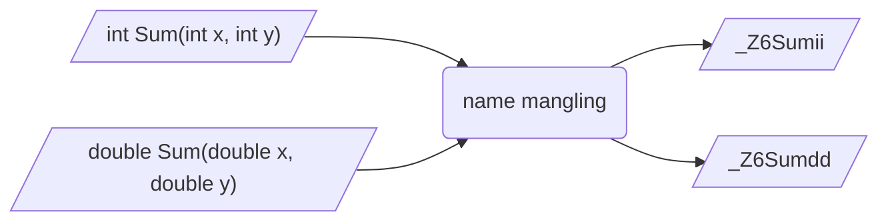

## 概念

c++为支持函数重载、命名空间、类、模板等特性, 存在`name mangling`机制

例如对于函数重载, c++编译器会在编译阶段通过添加参数类型、参数个数等额外信息对函数重命名, 生成唯一符号, 以区分同名函数

- 示例, c++中同名函数经过`name mangling`机制后生成唯一名称



## 符号处理

函数和变量在本质上都是地址助记符, 在链接过程中称为`symbol`(符号)

链接阶段, 链接器会按照符号名来解析不同目标文件和库文件中所引用符号, 以正确区分和链接函数

### C语言

C语言无`name mangling`机制, 每个函数名称必须唯一, 链接器可直接使用名称解析符号

- 示例, C语言生成目标文件

```c
// c_module.h
#include <stdio.h>

int add_num(int x, int y);
void display_value(double num);
```

```c
// c_module.c
#include "c_module.h"

int add_num(int x, int y) {
    return x + y;
}

void display_value(double num) {
    printf("res = %f\n", num);
}
```

生成中间文件

```sh
clang c_module.c -c -o c_module.o
```

使用`nm` 查看符号表, 发现函数符号名称与源代码中一致

```sh
0000000000000000 T add_num
0000000000000020 T display_value
0000000000000000 r .L.str
                 U printf
```

#### 错误情况

- 示例, C语言源文件函数同名情况

```c
#include <stdio.h>

int add_num(int x) {
    return x + 1;
}

double add_num(double x) {
    return x + 0.1;
}
```

编译时报错定义类型冲突

```sh
error: conflicting types for 'add_num'
```

c编译器不会对函数名增加任何处理, 因此函数名必须唯一

### c++

c++编译器通过`name mangling`机制, 对于同名函数, 只要参数类型、参数个数或返回值类型不一致也可通过编译

- 示例, 源文件中存在同名函数

```c
// cpp_module.hpp
#include <iostream>

int add_num(int x, int y);
double add_num(double x, double y);

void display_value(int num);
void display_value(double num);
```

```c
// cpp_module.cpp
#include "cpp_module.hpp"

int add_num(int x, int y) {
    return x + y;
}

double add_num(double x, double y) {
    return x + y;
}

void display_value(int num) {
    printf("int = %d\n", num);
}

void display_value(double num) {
    printf("double = %f\n", num);
}
```

生成中间文件

```sh
clang++ cpp_module.cpp -c -o cpp_module.o
```

使用`nm` 查看符号表, 发现函数符号名称与源代码中一致

```sh
0000000000000000 r .L.str
000000000000000a r .L.str.1
                 U printf
0000000000000070 T _Z13display_valued
0000000000000040 T _Z13display_valuei
0000000000000020 T _Z7add_numdd
0000000000000000 T _Z7add_numii
                 U _ZSt21ios_base_library_initv

```

查看符号表, 发现同名函数符号名被重命名成唯一符号

### c/c++ 混合

#### 同步编译

- 示例, 使用c++编译器同步编译.c、.cpp

```c
// c_module.h
#include <stdio.h>

int add_num(int x, int y);
void display_value(double num);
```

```c
// c_module.c
#include "c_module.h"

int add_num(int x, int y) {
    return x + y;
}

void display_value(double num) {
    printf("res = %f\n", num);
}
```

```c
// main.cpp
#include "c_module.h"
#include <iostream>

int main() {
    int x = add_num(1, 2);
    display_value(6);
    return 0;
}
```

只要使用c++编译器, 源文件内函数名都会被执行`name mangling`

```sh
0000000000000000 r .LCPI0_0
0000000000000000 T main
                 U _Z13display_valued
                 U _Z7add_numii
                 U _ZSt21ios_base_library_initv
```

#### 模块链接

c模块与c++链接过程中可能会出现符号未定义错误

- 示例

```c
// math_module.h
#include <stdio.h>

int add(int x, int y);
double get_square_area(double length);
```

```c
// math_module.c
#include "math_module.h"

int add(int x, int y) {
    return x + y;
}

double get_square_area(double length) {
    return length * length;
}
```

```cpp
// main.cpp
#include "math_module.h"
#include <iostream>

int main() {
    int res = add(1, 2);
    double area = get_square_area(3.74);
    std::cout << "add = " << res << std::endl;
    std::cout << "square_area = " << area << std::endl;
    return 0;
}
```

- 未定义错误

(1) 用C语言编译器将math_module.c生成 `math_module.o`

(2) 使用c++编译器将main.cpp生成目标文件 `main.o`

(3) 链接 `math_module.o`、`main.o` 为可执行文件, 出现符号未定义错误

(4) 分别查看符号表, 发现同函数在两个目标文件中符号各不相同

- 原因分析

main.cpp 预处理时, 内容展开

```diff
+ #include <stdio.h>
+ int add(int x, int y);
+ double get_square_area(double length);

#include <iostream>

int main() {
    int res = add(1, 2);
    double area = get_square_area(3.74);
    std::cout << "add = " << res << std::endl;
    std::cout << "square_area = " << area << std::endl;
    return 0;
}
```

生成main.o时, c++编译器对main.cpp中两个原本C语言函数名`add`、`get_square_area`进行`name mangling`, 生成新名`_Z3addii`、`_Z13get_square_aread`

`math_module.o` 由c编译器编译生成, 没有`name mangling`机制, 函数名未改变

链接时`main.o`按`_Z3Addii` 符号名到各模块查找函数引用, 结果`math_module.o`里符号名是`add`、`get_square_area`, 无法匹配, 自然出现函数未定义错误

这种情况需通过`extern "C"`处理

## extern "C"

c++编译器中提供 `extern "C"`/ `extern "C" {}` 机制, 表示其后续或作用域内函数屏蔽`name mangling`机制, 按c语言风格处理, 保持原本名称

通常用于c++代码中调用c语言动态库, 以及c语言调用c++动态库时处理

### 语法

#### 作用函数

函数名前添加`extern "C"`, 表示使用c++编译器时该函数均按C语言规则编译, 不进行`name mangling`

```c
extern "C" 函数声明
```

#### 作用代码块

`extern "C" {}`表示代码块内所有函数均调用`extern "C"`

```c
extern "C" {
    void func_1();
    void func_2();
    ...
}
```

#### 仅c++编译时使用

预处理宏`__cplusplus`仅在c++编译器中定义, 可通过该宏判断代码是否被c++编译器编译

- 示例, 仅在代码被c++编译器编译时, 对函数添加`extern "C"`

```c++
#if __cplusplus
extern "C" {
#endif
    void func_1();
    void func_2();
#if __cplusplus
}
#endif
```

### 特点

#### 作用对象

`extern "C"` 只能用于函数和全局变量声明, 不能用于类成员或模板

#### 特性

`extern "C"` 修饰函数内不能出现c++所有特性

### 应用

#### c++调用c动态库

- 示例, 处理模块链接错误

修改main.cpp, 对于所引用c语言头文件使用`extern "C" {}`包裹

```c++
extern "C" {
    #include "math_module.h"
}

#include <iostream>

int main() {
    int res = add(1, 2);
    double area = get_square_area(3.74);
    std::cout << "Add = " << res << std::endl;
    std::cout << "SquareArea = " << area << std::endl;
    return 0;
}
```

main.cpp预处理时展开

```c++
extern "C" {
    #include <stdio.h>

    int add(int x, int y);
    double get_square_area(double length);
}

#include <iostream>

int main() {
    int res = add(1, 2);
    double area = get_square_area(3.74);
    std::cout << "add = " << res << std::endl;
    std::cout << "square_area = " << area << std::endl;
    return 0;
}
```

因`extren C ""`机制, main.cpp中两个函数名编译时不受`name mangling`影响, 依然保持原名称, 和math_module.o中符号一致

链接错误问题解决
