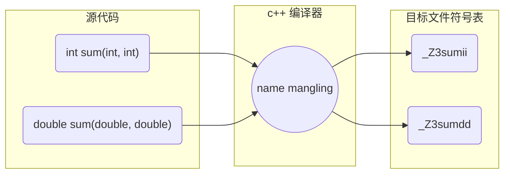
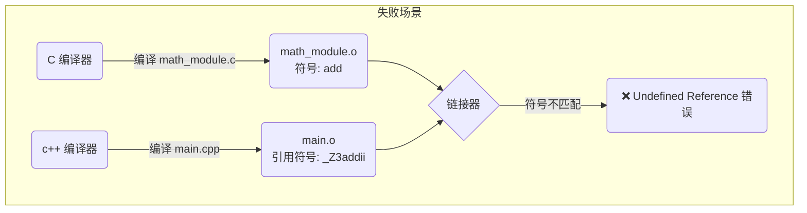

在编译和链接过程中, 代码中的函数和变量最终都会被映射为内存地址, 为了方便链接器识别和定位, 编译器会将源代码中的标识符转换为唯一的符号(Symbol)

链接阶段, 链接器会按照符号名来解析不同目标文件和库文件中所引用符号, 以正确区分和链接函数

在 c 语言中, 符号名通常与函数/变量名完全一致

但在 c++ 中, 为了支持函数重载、类、命名空间和模板等复杂特性, 编译器引入了 `name mangling`　机制

例如, 对于函数重载, `c++`编译器会在编译阶段通过添加参数类型、参数个数等额外信息对函数重命名, 生成唯一符号以区分同名函数


```mermaid
graph LR
    subgraph 源代码
        A1("int sum(int, int)")
        A2("double sum(double, double)")
    end
    subgraph c++ 编译器
        B((name mangling))
    end
    subgraph 目标文件符号表
        C1("_Z3sumii")
        C2("_Z3sumdd")
    end

    A1 --> B --> C1
    A2 --> B --> C2
```

## 对比

### C 语言

c语言无`name mangling`机制, 每个函数名称必须唯一, 链接器直接使用源代码中的名称来解析符号

- 示例, c生成目标文件

```c
// c_module.c
#include <stdio.h>

int add_num(int x, int y) {
    return x + y;
}

void display_value(double num) {
    printf("res = %f\n", num);
}
```

编译并查看符号表

```sh
clang c_module.c -c -o c_module.o
```

发现函数的符号名与源代码中名称一致

```sh
0000000000000000    T add_num
0000000000000020    T display_value
0000000000000000    r .L.str
                    U printf
```

#### 不支持同名函数

如果在 C 语言中定义同名函数, 编译器会直接报错, 因为无法生成唯一的符号

```c
#include <stdio.h>

int add_num(int x) {
    return x + 1;
}

double add_num(double x) {
    return x + 0.1;
}
```

编译时报错定义类型冲突

```sh
error: conflicting types for 'add_num'
```

### c++

c++编译器通过`name mangling`机制, 将函数的参数类型、参数个数等信息编码到符号名中

只要参数列表不同, 同名函数就能生成唯一的符号, 从而实现函数重载

- 示例, 源文件中存在同名函数

```c
// cpp_module.cpp
#include <cstdio>

int add_num(int x, int y) {
    return x + y;
}

double add_num(double x, double y) {
    return x + y;
}

void display_value(int num) {
    printf("int = %d\n", num);
}

void display_value(double num) {
    printf("double = %f\n", num);
}

```

编译并查看符号表

```sh
clang++ cpp_module.cpp -c -o cpp_module.o
```

查看符号表, 发现同名函数的符号名被重命名成唯一符号名

```sh
                    U printf
0000000000000070    T _Z13display_valued
0000000000000040    T _Z13display_valuei
0000000000000020    T _Z7add_numdd
0000000000000000    T _Z7add_numii
```

同名函数被重命名为唯一的符号

以 _Z7add_numii 为例(遵循 Itanium c++ ABI 规则): 

- _Z：c++ 修饰符号的固定前缀

- 7：函数名 add_num 的长度

- add_num：函数名

- ii：参数类型缩写(i 代表 int, 两个 i 代表两个 int 参数)

> 如何反修饰 (Demangle)？ 由于 Mangling 后的名称难以阅读, 可以使用 c++filt 工具将其还原
> 例如: c++filt _Z7add_numii

### c/c++ 混合

在实际工程中, 经常需要将 c 和 c++ 代码混合编译, 这会引发符号匹配问题

#### 统一编译

如果统一使用 c++ 编译器(如 clang++)来编译 `.c` 文件, c++ 编译器依然会对 c代码中的函数执行 `name mangling`

- 示例, 使用c++编译器同步编译`.c`

```c
// c_module.c
#include "c_module.h"

int add_num(int x, int y) {
    return x + y;
}

void display_value(double num) {
    printf("res = %f\n", num);
}
```

编译查看符号表

```sh
clang++ c_module.c -c -o c_module.o
```

```sh
                    U printf
0000000000000020    T _Z13display_valued
0000000000000000    T _Z7add_numii
```

#### 分别编译

如果 C 代码用 C 编译器编译, c++ 代码用 c++ 编译器编译, 在链接阶段就会发生符号未定义错误

```c
// math_module.h
#include <stdio.h>

int add(int x, int y);
```

```c
// math_module.c
#include "math_module.h"

int add(int x, int y) {
    return x + y;
}
```

```cpp
// main.cpp
#include "math_module.h"
#include <iostream>

int main() {
    int res = add(1, 2);

    std::cout << "add = " << res << std::endl;

    return 0;
}
```

- 编译与链接过程

(1) 用c编译器编译 `math_module.c`

```sh
clang math_module.c -c -o math_module.o
```

(2) 使用c++编译器编译 `main.cpp`

```sh
clang++ main.cpp.cpp -c -o main.o
```

(3) 链接, 出现符号未定义错误

```sh
clang++ math_module.o main.o -o main
```

```sh
Undefined symbols for architecture arm64:
  "_Z3addii", referenced from:
      _main in main.o
```

- 原因分析

(1) c编译器编译生成`math_module.o`, 没有`name mangling`机制, 函数名未改变

(2) main.cpp 预处理时, 内容展开

```diff
+ #include <stdio.h>
+ int add(int x, int y);
+ double get_square_area(double length);

#include <iostream>

int main() {
    int res = add(1, 2);
    double area = get_square_area(3.74);
    std::cout << "add = " << res << std::endl;
    std::cout << "square_area = " << area << std::endl;
    return 0;
}
```

c++编译器编译`main.cpp` 时, 对原本c语言函数名`add`进行`name mangling`, 生成新名`_Z3addii`

(3) 链接时`main.o`按`_Z3Addii` 符号名到各模块查找函数引用, 结果`math_module.o`里符号名是`add`, 无法匹配, 自然出现函数未定义错误


```mermaid
graph TD
    subgraph 失败场景
        A1(C 编译器) -->|编译 math_module.c| O1(math_module.o<br>符号: add)
        A2(c++ 编译器) -->|编译 main.cpp| O2(main.o<br>引用符号: _Z3addii)
        O1 --> L1{链接器}
        O2 --> L1
        L1 -->|符号不匹配| E1(❌ Undefined Reference 错误)
    end
```

此时可通过`extern "C"`处理

## extern "C"

c++编译器中提供 `extern "C"`/ `extern "C" {}` 机制, 表示其后续或作用域内函数屏蔽`name mangling`机制, 按c语言风格处理

`extern "C"` 只能用于函数和全局变量声明, 不能用于类成员或模板

`extern "C"` 修饰函数内不能出现c++所有特性

### 语法

#### 使用

- 作用于函数

```c
extern "C" int add(int x, int y);
```

- 作用于代码块

`extern "C" {}`表示代码块内所有函数均调用`extern "C"`, 按 C 语言规则编译

```c
extern "C" {
    void func_1();
    void func_2();
    ...
}
```

#### 仅c++编译时使用

预处理宏`__cplusplus`仅在`c++`编译器中定义, 可通过该宏判断代码是否被`c++`编译器编译

在实际开发中不推荐在 `.cpp` 中用 `extern "C"` 去包裹 `#include`

最佳实践是将 `extern "C"` 直接写在 c 语言的头文件中, 并结合预处理宏 `__cplusplus`, 使头文件同时兼容 c 和 c++ 编译器

```c++
// math_module.h
#ifndef MATH_MODULE_H
#define MATH_MODULE_H

#ifdef __cplusplus
extern "C" {
#endif

int add(int x, int y);

#ifdef __cplusplus
}
#endif

#endif // MATH_MODULE_H
```

#### extern "C" 限制

- 只能修饰函数和全局变量

不能用于类成员函数、模板或 c++ 特有语法

- 内部不能包含 c++ 特性

被 `extern "C"` 包裹的代码块中, 不能使用函数重载、默认参数、引用等 c++ 特性, 必须严格符合 C 语言语法

### 应用

#### c++调用c动态库

- 示例, 处理模块链接错误

修改main.cpp, 对于所引用c语言头文件使用`extern "C" {}`包裹

```c++
extern "C" {
    #include "math_module.h"
}

#include <iostream>

int main() {
    int res = add(1, 2);
    std::cout << "add = " << res << std::endl;

    return 0;
}
```

main.cpp预处理时展开

```c++
extern "C" {
    #include <stdio.h>

    int add(int x, int y);
}

#include <iostream>

int main() {
    int res = add(1, 2);
    std::cout << "add = " << res << std::endl;

    return 0;
}
```

因`extren C ""`机制, main.cpp中两个函数名编译时不受`name mangling`影响, 依然保持原名称, 和math_module.o中符号一致

链接错误问题解决
