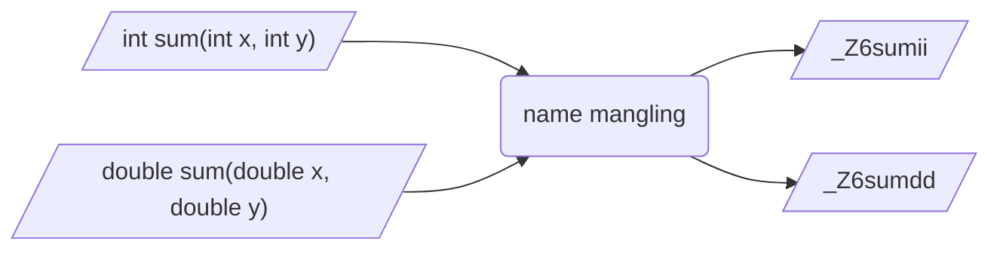

函数和变量在本质上都是地址助记符, 在链接过程中称为`symbol`(符号)

链接阶段, 链接器会按照符号名来解析不同目标文件和库文件中所引用符号, 以正确区分和链接函数

`c++`为支持函数重载、命名空间、类、模板等特性, 存在`name mangling`机制; c语言则无此机制

例如, 对于函数重载, `c++`编译器会在编译阶段通过添加参数类型、参数个数等额外信息对函数重命名, 生成唯一符号, 以区分同名函数

- 示例, c++定义两个同名函数后, 因`name mangling`生成唯一名称


```mermaid
graph LR;
    A[/"int sum(int x, int y)"/]
    A1[/"_Z6sumii"/]
    B[/"double sum(double x, double y)"/]
    B1[/"_Z6sumdd"/]
    C(name mangling)

    A-->C-->A1
    B-->C-->B1
```

## 对比

### c

c语言无`name mangling`机制, 每个函数名称必须唯一, 链接器可直接使用名称解析符号

- 示例, c生成目标文件

```c
// c_module.h
#include <stdio.h>

int add_num(int x, int y);
void display_value(double num);
```

```c
// c_module.c
#include "c_module.h"

int add_num(int x, int y) {
    return x + y;
}

void display_value(double num) {
    printf("res = %f\n", num);
}
```

生成中间文件

```sh
clang c_module.c -c -o c_module.o
```

使用`nm` 查看符号表, 发现函数的符号名与源代码中名称一致

```sh
0000000000000000    T add_num
0000000000000020    T display_value
0000000000000000    r .L.str
                    U printf
```

#### 错误情况

- 示例, c语言源文件函数同名

```c
#include <stdio.h>

int add_num(int x) {
    return x + 1;
}

double add_num(double x) {
    return x + 0.1;
}
```

编译时报错定义类型冲突

```sh
error: conflicting types for 'add_num'
```

c编译器不会对函数名增加任何处理, 因此函数名必须唯一

### c++

c++编译器通过`name mangling`机制, 对于同名函数, 只要参数类型、参数个数或返回值类型不一致也可通过编译

- 示例, 源文件中存在同名函数

```c
// cpp_module.hpp
#include <iostream>

int add_num(int x, int y);
double add_num(double x, double y);

void display_value(int num);
void display_value(double num);
```

```c
// cpp_module.cpp
#include "cpp_module.hpp"

int add_num(int x, int y) {
    return x + y;
}

double add_num(double x, double y) {
    return x + y;
}

void display_value(int num) {
    printf("int = %d\n", num);
}

void display_value(double num) {
    printf("double = %f\n", num);
}
```

生成中间文件

```sh
clang++ cpp_module.cpp -c -o cpp_module.o
```

查看符号表, 发现同名函数的符号名被重命名成唯一符号名

```sh
0000000000000000    r .L.str
000000000000000a    r .L.str.1
                    U printf
0000000000000070    T _Z13display_valued
0000000000000040    T _Z13display_valuei
0000000000000020    T _Z7add_numdd
0000000000000000    T _Z7add_numii
                    U _ZSt21ios_base_library_initv
```

### c/c++ 混合

#### 同步编译

- 示例, 使用c++编译器同步编译`.c`、`.cpp`

```c
// c_module.h
#include <stdio.h>

int add_num(int x, int y);
void display_value(double num);
```

```c
// c_module.c
#include "c_module.h"

int add_num(int x, int y) {
    return x + y;
}

void display_value(double num) {
    printf("res = %f\n", num);
}
```

```c
// main.cpp
#include "c_module.h"
#include <iostream>

int main() {
    int x = add_num(1, 2);
    display_value(6);
    return 0;
}
```

查看符号表发现, 只要使用c++编译器, 源文件内所有函数名都会被执行`name mangling`

```sh
0000000000000000    r .LCPI0_0
0000000000000000    T main
                    U _Z13display_valued
                    U _Z7add_numii
                    U _ZSt21ios_base_library_initv
```

#### 模块链接

c编译的中间文件与c++编译的中间文件在链接过程中可能会出现符号未定义错误

- 示例

```c
// math_module.h
#include <stdio.h>

int add(int x, int y);
double get_square_area(double length);
```

```c
// math_module.c
#include "math_module.h"

int add(int x, int y) {
    return x + y;
}

double get_square_area(double length) {
    return length * length;
}
```

```cpp
// main.cpp
#include "math_module.h"
#include <iostream>

int main() {
    int res = add(1, 2);
    double area = get_square_area(3.74);

    std::cout << "add = " << res << std::endl;
    std::cout << "square_area = " << area << std::endl;

    return 0;
}
```

- 编译链接

(1) 用c语言编译器将math_module.c生成 `math_module.o`

```sh
clang math_module.c -c -o math_module.o
```

(2) 使用c++编译器将main.cpp生成目标文件 `main.o`

```sh
clang++ main.cpp.cpp -c -o main.o
```

(3) 链接 `math_module.o`、`main.o` 为可执行文件, 出现符号未定义错误

```sh
clang++ math_module.o main.o -o main
```

(4) 分别查看符号表, 发现同函数在两个目标文件中符号各不相同

- 原因分析

(1) main.cpp 预处理时, 内容展开

```diff
+ #include <stdio.h>
+ int add(int x, int y);
+ double get_square_area(double length);

#include <iostream>

int main() {
    int res = add(1, 2);
    double area = get_square_area(3.74);
    std::cout << "add = " << res << std::endl;
    std::cout << "square_area = " << area << std::endl;
    return 0;
}
```

c++编译器生成main.o时, 对main.cpp中两个原本c语言函数名`add`、`get_square_area`进行`name mangling`, 生成新名`_Z3addii`、`_Z13get_square_aread`

(2) c编译器编译生成`math_module.o`, 没有`name mangling`机制, 函数名未改变

(3) 链接时`main.o`按`_Z3Addii` 符号名到各模块查找函数引用, 结果`math_module.o`里符号名是`add`、`get_square_area`, 无法匹配, 自然出现函数未定义错误

此时可通过`extern "C"`处理

## extern "C"

c++编译器中提供 `extern "C"`/ `extern "C" {}` 机制, 表示其后续或作用域内函数屏蔽`name mangling`机制, 按c语言风格处理, 保持原本名称

通常用于c++中调用c语言动态库, 以及c语言调用c++动态库时处理

- 特点

`extern "C"` 只能用于函数和全局变量声明, 不能用于类成员或模板

`extern "C"` 修饰函数内不能出现c++所有特性

### 语法

#### 作用于函数

```c
extern "C" 函数声明
```

函数名前添加`extern "C"`, 表示使用c++编译器时该函数均按c语言规则编译, 不进行`name mangling`

#### 作用于代码块

`extern "C" {}`表示代码块内所有函数均调用`extern "C"`

```c
extern "C" {
    void func_1();
    void func_2();
    ...
}
```

#### 仅c++编译时使用

预处理宏`__cplusplus`仅在c++编译器中定义, 可通过该宏判断代码是否被c++编译器编译

- 示例, 仅在代码被c++编译器编译时, 对函数添加`extern "C"`

```c++
#if __cplusplus
extern "C" {
#endif
    void func_1();
    void func_2();
#if __cplusplus
}
#endif
```

### 应用

#### c++调用c动态库

- 示例, 处理模块链接错误

修改main.cpp, 对于所引用c语言头文件使用`extern "C" {}`包裹

```c++
extern "C" {
    #include "math_module.h"
}

#include <iostream>

int main() {
    int res = add(1, 2);
    double area = get_square_area(3.74);
    std::cout << "add = " << res << std::endl;
    std::cout << "squareArea = " << area << std::endl;

    return 0;
}
```

main.cpp预处理时展开

```c++
extern "C" {
    #include <stdio.h>

    int add(int x, int y);
    double get_square_area(double length);
}

#include <iostream>

int main() {
    int res = add(1, 2);
    double area = get_square_area(3.74);
    std::cout << "add = " << res << std::endl;
    std::cout << "square_area = " << area << std::endl;

    return 0;
}
```

因`extren C ""`机制, main.cpp中两个函数名编译时不受`name mangling`影响, 依然保持原名称, 和math_module.o中符号一致

链接错误问题解决
