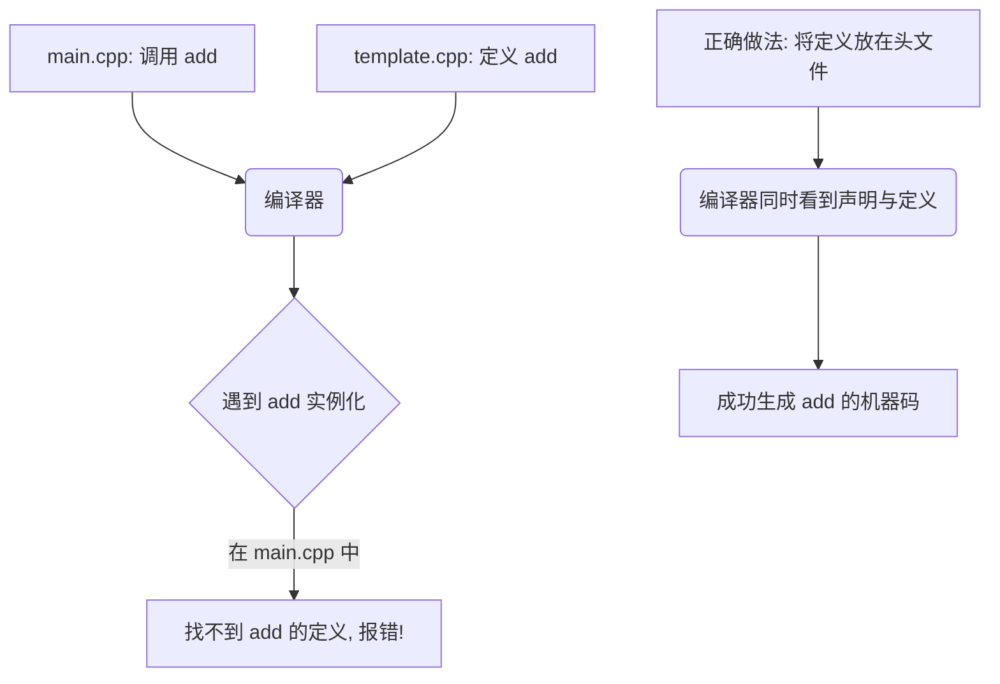

> 参考
>
> - [函数模板](https://mq-b.github.io/Modern-Cpp-templates-tutorial/md/%E7%AC%AC%E4%B8%80%E9%83%A8%E5%88%86-%E5%9F%BA%E7%A1%80%E7%9F%A5%E8%AF%86/01%E5%87%BD%E6%95%B0%E6%A8%A1%E6%9D%BF#%E5%87%BD%E6%95%B0%E6%A8%A1%E6%9D%BF)

## 定义

`c++ template`是实现泛型编程 (`generic programming`) 的核心特性, 允许开发者编写与类型无关代码, 在编译期根据传入的实际类型生成具体的代码实例, 从而极大地提高代码的重用性和灵活性

```c++
template<typename T>
```

- `template`：声明这是一个模板

- `typename`(或 `class`)：关键字, 表示后面跟着一个类型参数

- `T`：类型参数 (`type parameter`), 是一个占位符, 在模板实例化时会被具体的类型(如 `int` `double` `std::string`)替换

## 种类

### 普通模板

#### 函数模板(function templates)

函数模板允许定义一个通用的函数逻辑, 适用于多种数据类型

编译器会根据传入的参数自动推导类型(模板参数推导), 或者由开发者显式指定

```c++
// 单参数
template<typename T>

// 多参数
template<typename T, typename V>
```

```c++
#include <iostream>
#include <string>

// 单参数模板
template<typename T>
T add(T x, T y) {
    return x + y;
}

// 多参数模板
template<typename T, typename U>
void print(T x, U y) {
    std::cout << "x: " << x << ", y: " << y << std::endl;
}

int main() {
    // 1. 显式指定类型
    std::cout << add<int>(1, 2) << std::endl;
    
    // 2. 自动类型推导 (编译器根据 3.14 和 2.71 推导出 T 为 double)
    std::cout << add(3.14, 2.71) << std::endl; 
    
    // 3. 多参数模板调用
    print(1, 0.1412);
    print(std::string("Hello"), 'A');
    
    return 0;
}
```

#### 类模板(class templates)

类模板用于定义通用的类、结构体或联合体

与函数模板不同, 类模板通常不能自动推导参数类型(c++17 引入了类模板参数推导 CTAD, 但在复杂场景下仍需显式指定)

```c++
#include <iostream>

template <typename T>
class Composer {
public:
    Composer(T x, T y) : mX(x), mY(y) {}

    T get_max() const {
        return mX > mY ? mX : mY;
    }
private:
    T mX;
    T mY;
};

int main() {
    Composer<int> com(1, 2);
    std::cout << com.get_max() << std::endl;

    return 0;
}
```

### 可变参数模板(variadic templates)

c++11 引入了可变参数模板, 允许模板接受任意数量、任意类型的参数

#### 定义

`typename`后跟 `...Args` 表明Args是可变模板参数, 可接收多种数据类型, 又称模板参数包

```c++
// args参数, 类型为Args... , 可以接收任意个参数
template<typename... Args>
void vair_fun(Args... args) {
    // ...
}
```

#### 读取

- 递归方式解包

定义一个辅助递归模板函数, 每次递归调用时从参数包中取出一个参数, 直到参数包为空

```c++
#include <iostream>

// 基础递归终止函数
void print() {
    // 换行作为递归终止标志
    std::cout << std::endl;
}

// 递归模板函数
template<typename T, typename... Args>
void print(T firstArg, Args... args) {
    // 打印第一个参数
    std::cout << firstArg << " ";
    // 递归调用, 解包剩余参数
    print(args...);
}

// 可变参数模板函数
template<typename... Args>
void print_all(Args... args) {
    // 调用递归模板函数开始解包
    print(args...);
}

int main() {
    print_all(1, 2.5, "Hello");
    return 0;
}
```

- `std::initializer_list`和逗号运算符解包

```c++
#include <iostream>

// 可变参数模板函数, 使用std::initializer_list和逗号运算符解包
template<typename... Args>
void print_all(Args... args) {
    (void) std::initializer_list<int>{ (std::cout << args << " ", 0)... };
    std::cout << std::endl;
}

int main() {
    print_all(1, 2.5, "Hello");

    return 0;
}
```

## 特征

### 特化

模板特化允许为某些特定的类型提供不同于通用模板的定制化实现

分为全特化和偏特化

#### explicit specialization(全特化)

全特化是指将模板的所有参数都指定为具体的类型

```c++
#include <iostream>
#include <string>

// 通用模板
template<typename T>
struct Printer {
    void print(const T& value) {
        std::cout << "General: " << value << std::endl;
    }
};

// 全特化：针对 std::string 提供特定实现
template<>
struct Printer<std::string> {
    void print(const std::string& value) {
        std::cout << "String Specialization: [" << value << "]" << std::endl;
    }
};

int main() {
    Printer<int> p1;
    p1.print(42);

    Printer<std::string> p2;
    p2.print("Hello");
    return 0;
}
```

#### partial specialization(偏特化)

偏特化(部分特化)是指只特化模板的部分参数, 或者对参数的某种类型特征(如指针、引用)进行特化

注意：函数模板不支持偏特化, 只有类模板支持

```c++
#include <iostream>
#include <typeinfo>

// 通用类模板
template<typename T>
class TypeAnalyzer {
public:
    void analyze() {
        std::cout << "Generic type: " << typeid(T).name() << std::endl;
    }
};

// 偏特化 1：针对所有指针类型 (T*)
template<typename T>
class TypeAnalyzer<T*> {
public:
    void analyze() {
        std::cout << "Pointer to type: " << typeid(T).name() << std::endl;
    }
};

// 偏特化 2：针对 std::pair 类型 (包含两个模板参数)
template<typename T1, typename T2>
class TypeAnalyzer<std::pair<T1, T2>> {
public:
    void analyze() {
        std::cout << "std::pair of " << typeid(T1).name() << " and " << typeid(T2).name() << std::endl;
    }
};

int main() {
    TypeAnalyzer<int> t1;
    t1.analyze(); // Generic type: i (int)

    TypeAnalyzer<int*> t2;
    t2.analyze(); // Pointer to type: i (int)

    TypeAnalyzer<std::pair<int, double>> t3;
    t3.analyze(); // std::pair of i and d
    return 0;
}
```

### 变量类型

提取模板变量类型及其特性主要通过类型萃取(`type traits`)和`SFINAE`(`substitution failure is not an error`)技术实现

#### 提取

利用标准库中头文件`<type_traits>`, 可检查、提取和操作模板变量类型信息

- std::decay

`std::decay`是一个类型特征(type trait), 其会去掉模板变量引用、cv-限定符(`const`、`volatile`), 并将数组和函数类型转换为指针类型, 之后提取模板类型

`std::decay`本身并不直接"提取"模板变量类型, 它只是转换一个给定类型到其衰减后形式

示例, 提取模板变量类型

```c++
#include <iostream>
#include <type_traits>

template <typename T>
void print_decay_type() {
    using DecayedT = typename std::decay<T>::type
    std::cout << typeid(DecayedT).name() << std::endl;
}

int main() {
    // int(移除引用)
    print_decay_type<int&>();

    // int const * __ptr64
    print_decay_type<const int[]>();

    return 0;
}
```

- `remove_reference/remove_cv`

`std::remove_reference`和`std::remove_cv`是两种类型特征(`type traits`), 分别用于从给定类型中移除引用和cv-限定符(const和volatile)

```c++
#include <iostream>
#include <type_traits>

template <typename T>
void print_stripped_type() {
    // 先移除引用, 再移除cv限定符
    using CleanedT = typename std::remove_cv<typename std::remove_reference<T>::type>::type;
    std::cout << typeid(CleanedT).name() << std::endl;
}

int main() {
    // int
    print_stripped_type<const int&>();

    return 0;
}
```

- `std::type_traits`

`std::type_traits` 是 c++11 所引入标准库, 提供一组模板类和函数, 用于在编译时查询和操作类型特性, 包括但不限于类型是否为整型、是否为浮点型、是否有默认构造函数、是否可拷贝等

```c++
#include <iostream>
#include <type_traits>

template <typename T>
void print_type_traits() {
    std::cout << "is_pointer: " << std::is_pointer<T>::value << std::endl;
    std::cout << "is_reference: " << std::is_reference<T>::value << std::endl;
    std::cout << "is_integral: " << std::is_integral<T>::value << std::endl;
    std::cout << "is_float: " << std::is_floating_point<T>::value << std::endl;
}

int main() {
    // is_pointer: 1
    print_type_traits<int*>();
    // is_reference: 1
    print_type_traits<int&>();
    // is_float: 1
    print_type_traits<float>();
    return 0;
}
```

- `decltype`

`decltype` 操作符用于在编译时推导表达式类型

```c++
template <typename T, typename U>
auto add(T a, U b) -> decltype(a + b) {
    return a + b;
}

int main() {
    // 推导出result类型为double
    auto result = add(1, 2.0);
    // double
    std::cout << typeid(result).name() << std::endl;

    return 0;
}
```

## 编译

### 问题

在 c++ 的分离编译模型中, 通常将声明放在 `.h` 文件, 定义放在 `.cpp` 文件

但模板不能这样做(除非使用显式实例化), 因为模板本身不是真实的代码, 而是一个"代码生成器"

编译器在编译 `.cpp` 文件时, 如果看不到模板被具体类型实例化, 就不会生成任何机器码

当链接器尝试将使用了模板的 中间文件和包含模板定义的库文件链接时, 会找不到具体的符号, 从而报 `Undefined Reference`错误



### 解决

#### 声明定义均放头文件

```c++
// math_utils.hpp
#pragma once
#include <iostream>

template <typename T>
class MathUtils {
public:
    void print(const T& value);
};

// 在头文件中直接给出实现
template <typename T>
void MathUtils<T>::print(const T& value) {
    std::cout << "Value: " << value << std::endl;
}

```

#### 定义放内联实现文件

为了保持头文件整洁, 可以将实现放在 `.tpp` 文件中, 并在 `.hpp` 的末尾 `#include` 它

```c++
// math_utils.hpp
#pragma once
template <typename T>
class MathUtils {
public:
    void print(const T& value);
};

// 包含实现文件 (注意：不是 .cpp, 防止被编译器独立编译)
#include "math_utils.tpp" 

```

```c++
// math_utils.tpp
template <typename T>
void MathUtils<T>::print(const T& value) {
    // 实现代码
}
```

#### 显式实例化

若确定模板只会用于特定类型, 可使用显式实例化, 将模板定义放在`.cpp`中实例化所需类型

```c++
// math_utils.cpp
#include "math_utils.hpp"

template <typename T>
void MathUtils<T>::print(const T& value) { /*...*/ }

// 显式实例化：强制编译器生成 int 和 double 版本的代码
template class MathUtils<int>;
template class MathUtils<double>;
```

现在`.cpp`只会生成特定类型模板实例, 对于没有实例化类型编译器会报错

## 类型萃取(type traits)

`traits`是一种用于泛型编程(`generic programming`)技术, 允许程序根据类型特征进行编译期决策

`traits`可以在编译时查询和操作类型属性, 而无需在运行时进行类型检查, 通常用于模板编程中以增强代码灵活性和可重用性

例如可以创建一个`traits`来确定类型是否为某种类型(如整数、浮点数、指针等), 是否满足某种条件(如可复制、可移动), 或者是否具备某种操作(如算术操作、输入输出操作)等

### 功能

`traits`通常以模板类形式实现, 并使用模板特化(`template specialization`)来定义特定类型特性

#### is_same

`std::is_same` 是c++标准库中所提供, 用于判断两个模板类型是否相同

```c++
#include <iostream>
#include <type_traits>

template <typename T>
void check_type() {
    if (std::is_same<T, int>::value) {
        std::cout << "type is int" << std::endl;
        return;
    }
    std::cout << "type is not int" << std::endl;
}

int main() {
    check_type<int>();
    check_type<double>();

    return 0;
}
```

#### 自定义traits类

可以自定义traits类来检查某个类型, 通常使用模板特化来对特定类型进行处理

```c++
#include <iostream>
#include <type_traits>

// 默认情况下, 非整数类型
template <typename T>
struct IsInteger {
    static const bool value = false;
};

// 针对整数类型进行特化
template <>
struct IsInteger<int> {
    static const bool value = true;
};

template <>
struct IsInteger<long> {
    static const bool value = true;
};

template <typename T>
void check_int_type() {
    if (IsInteger<T>::value) {
        std::cout << "type is integer" << std::endl;
        return;
    }
    std::cout << "type is not integer" << std::endl;
}

int main() {
    check_int_type<int>();
    check_int_type<double>();

    return 0;
}
```

上面代码中定义一个 IsInteger traits 类

通过模板特化将 `IsInteger<int>` 和 `IsInteger<long>` 设置为 true, 而其他类型默认为 false

### 类型别名

#### value_type

`value_type`定义容器中存储元素类型

```c++
#include <iostream>
#include <vector>

int main() {
    using value_type = std::vector<int>::value_type

    std::vector<int> vec = {1, 2, 3, 4, 5};
    value_type x = 10;
    vec.push_back(x);

    std::cout << vec.back() << std::endl;

    return 0;
}
```

#### difference_type

`difference_type`表示两个迭代器之间距离类型, 通常是一个有符号整数类型

```c
#include <vector>
#include <iostream>

int main() {
    std::vector<int> vec = {1, 2, 3, 4, 5};
    auto it1 = vec.begin();
    auto it2 = vec.end();

    // 计算迭代器之间距离
    std::vector<int>::difference_type diff = it2 - it1;
    std::cout << diff << std::endl;

    return 0;
}
```

#### pointer

pointer提供指向容器中元素指针类型

#### reference

reference定义容器中元素引用类型

```c++
#include <vector>
#include <iostream>

int main() {
    std::vector<int> vec = {1, 2, 3, 4, 5};
    // 获取vec中第一个元素引用
    std::vector<int>::reference ref = vec[0];
    // 修改引用值, 即修改vec中第一个元素值
    ref = 10;
    // 输出10, 表示vec中第一个元素被修改
    std::cout << vec[0] << std::endl;

    return 0;
}
```

#### std::iterator_traits

`std::iterator_traits`是 c++ 标准库中一个模板结构体, 提供方法来查询迭代器特性, 如迭代器类别、值类型、差异类型、指针类型和引用类型等, 其主要定义几个类型别名`value_type`、`difference_type`、`pointer`、`reference` 等

#### 获取指向类型

`std::iterator_traits<T>::value_type` 用于获取迭代器 T 所指向值类型

- 示例, 获取迭代器类型

```c++
#include <iterator>
#include <type_traits>

template <typename T>
struct MyIterator {
    using iterator_category = std::forward_iterator_tag; // 迭代器类别
    using value_type = T;                                // 值类型
    using difference_type = std::ptrdiff_t;              // 差异类型
    using pointer = T*;                                  // 指针类型(如果需要)
    using reference = T&;                                // 引用类型

    // ... 其他成员和函数 ...
};

// 通常不需要特化 std::iterator_traits, 除非你有特殊需求
// 在这个例子中, MyIterator 已经定义所有必要类型成员, 所以 std::iterator_traits<MyIterator<T>> 会自动工作

int main() {
    // 使用 std::iterator_traits 来查询 MyIterator特性
    static_assert(std::is_same<std::iterator_traits<MyIterator<int>>::iterator_category, std::forward_iterator_tag>::value, "");
    static_assert(std::is_same<std::iterator_traits<MyIterator<int>>::value_type, int>::value, "");
    // ... 其他静态断言 ...

    return 0;
}
```

例如, 若 `T` 是 `std::vector<int>::iterator`, 那么 `iterator_traits<T>::value_type` 将是 `int`

- 示例, `iterator_traits`使用

```c++
template<typename T>
typename iterator_traits<T>::value_type TestFunc(T iter) {
    return *iter;
}
```

(1) 模板声明

`template<typename T>` 表示 TestFunc 是模板函数, 可以接受任意类型 T 参数

(2) 函数返回类型

`typename iterator_traits<T>::value_type`

函数返回类型, 使用 iterator_traits 提取 T 类型所对应迭代器值类型(即 value_type)

`typename` 关键字用于指明`iterator_traits<T>::value_type` 是一个类型(type), 而不是一个静态成员或其他内容

(3) 函数参数

该函数接受一个类型为 `T` 参数 iter, 通常是一个迭代器(例如指向容器指针或迭代器)

(4) 函数体

函数返回 `*iter`, 即传入迭代器所指向值, 意味着 T 必须是一个可以解引用迭代器类型

(5) 用途

该函数接受一个迭代器 ite, 并返回迭代器解引用后值

返回类型是 `T` 所对应迭代器 value_type, 确保返回值类型与 ite 所指向对象类型相匹配

因此, 该函数可以处理任意迭代器, 例如 `std::vector<int>::iterator`、`std::list<std::string>::iterator` 等, 而不需要知道具体容器类型

```c++
#include <iostream>
#include <vector>
#include <iterator>

template<typename T>
typename std::iterator_traits<T>::value_type func(T iter) {
    return *iter;
}

int main() {
    std::vector<int> vec = {1, 2, 3, 4, 5};
    auto it = vec.begin();
    int val = func(it);
    std::cout << "The value is: " << val << std::endl;

    return 0;
}
```