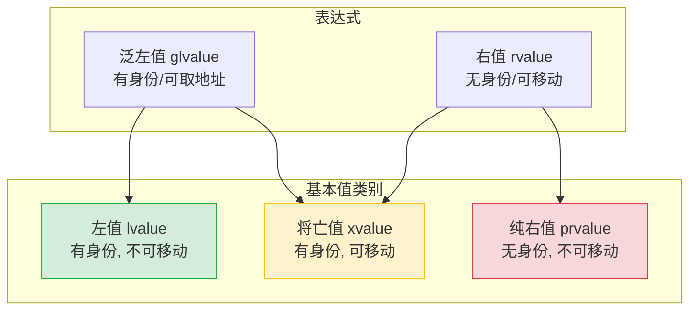
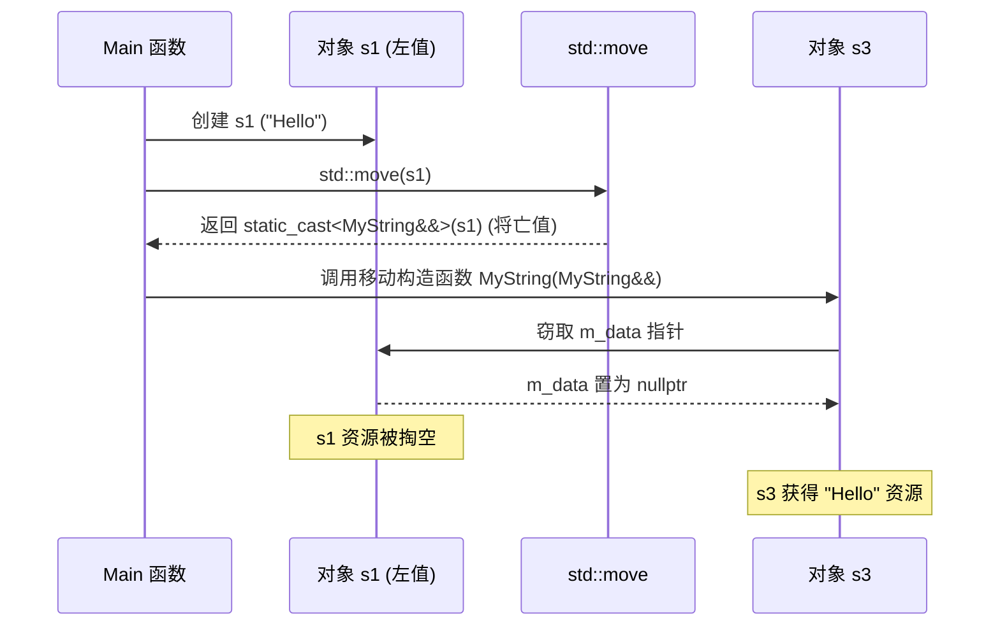

> 参考
> 
> - [[Modern c++]深入理解左值、右值](https://mp.weixin.qq.com/s/_9-0iNUw6KHTF3a-vSMCmg)
> - [理解 C_c++ 中的左值和右值](https://nettee.github.io/posts/2018/Understanding-lvalues-and-rvalues-in-C-and-C/)
> - [c++中左值(引用)及右值(引用)详解](https://blog.csdn.net/weixin_43064827/article/details/120803409?spm=1001.2101.3001.6661.1&utm_medium=distribute.pc_relevant_t0.none-task-blog-2%7Edefault%7ECTRLIST%7ERate-1-120803409-blog-78619152.pc_relevant_aa_2&depth_1-utm_source=distribute.pc_relevant_t0.none-task-blog-2%7Edefault%7ECTRLIST%7ERate-1-120803409-blog-78619152.pc_relevant_aa_2&utm_relevant_index=1)

`c++11` 引入了`rvalue reference`, 此特性允许程序员高效地移动资源而非拷贝资源, 可显著提高程序性能

## 值类别(value categories)

c++11 对表达式的值类别进行了更细致的划分

- `lvalue`

表示一个有名字、有明确内存地址(可寻址)的对象, 其生命周期通常超出当前表达式

```c
// x是一个左值
int x = 10;
```

- `rvalue`

通常表示一个临时的、无名字的、不可寻址的值, 其生命周期仅存在于当前表达式中

```c
// 5和3是右值, 它们和8也是一个右值
int y = 5 + 3;
```

### 细化分类

c++11 为了支持移动语义, 将值类别进一步细化为三种基本类别: 左值(lvalue)、纯右值 (prvalue) 和 将亡值(xvalue)

- 纯右值 (`prvalue` `pure rvalue`): 传统的右值

如字面量 10、返回非引用类型的函数调用 get_value()、临时对象 MyClass()

- 将亡值 (`xvalue`): C++11 新增

它有身份(可取地址), 但其资源即将被"剥夺"或"转移", 例如 std::move(obj) 的返回值

- 泛左值 (`glvalue`): 左值和将亡值的统称(有身份的表达式)

- 右值 (`rvalue`): 纯右值和将亡值的统称(可被安全移动的表达式)



### 左右值判断

- 能否使用 & 取地址?

能取地址的是泛左值(左值或将亡值), 不能取地址的是纯右值

- 能否被移动?

将亡值和纯右值可以被移动, 左值不能被直接移动

```c
int a = 10;      // a 是左值 (lvalue)
int b = a + 5;   // a+5 是纯右值 (prvalue)
int&& c = std::move(a); // std::move(a) 是将亡值 (xvalue)
```

## 引用

### 左值引用(lvalue reference)

c++98 引入的引用, 使用 `&` 表示, 它只能绑定到左值

```c++
int num = 10;
int& ref1 = num;  // 正确：绑定到左值
int& ref2 = 10;   // 错误：不能将纯右值绑定到非常量左值引用
```

常量左值引用 (`const lvalue reference`)是一个特例, 它可以绑定到右值

这在c++98 中常用于避免参数传递时的拷贝

```c
const int& ref3 = 10;       // 正确：常量左值引用可绑定右值
const int& ref4 = num + 5;  // 正确
```

### 右值引用(rvalue reference)

`c++11` 新标准引入右值引用, 用 `&&` 表示, 右值引用使得可以**转移**资源, 而不是复制, 避免不必要的拷贝, 从而实现移动语义

```c
int&& rref1 = 10;          // 正确：绑定纯右值
int&& rref2 = std::move(num); // 正确：绑定将亡值
int&& rref3 = num;         // 错误：不能直接绑定左值
```

右值引用必须在初始化时绑定到一个右值, 且一旦绑定, 右值引用就指向该右值

```c++
int num = 10;

// 错误: 不能将左值绑定到右值引用
int &&a = num; // 编译错误

// 正确: 右值引用绑定到右值
int &&b = 10;
```

## 移动语义(move semantics)

移动语义通过右值引用实现, 使得对象可以`移动`而不是`拷贝`, 从而提升性能

移动构造函数和移动赋值运算符是移动语义主要实现方式

### 移动构造函数

移动构造函数允许对象的资源从一个临时对象(右值)转移到新的对象, 而不是复制

```c++
class MyClass {
public:
    int* m_data;

    // 构造函数: 为 m_data 分配内存
    MyClass(int value) : m_data(new int(value)) {}

    // 移动构造函数: 从右值引用移动资源
    MyClass(MyClass&& other) : m_data(other.m_data) {
        other.m_data = nullptr;  // 将 other 的资源置为空
    }

    // 析构函数: 释放资源
    ~MyClass() {
        delete m_data;
    }
};
```

移动构造函数MyClass(MyClass&& other)接收一个右值引用other, 并将其资源(m_data)转移到当前对象, 然后, 将other.mData置为空指针, 避免在析构时释放资源

### 移动赋值运算符

移动赋值运算符用于将一个右值的资源移动到当前对象, 避免不必要的内存分配和释放

```c++
MyClass& operator=(MyClass&& other) {
    if (this != &other) {
        delete m_data;
        m_data = other.m_data;
        other.m_data = nullptr;
    }
    return *this;
}
```

通过移动赋值运算符, 避免了不必要的资源拷贝, 从而提高了性能

### std::move本质

`std::move`是一个标准库函数, 它接受一个左值并将其"转换"为右值引用, 从而可以将左值对象资源移动到另一个对象中

`std::move`本质上并不真正"移动"对象, 它只是将左值转换为右值引用, 使得移动语义可以生效

```c++
MyString s1("Hello");
// s1 是左值, 直接赋值会调用"拷贝构造函数"
MyString s2 = s1; 

// std::move(s1) 将 s1 转换为右值引用, 触发"移动构造函数"
MyString s3 = std::move(s1); 

// 此时 s1 内部的 m_data 已被置空, 处于"有效但未定义"的状态
// 不能再使用 s1 的内容, 但可以给它重新赋值或让其安全析构
```



## 完美转发(perfect forwarding)

右值引用的另一个核心应用是完美转发

在编写泛型包装函数(如工厂函数、线程包装器)时, 希望将参数原封不动(保持其左值/右值属性)地传递给内部函数

需要结合万能引用和 `std::forward` 来实现

### std::forward 作用

`std::forward<T>(arg)` 会在 `arg` 是右值时将其转换为右值引用, 在 `arg` 是左值时保持其左值引用

```c
#include <iostream>
#include <utility>

void process(int& x) {
    std::cout << "Lvalue reference: " << x << "\n";
}

void process(int&& x) {
    std::cout << "Rvalue reference: " << x << "\n";
}

// 泛型包装函数
template <typename T>
void wrapper(T&& arg) {
    // 如果不使用 std::forward, arg 本身是左值, 永远只会调用 process(int&)
    // 使用 std::forward 可以完美还原 arg 传入时的值类别
    process(std::forward<T>(arg)); 
}

int main() {
    int a = 10;
    
    wrapper(a);      // 传入左值, 最终调用 process(int&)
    wrapper(20);     // 传入右值, 最终调用 process(int&&)
    wrapper(std::move(a)); // 传入将亡值, 最终调用 process(int&&)
    
    return 0;
}
```

最佳实践与总结

- `Rule of Zero`(零法则)： 尽量使用标准库容器(如 std::vector, std::string)和智能指针(std::unique_ptr, std::shared_ptr)来管理资源

这样编译器自动生成的默认构造、析构、拷贝和移动函数就能完美工作, 你不需要手动编写那五个函数

- 移动语义的适用场景：

函数返回大型局部对象时(虽然现代编译器有 RVO/NRVO 返回值优化, 但移动语义是底线保证)

向容器(如 `std::vector`)中插入临时对象时(使用 std::vector::push_back(std::move(obj)) 或 emplace_back)

实现工厂函数或转移对象所有权时(如 std::unique_ptr 的转移)

- 被 `std::move` 掏空的对象

被移动后的对象处于 "有效但未定义" (Valid but unspecified state) 的状态

只能对它进行销毁(析构)或重新赋值, 绝对不能再读取它的业务数据

- `noexcept` 的重要性

自定义移动构造函数和移动赋值运算符时, 务必加上 noexcept

如果移动操作可能抛出异常, STL 容器(如 std::vector)在重新分配内存时, 为了保证强异常安全(Strong Exception Guarantee), 会放弃使用移动构造, 退化为使用效率低下的拷贝构造