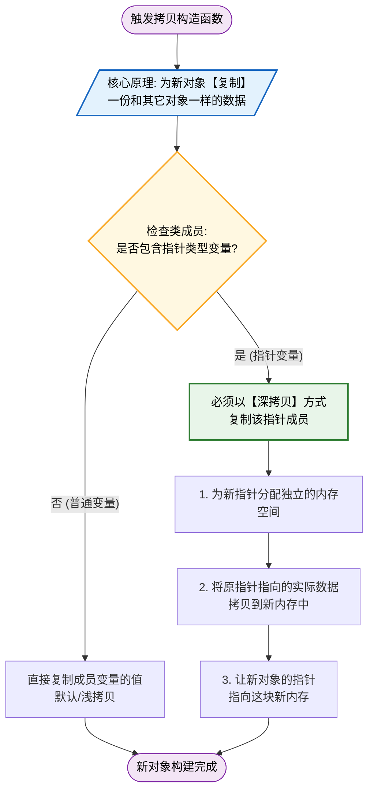

`c++ 11` 标准之前, 若想用类对象初始化一个同类新对象, 只能借助类中复制(拷贝)构造函数

拷贝构造函数实现原理就是为新对象**复制**一份和其它对象一样的数据

当类中拥有指针类型成员变量时, 拷贝构造函数中需要以**深拷贝**方式复制该指针成员



## 概念

移动语义是用于优化资源管理和提高程序性能的一种重要特性, 其主要通过**转移**(移动)资源所有权而不是复制资源, 以减少不必要深拷贝开销

移动语义主要依赖于右值引用(`rvalue reference`)、移动构造函数(`move constructor`)及移动赋值运算符(`move assignment operator`)来实现

### 支持类型

`c++`中支持移动语义类型一般是具有资源所有权或需要深拷贝类型, 常见支持移动语义类型有:

- 标准库容器

如`std::vector`、`std::string`、`std::unique_ptr`等

容器和智能指针因为管理动态内存, 所以非常适合使用移动语义

- 用户定义类型

若一个类管理动态内存或者其他资源(如文件句柄), 则可以为其实现移动构造和移动赋值

- 智能指针

如`std::unique_ptr`, 它具有唯一资源所有权, 不能复制, 只能移动

支持移动语义类型通常会利用`std::move()`来显式地将对象转换为右值, 以触发移动构造函数或移动赋值运算符

### 实现

#### 移动构造函数

移动构造函数用于初始化新对象时, 将资源从一个右值对象移动到新对象上

```c++
class MyClass {
public:
    // 移动构造函数
    MyClass(MyClass&& other) noexcept {
        // 将other资源转移到当前对象
        this->resource = other.resource;
        // 清空other资源
        other.resource = nullptr;
    }
};
```

#### 移动赋值运算符

移动赋值运算符用于将资源从一个右值对象赋值给已有对象

```c++
class MyClass {
public:
    // 移动赋值运算符
    MyClass& operator=(MyClass&& other) noexcept {
        if (this != &other) { // 避免自我赋值
            // 释放当前对象资源
            delete this->resource;
            // 转移资源
            this->resource = other.resource;
            // 清空other资源
            other.resource = nullptr;
        }
        return *this;
    }
};
```

为了确保对象只能通过移动来转移资源, 而不是复制资源, 可以显式禁用拷贝构造函数和拷贝赋值运算符

```c++
class MyClass {
public:
    // 禁用拷贝构造
    MyClass(const MyClass&) = delete;
    // 禁用拷贝赋值
    MyClass& operator=(const MyClass&) = delete;
    // 移动构造
    MyClass(MyClass&& other) noexcept;
    // 移动赋值
    MyClass& operator=(MyClass&& other) noexcept;
};
```

### std::move

`std::move()`是标准库函数, 可以将左值转换为右值, 以便触发移动语义

c++11 标准中借助右值引用可以为指定类添加移动构造函数, 当使用该类右值对象(可以理解为临时对象)初始化同类对象时, 编译器会优先选择移动构造函数

```c++
#include <iostream>

class MyClass {
public:
    MyClass() : m_num(new int(0)) {
        std::cout << "Construct!" << std::endl;
    }

    MyClass(const MyClass& d) : m_num(new int(*d.m_num)) {
        std::cout << "Copy Construct!" << std::endl;
    }

    MyClass(MyClass&& d) noexcept {
        m_num = d.m_num;
        d.m_num = NULL;
        std::cout << "Move Construct!" << std::endl;
    }
public:
    int* m_num;
};

int main() {
    MyClass my_class;
    MyClass demo2 = my_class;
    MyClass demo3 = std::move(my_class);

    return 0;
}
```

运行结果

```sh
Construct!
Copy Construct!
Move Construct!
```

my_class 对象作为左值, 直接用于初始化 demo2 对象, 调用拷贝构造函数

通过调用 `std::move()`可以得到 my_class 对象右值形式, 用其初始化 demo3 对象, 优先调用移动构造函数
