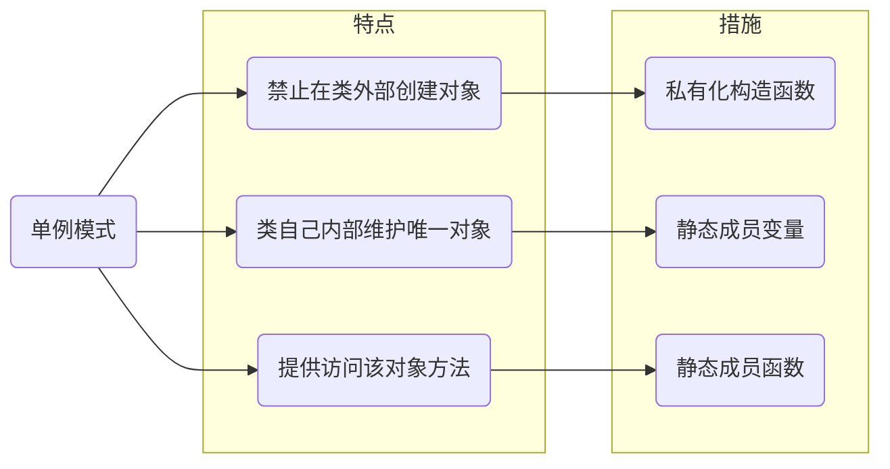
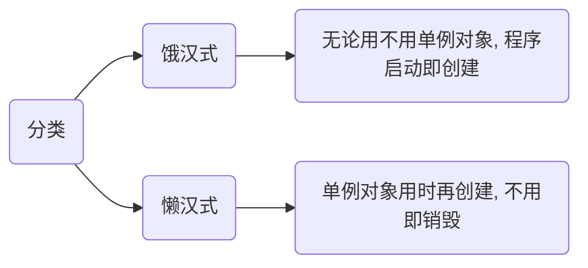

## 概念

单例模式（Singleton）是一种创建型设计模式, 确保一个类在整个程序中仅存在一个实例, 并提供全局访问点

特点

- 禁止在类外部直接创建对象

- 类内部维护唯一实例

- 提供访问该实例的方法

措施

- 私有化构造函数

- 使用静态成员变量存储实例

- 提供静态成员函数访问实例



单例模式主要分为两类



## 实现

### c

c中可通过静态变量 + malloc 实现懒汉式单例

```c++
#include <stdio.h>
#include <stdlib.h>

typedef struct {
    int value;
} Singleton;

Singleton* get_instance() {
    static Singleton* s = NULL;
    if (s == NULL) {
        s = (Singleton*)malloc(sizeof(Singleton));
        s->value = 0;
    }
    return s;
}

int main() {
    Singleton* s1 = get_instance();
    Singleton* s2 = get_instance();
    printf("s1 address: %p\n", s1);
    printf("s2 address: %p\n", s2);
    return 0;
}
```

运行结果

```sh
s1 address: 0x5affbf72a2a0
s2 address: 0x5affbf72a2a0
```

> 说明：两次获取的地址相同, 仅创建了一次实例

### c++

c++ 中可利用局部静态变量实现线程安全单例(c++11 及以上)

```c++
#include <iostream>

class Singleton {
public:
    // 返回单例, c++11 以上线程安全
    static Singleton& get_instance() {
        static Singleton s;
        return s;
    }
    // 禁用拷贝构造函数
    Singleton(Singleton const&) = delete;
    // 禁用赋值构造函数
    Singleton& operator=(Singleton const&) = delete;
private:
    // 构造与析构函数设置为私有类型
    Singleton() = default;
    ~Singleton() = default;
};

int main(void) {
    Singleton& s1 = Singleton::get_instance();
    Singleton& s2 = Singleton::get_instance();
    Singleton& s3 = Singleton::get_instance();

    std::cout << &s1 << std::endl;
    std::cout << &s2 << std::endl;
    std::cout << &s3 << std::endl;
    return 0;
}
```

运行结果

```sh
0x604558498151
0x604558498151
0x604558498151
```

可发现仅执行了一次构造与析构函数, 并且创建出对象地址均一致, 说明为同个对象

#### 单例模板

为了提高复用性, 可以使用模板实现通用单例模式

```c++
#include <iostream>

template <typename T>
class Singleton {
public:
    static T& get_instance() {
        static T s;
        return s;
    }

    Singleton(const Singleton&) = delete;
    Singleton& operator=(const Singleton&) = delete;
protected:
    Singleton() = default;

    virtual ~Singleton() = default;
};

class Log : public Singleton<Log> {
    // 为使父类能访问派生类构造与析构函数
    friend class Singleton<Log>;
public:
    Log(const Log&) = delete;
    Log& operator=(const Log&) = delete;
private:
    Log() = default;
    ~Log() = default;
};
```
