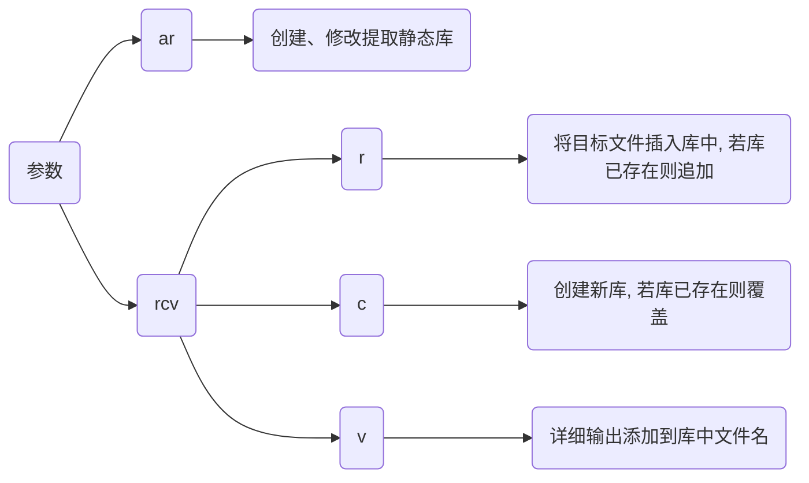

## 概念

`static library`(静态库)是一种在编译时就被链接到最终可执行文件中的库

静态库包含一组函数或代码实现, 当程序需要使用这些功能时, 链接器会将静态库中相关部分复制到可执行文件中

静态库通常以`.a`(在 unix 和 linux 系统中)或`.lib`(在 windows 系统中)为文件扩展名

### 特点

#### 编译时链接

静态库在程序编译时就被链接到最终可执行文件中

编译器和链接器会把所需库文件代码嵌入到最终程序中

#### 依赖

不依赖于运行时环境: 由于静态库已经在编译时被嵌入到可执行文件中, 程序在运行时不再需要再去查找和加载外部库文件

因此静态库不依赖于运行时环境, 程序在运行时不需要静态库文件

#### 体积

由于静态库代码被复制到每个所依赖它可执行文件中, 最终可执行文件会比动态链接程序大得多

因为每个使用静态库程序都会有自己库副本

#### 版本控制

没有版本控制

一旦静态库被链接到程序中, 更新库中代码并不会自动影响已经编译好程序

如果库文件发生变化, 需要重新编译程序, 才能使用

### 对比

| 特性     | 静态库                             | 动态库                                       |
| -------- | ---------------------------------- | -------------------------------------------- |
| 链接时间 | 在编译时链接到可执行文件中         | 在运行时由操作系统加载和链接                 |
| 文件大小 | 可执行文件包含库代码, 文件较大     | 可执行文件较小, 库文件单独                   |
| 性能     | 无需在运行时加载, 启动速度较快     | 启动时需要加载, 可能稍慢                     |
| 更新     | 更新库文件需要重新编译所有依赖程序 | 更新库文件后, 无需重新编译, 程序直接使用新库 |
| 依赖管理 | 无需在运行时寻找库文件             | 程序需要在运行时找到正确库文件               |
| 内存使用 | 每个程序都包含一份静态库副本       | 多个程序可以共享同一个动态库内存             |

## 开发


### 生成

```c++
// static_api.h
#ifndef __STATIC_API_HPP__
#define __STATIC_API_HPP__

#include <iostream>

extern "C" {
    int add(int x, int y);
    void hello();
}

#endif
```

```c
// static_api.cpp
#include "static_api.hpp"

int add(int x, int y) {
    return x + y;
}

void hello() {
    std::cout << "Hello World" << std::endl;
}
```

#### 编译器

```sh
clang++ 源文件 -c -o 目标文件

ar rcv 库文件 目标文件
```



- 示例, 生成静态库

```sh
clang++ static_api.cpp -c -o static_api.o

ar rcv libstatic_api.a static_api.o
```

#### 构建工具

通过cmake等工具生成静态库

```cmake
# CMakeLists.txt
cmake_minimum_required(VERSION 3.16)
project(static_api)

add_library(${PROJECT_NAME} STATIC "")
target_sources(${PROJECT_NAME} PUBLIC ${CMAKE_SOURCE_DIR}/static_api.cpp)
```

## 使用

### 链接

- 示例, 使用静态库

```c
// main.cpp
#include "static_api.hpp"

int main(void) {
    hello();
    std::cout << add(0xA, 0xB) << std::endl;

    return 0;
}
```

```sh
clang++ 源文件 库文件 -o 可执行文件
```
