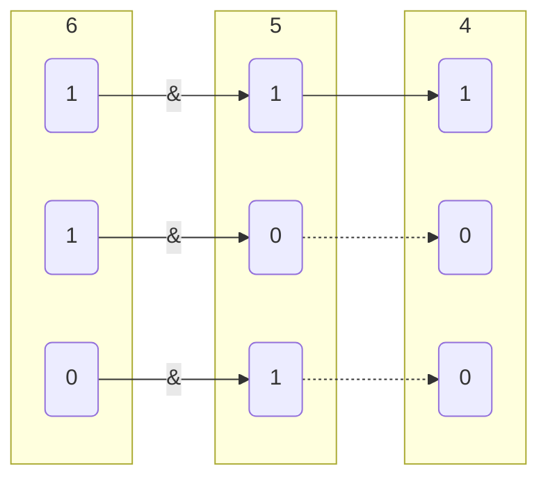
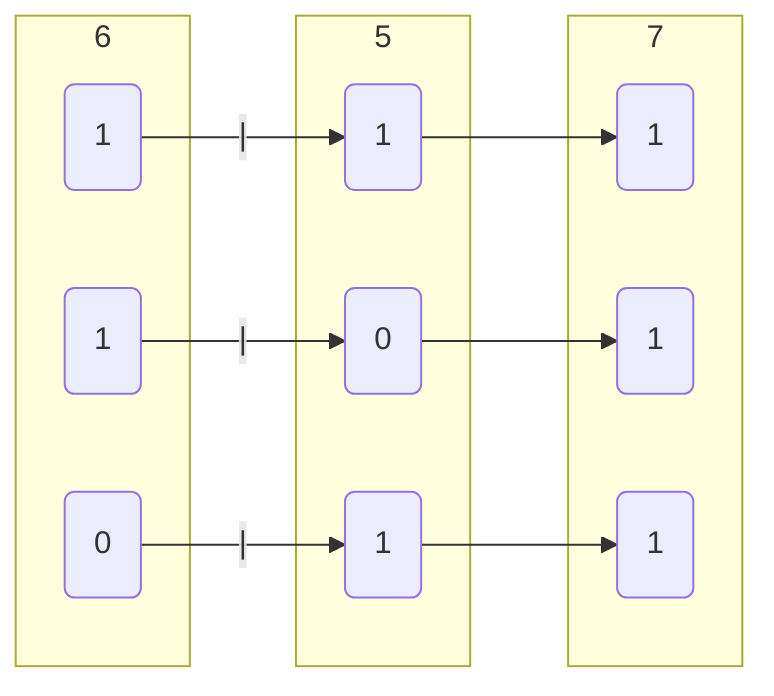
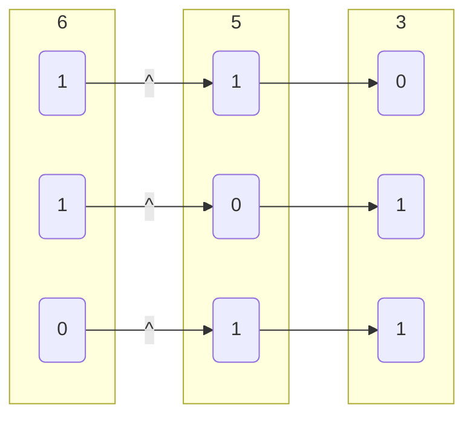
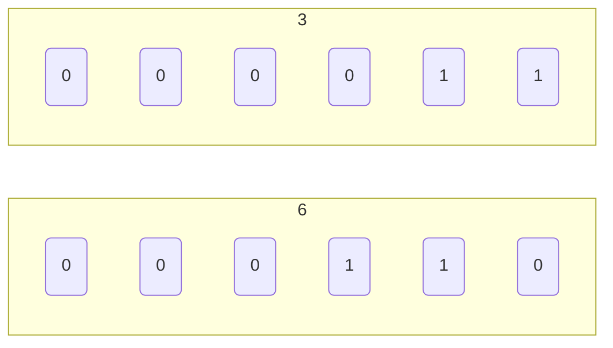
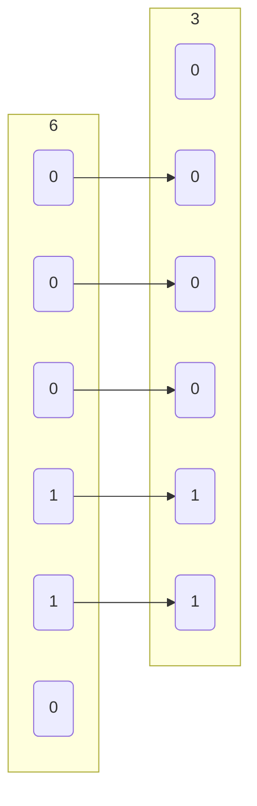
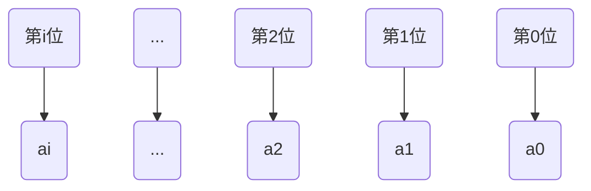
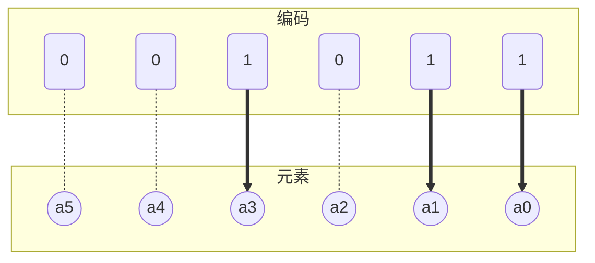

位操作（Bitwise Operations）是 C/C++ 中最贴近硬件底层的操作之一, 它不仅执行速度极快, 而且在状态压缩、权限控制、密码学、嵌入式开发以及算法竞赛中有着不可替代的作用

## 基础位运算符

位运算直接对整数在内存中的二进制补码进行操作。为演示清晰, 以下示例均以 4 位二进制数为例

### 按位取反

对操作数各二进制位按位取反, 即0变为1, 1变为0

### 位与(&)

同为 1 才为 1, 否则为 0

核心用途：清零、提取特定位（掩码操作）

| A \ B | 0 | 1 |
|-------|---|---|
| **0** | 0 | 0 |
| **1** | 0 | 1 |

```c
// 4
6 & 5
```



- 示例, 获取数字区间值

```c
#include <stdio.h>

int main() {
    int a = 0x12345678;

    // 获取数字低8位值
    int a1 = a & 0xFF;

    // 获取数字低10位值
    int a2 = a & 0x3FF;

    // 获取数字10-19位值
    int a3 = (a >> 10) & 0x3FF;

    return 0;
}
```

### 位或(|)

有 1 则为 1, 全 0 才为 0

核心用途：将特定位置 1、组合数据

| A \ B | 0 | 1 |
|-------|---|---|
| **0** | 0 | 1 |
| **1** | 1 | 1 |

```c
// 7
6 | 5
```



- 示例, 组合数字

```c++
#include <stdio.h>

int main() {
    unsigned char v[4] = {0x12, 0x34, 0x56, 0x78};
    int r = 0;

    // 必须显式转换为 int 再左移, 防止溢出和符号扩展问题
    r |= ((int)v[0] << 24);
    r |= ((int)v[1] << 16);
    r |= ((int)v[2] << 8);
    r |= ((int)v[3]);

    // 12345678
    printf("%x\n", r);
    return 0;
}

```

### 异或(^)

| A \ B | 0 | 1 |
|-------|---|---|
| **0** | 0 | 1 |
| **1** | 1 | 0 |

```c
// 3
6 ^ 5
```



- 示例, 交换变量值

```c
void swap(int &a, int &b) {
    // 注意：如果 a 和 b 是同一个内存地址（即 &a == &b）, 此方法会将值清零！
    // 安全写法：if (&a != &b) { ... }
    a = a ^ b;
    b = b ^ a; // 此时 b = (a^b)^b = a
    a = a ^ b; // 此时 a = (a^b)^a = b
}
```

## 移位运算符

移位操作在底层直接对应 CPU 的移位指令, 是替代乘除法（针对 2 的幂）的高效手段

### 左移(<<)

变量二进制值左移$n$位, 右侧补 0, 相当于乘$2^{n}$

```c
int a = 3;      // 0011
int b = a << 2; // 1100 (即 12)
```



#### 右移

二进制值右移$n$位, 相当于除$2^{n}$（向下取整）

> 算术右移 vs 逻辑右移
> - 无符号数：执行逻辑右移, 左侧补 0
> - 有符号数：C/C++ 标准未明确规定, 但绝大多数现代编译器（GCC/Clang/MSVC）执行算术右移, 左侧补符号位（正数补 0, 负数补 1）, 以保持负数的符号不变

```c
int x = -8;       // 补码: 1111...1000
int y = x >> 2;   // 算术右移: 1111...1110 (即 -2)

unsigned int u = 8; 
unsigned int v = u >> 2; // 逻辑右移: 0000...0010 (即 2)
```



- 获取$x$第$i$位值(索引从 0 开始)

```c
// 获取 x 的第 i 位（0 表示最低位）
int get_bit(int x, int i) {
    return (x >> i) & 1;
}
```

## 二进制枚举

在算法与离散数学中, 常需要枚举一个集合的所有子集

利用二进制位, 可以将集合的包含关系完美映射到整数的二进制位上, 这被称为状态压缩

### 设定

设存在集合$S$, 含$n$个元素($a_1$, $a_2$ $\cdots$ $a_n$)

- 用一个 n 位二进制数表示一个子集

- 第 i 位（从右往左, 索引从 $0$ 开始）为 $1$, 表示子集包含 $a_i$; 为 $0$ 表示不包含

- $n$个元素集合子集个数为$2^n$, 对应0到$2^n - 1$
 
#### 推导过程

$S$ = {$a_0$, $a_1$ $\cdots$ $a_n$}

将集合中从0开始计数第i个元素与二进制数从右往左数第i位一一对应

元素$a_1$对应二进制数第0位, 元素$a_2$对应二进制数第1位



于是集合$S$所有子集可以表示为,

- 空集: $(0000...0000)_2$, 即0

- ${a_0}$: $(0000...0001)_2$, 即1

- ${a_1}$: $(0000...0010)_2$, 即2

- ${a_0, a_1}$: $(0000...0011)_2$, 即3

.....

| 子集序号  |   序号二进制                     | 子集大小 | 包含元素               |
| -------- | ------------------------------- | -------- | --------------------- |
| $1$      | $\underbrace{00 \cdots 0001}_n$ | $1$      | $a_0$                 |
| $2$      | $\underbrace{00 \cdots 0010}_n$ | $1$      | $a_1$                 |
| $3$      | $\underbrace{00 \cdots 0011}_n$ | $2$      | $a_0, a_1$            |
| $4$      | $\underbrace{00 \cdots 0100}_n$ | $1$      | $a_2$                 |
| $5$      | $\underbrace{00 \cdots 0101}_n$ | $2$      | $a_0, a_2$            |
| $6$      | $\underbrace{00 \cdots 0110}_n$ | $2$      | $a_1, a_2$            |
| $7$      | $\underbrace{00 \cdots 0111}_n$ | $3$      | $a_0, a_1, a_2$       |
| $\cdots$ | $\cdots$                        | $\cdots$ | $\cdots$              |
| $2^n$    | $\underbrace{11 \cdots 1111}_n$ | $n$      | $a_0, a_1 \cdots a_n$ |

通过上表总结对于子集 $i$, 若 $i$ 二进制值第 $x$ 位为 $1$, 则子集包含$a_x$元素, 若为 $0$则子集不包含$a_x$元素

子集 $i$, $i$ 二进制值中含1数量为子集大小

#### 程序

例如对于含 $5$ 个元素集合$S$, 其第 $11$ 个子集

因$(11)_2 = 01011$, 第$0, 1, 3$位为$1$, 因此包含$a_0, a_1, a_3$三个元素



#### c

```c++
// 元素数量
const int n = 5;

int a[5] = {1, 2, 3, 4, 5};

for(int i = 1; i <= (1 << n); i++){
    for(int j = 0; j < n; j++){
        // 若子集i中第j位为1, 则子集i包含a(j)
        if ((i >> j) & 1){
            // 选择a(j)
        }
    }
}
```

#### python

```py
n = 3

a = [...]

for i in range(1, 1 << n):
    for j in range(n):
        if (i >> j) & 1:
            ...
```