## 概念

**pointer(指针)**是一个变量类型, 用来存储另一个变量的内存地址

c/c++ 中, 每个变量在内存中都有一个唯一的地址, 可以用指针来表示

**指针变量**是指针的具体实现, 它本身也是一个变量, 专门用来保存其他变量的内存地址

通过指针, 可间接访问或修改指针所指向变量的值, 而不需要直接使用原变量名

### 操作

#### 定义指针

```c
int *p;      // 指向 int 类型的指针
char *p;     // 指向 char 类型的指针
double *p;   // 指向 double 类型的指针
```

指针变量的值是所存储变量在内存中的地址

#### 获取地址(取地址)

使用`&`运算符可以获取变量地址, 并将地址赋值给指针变量完成初始化

```c
#include <stdio.h>

int main() {
    int a = 0xFF;
    int *p = &a;

    printf("a address = %p\n", &a);
    printf("p value = %p\n", p);

    return 0;
}
```

运行结果

```sh
a address = 0x7ffa2ed1128
p value = 0x7ffa2ed1128
```

图示

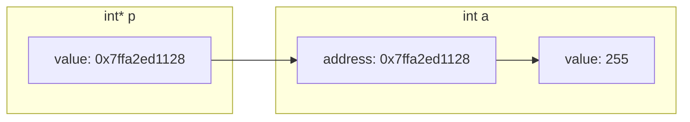

#### 解引用(访问指针指向的值)

使用 `*` 运算符可以访问指针指向的变量值

```c
#include <stdio.h>

int main() {
    int a = 0xFF;
    int *p = &a;
    printf("a value: %d\na address: %p\n", a, &a);
    printf("p value: %p\n*p value: %d\n", p, *p);
    return 0;
}
```

运行结果

```sh
a value = 255
a address = 0x7ffc241ed608
p value = 0x7ffc241ed608
*p value = 255
```

图示

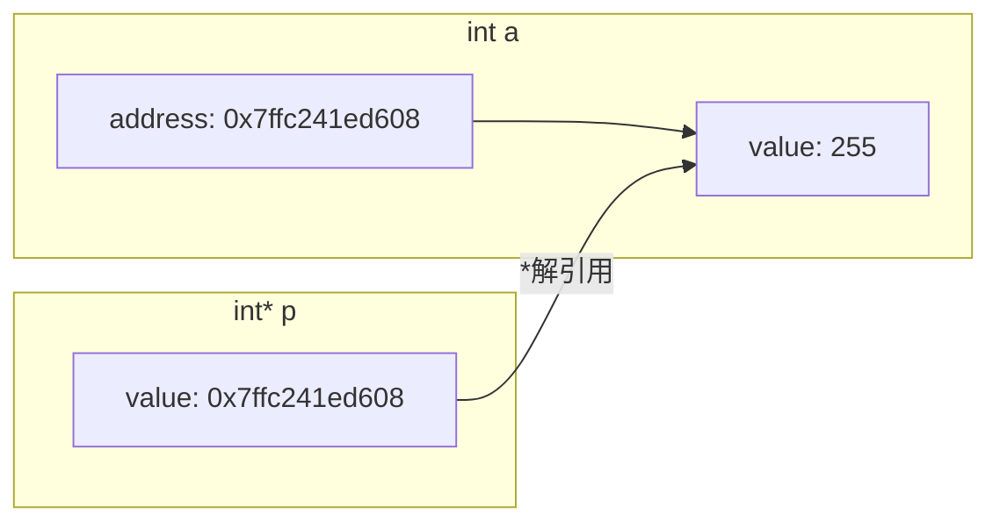

## 指针属性

### 指针指向(指针值)

指针的值就是它所存储变量的地址, 即指针指向该变量

```c++
#include <stdio.h>

int main() {
    int a = 10;
    int *p = &a;
    printf("a = %d, &a = %p\n", a, &a);
    printf("*p = %d, p = %p\n", *p, p);

    return 0;
}
```

运行结果

```sh
a = 10, &a = 0x7ffff423e928
*p = 10, p = 0x7ffff423e928
```

图示

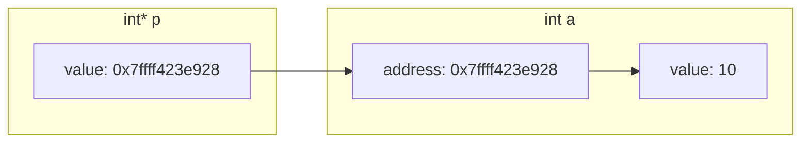

#### 改变指针指向

通过给指针变量赋新地址, 可以改变它的指向

```c
#include <stdio.h>

int main() {
    int a = 0xFF;
    int b = 0xAA;
    int* p = &a;

    printf("p = %p, *p = %d\n", p, *p);

    p = &b;  // 改变指针指向
    printf("p = %p, *p = %d\n", p, *p);

    return 0;
}
```

运行结果

```sh
p = 0x7fff62e598a8, *p = 255
p = 0x7fff62e5989c, *p = 170
```

图示

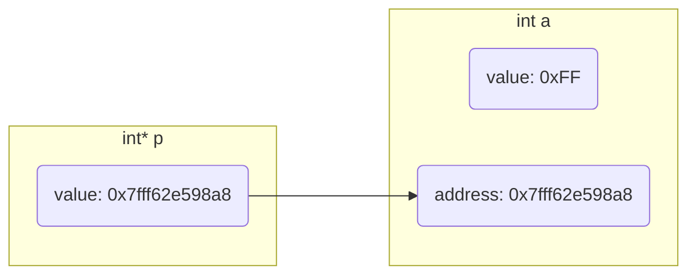

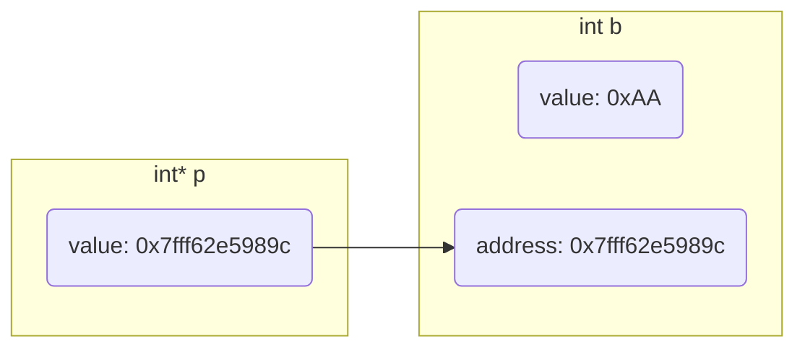

#### 间接修改变量值

通过指针指向的地址可以间接修改变量值

```c
#include <stdio.h>

int main() {
    int a = 0xFF;
    int* p = &a;
    printf("a = %d, &a = %p\n",a, &a);
    printf("p = %p, *p = %d\n", p, *p);

    *p = 0xAA;
    printf("p = %p, *p = %d\n", p, *p);
    printf("a = %d, &a = %p\n",a, &a);

    return 0;
}
```

运行结果

```sh
a = 255, &a = 0x7ffc9fcdabf8
p = 0x7ffc9fcdabf8, *p = 255
p = 0x7ffc9fcdabf8, *p = 170
a = 170, &a = 0x7ffc9fcdabf8
```

图示

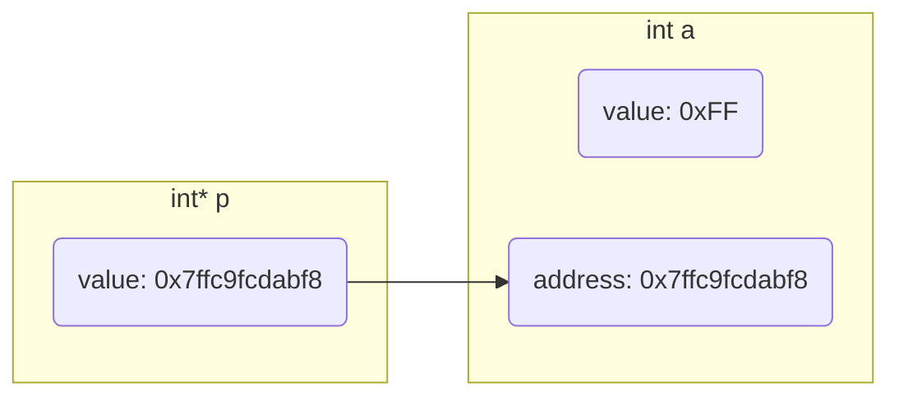

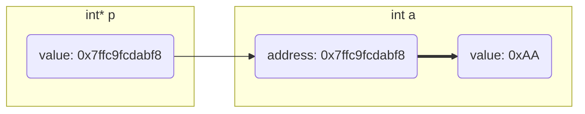

### 类型

#### 指针类型

指针变量去掉`变量名`后是指针类型

| 指针变量    | 指针类型  |
| ----------- | --------- |
| int *p1     | int *     |
| char *p2    | char *    |
| double **p3 | double ** |

指针变量大小只与系统位数有关, 与类型无关, 因为不论何类型指针都是存储地址值

32位系统指针大小为4字节, 64位系统指针大小位8字节

```c
#include <stdio.h>

int main() {
    int* p = NULL;
    double* p1 = NULL;
    printf("sizeof p = %d\nsizeof p1 = %d\n", sizeof(p), sizeof(p1));
    return 0;
}
```

#### 指针指向类型

指针变量去掉`* 变量名`表示指向类型

| 指针变量    | 指针指向类型 |
| ----------- | ------------ |
| int *p1     | int          |
| char *p2    | char         |
| double **p3 | double *     |

#### 指向区域大小

```c
// 指针指向4字节大小区域
int a = 3;
int *p = &a;

// 指针指向1024 字节 大小区域
const int SIZE = 1024;
char *p = (char *)malloc(sizeof(char) * SIZE);
```

## 特殊指针

### 常量指针

常量指针是指针

其指向常量(存储常量地址), 指向可变(可存储其他变量), 指向值不可变(不能通过地址间接修改变量值)

```c
const int *p
```

或

```c
int const *p
```

指针类型 `int *`, 指针指向类型 `const int`

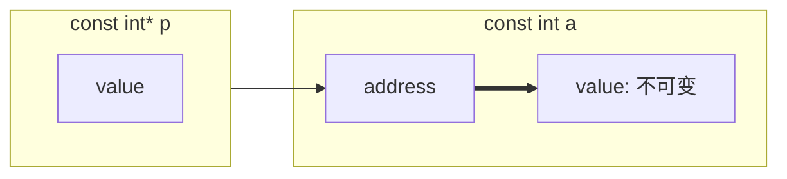

- 示例, 尝试改变常量指针指向和指向值

```c++
#include <stdio.h>

int main(void) {
    const int a = -1;
    const int b = 1;
    const int *p = &a;
    printf("%d\n", *p);

    // 尝试改变指针指向
    p = &b;
    printf("%d\n", *p);

    // 尝试改变指针指向值, 报错
    *p = -1;
    printf("%d\n", *p);
    return 0;
}
```

运行时报错

```sh
error: read-only variable is not assignable
```

### 指针常量

指针常量是常量

其本身是常量(指针是常量类型), 指向不可变(不能再存储其他变量地址), 指向值可变(可通过地址间接修改变量值)

```c
int *const p;
```

指针类型 `int *const`, 指针指向类型 `int`

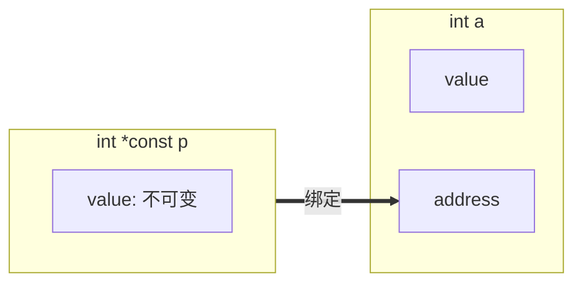

- 示例, 修改指针常量

```c++
#include <stdio.h>

int main(void) {
    int a = -1;
    int *const p = &a;

    printf("%d\n", *p);
    // 尝试改变指针指向值
    *p = 1;
    printf("%d\n", *p);

    int b = 1;
    // 尝试改变指针指向, 报错
    p = &b;
    printf("%d\n", *p);

    return 0;
}
```

运行时报错

```sh
error: cannot assign to variable 'p' with const-quakufued type 'int *const'

note: variable 'p' declared const here
```

### 函数指针

其指向一个函数, 即存储函数的地址, 通过函数指针可间接调用函数

```sh
返回值 (*)(参数...,)
```

- 示例, 通过指针间接调用函数

```c
#include <stdio.h>

int get_max(int x, int y) {
    return x > y ? x : y;
}

int main() {
    int (*p)(int, int) = NULL;
    p = get_max;
    printf("%d\n", p(1, 2));

    return 0;
}
```

### 指针数组

指针数组是数组, 数组中元素为指针

```c
int *p[3];
```

指针类型 `int *`, 指针指向类型 `int`

- 示例, 指针数组使用

```c
#include <stdio.h>

int main(void) {
    int *p[3];
    int a = 1;
    int b = 2;
    int c = 3;

    p[0] = &a;
    p[1] = &b;
    p[2] = &c;
    for (int i = 0; i < 3; i++) {
        printf("p[%d] = %d, &p[%d] = %p\n", i, *p[i], i, &p[i]);
    }

    return 0;
}
```

运行结果

```c
p[0] = 1, &p[0] = 0x7fffa48dbfd0
p[1] = 2, &p[1] = 0x7fffa48dbfd8
p[2] = 3, &p[2] = 0x7fffa48dbfe0
```

### 对象指针

指针指向一个对象(存储对象地址)

### 二级指针

二级指针指向指针, 其值是另一个指针的地址

```c
int **a;
```

- 示例, 二级指针使用

```c
#include <stdio.h>

int main() {
    int a = 0xFF;
    int *p = &a;
    int **sp = &p;

    printf("a: %d\n, &a: %p\n\n", a, &a);
    printf("*p: %d\n, p: %p\n, &p: %p\n\n", *p, p, &p);
    printf("**sp: %d\n, *sp: %p\n, sp: %p\n", **sp, *sp, sp);

    return 0;
}
```

运行结果

```c
a: 255
&a: 0x7ffd79d476d8

*p: 255
p: 0x7ffd79d476d8
&p: 0x7ffd79d476d0

**sp: 255
*sp: 0x7ffd79d476d8
sp: 0x7ffd79d476d0
```

图示

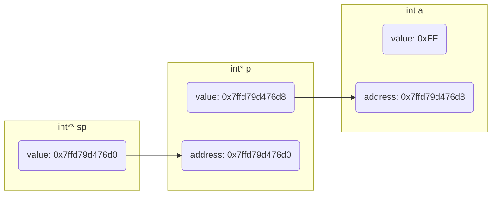


#### 数组指针

数组指针是指针, 指针指向数组(存储数组首元素地址)

```c
int (*p)[3];
```

指针类型 `int *`, 指针指向类型 `int [3]`

- 示例, 数组指针使用

```c
#include <stdio.h>

int main(void) {
    int a[3] = {1, 2, 3};
    int (*p)[3] = &a;

    for (int i = 0; i < 3; i++) {
        printf("&a[%d] = %p, a[%d] = %d\n", i, &a[i], i, a[i]);
    }
    for (int i = 0; i < 3; i++) {
        printf("(*p + %d) = %p, *(*p + %d) = %d\n", i, (*p + i), i,*(*p + i));
    }

    return 0;
}
```

运行结果

```c
&a[0] = 0x7ffdeaf17b0, a[0] = 1
&a[1] = 0x7ffdeaf17b4, a[1] = 2
&a[2] = 0x7ffdeaf17b8, a[2] = 3

(*p + 0) = 0x7ffdeaf17b0, *(*p + 0) = 1
(*p + 1) = 0x7ffdeaf17b4, *(*p + 1) = 2
(*p + 2) = 0x7ffdeaf17b8, *(*p + 2) = 3
```

图示

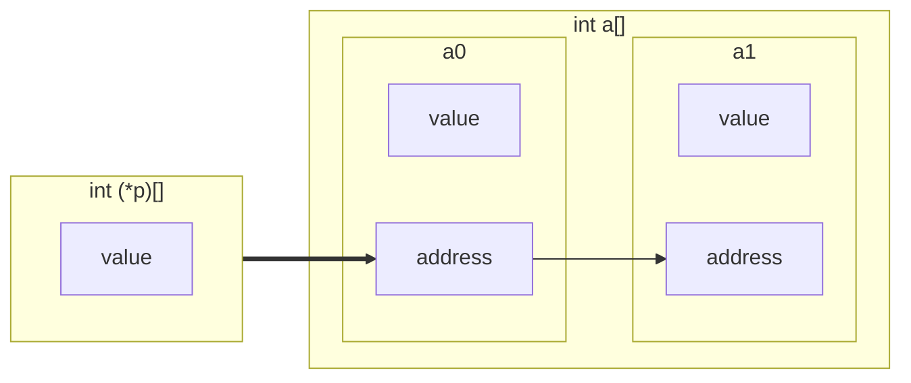
