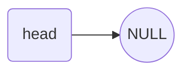

## 节点

```c++
typedef struct Node {
    int data;
    // 指向下个节点指针
    struct Node *next;
} Node;
```

## 操作

### 初始化



```c++
Node* init_node() {
    NodeList head = (NodeList)malloc(sizeof(Node));
    head->next = NULL;
    return head;
}
```

### 创建

```c++
void insert_node(Node* head, int data) {
    Node* new_node = (Node*)malloc(sizeof(Node));
    new_node->data = data;
    new_node->next = NULL;

    Node* temp = head;
    while(temp->next) {
        temp = temp->next;
    }
    temp->next = new_node;
}
```

### 显示

```c
void print_node(Node* head) {
    Node* p = head->next;
    while(p) {
        printf("%d ", p->data);
        p = p->next;
    }
}
```

## 有序表合并

```c++
#include <stdio.h>
#include <stdlib.h>

typedef struct Lnode {
    int           data;
    struct Lnode* next;
} Lnode, *Linklist;


Linklist init_head_node(Linklist &head) {
    head = (Linklist)malloc(sizeof(Lnode));
    head->next = NULL;
    return head;
}

Linklist create_head(Linklist &head, int n) {
    head->next = NULL;
    Linklist p;
    Linklist r = head;
    for (int i = 0; i < n; i++) {
        p = (Linklist)malloc(sizeof(Lnode));
        scanf("%d", &p->data);
        p->next = NULL;
        r->next = p;
        r = p;
    }
    return head;
}

void merge_node(Linklist &head1, Linklist &head2, Linklist &head3) {
    Linklist p1, p2, p3;
    p1 = head1->next;
    p2 = head2->next;

    head3 = head1;
    p3 = head3;
    // 两个表均为到末尾, 则依次摘取
    while (p1 && p2) {
        // 摘取第一条链上的点
        if (p1->data <= p2->data) {
            // 将这个节点与head3连接上
            p3->next = p1;
            // p3指向p1, 为下一次连接做准备
            p3 = p1;
            p1 = p1->next;
        } else {
            // 将这个节点与head3连接上
            p3->next = p2;
            // p3指向p1, 为下一次连接做准备
            p3 = p2;
            p2 = p2->next;
        }
    }
    // 将非空表的剩余部分与head3相连
    p3->next = p1 ? p1 : p2;
    free(head2);
}

void print(Linklist &head) {
    Linklist p = head->next;
    while (p) {
        printf("%d ", p->data);
        p = p->next;
    }
}

int main() {
    Linklist head1, head2, head3;

    head1 = init_head_node(head1);
    head2 = init_head_node(head2);
    head3 = init_head_node(head3);

    int n;
    scanf("%d", &n);
    head1 = creat(head1, n);
    scanf("%d", &n);
    head2 = creat(head2, n);

    merge_node(head1, head2, head3);

    print(head3);

    return 0;
}
```
