> [并查集](https://oi-wiki.org/ds/dsu/)

## 并查集

并查集是用于管理元素所属集合的数据结构, 实现为一个森林, 其中每棵树表示一个集合, 树中节点表示对应集合中元素

### 初始化

#### 节点

定义独立两个节点$A、B$

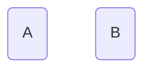

#### 父节点

定义 $parent[A] = B$, 表示节点$A$父节点是节点$B$

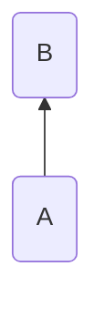

```c++
// 使用map存储节点间关系
template<typename T, typename T>
std::map<T, T> parent;
```

#### 集合

初始时每个元素都位于一个单独集合, 其父节点为自身

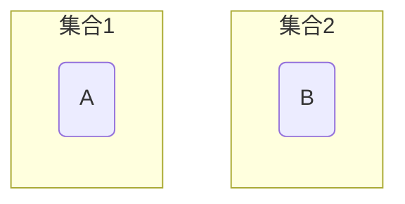

```c++
template<typename T>
void Init(T x) {
    parent[x] = x;
}
```

### 查询

查询操作用于查询某个元素所属集合, 用于判断两个元素是否属于同一集合(同根节点)

```c++
template<typename T>
T find(T x) {
    // 若x父节点非它本身, 则继续查找
    while (parent[x] != x) {
        x = parent[x];
    }
    return x;
}
```

节点$A、B、C$根节点均为$X$, 故节点$A、B、C$属于同一集合

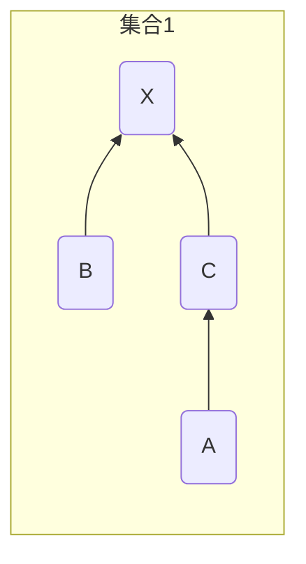

节点$D$根节点为节点$Y$, 故节点$A$节点$D$不属于同一集合

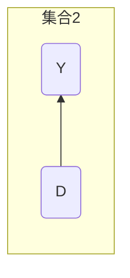

#### 路径压缩

查询过程中所经过每个元素都属于该集合, 可将每个元直接连到根节点以加快后续查询

```c++
template<typename T>
T find(T x) {
    if (parent[x] != x) {
        parent[x] = find(parent[x]);
    }
    return parent[x];
}
```

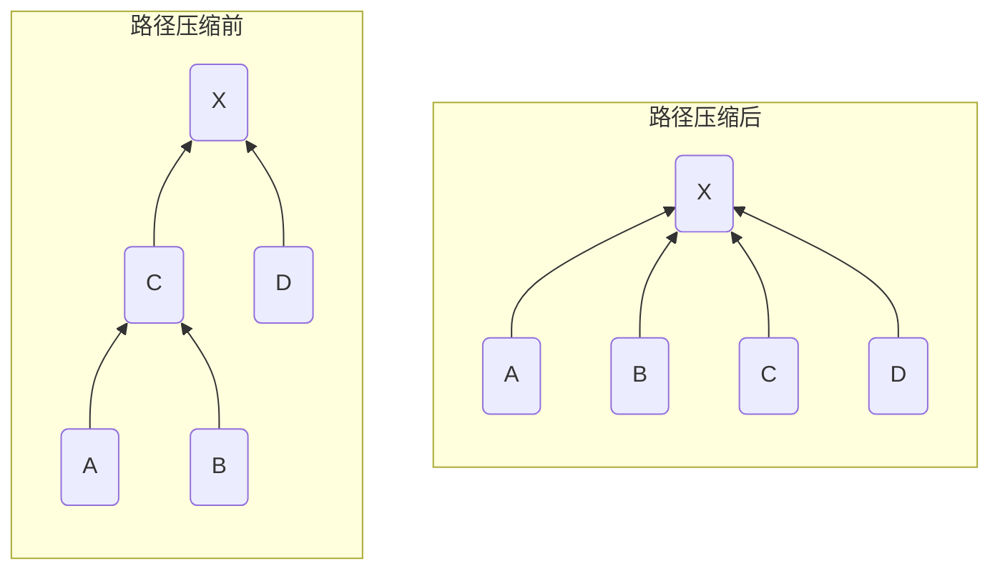

### 合并

合并两个元素所属集合, 即将一个集合根节点连到另一集合根节点

```c++
template<typename T>
void unions(const T x, const T y) {
    T fx = find(x);
    T fy = find(y);
    if (fx != fy) {
        parent[fx] = fy;
    }
}
```

将节点$X$的父节点设为节点$Y$, 合并两个集合

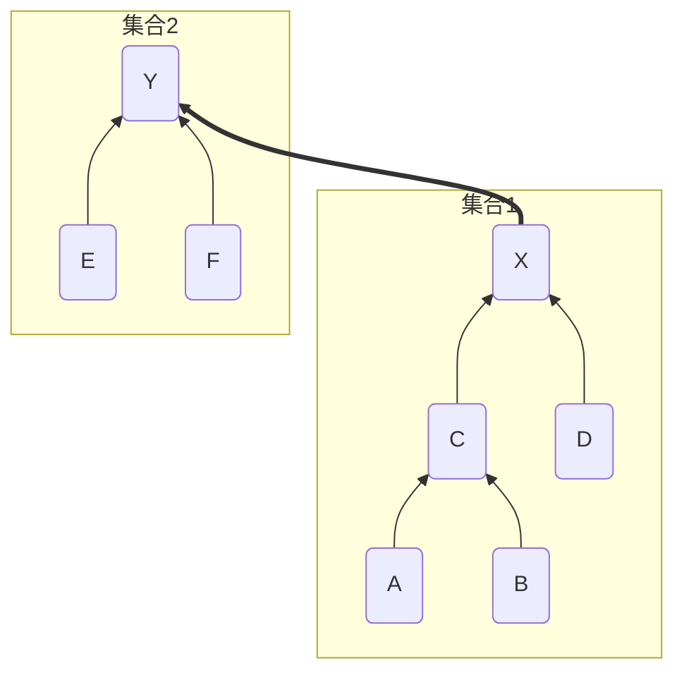

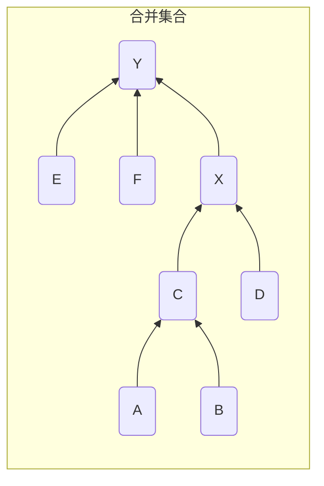


#### 按秩合并(Union by Rank)

并查集树结构中, 树高度会影响查找操作效率

秩(rank)通常是树高度估计, 按秩合并时, 将秩小树连接到秩大树上, 从而避免较大树高度增加

若两棵树秩相同, 那么任选其中一个树根节点作为新根节点, 并将其秩加1

```c++
template<typename T>
void unions(const T x, const T y) {
    T fx = find(x);
    T fy = find(y);
    if (fx != fy) {
        if(rank[fx] > rank[fy]){
            parent[fy] = fx;
        }else if(rank[fx] > rank[fy]){
            parent[fx] = fy;
        }else{
            parent[fx] = fy;
            rank[fx]++;
        }
    }
}
```


合并节点$X、Y$, 其秩一致, 任选节点$Y$作为新根节点

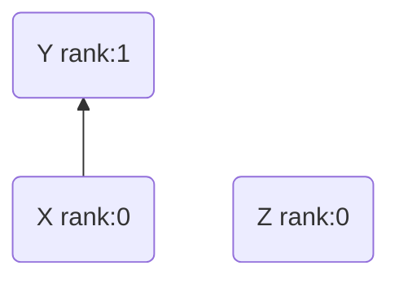

合并节点$Z、Y$, 其节点$Z$秩小于节点$Y$秩, 即将节点$Z$合并到节点$Y$

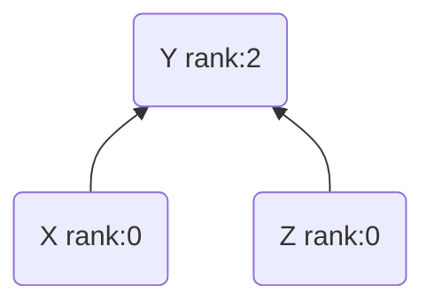

### 代码

```c++
#include <iostream>
#include <algorithm>
#include <utility>
#include <vector>
#include <map>
#include <set>

template<class NodeType = std::string>
struct Line {
    NodeType m_start_node;
    NodeType m_end_node;
    double   m_weight;
    bool     m_is_selected;

    Line(NodeType s, NodeType e, double w) :
        m_start_node(std::move(s)), m_end_node(std::move(e)), m_weight(w), m_is_selected(false) {}
};

template<class NodeType = std::string>
class DisjointSetUnion {
public:
    DisjointSetUnion() = default;
    DisjointSetUnion(std::vector<Line<NodeType>>& lines) {
        for (const auto& line : lines) {
            m_nodes.insert(line.m_start_node);
            m_nodes.insert(line.m_end_node);
        }

        for (const auto& node : m_nodes) {
            m_parent[node] = node;
            m_rank[node] = 0;
        }
    };

    NodeType find(NodeType x) {
        if (m_parent[x] != x) {
            m_parent[x] = find(m_parent[x]);
        }
        return m_parent[x];
    }

    void unions(NodeType x, NodeType y) {
        NodeType fx = find(x);
        NodeType fy = find(y);
        if(fx != fy) {
            if(m_rank[fx] > m_rank[fy]){
                m_parent[fy] = fx;
            }else if(m_rank[fx] > m_rank[fy]){
                m_parent[fx] = fy;
            }else{
                m_parent[fx] = fy;
                m_rank[fx]++;
            }
        }
    }

private:
    std::set<NodeType>           m_nodes;
    std::map<NodeType, NodeType> m_parent;
    std::map<NodeType, int>      m_rank;
};
```

## 最小生成树

### kruskal法

> [完整代码路径](https://github.com/dmjcb/self_assets/blob/main/code/example/c_c%2B%2B/data_structure/MinimumSpanningTree.cpp)

- 将所有边按权值大小顺序排列

- 对于任意两个节点,若不在同个并查集内(不会形成闭环), 选择该边, 并和合并两个节点

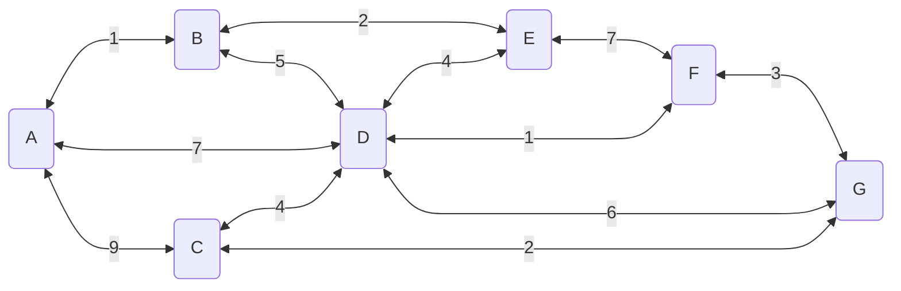

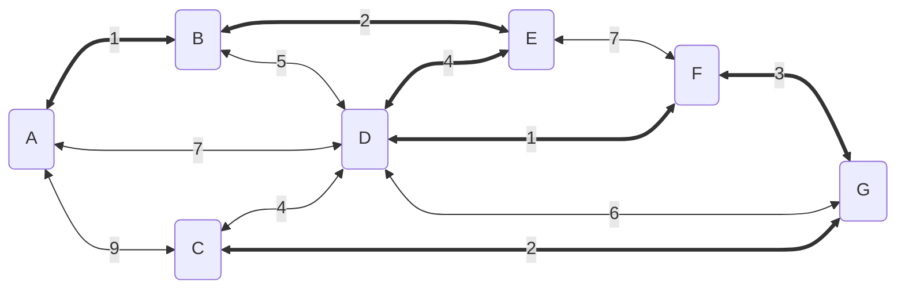

```c++
#include <iostream>

template<class NodeType = std::string>
class MinimumSpanningTree {
public:
    MinimumSpanningTree(std::vector<Line<NodeType>>& lines) {
        m_unions = DisjointSetUnion<NodeType>(lines);

        std::sort(
            lines.begin(),
            lines.end(),
            [=](const Line<NodeType>& e1, const Line<NodeType>& e2) {
                return e1.m_weight < e2.m_weight;
            }
        );
        m_lines = std::move(lines);
        m_mst_value = 0;
    }

    double run_kruskal() {
        double sum = 0;
        for (auto& line : m_lines) {
            if (m_unions.find(line.m_start_node) != m_unions.find(line.m_end_node)) {
                sum += line.m_weight;
                line.m_is_selected = true;
                m_unions.unions(line.m_start_node, line.m_end_node);
            }
        }
        return sum;
    }

    void print() const {
        for (const auto& line : m_lines) {
            if (line.m_is_selected) {
                std::cout << "Select Line: " << line.m_start_node << "-" << line.m_end_node << std::endl;
            }
        }
    }

private:
    DisjointSetUnion<NodeType>  m_unions;
    std::vector<Line<NodeType>> m_lines;
    double                      m_mst_value;
};

int main() {
    std::vector<Line<>> lines = {
        Line<>("A", "B", 1), Line<>("A", "C", 9), Line<>("A", "D", 7),
        Line<>("B", "D", 5), Line<>("B", "E", 2), Line<>("E", "D", 4),
        Line<>("E", "F", 7), Line<>("F", "D", 1), Line<>("F", "G", 3),
        Line<>("G", "D", 6), Line<>("G", "C", 2), Line<>("C", "D", 4),
    };

    MinimumSpanningTree<> mst(lines);

    double mst_value = mst.run_kruskal();

    std::cout << "minimum spanning tree mst_value = " << mst_value << std::endl;

    mst.print();
    return 0;
}
```

运行结果

```sh
The minimum spanning tree value = 13
Select Line: A-B
Select Line: F-D
Select Line: B-E
Select Line: G-C
Select Line: F-G
Select Line: E-D
```
