> [并查集](https://oi-wiki.org/ds/dsu/)

## 并查集

并查集是用于管理元素所属集合的树型数据结构

它支持两种核心操作: 查询(判断两个元素是否属于同一集合)和合并(将两个集合合并为一个)

在并查集中, 每个集合被表示为一棵树, 树中的节点代表集合中的元素, 而树的根节点则代表整个集合

### 初始化

初始状态下, 每个元素都自成一个独立的集合, 即每个元素的父节点都是它自己


```mermaid
graph BT;
    A(A)
    B(B)
```

定义`parent[A] = B`, 表示节点`A`父节点是节点`B`

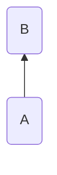
```mermaid
graph BT;
    a(A)-->b(B)
```

```c++
// 使用map存储节点间关系
template<typename T, typename T>
std::map<T, T> parent;
```

初始时每个元素都位于一个单独集合, 其父节点为自身

集合1包含元素`A`, 集合2包含元素`B`

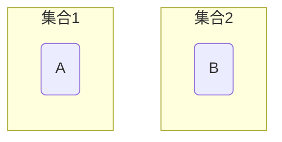
```mermaid
graph BT;
    subgraph 集合2
    direction BT
        B(B)
    end

    subgraph 集合1
    direction BT
        A(A)
    end
```

代码表示

```c++
template<typename T>
void init(T x) {
    parent[x] = x;
}
```

### 查询与路径压缩

查询操作用于寻找某个元素所在集合的"代表"(即根节点)

如果两个元素的根节点相同, 则说明它们属于同一集合

例如, 节点`A`、`B`、`C`根节点均为`X`, 故`A`、`B`、`C`属于同一集合

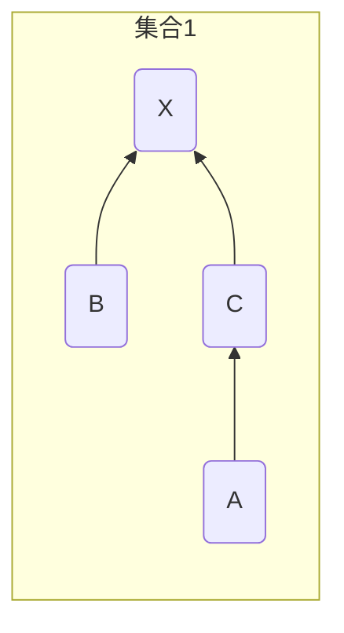
```mermaid
graph BT;
subgraph 集合1
    direction BT
        a(A)-->c(C)
        b(B)-->x(X)
        c(C)-->x(X)
    end
```

例如, 节点`D`根节点为节点`Y`, 故`Y`节点`D`不属于同一集合

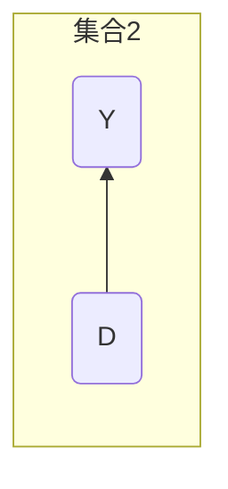
```mermaid
graph BT;
    subgraph 集合2
    direction BT
        d(D)-->y(Y)
    end
```

#### 基础查询

沿着父节点不断向上查找, 直到找到根节点(父节点等于自身的节点)

```c++
template<typename T>
T find(T x) {
    // 若x父节点非它本身, 则继续查找
    while (parent[x] != x) {
        x = parent[x];
    }
    return x;
}
```

#### 路径压缩

在基础查询中, 如果树的高度过高, 查询效率会退化为 $O(n)$ 

路径压缩的思想是: 在查询过程中, 将沿途经过的所有节点直接连接到根节点上, 从而"压平"树结构, 极大加快后续查询速度

```c++
template<typename T>
T find(T x) {
    if (parent[x] != x) {
        parent[x] = find(parent[x]);
    }

    return parent[x];
}
```

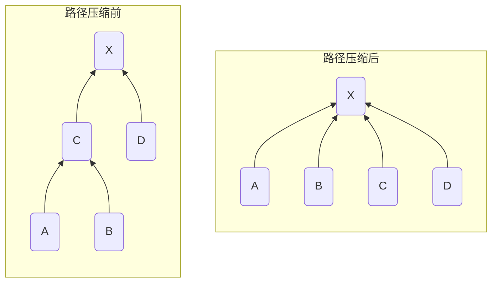
```mermaid
graph BT;
    subgraph 路径压缩后
    direction BT
        X1(X)
        a1(A)-->X1
        b1(B)-->X1
        c1(C)-->X1
        d1(D)-->X1
    end

    subgraph 路径压缩前
    direction BT
        X(X)
        a(A)-->c(C)
        b(B)-->c(C)
        c(C)-->X
        d(D)-->X
    end
```

### 合并与按秩合并

合并操作将两个元素所属的集合合并

具体做法是找到两个元素的根节点, 然后将其中一个根节点的父节点指向另一个根节点

```c++
template<typename T>
void unions(const T x, const T y) {
    T fx = find(x);
    T fy = find(y);
    if (fx != fy) {
        parent[fx] = fy;
    }
}
```

将节点`X`的父节点设为节点`Y`, 合并两个集合

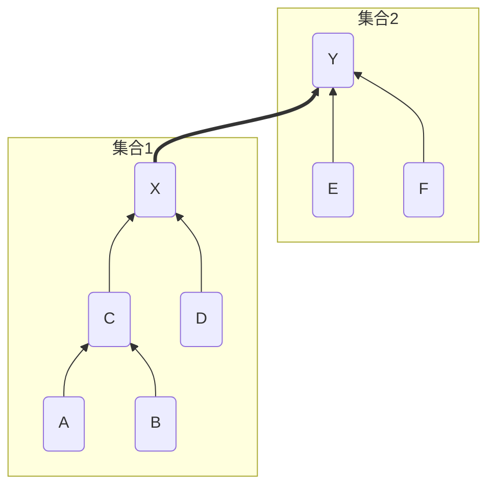
```mermaid
graph BT;
    subgraph 集合1
    direction TB
        a(A)-->c(C)
        b(B)-->c(C)
        c(C)-->x(X)
        d(D)-->x(X)
    end
    x(X)==>y(Y)
    subgraph 集合2
    direction TB
        e(E)-->y(Y)
        f(F)-->y(Y)
    end
    
```

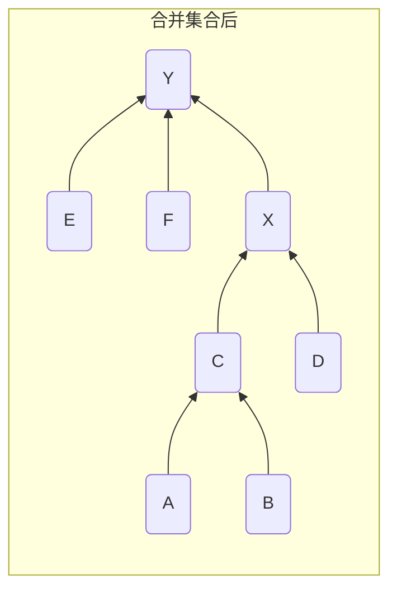
```mermaid
graph LR;
    subgraph 合并集合后
    direction BT
        a(A)-->c(C)
        b(B)-->c(C)
        c(C)-->x(X)
        d(D)-->x(X)
        e(E)-->y(Y)
        f(F)-->y(Y)
        x -->y
    end
```

#### 按秩合并(union by rank)

基础合并可能会导致树的高度不断增加(退化成链表)

按秩合并通过维护一个 rank 数组(记录树的近似高度/秩), 在合并时总是将秩较小的树连接到秩较大的树上, 从而控制树的高度

```c++
template <typename T>
void unite(T x, T y) {
    T fx = find(x);
    T fy = find(y);
    if (fx == fy) return;

    if (rank[fx] < rank[fy]) {
        parent[fx] = fy;
    } else if (rank[fx] > rank[fy]) {
        parent[fy] = fx;
    } else {
        parent[fx] = fy; 
        rank[fy]++;      // fy 成为新根, 高度增加, 秩 +1
    }
}
```


```mermaid
graph BT;
    X(X rank:0)
    Y(Y rank:0)
    Z(Z rank:0)
```

合并节点`X`、`Y`, 其秩一致, 任选节点`Y`作为新根节点

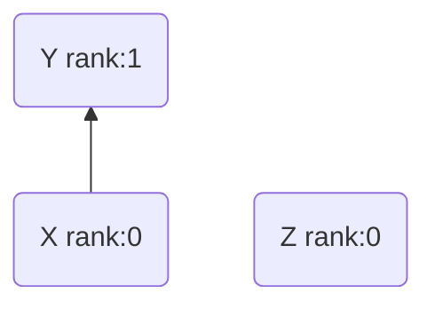
```mermaid
graph BT;
    X(X rank:0)
    Y(Y rank:1)
    Z(Z rank:0)
    X --> Y
```

合并节点`Z`、`Y`, 其节点`Z`秩小于节点`Y`秩, 即将节点`Z`合并到节点`Y`

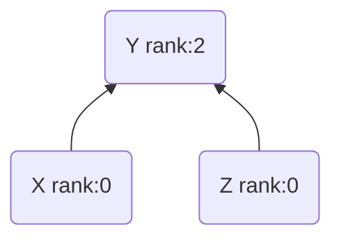
```mermaid
graph BT;
    X(X rank:0)
    Y(Y rank:2)
    Z(Z rank:0)
    X --> Y
    Z --> Y
```

当同时使用路径压缩和按秩合并时, 并查集的单次操作时间复杂度为 $O(α(n))$, 其中 $α$ 是阿克曼函数的反函数

对于所有实际应用中的 $n$, $α(n)≤4$, 因此可以认为其时间复杂度是 $O(1)$ 的常数级别

### 代码

```c++
#include <iostream>
#include <algorithm>
#include <utility>
#include <vector>
#include <map>
#include <set>

template<class NodeType = std::string>
struct Line {
    NodeType m_start_node;
    NodeType m_end_node;
    double   m_weight;
    bool     m_is_selected;

    Line(NodeType s, NodeType e, double w) :
        m_start_node(std::move(s)), m_end_node(std::move(e)), m_weight(w), m_is_selected(false) {}
};

template<class NodeType = std::string>
class DisjointSetUnion {
public:
    DisjointSetUnion() = default;
    DisjointSetUnion(std::vector<Line<NodeType>>& lines) {
        for (const auto& line : lines) {
            m_nodes.insert(line.m_start_node);
            m_nodes.insert(line.m_end_node);
        }

        for (const auto& node : m_nodes) {
            m_parent[node] = node;
            m_rank[node] = 0;
        }
    };

    NodeType find(NodeType x) {
        if (m_parent[x] != x) {
            m_parent[x] = find(m_parent[x]);
        }
        return m_parent[x];
    }

    void unions(NodeType x, NodeType y) {
        NodeType fx = find(x);
        NodeType fy = find(y);
        if (fx != fy) {
            if (m_rank[fx] > m_rank[fy]) {
                m_parent[fy] = fx;
            } else if (m_rank[fx] > m_rank[fy]) {
                m_parent[fx] = fy;
            } else {
                m_parent[fx] = fy;
                m_rank[fx]++;
            }
        }
    }

private:
    std::set<NodeType>           m_nodes;
    std::map<NodeType, NodeType> m_parent;
    std::map<NodeType, int>      m_rank;
};
```

## 最小生成树

在一个连通加权无向图中, 最小生成树(MST) 是一棵包含图中所有顶点, 且边权值之和最小的生成树

常用的求解算法有 kruskal 和 prim

### kruskal法

kruskal 算法是一种基于贪心思想的算法, 特别适合稀疏图(边数相对较少)

- 算法流程

1. 将图中所有的边按权值从小到大排序

2. 初始化并查集, 每个顶点自成一个集合

3. 依次遍历排序后的边, 如果该边的两个顶点不在同一个集合中(即加入该边不会形成环), 则将该边加入生成树, 并合并这两个顶点所在的集合

4. 重复步骤 3, 直到生成树中包含 V−1 条边(V 为顶点数)

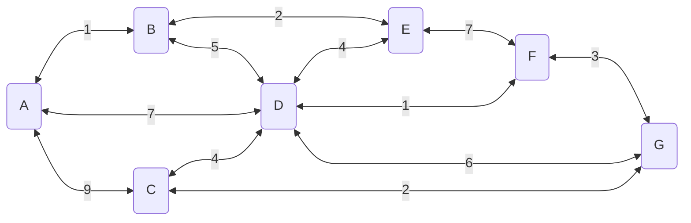
```mermaid
graph LR;
    a(A)<--1--->b(B)
    a(A)<--7--->d(d)
    a(A)<--9--->c(C)
    b(B)<--2--->e(E)
    b(B)<--5--->d(D)
    c(C)<--4--->d(D)
    c(C)<--2--->g(G)
    d(D)<--4--->e(E)
    d(D)<--1--->f(F)
    d(D)<--6--->g(G)
    e(E)<--7--->f(F)
    f(F)<--3--->g(G)
```

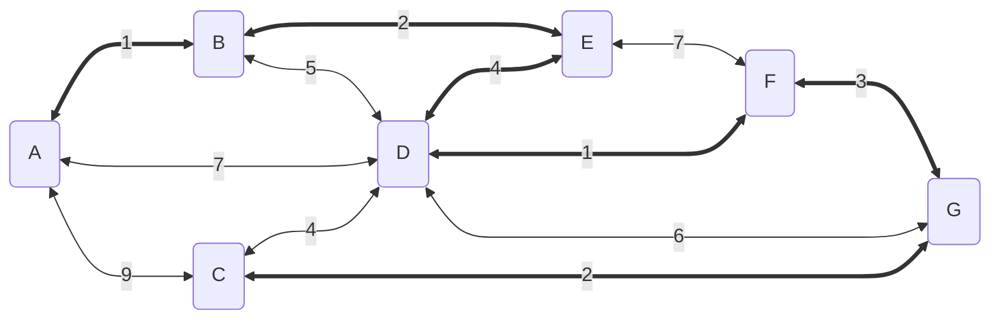
```mermaid
graph LR;
    a(A)<==1===>b(B)
    a(A)<--7--->d(d)
    a(A)<--9--->c(C)
    b(B)<==2===>e(E)
    b(B)<--5--->d(D)
    c(C)<--4--->d(D)
    c(C)<==2===>g(G)
    d(D)<==4===>e(E)
    d(D)<==1===>f(F)
    d(D)<--6--->g(G)
    e(E)<--7--->f(F)
    f(F)<==3===>g(G)
```

```c++
#include <iostream>
#include <vector>
#include <unordered_map>
#include <algorithm>
#include <string>

// ================= 1. 并查集实现 =================
template <typename T>
class DisjointSetUnion {
public:
    void add(const T& x) {
        if (parent.find(x) == parent.end()) {
            parent[x] = x;
            rank[x] = 0;
        }
    }

    T find(const T& x) {
        if (parent[x] != x) {
            parent[x] = find(parent[x]); // 路径压缩
        }
        return parent[x];
    }

    // 合并成功返回 true, 若已在同一集合返回 false
    bool unite(const T& x, const T& y) {
        T fx = find(x);
        T fy = find(y);
        if (fx == fy) return false;

        // 按秩合并
        if (rank[fx] < rank[fy]) {
            parent[fx] = fy;
        } else if (rank[fx] > rank[fy]) {
            parent[fy] = fx;
        } else {
            parent[fx] = fy;
            rank[fy]++; 
        }
        return true;
    }

private:
    std::unordered_map<T, T> parent;
    std::unordered_map<T, int> rank;
};

// ================= 2. 图与边定义 =================
template <typename T>
struct Edge {
    T u, v;
    double weight;
    bool selected;

    Edge(T u, T v, double w) : u(std::move(u)), v(std::move(v)), weight(w), selected(false) {}
};

// ================= 3. Kruskal 算法实现 =================
template <typename T>
double kruskal(std::vector<Edge<T>>& edges) {
    DisjointSetUnion<T> dsu;
    
    // 将所有节点加入并查集
    for (const auto& e : edges) {
        dsu.add(e.u);
        dsu.add(e.v);
    }

    // 按边权从小到大排序
    std::sort(edges.begin(), edges.end(), [](const Edge<T>& a, const Edge<T>& b) {
        return a.weight < b.weight;
    });

    double mst_weight = 0;
    // 贪心选择边
    for (auto& e : edges) {
        if (dsu.unite(e.u, e.v)) {
            e.selected = true;
            mst_weight += e.weight;
        }
    }
    return mst_weight;
}

// ================= 4. 测试与运行 =================
int main() {
    std::vector<Edge<std::string>> edges = {
        {"A", "B", 1}, {"A", "C", 9}, {"A", "D", 7},
        {"B", "D", 5}, {"B", "E", 2}, {"E", "D", 4},
        {"E", "F", 7}, {"F", "D", 1}, {"F", "G", 3},
        {"G", "D", 6}, {"G", "C", 2}, {"C", "D", 4}
    };

    double mst_value = kruskal(edges);

    std::cout << "Minimum Spanning Tree Total Weight: " << mst_value << "\n";
    std::cout << "Selected Edges:\n";
    
    for (const auto& e : edges) {
        if (e.selected) {
            std::cout << "  " << e.u << " - " << e.v << " (weight: " << e.weight << ")\n";
        }
    }

    return 0;
}
```

运行结果

```sh
the minimum spanning tree value = 13
select Line: A-B
select Line: F-D
select Line: B-E
select Line: G-C
select Line: F-G
select Line: E-D
```

### Prim 算法 (拓展补充)

prim 算法同样基于贪心思想, 但它是从顶点的角度出发, 更适合稠密图

- 算法流程:

1. 任选一个起始顶点加入集合 U , 其余顶点在集合 V−U 中

2. 寻找一条连接 U 和 V−U 的权值最小的边, 将该边加入生成树, 并将对应的新顶点加入 U

3. 重复步骤 2, 直到所有顶点都加入 U, (通常使用优先队列 / 最小堆来优化寻找最小边的过程)