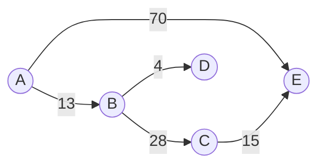
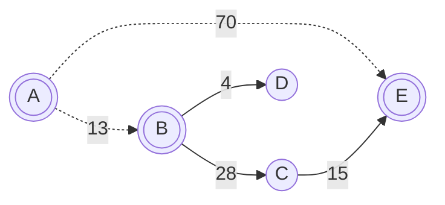
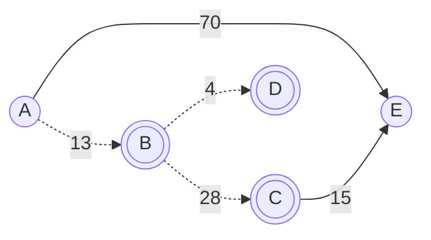
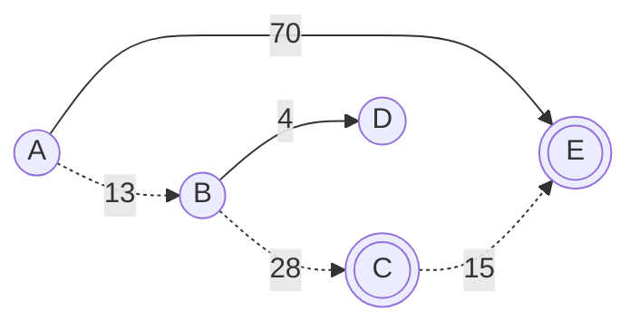

## 理论

建立一个队列, 存入开始节点, 队列不为空时,

(1) 取出队头节点 $X$, 出队

(2) 遍历与 $X$ 相通的节点 $Y$, 若 $X$ 到 $Y$ 的距离可缩小(松弛), 且 $Y$ 不在队列中, 将 $Y$ 入队, 继续 $(1)$

(3) 若队列为空则结束

## 过程



求$A$到其他点最短路径

设定 $p[i]$表示节点$A$到节点$i$的路径

(1) 初始状态, 设置节点$A$到其余各点最短路径为$∞$

|        | A   | B   | C   | D   | E   |
| ------ | --- | --- | --- | --- | --- |
| $p[i]$ | $0$ | $∞$ | $∞$ | $∞$ | $∞$ |

(2) 节点$A$进入队列, 队列为$[A,]$, 队列非空

队头节点$A$ 出队, 对以节点$A$为起点的所有边松弛, 涉及节点$B、E$

节点$A$到节点$B、E$ 最短路径变小, 且其未在队列中, 故点 $B, E$ 入队, 队列为 $[B, E]$



|        | A   | B    | C   | D   | E    |
| ------ | --- | ---- | --- | --- | ---- |
| $p[i]$ | $0$ | `13` | $∞$ | $∞$ | `70` |


(3) 队头 $B$ 出队, 对以 $B$ 为起点所有边进行松弛, 涉及点 $C, D$

节点$A$到节点$C, D$路径变小, 且点其未在队列中, 故点 $C, D$ 入队, 队列为 $[E, C, D]$



|        | A   | B    | C             | D            | E    |
| ------ | --- | ---- | ------------- | ------------ | ---- |
| $p[i]$ | $0$ | $13$ | `41`(13 + 28) | `17`(13 + 4) | $70$ |

(4) 队头 $E$ 出队, 对以 $E$ 为起点所有边的终点进行松弛操作

不涉及其他节点, 队列$[C, D]$

(5) 队头 $C$ 出队, 对以 $C$ 为起点所有边的终点进行松弛操作, 涉及点$E$

节点$A$到节点$E$路径变小, 且其未在队列中, 点 $E$ 入队, 队列中结点为 $[D, E]$



|        | A   | B    | C    | D    | E                  |
| ------ | --- | ---- | ---- | ---- | ------------------ |
| $p[i]$ | $0$ | $13$ | $41$ | $17$ | `56`(13 + 28 + 15) |


(6) 队头 $D$ 出队, 对以 $D$ 为起点的边进行松弛

不涉及其他节点, 队列为$[E]$

(7) 队头 $E$ 出队, 对以 $E$ 为起点的边进行松弛

不涉及其他节点, 队列为空, 结束

节点$A$到其他点最短路径为

|        | A   | B    | C    | D    | E    |
| ------ | --- | ---- | ---- | ---- | ---- |
| $p[i]$ | `0` | `13` | `41` | `17` | `56` |


## 实现

```c++
#include <iostream>
#include <queue>
#include <map>
#include <set>
#include <utility>
#include <vector>

// definition of line
template <typename T = std::string>
struct Line {
    T      m_start_node;
    T      m_end_node;
    double m_weight;

    Line(T s, T e, double w): m_start_node(std::move(s)), m_end_node(std::move(e)), m_weight(w) {}
};


template <typename T = std::string>
class SPFAAlgorithm {
public:
    explicit SPFAAlgorithm(std::vector<Line<T> > lines) {
        std::set<T> nodes;
        for (const auto& line : lines) {
            nodes.insert(line.m_start_node);
            nodes.insert(line.m_end_node);
        }

        m_node.assign(nodes.begin(), nodes.end());
        m_lines = std::move(lines);
        for (const auto& node : m_node) {
            m_shortest_path[node] = 0x7FFFFFFF;
            m_is_in_queue[node] = false;
        }
    }

    void run(T node) {
        std::queue<T> q;

        m_shortest_path[node] = 0;
        m_is_in_queue[node] = true;

        T s_node;
        T e_node;

        q.push(node);
        while (!q.empty()) {
            s_node = q.front();
            q.pop();

            m_is_in_queue[s_node] = false;
            for (const auto& line : m_lines) {
                if (s_node == line.m_start_node) {
                    e_node = line.m_end_node;

                    if (m_shortest_path[s_node] + line.m_weight < m_shortest_path[e_node]) {
                        m_shortest_path[e_node] = m_shortest_path[s_node] + line.m_weight;
                        if (!m_is_in_queue[e_node]) {
                            q.push(e_node);
                            m_is_in_queue[e_node] = true;
                        }
                    }
                }
            }
        }
    }

    void print_path() const {
        for (auto it = m_shortest_path.begin(); it != m_shortest_path.end(); ++it) {
            std::cout << it->first << ": " << it->second << std::endl;
        }
    }

private:
    std::vector<Line<T>> m_lines;
    std::vector<T>       m_node;
    std::map<T, double>  m_shortest_path;
    std::map<T, bool>    m_is_in_queue;
};

int main() {
    using Line = Line<>;

    std::vector<Line> lines = {
        Line("A", "B", 13), Line("A", "E", 70), Line("B", "D", 4),
        Line("B", "C", 28), Line("C", "D", 23), Line("C", "E", 15)
    };

    std::string node = "A";
    SPFAAlgorithm<> spfa = SPFAAlgorithm<std::string>(lines);
    spfa.run(node);
    spfa.print_path();
    return 0;
}
```

运行结果

```sh
A: 0
B: 13
C: 41
D: 17
E: 56
```
