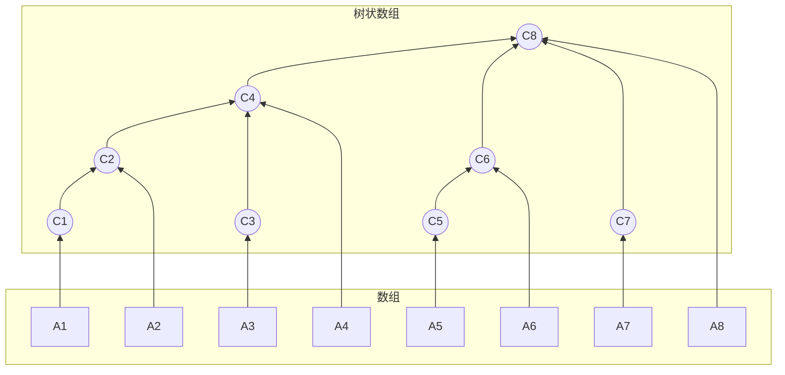
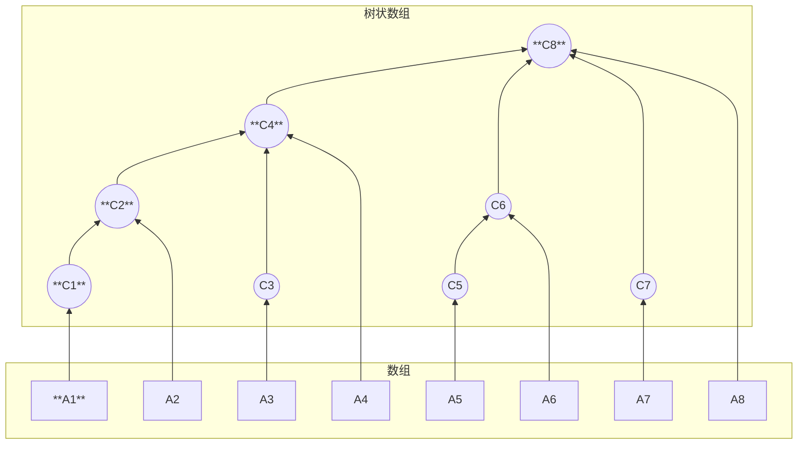
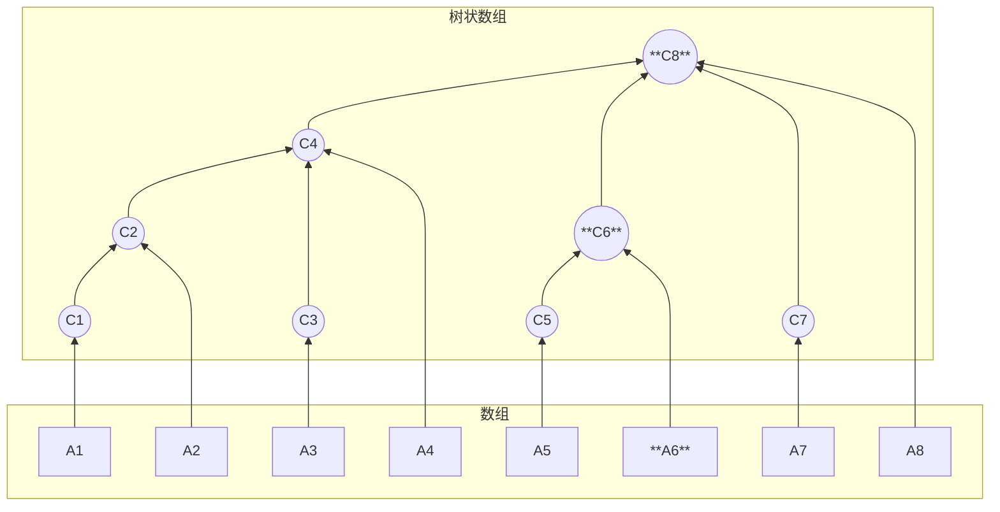

## 概念

树状数组(binary indexed tree, 简称 BIT, 又称 Fenwick Tree)是一种用于高效计算前缀和与维护单点修改的数据结构

- 时间复杂度: 单点修改和区间查询均为 O(logn)

- 空间复杂度: O(n)

- 优点: 代码极简、常数极小、运行效率高于线段树

### lowbit

树状数组的灵魂在于位运算 `lowbit(x)`, 它的作用是提取出 $x$ 二进制表示中最低位的 $1$ 及其后面的 $0$ 所代表的数值

```c
// 获取 x 的 lowbit 值
int lowbit(int x) {
    return x & (-x);
}
```

原理解析: 在计算机中, 负数采用补码表示(按位取反加 1), x & (-x) 恰好能保留最低位的 1, 并将其他位全部置 0

例: x=6 , 二进制为 (0110) 2, −6 的补码为 (1010) 
2, 6 & (−6)=(0010) 2=2 

### 节点管辖范围

- $A[i]$

表示数组元素

- $C[i]$

表示对应树状数组, 值为存储的是原数组 $A[i]$ 中一段连续区间的和, 区间的右端点固定为 i

$C[i]$ 管辖的元素个数为 lowbit(i), 即它管辖的区间为: $[i−lowbit(i)+1, i]$

$C[i]$中一定包含$A[i]$值, $i$ 为奇数时, 有 $C[i] = A[i]$



$C[i]$管辖数组 $A$ 一段连续区间和, 区间末尾元素是 $A[i]$

$C[i]$所管辖元素个数为$2^{k}$个($k$ 为 $i$ 二进制中最低位到最高位`连续0`长度)

- $C[8]$

$(8)_{10}$ =$(1000)_{2}$, 最低位到最高位连续 $0$ 长度为 $3$, 故 $k=3$, 管辖数有$2^{3}$个

$C[8]$是$8$ 个数($A[1]-A[8]$)和

- $C[5]$

$(5)_{10}$ =$(0101)_{2}$, 最低位到最高位连续 $0$ 长度为 $0$, 故 $k=0$, 管辖数有$2^{0}$个

$C[5]$是 $1$ 个数($A[5]$)和

- $C[4]$

$(4)_{10}$ =$(0100)_{2}$, 最低位到最高位连续 $0$ 长度为 $2$, 故 $k=2$, 管辖数有$2^{2}$个

$C[4$]是 4 个数($A[1]-A[4]$)和

给定 $i$, $C[i]$管辖范围$2^{k}$, $2^{k}$ = $i$ & $(-i)$

```c
// 根据C[i]下标i获取管辖范围
int lowbit(int i){
    return i & (-i);
}
```

## 操作

### 单点修改

当 $A[i]$ 的值增加 $v$ 时, 所有管辖 $A[i]$ 的 $C$ 节点都需要加上 $v$, 向上寻找父节点: i += lowbit(i)

```c
// 在位置 pos 加上值 v
void add(int pos, int v, int n) {
    for (int i = pos; i <= n; i += lowbit(i)) {
        c[i] += v;
    }
}
```

- 更新 $A[1]$

更新所有包含$A[1]$的 $C[i]$, 即 $C[1]$和其祖先节点$C[2], C[4], C[8]$

$i = 1$

$C[1] += A[1]$

$lowbit(1) = 1; 1+lowbit(1) = 2 ; C[2]+=A[1]$

$lowbit(2) = 2; 2+lowbit(2) = 4 ; C[4]+=A[1]$

$lowbit(4) = 4; 4+lowbit(4) = 8 ; C[8]+=A[1]$




- 更新 $A[6]$

更新所有包含 $A[6]$的 $C[i]$, 即 $C[6]$和其祖先节点 $C[8]$

$i = 6$

$C[6]+=A[6]$

$lowbit(6) = 2; 6+lowbit(6) = 8 ; C[8]+=A[6]$



```c
// pos 更新位置
// value 增加或减少值
// len 数组长度
void update(int pos, int value, int len){
    a[pos] += value;
    // i代表更新位置
    for(int i = pos; i <= len; i += lowbit(i)){
        c[i] += value;
    }
}
```

### 前缀和查询 (query)

求 $A[1…x]$ 的前缀和, 需要将 $x$ 拆解为若干个不相交的管辖区间, 向前寻找前一个区间: i -= lowbit(i)

```c
// 查询 A[1] ~ A[x] 的前缀和
int query(int x) {
    int sum = 0;
    for (int i = x; i > 0; i -= lowbit(i)) {
        sum += c[i];
    }
    return sum;
}
```

### 区间和查询

利用前缀和的思想, 区间 $[L, R]$ 的和等于: 
$$ \sum_{i=L}^{R} A[i] = \text{query}(R) - \text{query}(L-1) $$

```c
// 求A[1] ~ A[X]的和
int get_interval_sum(int x){
    int sum = 0;
    for(int i = x; i > 0; i -= lowbit(i)){
        sum += c[i];
    }
    return sum;
}
```

```cpp
#include <iostream>
#include <vector>

class BinaryIndexedTree {
private:
    int n;
    std::vector<int> c;

    int lowbit(int x) {
        return x & (-x);
    }

public:
    // 构造函数, 支持 O(n) 线性建树
    BinaryIndexedTree(const std::vector<int>& a) {
        n = a.size() - 1; // 假设 a 从下标 1 开始
        c.assign(n + 1, 0);
        
        // O(n) 初始化: 先将 A 的值赋给 C, 然后向上更新父节点
        for (int i = 1; i <= n; ++i) {
            c[i] += a[i];
            int parent = i + lowbit(i);
            if (parent <= n) {
                c[parent] += c[i];
            }
        }
    }

    // 单点修改: A[pos] += v
    void add(int pos, int v) {
        for (int i = pos; i <= n; i += lowbit(i)) {
            c[i] += v;
        }
    }

    // 前缀和查询: Sum(A[1...x])
    int query(int x) {
        int sum = 0;
        for (int i = x; i > 0; i -= lowbit(i)) {
            sum += c[i];
        }
        return sum;
    }

    // 区间和查询: Sum(A[L...R])
    int query_range(int l, int r) {
        return query(r) - query(l - 1);
    }
};

int main() {
    // 数组 a 从下标 1 开始, a[0] 占位
    std::vector<int> a = {0, 1, 2, 3, 4, 5, 6, 7, 8}; 
    BinaryIndexedTree bit(a);

    std::cout << "Sum[1..4]: " << bit.query_range(1, 4) << "\n"; // 10
    bit.add(2, 5); // A[2] 增加 5
    std::cout << "Sum[1..4]: " << bit.query_range(1, 4) << "\n"; // 15

    return 0;
}
```

## 进阶应用

基础树状数组只能做到"单点修改 + 区间查询"

通过引入**差分**思想, 我们可以解锁更多功能

### 区间修改 + 单点查询

**核心思想**: 维护原数组 $A$ 的**差分数组** $D$, 其中 $D[i] = A[i] - A[i-1]$(规定 $A[0]=0$)

- **区间修改**: 将 $A[L \dots R]$ 都加上 $v$, 等价于 $D[L] += v$ 且 $D[R+1] -= v$(转化为**单点修改**)

- **单点查询**: 求 $A[x]$ 的值, 等价于求差分数组的前缀和 $\sum_{i=1}^x D[i]$(转化为**区间查询**)

```cpp
// 区间 [L, R] 加上 v
void range_add(int l, int r, int v) {
    add(l, v);
    add(r + 1, -v);
}

// 单点查询 A[x]
int point_query(int x) {
    return query(x); // 直接求差分数组的前缀和
}
```

### 区间修改 + 区间查询 (双树状数组)

如果既要区间修改, 又要区间查询, 需要维护**两个**树状数组

数学推导:

设差分数组为 $D$, 则前缀和为: 
$$ \sum_{i=1}^x A[i] = \sum_{i=1}^x \sum_{j=1}^i D[j] = \sum_{j=1}^x D[j] \times (x - j + 1) $$
拆分后得到: 
$$ \sum_{i=1}^x A[i] = (x + 1) \sum_{j=1}^x D[j] - \sum_{j=1}^x (j \times D[j]) $$

实现方案: 

- `bit1` 维护 $D[i]$ 的前缀和

- `bit2` 维护 $i \times D[i]$ 的前缀和

```cpp
// 区间加 v
void range_add(int l, int r, int v) {
    // 更新 bit1
    add(bit1, l, v);       add(bit1, r + 1, -v);
    // 更新 bit2
    add(bit2, l, l * v);   add(bit2, r + 1, -(r + 1) * v);
}

// 前缀和查询
long long range_query(int x) {
    return (x + 1) * query(bit1, x) - query(bit2, x);
}

// 区间和查询
long long query_range(int l, int r) {
    return range_query(r) - range_query(l - 1);
}
```