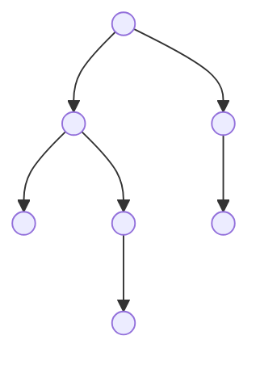
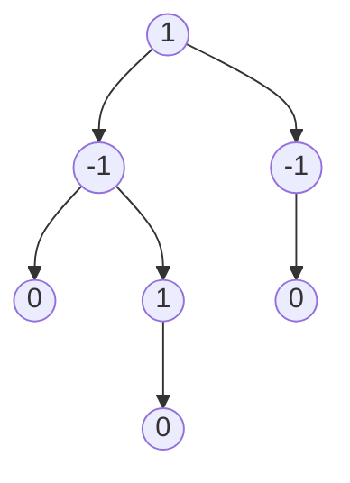
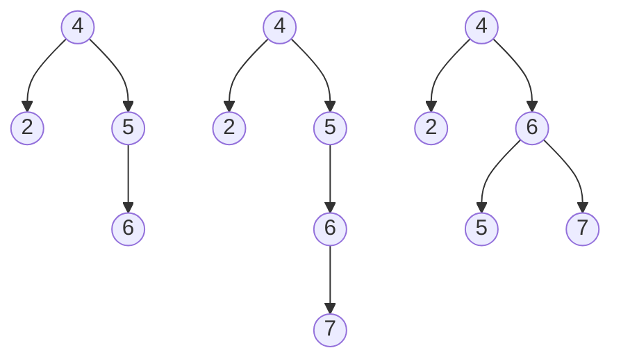
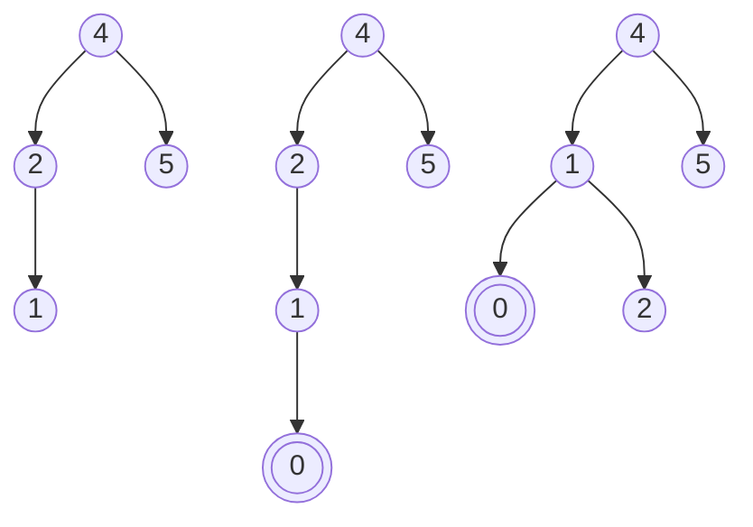
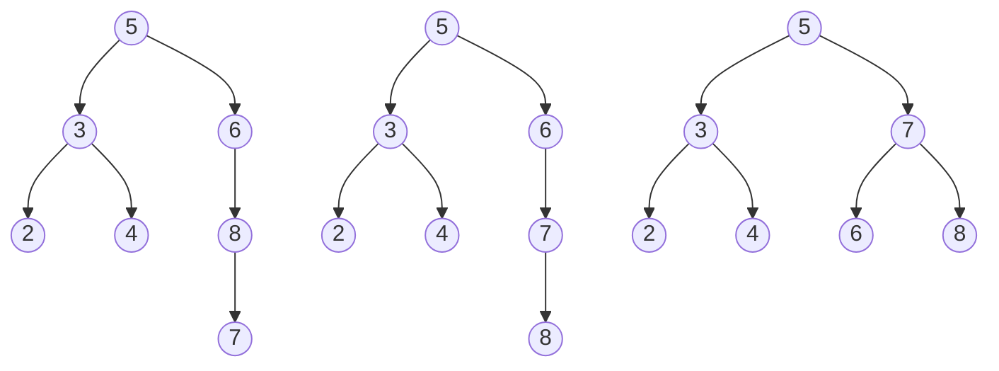
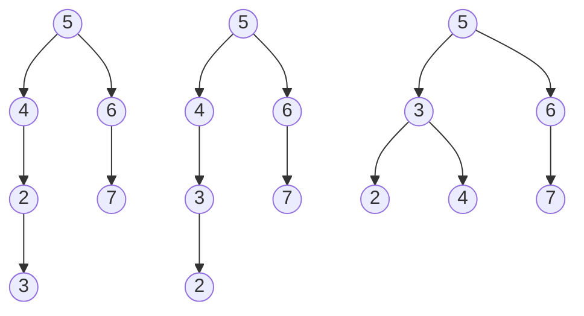

## AVL树

### 定义

AVL树是一种自平衡二叉查找树

### 性质

在AVL树中, 任何节点两个子树高度最大差别为1, 因此也被称为高度平衡树

AVL树左子树和右子树都是AVL树, 即它们都满足高度平衡条件

平衡因子(bf)节点右子树高度减去左子树高度(或左子树高度减去右子树高度取绝对值), 其绝对值不超过1(-1、0、1)



标记平衡因子



该树为$AVL$树

### 实现

#### 节点定义

```c++
template <typename T>
typedef struct AVLNode {
    T           m_value;
    int         m_height;
    AVLNode<T>* m_left_son;
    AVLNode<T>* m_right_son;

    AVLNode(T value, AVLNode<T> *left_son, AVLNode<T> *right_son, int height){
        this->m_value = value;
        this->m_height = height;
        this->m_left_son = left_son;
        this->m_right_son = right_son;
    }
} AVLNode, AVLNodeList;
```

#### 节点信息

##### 获取节点高度

```c++
template <typename T>
int get_height(AVLNode<T> *node) {
    if(node == nullptr) {
        return 0;
    }
    return node->m_height;
}
```

##### 获取节点平衡因子

```c++
template <typename T>
int get_balance_factor(AVLNode<T> *node) {
    if(node == nullptr) {
        return 0;
    }
    return get_height(node->m_left_son) - get_height(node->m_right_son);
}
```

##### 判断

```c++
// 判断是否平衡
template <typename T>
bool is_balance(AVLNode<T> *node) {
    if(node == nullptr){
        return true;
    }

    if(abs(get_balance_factor(node)) > 1) {
        return false;
    }
    return is_balance(node->m_left_son) && is_balance(node->m_right_son);
}
```

#### 左旋

- `AVL`树若在`右子树`插入右孩子导致失衡时, 单左旋调整

- 旋转围绕最小失衡子树根节点进行



原本平衡$AVL$树插入节点$7$后导致不平衡

最小失衡子树根节点为节点$5$

```c++
// 左旋, root为最小失衡子树根节点
template <typename T>
AVLNode<T>* do_left_rotate(AVLNode<T> *root) {
    AVLNode<T> *p = root->m_right_son;

    root->m_right_son = p->m_left_son;
    p->m_left_son = root;

    // 改变指向后, 更新结点对应高度
    root->m_height = max(get_height(root->m_left_son), get_height(root->m_right_son)) + 1;
    p->m_height = max(get_height(p->m_left_son), get_height(p->m_right_son)) + 1;

    return p;
}
```

#### 右旋

- $AVL$ 树若在`左子树`插入`左孩子`导致失衡时, 单右旋调整

- 旋转围绕最小失衡子树根节点进行



```c++
template <typename T>
AVLNode<T>* do_right_rotate(AVLNode<T> *&root) {
    AVLNode<T> *p = root->m_left_son;

    root->m_left_son = p->m_right_son;
    p->m_right_son = root;

    root->m_height = max(get_height(root->m_left_son), get_height(root->m_right_son)) + 1;
    p->m_height = max(get_height(p->m_left_son), get_height(p->m_right_son)) + 1;
    return p;
}
```

#### 先右旋后左旋

- `AVL`树在 `右子树`上插入`左孩子`导致失衡时, 先右旋后左旋调整

```c++
template <typename T>
AVLNode<T>* do_right_left_rotate(AVLNode<T> *&root) {
    root->m_right_son = do_right_rotate(root->m_right_son);
    return do_left_rotate(root);
}
```



红色为插入节点;绿色为最小失衡子树根节点

#### 先左旋后右旋

- `AVL`树在`左子树`上插入`右孩子`导致失衡时, 先左旋后右旋调整



```c++
template <typename T>
AVLNode<T>* left_right_rotate(AVLNode<T> *&root) {
    root->m_left_son = do_left_rotate(root->m_left_son);
    return do_right_rotate(root);
}
```

红色为插入节点, 绿色为最小失衡子树根节点
