## binary tree

二叉树(binary tree)是一种数据结构, 其中每个节点最多有两个子节点, 通常被称为左子节点和右子节点

### 概念

#### 根节点(root node)

二叉树顶层节点, 没有父节点

#### 子节点(child node)

每个节点最多有两个子节点, 分别称为左子节点和右子节点

#### 父节点(parent node)

拥有子节点节点

#### 叶子节点(leaf nodes)

没有子节点节点, 即树末端节点

#### 深度(depth)

从根节点到某个节点最长路径上节点数(包括该节点本身)

根节点深度为1

#### 高度(height)

从根节点到树中最深叶子节点最长路径上节点数减1(即不包括叶子节点本身)

空树高度为0

#### 遍历

##### 层次遍历(level order traversal)

按层次从上到下、从左到右遍历树中节点

##### 前序遍历(preorder traversal)

访问顺序为: 根节点 -> 左子树 -> 右子树

##### 中序遍历(inorder traversal)

访问顺序为: 左子树 -> 根节点 -> 右子树(在二叉搜索树中, 这种遍历会产生一个有序序列)

##### 后序遍历(postorder traversal)

访问顺序为: 左子树 -> 右子树 -> 根节点

### 类型

#### 二叉搜索树(binary search tree, BST)

每个节点左子树中所有节点值都小于该节点值, 右子树中所有节点值都大于该节点值

#### 平衡二叉树(balanced binary tree)

树左右子树高度差不超过1, 例如AVL树和红黑树

#### 完全二叉树(complete binary tree)

除最后一层外, 每一层都满, 且最后一层节点都靠左对齐

#### 满二叉树(full binary tree)

除叶子节点外, 每个节点都有两个子节点

### 实现

#### 节点定义

```c++
template<typename T>
struct Node {
    T        m_value;
    Node<T>* m_left_son;
    Node<T>* m_right_son;

    Node(T value): m_value(value), m_left_son(nullptr), m_right_son(nullptr) {}
    Node(T value, Node<T> *leftSon, Node<T> *rightSon): m_value(value), m_left_son(leftSon), m_right_son(rightSon) {}
};
```

## 二叉排序树

### 概念

二叉排序树 `binary sort tree`(BST), 也称二叉查找树, 是一种特殊二叉树

#### 性质

##### 节点

每个节点都有一个左子节点和一个右子节点, 但也可以没有子节点(叶子节点)或只有一个子节点

##### 左子树性质

左子树中所有节点值都小于其根节点值

##### 右子树性质

右子树中所有节点值都大于其根节点值

##### 递归性质

左子树和右子树也分别是二叉排序树

- 示例

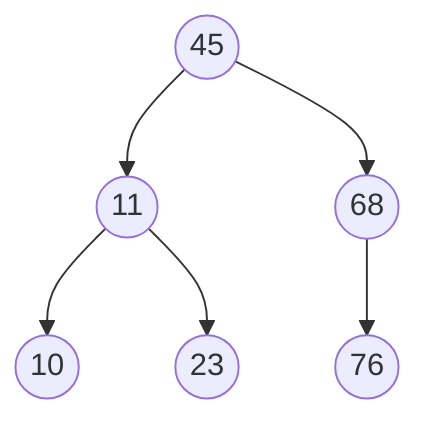

对该树进行中序遍历($LDR$)会得到一个递增有序序列: $10, 11, 23, 45, 50, 68, 76$

### 操作

#### 插入

##### 规则

从根节点开始,

如果要插入值小于当前节点值, 则递归地到左子树中寻找合适插入位置(或到达一个叶子节点左孩子为空位置)

如果要插入值大于当前节点值, 则递归地到右子树中寻找

最后找到合适位置后插入新节点, 新插入结点总是叶子结点

- 示例, 插入 $15$

因为 $15 < 45$, 选择左子树,

因为 $15 > 11$, 选择右子树,

因为 $15 < 23$, 选择左子树, 左子树为空, 插入

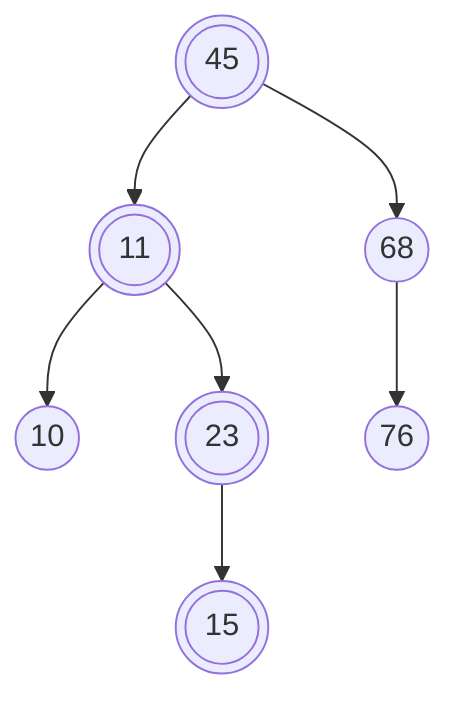

##### 单值插入

```c++
template<typename T>
Node<T> *insert(Node<T> *root, const T value) {
    if(root == nullptr){
        root = new Node<T>(value, nullptr, nullptr);
        return root;
    }

    if(root->m_value > value){
        root->m_left_son = insert(root->m_left_son, value);
    }

    if(root->m_value < value){
        root->m_right_son = insert(root->m_right_son, value);
    }
    return root;
}
```

##### 构建

根节点为空, 进行插入操作

```c++
template<typename T>
void init(Node<T> *root, const vector<T> &v) {
    for(int i = 0, size = v.size(); i < size; i++) {
        root = insert(root, v[i]);
    }
}
```

#### 查找

##### 规则

从根节点开始,

如果要查找值小于当前节点值, 则递归地在左子树中查找

如果要查找值大于当前节点值, 则递归地在右子树中查找

如果找到相等值, 则返回该节点

到叶子节点仍未找到, 查找失败

- 示例, 查找 $23$

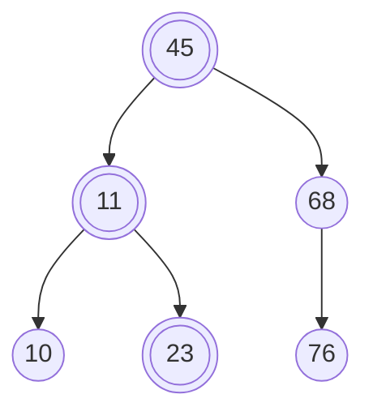

因为 $23 < 45$, 则查找左子树

因为 $23 > 11$, 则查找右子树, $23 = 23$, 查找成功

- 示例, 查找 $47$

因为 $47 > 45$, 则查找右子树

因为 $47 < 68$, 则查找左子树, 左子树为空, 查找失败

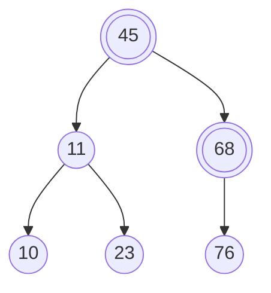

##### 递归

```c++
template<typename T>
Node<T> *search(Node<T> *root, const T value) {
    if(root == nullptr){
        return nullptr;
    }

    if(root->m_value == value){
        return root;
    }

    if(root->m_value > value){
        return search(root->m_left_son, value);
    }

    if(root->m_value < value){
        return search(root->m_right_son, value);
    }
}
```

##### 非递归

```c++
template<typename T>
Node<T> *search(Node<T> *root, const T value) {
    while(root) {
        if(root->m_value == value){
            return root;
        }

        if(root->m_value > value){
            root = root->m_left_son;
        }

        if(root->m_value < value){
            root = root->m_right_son;
        }
    }
    return nullptr;
}
```

#### 删除

##### 规则

如果是叶子节点, 直接删除

如果有一个子节点, 用其子节点替换该节点

如果有两个子节点, 则寻找该节点中序后继(右子树中最小节点)或中序前驱(左子树中最大节点), 将其值复制到要删除节点上, 然后删除该中序后继或中序前驱(该节点一定是一个叶子节点或只有一个子节点节点)

- 示例, 删除 $10$ 节点

$10$ 节点是叶子节点, 直接删除

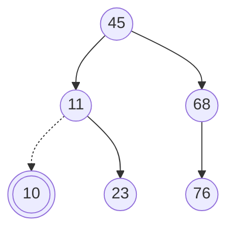

- 示例, 删除 $68$

$68$ 节点只有一个子树, 让 $68$ 子树 $76$, 成为 $68$ 父节点 $45$ 子树

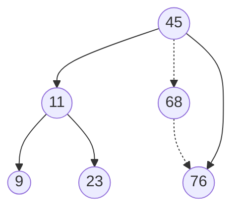

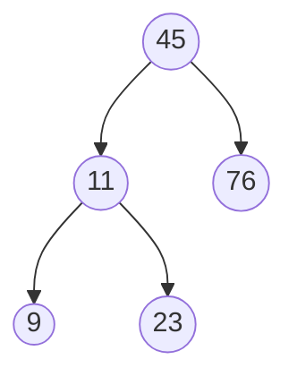

- 删除 $11$

$11$ 右子树中最小节点为 $23$, 让 $23$ 代替 $11$

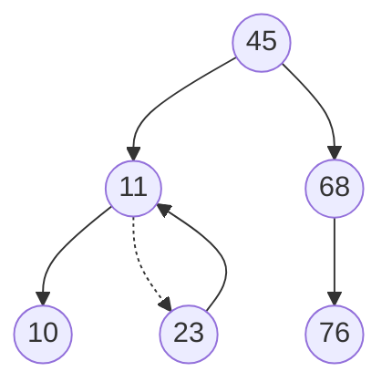

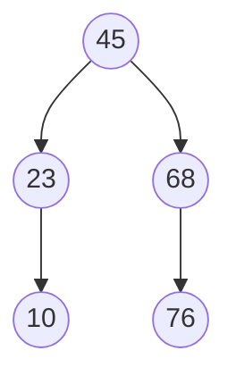

```c++
template<typename T>
void del(Node<T> *root, const T value){
    if (root == nullptr) {
        return;
    }
    // p为待删除节点, fp为其父节点
    Node<T> *p = root;
    Node<T> *fp = root;

    while(p->m_value != value){
        fp = p;
        if(p->m_value > value){
            p = p->m_left_son;
        }

        if(p->m_value < value){
            p = p->m_right_son;
        }
    }

    // 情况1, p为叶子节点, 直接删
    if(p->m_left_son == nullptr && p->m_right_son == nullptr){
        if(fp->m_left_son != nullptr){
            fp->m_left_son = nullptr;
        }

        if(fp->m_right_son != nullptr){
            fp->m_right_son = nullptr;
        }

        delete(p);
        p = nullptr;

        return;
    }

    // 情况2, p左子树为空, 重接右子树
    if(p->m_left_son == nullptr){
        p->m_value = p->m_right_son->m_value;
        p->m_right_son = nullptr;

        delete(p);
        p = nullptr;

        return;
    }

    // 情况3, p右子树为空, 重接左子树
    if(p->m_right_son == nullptr){
        p->m_value = p->m_left_son->m_value;

        delete(p->m_left_son);
        p->m_left_son = nullptr;
        return;
    }

    // 情况4, p左右子树均不为空时, 需要找p右子树中最小节点(最左节点)q
    Node<T> *q = p->m_right_son;
    // fq为q父节点
    Node<T> *fq = q;
    // 循环查找左节点, 就会找到最小值
    while(q->m_left_son != nullptr){
        fq = q;
        q = q->m_left_son;
    }
    fq->m_left_son = nullptr;
    // 用最小值节点代替欲删除节点
    p->m_value = q->m_value;

    delete(q);
    q = nullptr;
    return;
}
```

#### 遍历

```c++
template<typename T>
void output(Node<T> *root) {
    if(root->m_left_son != nullptr){
        output(root->m_left_son);
    }

    std::cout << root->m_value << std::endl;

    if(root->m_right_son != nullptr){
        output(root->m_right_son);
    }
}
```

## 线段树

线段树(segment tree)是一种高级数据结构, 专门用于在区间查询和区间更新场景中实现高效数据处理

### 定义

线段树是一种二叉搜索树, 也是平衡二叉树

它将一个区间划分成一些单元区间, 每个单元区间对应线段树中一个叶结点

(1) 每个节点表示一个区间

(2) 每个非叶子节点均有左右两颗子树, 对应区间左半与右半部分

根节点编号 $1$, 对于节点 $i$, 其左节点编号为 $2i$, 右节点编号为 $2i+1$

(3) 对于任意节点, 表示区间范围为$[x, y]$:

若 $x = y$, 则此为叶子节点

否则令 $mid = \lfloor {\frac{x+y}{2}} \rfloor$, 左儿子对于$[x, mid]$区间, 右儿子对应$[mid+1, y]$区间

- 示例, $n = 10$ 时线段树

节点 $1$, 管理范围为$[1, 10]$, 节点 $2$, 管理范围为$[1, 5]$, 节点 $12$, 管理范围为$[6, 7]$

$\cdots$

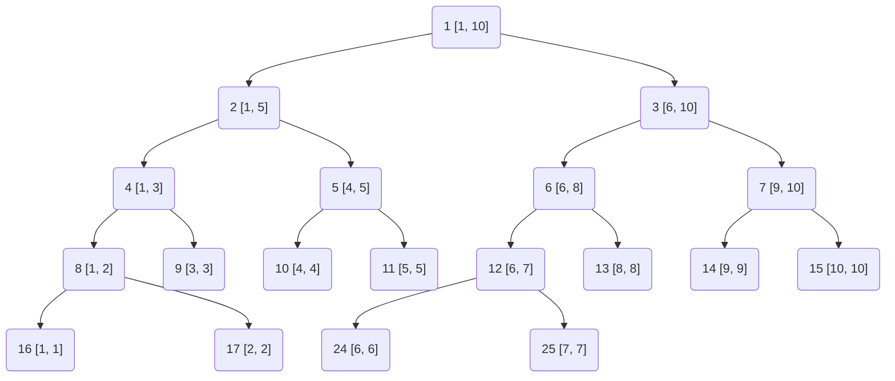

### 特点

#### 区间信息存储

线段树每个节点都存储一个区间信息, 如区间和、区间最小值或最大值等

#### 平衡性

线段树是平衡二叉树, 因此其高度为$O(log n)$, 其中n是数组长度

保证线段树上操作(如查询和更新)时间复杂度都是$O(log n)$

#### 高效性

线段树能够在$O(log n)$时间复杂度内完成查询和更新操作, 适用于处理静态或动态数组中区间问题

#### 灵活性

线段树不仅支持单点更新, 还可以扩展为区间批量更新(通过懒标记优化)

同时, 线段树还可以处理更复杂区间问题, 如二维线段树用于处理二维平面中区间问题

### 操作

```c++
#include <iostream>
#include <vector>
#include <climits>

template<typename T>
class SegmentTree {
public:
    SegmentTree(const vector<T>& arr) {
        m_size = arr.size();
        // 线段树大小是原数组大小4倍(最坏情况下满二叉树)
        m_tree.resize(4 * m_size);
        Build(1, 0, m_size - 1);
    }

    ~SegmentTree() = default;

    // 区间查询
    T query(int x, int y) {
        return query_util(1, 0, m_size - 1, x, y);
    }

    // 单点更新
    void update(int idx, T val) {
        // 更新函数也是从1开始, 与build函数保持一致
        // 计算差值
        int diff = val - arr[idx];
        arr[idx] = val; // 更新原数组
        // 更新线段树(递归)
        update_util(1, 0, n - 1, idx, diff);
    }

private:
    std::vector<T> m_tree;
    int            m_size;

    // 构建线段树(递归)
    void build(int node, int start, int end) {
        if (start == end) {
            // 叶节点, 直接存储数组元素
            m_tree[node] = arr[start];
            return;
        }
        int mid = (start + end) / 2;
        // 递归构建左子树
        build(2 * node, start, mid);
        // 递归构建右子树
        build(2 * node + 1, mid + 1, end);
        // 内部节点存储子树和
        m_tree[node] = m_tree[2 * node] + m_tree[2 * node + 1];
    }

    // 查询操作(递归)
    int query_util(int node, int start, int end, int x, int y) {
        if (y < start || end < x) {
            // 查询区间与当前节点区间无交集
            return 0;
        }
        if (x <= start && end <= y) {
            // 查询区间完全包含当前节点区间
            return m_tree[node];
        }
        // 查询区间与当前节点区间有交集, 但不完全包含
        int mid = (start + end) / 2;
        int left_sum = query_util(2 * node, start, mid, x, y);
        int right_sum = query_util(2 * node + 1, mid + 1, end, x, y);
        return left_sum + right_sum;
    }

    // 单点更新辅助函数
    void update_util(int node, int start, int end, int idx, T diff) {
        if (start == end) {
            // 叶节点, 直接更新
            m_tree[node] += diff;
            return;
        }
        int mid = (start + end) / 2;
        if (idx <= mid) {
            // 更新左子树
            update_util(2 * node, start, mid, idx, diff);
        } else {
            // 更新右子树
            update_util(2 * node + 1, mid + 1, end, idx, diff);
        }
    }
};

int main() {
    std::vector<int> arr = {1, 3, 5, 7, 9, 11};
    SegmentTree segTree(arr);

    std::cout << "Sum of values in given range [1, 3] = " << segTree.query(1, 3) << std::endl;
    segTree.update(1, 10);
    std::cout << "Sum of values in given range [1, 3] after update = " << segTree.query(1, 3) << std::endl;

    return 0;
}
```

## 堆

### 定义

堆通常是一个可以被看做一棵树数组对象, 堆总是一棵完全二叉树[^1]

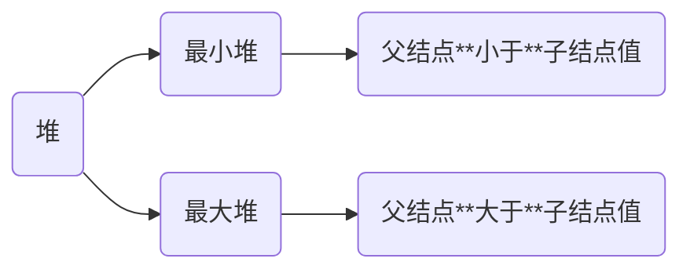

### 性质

```c
a[] = {61, 41, 30, 28, 16, 22, 13, 19, 17, 15}
```

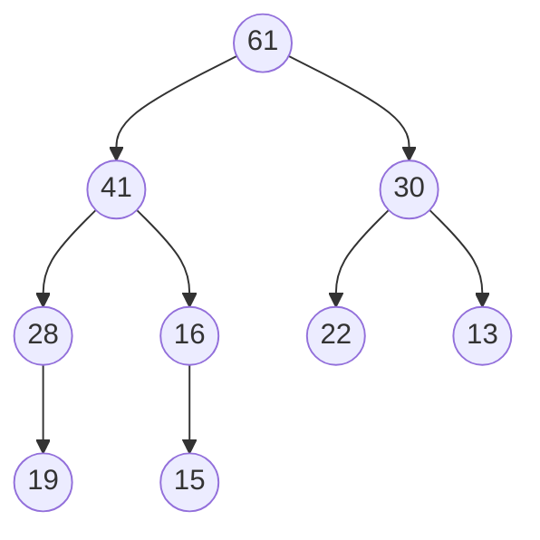

- 第 $i$ 个父节点下标为 $(i - 1)/2$

- 左儿子下标为 $2 * i + 1$

- 右儿子下标为 $2 * i + 2$

如父节点 $28$, 其下标为 $3$, 左儿子 $19$ 下标为 $7$, 右儿子 $17$ 下标为 $8$

### 堆排序

```c++
// 调整为最小堆
// start, end表示待建堆区间
template<typename T>
void sift_down(std::vector<T> &v, const int start, const int end) {
    int parent = start;
    int child = 2 * parent + 1;
    // temp暂存子树根节点
    int temp = v[parent];
    // 若左儿子编号未到终点
    while (child < end) {
        // 若右儿子比左儿子小
        if (child + 1 < end && v[child] < v[child + 1]) {
            // child变为右儿子
            child++;
        }
        // 若根节点比儿子节点小, 则不需要调整
        if (temp >= v[child]) {
            break;
        }
        // 否则需调整儿子和双亲位置
        v[parent] =  v[child];
        // 儿子上移变为双亲
        parent = child;
        child = 2 * child + 1;
    }
    v[parent] = temp;
}

// 堆排序函数
template<typename T>
void heap_sort(vector<T> &v) {
    int size = v.size();
    for (int i =  (size - 2) / 2; i >= 0; i-- ) {
        // 建立一个小根堆
        sift_down(v, i, size);
    }
    for (int i = size - 1; i > 0; i--) {
        // 交换根和最后一个元素,
        std::swap(v[0], v[i]);
        sift_down(v, 0, i);
    }
}
```

[^1]: 若二叉树中除去最后一层节点为满二叉树, 且最后一层结点依次从左到右分布, 则此二叉树被称为完全二叉树
