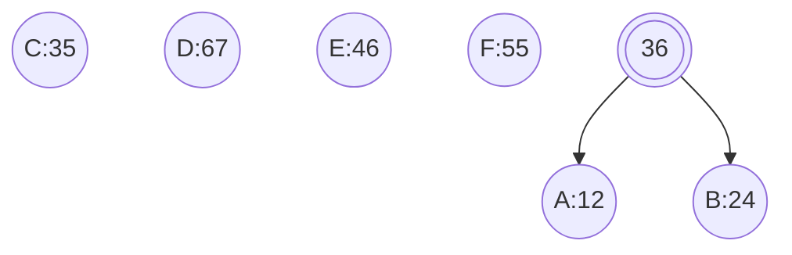
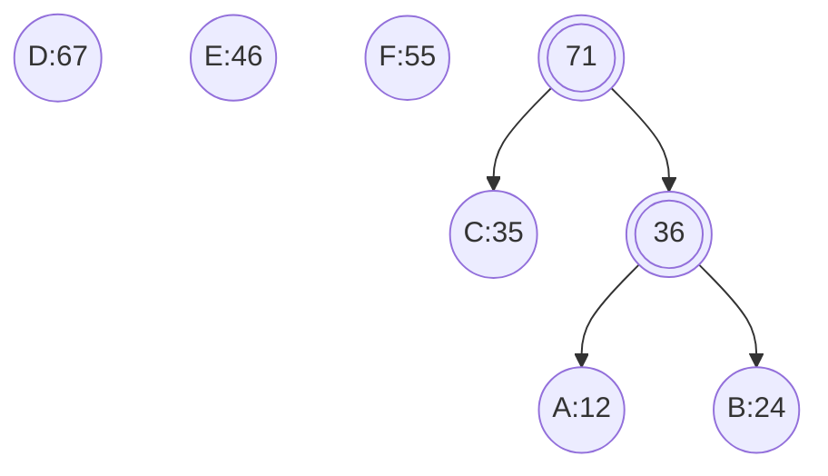
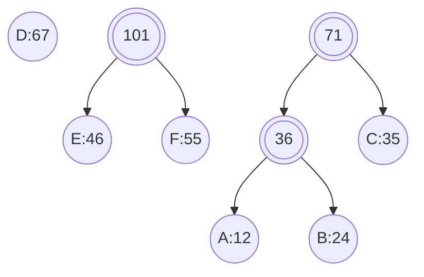
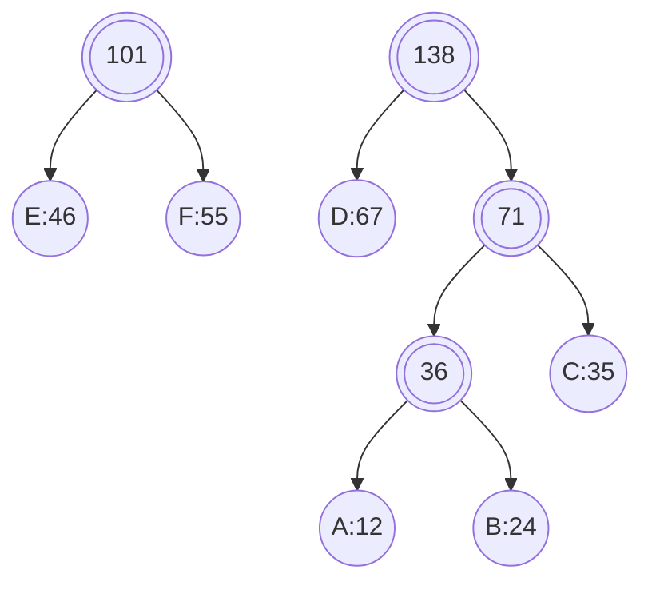
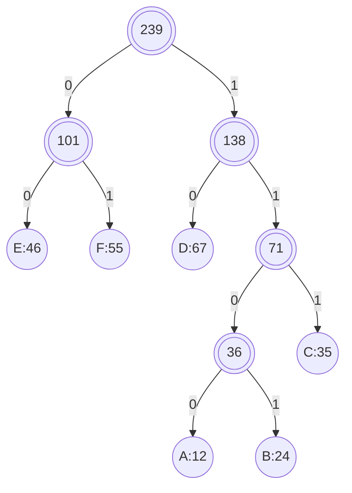

## huffman树

哈夫曼树(huffman tree), 又称霍夫曼树或最优二叉树, 是一种特殊二叉树结构, 广泛应用于数据压缩和编码领域

### 定义

给定N个权值作为N个叶子结点, 构造一棵二叉树, 若该树带权路径长度(weighted path length, WPL)达到最小, 且权值较大结点离根较近, 则称这样二叉树为最优二叉树, 也称为huffman树

#### 性质

##### 权重性质

哈夫曼树带权路径长度最短

##### 结构性质

huffman树中, 权值越大叶子节点越靠近根节点, 而权值较小结点则离根结点较远

huffman树中只有度为0(叶子节点)和度为2节点, 不存在度为1节点

##### 构造性质

哈夫曼树构造过程通常采用自底向上方法, 每次选取两个最小(或最大)权值节点进行合并, 形成新节点, 并更新节点权值和高度

#### 应用性质

huffman树在数据压缩、编码等领域有广泛应用

例如, huffman编码利用哈夫曼树性质为不同频率字符分配不同长度编码, 从而实现高效数据压缩

### 构建

每次从所有节点中选出最小权值节点与次小权值节点合并为新节点, 重复操作至所有节点合并为一棵树


(1) 选择节点$A、B$合并, 产生节点$36$



(2) 选择节点$C$与节点$36$合并, 产生节点$71$



(3) 选择节点$E、F$合并, 产生节点$101$



(4) 选择节点$D$与节点$71$合并, 产生节点$138$



(5) 合并节点$101$与$138$, 完成构建

对建好哈夫曼树, 所有节点左儿子编为 $0$, 右儿子编为 $1$, 从根节点走到叶子节点实现编码



### 实现

```c++
#include <iostream>
#include <utility>
#include <vector>
#include <memory>
#include <queue>
#include <map>

template<typename NodeType, typename WeightType>
struct Node {
    NodeType              m_name;
    WeightType            m_frequency;
    std::shared_ptr<Node> m_left_child;
    std::shared_ptr<Node> m_right_child;

    Node(NodeType name, WeightType freq, std::shared_ptr<Node> left, std::shared_ptr<Node> right) :
        m_name(name), m_frequency(freq), m_left_child(std::move(left)), m_right_child(std::move(right)) {}
};


template<typename NodeType, typename WeightType>
class HuffmanTree {
public:
    using NodePtr = std::shared_ptr<Node<NodeType, WeightType>>;

    explicit HuffmanTree(std::map<NodeType, WeightType>& table) {
        auto Compare = [](NodePtr node1, NodePtr node2) {
            return node1->m_frequency > node2->m_frequency;
        };
        std::priority_queue<NodePtr, std::vector<NodePtr>, decltype(Compare)> min_heap(Compare);

        for (auto it = table.begin(); it != table.end(); ++it) {
            min_heap.push(std::make_shared<Node<NodeType, WeightType>>(it->first, it->second, nullptr, nullptr));
        }

        while (min_heap.size() > 1) {
            NodePtr left = min_heap.top();
            min_heap.pop();
            NodePtr right = min_heap.top();
            min_heap.pop();
            min_heap.push(std::make_shared<Node<NodeType, WeightType>>('\0', left->m_frequency + right->m_frequency, left, right));
        }
        NodePtr root = min_heap.top();
        build_code(root, "");
    }

    ~HuffmanTree() = default;

    void build_code(const NodePtr& node, const std::string& code) {
        if(!node){
            return;
        }
        if(node->m_left_child == nullptr && node->m_right_child == nullptr){
            m_code_table[node->m_name] = code;
        }
        build_code(node->m_left_child, code + "0");
        build_code(node->m_right_child, code + "1");
    }

    void print_code_table() const {
        for (auto it = m_code_table.begin(); it != m_code_table.end(); ++it) {
            std::cout << it->first << ": " << it->second << std::endl;
        }
    }

private:
    std::map<NodeType, std::string> m_code_table;
};

int main() {
    std::map<char, int> table = {
        {'A', 12}, {'B', 24}, {'C', 35},
        {'D', 67}, {'E', 46}, {'F', 55}
    };

    HuffmanTree<char, int> tree(table);
    tree.print_code_table();

    return 0;
}
```

运行结果

```sh
A: 1110
B: 1111
C: 110
D: 10
E: 00
F: 01
```
