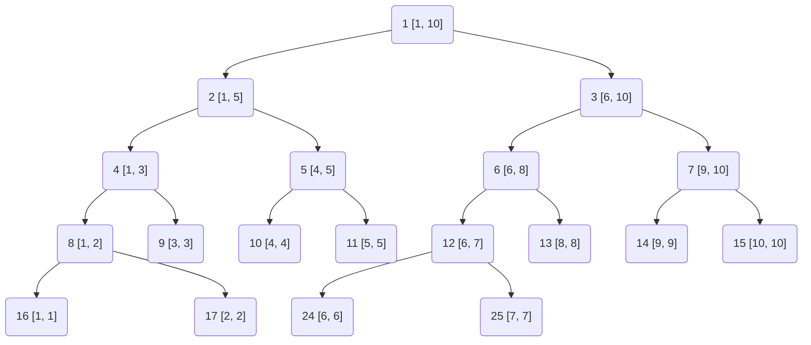

## 线段树

线段树(segment tree)是一种高级数据结构, 专门用于在区间查询和区间更新场景中实现高效数据处理

### 定义

线段树是一种二叉搜索树, 也是平衡二叉树

它将一个区间划分成一些单元区间, 每个单元区间对应线段树中一个叶结点

(1) 每个节点表示一个区间

(2) 每个非叶子节点均有左右两颗子树, 对应区间左半与右半部分

根节点编号 $1$, 对于节点 $i$, 其左节点编号为 $2i$, 右节点编号为 $2i+1$

(3) 对于任意节点, 表示区间范围为$[x, y]$:

若 $x = y$, 则此为叶子节点

否则令 $mid = \lfloor {\frac{x+y}{2}} \rfloor$, 左儿子对于$[x, mid]$区间, 右儿子对应$[mid+1, y]$区间

- 示例, $n = 10$ 时线段树

节点 $1$, 管理范围为$[1, 10]$, 节点 $2$, 管理范围为$[1, 5]$, 节点 $12$, 管理范围为$[6, 7]$

$\cdots$



### 特点

#### 区间信息存储

线段树每个节点都存储一个区间信息, 如区间和、区间最小值或最大值等

#### 平衡性

线段树是平衡二叉树, 因此其高度为$O(log n)$, 其中n是数组长度

保证线段树上操作(如查询和更新)时间复杂度都是$O(log n)$

#### 高效性

线段树能够在$O(log n)$时间复杂度内完成查询和更新操作, 适用于处理静态或动态数组中区间问题

#### 灵活性

线段树不仅支持单点更新, 还可以扩展为区间批量更新(通过懒标记优化)

同时, 线段树还可以处理更复杂区间问题, 如二维线段树用于处理二维平面中区间问题

### 操作

```c++
#include <iostream>
#include <vector>
#include <climits>

template<typename T>
class SegmentTree {
public:
    SegmentTree(const vector<T>& arr) {
        mSize = arr.size();
        // 线段树大小是原数组大小4倍(最坏情况下满二叉树)
        mTree.resize(4 * mSize);
        build(1, 0, mSize - 1);
    }

    ~SegmentTree() = default;

    // 区间查询
    T query(int x, int y) {
        return query_util(1, 0, mSize - 1, x, y);
    }

    // 单点更新
    void update(int idx, T val) {
        // 更新函数也是从1开始, 与build函数保持一致
        // 计算差值
        int diff = val - arr[idx];
        arr[idx] = val; // 更新原数组
        // 更新线段树(递归)
        update_util(1, 0, n - 1, idx, diff);
    }

private:
    std::vector<T> mTree;
    int            mSize;

    // 构建线段树(递归)
    void build(int node, int start, int end) {
        if (start == end) {
            // 叶节点, 直接存储数组元素
            mTree[node] = arr[start];
            return;
        }
        int mid = (start + end) / 2;
        // 递归构建左子树
        build(2 * node, start, mid);
        // 递归构建右子树
        build(2 * node + 1, mid + 1, end);
        // 内部节点存储子树和
        mTree[node] = mTree[2 * node] + mTree[2 * node + 1];
    }

    // 查询操作(递归)
    int query_util(int node, int start, int end, int x, int y) {
        if (y < start || end < x) {
            // 查询区间与当前节点区间无交集
            return 0;
        }
        if (x <= start && end <= y) {
            // 查询区间完全包含当前节点区间
            return mTree[node];
        }
        // 查询区间与当前节点区间有交集, 但不完全包含
        int mid = (start + end) / 2;
        int left_sum = query_util(2 * node, start, mid, x, y);
        int right_sum = query_util(2 * node + 1, mid + 1, end, x, y);
        return left_sum + right_sum;
    }

    // 单点更新辅助函数
    void update_util(int node, int start, int end, int idx, T diff) {
        if (start == end) {
            // 叶节点, 直接更新
            mTree[node] += diff;
            return;
        }
        int mid = (start + end) / 2;
        if (idx <= mid) {
            update_util(2 * node, start, mid, idx, diff);
        } else {
            update_util(2 * node + 1, mid + 1, end, idx, diff);
        }
    }
};

int main() {
    std::vector<int> arr = {1, 3, 5, 7, 9, 11};
    SegmentTree segTree(arr);

    std::cout << "Sum of values in given range [1, 3] = " << segTree.query(1, 3) << std::endl;
    segTree.update(1, 10);
    std::cout << "Sum of values in given range [1, 3] after update = " << segTree.query(1, 3) << std::endl;

    return 0;
}
```
