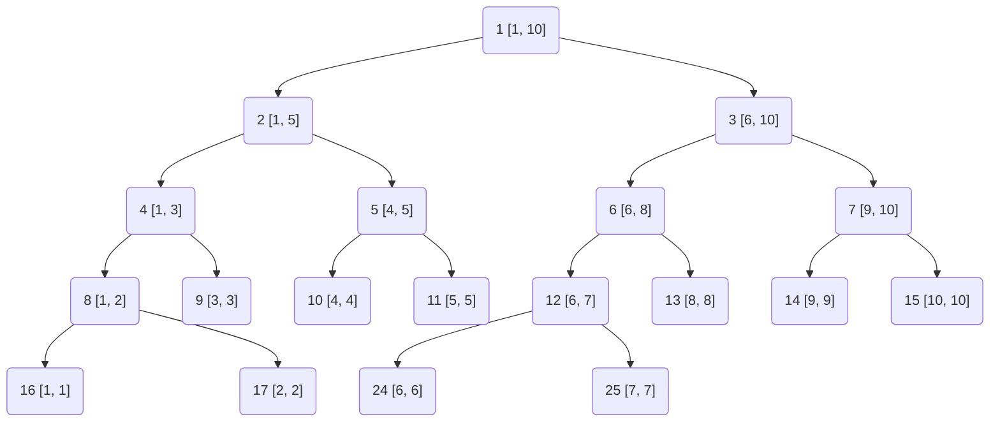

## 线段树

**线段树 (Segment Tree)** 是一种基于分治思想的高级二叉树数据结构, 专门用于高效处理**区间查询**和**区间修改**问题

### 定义

线段树将一个大的区间 $[1, n]$ 递归地划分为若干个单元区间, 每个单元区间对应树中的一个叶子节点

- **节点含义**: 每个节点代表一个区间 $[L, R]$, 并存储该区间的聚合信息(如区间和、最大值、最小值等)
  
- **左右子树**: 对于非叶子节点 $[L, R]$, 令 $mid = \lfloor \frac{L+R}{2} \rfloor$, 

其左子节点代表区间 $[L, mid]$, 右子节点代表区间 $[mid+1, R]$

- **节点编号**: 通常根节点编号为 $1$

对于节点 $i$, 其左子节点编号为 $2i$, 右子节点编号为 $2i+1$,(这与二叉堆的数组存储方式一致)


- 示例, $n = 10$ 时线段树

节点 $1$, 管理范围为$[1, 10]$, 节点 $2$, 管理范围为$[1, 5]$, 节点 $12$, 管理范围为$[6, 7]$

$\cdots$


```mermaid
graph TB;
    A1("1 [1, 10]")
    A2("2 [1, 5]")
    A3("3 [6, 10]")
    A4("4 [1, 3]")
    A5("5 [4, 5]")
    A6("6 [6, 8]")
    A7("7 [9, 10]")
    A8("8 [1, 2]")
    A9("9 [3, 3]")
    A10("10 [4, 4]")
    A11("11 [5, 5]")
    A12("12 [6, 7]")
    A13("13 [8, 8]")
    A14("14 [9, 9]")
    A15("15 [10, 10]")
    A16("16 [1, 1]")
    A17("17 [2, 2]")
    A24("24 [6, 6]")
    A25("25 [7, 7]")

    A1-->A2
    A1-->A3
    A2-->A4
    A2-->A5
    A3-->A6
    A3-->A7
    A4-->A8
    A4-->A9
    A5-->A10
    A5-->A11
    A6-->A12
    A6-->A13
    A7-->A14
    A7-->A15
    A8-->A16
    A8-->A17
    A12-->A24
    A12-->A25
```

### 特点

#### 区间信息存储

线段树每个节点都存储一个区间信息, 如区间和、区间最小值或最大值等

#### 平衡性

线段树是平衡二叉树, 因此其高度为$O(log n)$, 其中n是数组长度

保证线段树上操作(如查询和更新)时间复杂度都是$O(log n)$

#### 高效性

线段树能够在$O(log n)$时间复杂度内完成查询和更新操作, 适用于处理静态或动态数组中区间问题

#### 灵活性

线段树不仅支持单点更新, 还可以扩展为区间批量更新(通过懒标记优化)

同时, 线段树还可以处理更复杂区间问题, 如二维线段树用于处理二维平面中区间问题

### 操作

基础线段树支持**单点修改**和**区间查询**, 时间复杂度均为 $O(\log n)$

```c++
#include <iostream>
#include <vector>
#include <functional>

template <typename T>
class SegmentTree {
private:
    int n;
    std::vector<T> tree;
    std::vector<T> arr;

    // 向上更新(Push Up): 用子节点信息更新父节点
    void push_up(int node) {
        tree[node] = tree[node * 2] + tree[node * 2 + 1]; // 以区间和为例
    }

    // 递归建树
    void build(int node, int start, int end) {
        if (start == end) {
            tree[node] = arr[start];
            return;
        }
        int mid = start + (end - start) / 2; // 防止溢出
        build(node * 2, start, mid);
        build(node * 2 + 1, mid + 1, end);
        push_up(node);
    }

    // 单点修改辅助
    void update_point(int node, int start, int end, int idx, T val) {
        if (start == end) {
            tree[node] = val; // 直接覆盖或 tree[node] += val
            return;
        }
        int mid = start + (end - start) / 2;
        if (idx <= mid) update_point(node * 2, start, mid, idx, val);
        else update_point(node * 2 + 1, mid + 1, end, idx, val);
        push_up(node);
    }

    // 区间查询辅助
    T query_range(int node, int start, int end, int l, int r) {
        if (r < start || end < l) return 0; // 无交集, 返回不影响结果的值(如求和返回0, 求max返回极小值)
        if (l <= start && end <= r) return tree[node]; // 完全包含
        
        int mid = start + (end - start) / 2;
        T left_res = query_range(node * 2, start, mid, l, r);
        T right_res = query_range(node * 2 + 1, mid + 1, end, l, r);
        return left_res + right_res; // 合并结果
    }

public:
    SegmentTree(const std::vector<T>& input) {
        n = input.size();
        arr = input;
        tree.resize(4 * n, 0);
        build(1, 0, n - 1);
    }

    // 单点更新: 将 arr[idx] 修改为 val
    void update(int idx, T val) {
        update_point(1, 0, n - 1, idx, val);
    }

    // 区间查询: 查询 [l, r] 的聚合值
    T query(int l, int r) {
        return query_range(1, 0, n - 1, l, r);
    }
};

int main() {
    std::vector<int> arr = {1, 3, 5, 7, 9, 11};
    SegmentTree<int> segTree(arr);

    std::cout << "Sum of [1, 3]: " << segTree.query(1, 3) << "\n"; // 3+5+7 = 15
    
    segTree.update(1, 10); // 将索引 1 的值从 3 改为 10
    std::cout << "Sum of [1, 3] after update: " << segTree.query(1, 3) << "\n"; // 10+5+7 = 22

    return 0;
}
```

### 懒标记与区间修改

基础线段树只能进行**单点修改**

如果需要进行**区间修改**(例如将 $[L, R]$ 的所有元素都加上 $V$), 若递归到每个叶子节点, 时间复杂度会退化为 $O(n)$

为了解决这个问题, 引入了**懒标记 (Lazy Tag)**, 也称**延迟更新**

#### 方法

- **打标记**: 当递归到一个节点, 且该节点代表的区间**完全被**修改区间 $[L, R]$ 包含时, 直接修改该节点的值, 并给该节点打上一个“懒标记”, **不再继续向下递归**

- **下传标记 (Push Down)**: 当后续的操作(查询或修改)需要访问该节点的子节点时, 将懒标

记**下放**给左右子节点, 更新子节点的值和标记, 并清除当前节点的标记

```c
template <typename T>
class LazySegmentTree {
private:
    int n;
    std::vector<T> tree;
    std::vector<T> lazy; // 懒标记数组

    void push_up(int node) {
        tree[node] = tree[node * 2] + tree[node * 2 + 1];
    }

    // 下传懒标记
    void push_down(int node, int start, int end) {
        if (lazy[node] != 0) {
            int mid = start + (end - start) / 2;
            int left_child = node * 2;
            int right_child = node * 2 + 1;

            // 更新左子节点
            tree[left_child] += lazy[node] * (mid - start + 1);
            lazy[left_child] += lazy[node];

            // 更新右子节点
            tree[right_child] += lazy[node] * (end - mid);
            lazy[right_child] += lazy[node];

            // 清除当前节点的标记
            lazy[node] = 0;
        }
    }

    // 区间修改辅助
    void update_range(int node, int start, int end, int l, int r, T val) {
        if (r < start || end < l) return;
        if (l <= start && end <= r) {
            // 完全包含, 直接修改并打标记
            tree[node] += val * (end - start + 1);
            lazy[node] += val;
            return;
        }
        
        // 有部分交集, 需要先下传标记, 再递归子节点
        push_down(node, start, end);
        
        int mid = start + (end - start) / 2;
        update_range(node * 2, start, mid, l, r, val);
        update_range(node * 2 + 1, mid + 1, end, l, r, val);
        
        push_up(node);
    }

    // 区间查询辅助 (与基础版类似, 但需增加 push_down)
    T query_range(int node, int start, int end, int l, int r) {
        if (r < start || end < l) return 0;
        if (l <= start && end <= r) return tree[node];
        
        push_down(node, start, end); // 查询前必须下传标记
        
        int mid = start + (end - start) / 2;
        return query_range(node * 2, start, mid, l, r) + 
               query_range(node * 2 + 1, mid + 1, end, l, r);
    }

public:
    LazySegmentTree(int size) : n(size) {
        tree.resize(4 * n, 0);
        lazy.resize(4 * n, 0);
    }
    
    // 省略 build 函数, 实际使用时需补充
    
    void update(int l, int r, T val) {
        update_range(1, 0, n - 1, l, r, val);
    }

    T query(int l, int r) {
        return query_range(1, 0, n - 1, l, r);
    }
};
```