## 二叉树

二叉树(binary tree)是一种数据结构, 其中每个节点最多有两个子节点, 通常被称为左子节点和右子节点

### 概念

#### 根节点(root node)

二叉树的顶层节点, 没有父节点

#### 子节点(child node)

每个节点最多有两个子节点, 分别称为左子节点和右子节点

#### 父节点(parent node)

拥有子节点的节点。

#### 叶子节点(leaf nodes)

没有子节点的节点, 即树的末端节点

#### 深度(depth)

从根节点到某个节点的最长路径上的节点数(包括该节点本身)。根节点的深度为1。

#### 高度(height)

从根节点到树中最深叶子节点的最长路径上的节点数减1(即不包括叶子节点本身)。空树的高度为0。

#### 遍历

##### 层次遍历(level order traversal)

按层次从上到下、从左到右遍历树中的节点

##### 前序遍历(preorder traversal)

访问顺序为: 根节点 -> 左子树 -> 右子树

##### 中序遍历(inorder traversal)

访问顺序为: 左子树 -> 根节点 -> 右子树(在二叉搜索树中, 这种遍历会产生一个有序序列)

##### 后序遍历(postorder traversal)

访问顺序为: 左子树 -> 右子树 -> 根节点

### 类型

#### 二叉搜索树(binary search tree, BST)

每个节点的左子树中的所有节点的值都小于该节点的值，右子树中的所有节点的值都大于该节点的值

#### 平衡二叉树(balanced binary tree)

树的左右子树的高度差不超过1，例如AVL树和红黑树

#### 完全二叉树(complete binary tree)

除了最后一层外，每一层都是满的，且最后一层的节点都靠左对齐

#### 满二叉树(full binary tree)

除了叶子节点外，每个节点都有两个子节点

### 实现

#### 节点定义

```c++
template<typename T>
struct Node {
    T mValue;
    Node<T> *mLeftSon;
    Node<T> *mRightSon;

    Node(T value) : mValue(value), mLeftSon(nullptr), mRightSon(nullptr) {}
    Node(T value, Node<T> *leftSon, Node<T> *rightSon) : mValue(value), mLeftSon(leftSon), mRightSon(rightSon) {}
};
```

## 二叉排序树

### 概念

二叉排序树 `binary sort tree`(BST), 也称二叉查找树, 是一种特殊二叉树

#### 性质

##### 节点

每个节点都有一个左子节点和一个右子节点, 但也可以没有子节点(叶子节点)或只有一个子节点

##### 左子树性质

左子树中的所有节点的值都小于其根节点的值

##### 右子树性质

右子树中的所有节点的值都大于其根节点的值

##### 递归性质

左子树和右子树也分别是二叉排序树

- 示例

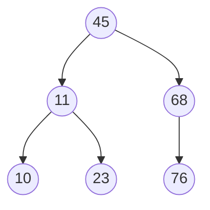

对该树进行中序遍历($LDR$)会得到一个递增有序序列: $10, 11, 23, 45, 50, 68, 76$

### 操作

#### 插入

##### 规则

从根节点开始,

如果要插入的值小于当前节点的值, 则递归地到左子树中寻找合适的插入位置(或到达一个叶子节点的左孩子为空的位置)

如果要插入的值大于当前节点的值, 则递归地到右子树中寻找

最后找到合适位置后插入新节点, 新插入结点总是叶子结点

- 示例, 插入 $15$

因为 $15 < 45$, 选择左子树,

因为 $15 > 11$, 选择右子树,

因为 $15 < 23$, 选择左子树, 左子树为空, 插入

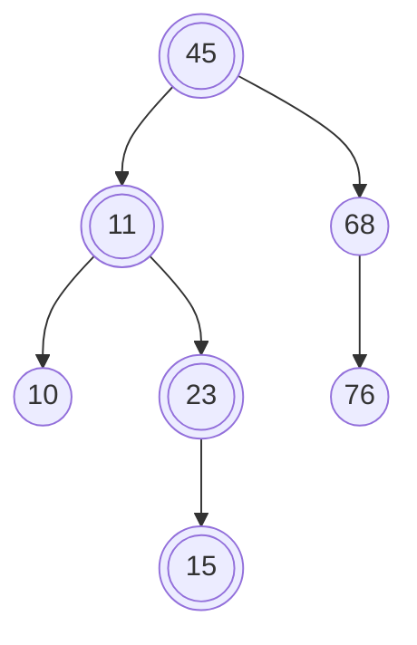

##### 单值插入

```c++
// 返回构建完成后根节点
template<typename T>
Node<T> *Insert(Node<T> *root, const T value) {
    // 节点为空, 说明是叶子节点
    if(root == nullptr){
        root = new Node<T>(value, nullptr, nullptr);
        return root;
    }

    // 插入值小于根结点时, 插入根节点左子树
    if(root->mValue > value) {
        root->mLeftSon = Insert(root->mLeftSon, value);
    }

    // 插入值大于根结点时, 插入根节点右子树
    if(root->mValue < value) {
        root->mRightSon = Insert(root->mRightSon, value);
    }
    return root;
}
```

##### 构建

根节点为空, 进行插入操作

```c++
template<class T>
void Init(Node<T> *root, const vector<T> &v) {
    for(int i = 0, size = v.size(); i < size; i++) {
        root = AddNode(root, v[i]);
    }
}
```

#### 查找

##### 规则

从根节点开始,

如果要查找的值小于当前节点的值, 则递归地在左子树中查找

如果要查找的值大于当前节点的值, 则递归地在右子树中查找

如果找到相等值, 则返回该节点

到叶子节点仍未找到, 查找失败

- 示例, 查找 $23$

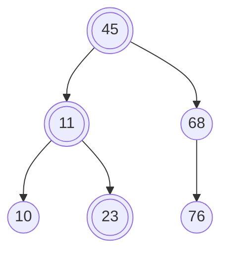

因为 $23 < 45$, 则查找左子树

因为 $23 > 11$, 则查找右子树, $23 = 23$, 查找成功

- 示例, 查找 $47$

因为 $47 > 45$, 则查找右子树

因为 $47 < 68$, 则查找左子树, 左子树为空, 查找失败

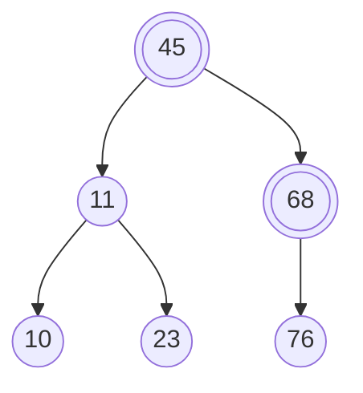

##### 递归

```c++
template<typename T>
Node<T> *Search(Node<T> *root, const T value) {
    if (root == nullptr) {
        return nullptr;
    }

    if (root->mValue == value) {
        return root;
    }

    if (root->mValue > value) {
        return Search(root->mLeftSon, value);
    }

    if (root->mValue < value) {
        return Search(root->mRightSon, value);
    }
}
```

##### 非递归

```c++
template<typename T>
Node<T> *Search(Node<T> *root, const T value) {
    while(root) {
        if (root->mValue == value) {
            return root;
        }

        if (root->mValue > value) {
            root = root->mLeftSon;
        }

        if (root->mValue < value) {
            root = root->mRightSon;
        }
    }
    return nullptr;
}
```

#### 删除

##### 规则

如果是叶子节点, 直接删除

如果有一个子节点, 用其子节点替换该节点

如果有两个子节点, 则寻找该节点的中序后继(右子树中最小的节点)或中序前驱(左子树中最大的节点), 将其值复制到要删除的节点上, 然后删除该中序后继或中序前驱(该节点一定是一个叶子节点或只有一个子节点的节点)

- 示例, 删除 $10$ 节点

$10$ 节点是叶子节点, 直接删除

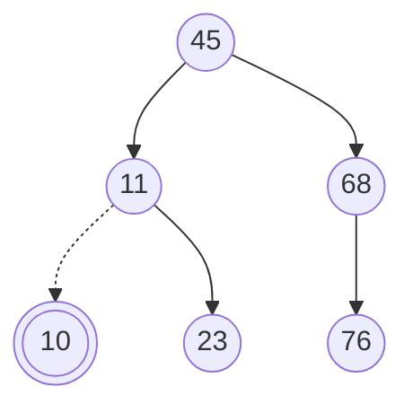

- 示例, 删除 $68$

$68$ 节点只有一个子树, 让 $68$ 子树 $76$, 成为 $68$ 父节点 $45$ 的子树

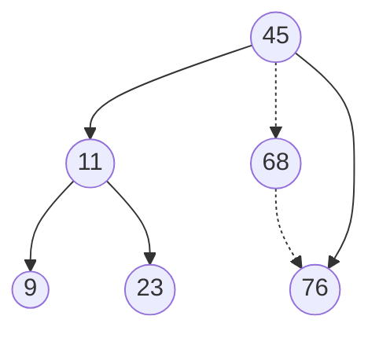

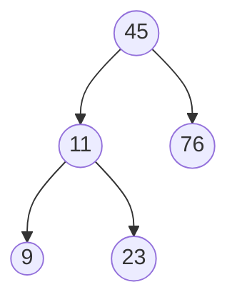

- 删除 $11$

$11$ 右子树中最小节点为 $23$, 让 $23$ 代替 $11$

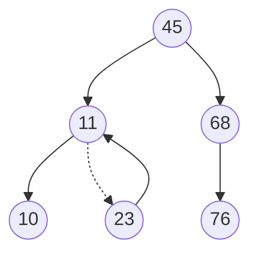

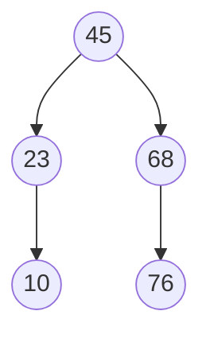

```c++
template<typename T>
void DelNode(Node<T> *root, const T value){
    if (root == nullptr) {
        return;
    }
    // p为待删除节点, fp为其父节点
    Node<T> *p = root;
    Node<T> *fp = root;

    while (p->mValue != value) {
        fp = p;
        if (p->mValue > value) {
            // 查找左子树
            p = p->mLeftSon;
        }

        if (p->mValue < value) {
            // 查找右子树
            p = p->mRightSon;
        }
    }

    // 情况1, p为叶子节点, 直接删
    if (p->mLeftSon == nullptr && p->mRightSon == nullptr) {
        if (fp->mLeftSon != nullptr) {
            fp->mLeftSon = nullptr;
        }

        if (fp->mRightSon != nullptr) {
            fp->mRightSon = nullptr;
        }

        delete(p);
        p = nullptr;

        return;
    }

    // 情况2, p左子树为空, 重接右子树
    if (p->mLeftSon == nullptr) {
        p->mValue = p->mRightSon->mValue;
        p->mRightSon = nullptr;

        delete(p);
        p = nullptr;

        return;
    }

    // 情况3, p右子树为空, 重接左子树
    if (p->mRightSon == nullptr) {
        p->mValue = p->mLeftSon->mValue;

        delete(p->mLeftSon);
        p->mLeftSon = nullptr;

        return;
    }
   
    // 情况4, p左右子树均不为空时, 需要找p右子树中最小节点(最左节点)q
    Node<T> *q = p->mRightSon;
    // fq为q父节点
    Node<T> *fq = q;
    // 循环查找左节点, 就会找到最小值
    while(q->mLeftSon != nullptr) {
        fq = q;
        q = q->mLeftSon;
    }
    fq->mLeftSon = nullptr;
    // 用最小值节点代替欲删除节点
    p->mValue = q->mValue;

    delete(q);
    q = nullptr;
    return;
}
```

#### 遍历

```c++
// 中序遍历
template<typename T>
void OutputBST(Node<T> *root) {
    if (root->mLeftSon != nullptr) {
        OutputBST(root->mLeftSon);
    }

    std::cout << root->mValue << std::endl;

    if (root->mRightSon != nullptr) {
        OutputBST(root->mRightSon);
    }
}
```

## 线段树

线段树(segment tree)是一种高级数据结构, 专门用于在区间查询和区间更新场景中实现高效数据处理

### 定义

线段树是一种二叉搜索树, 也是平衡二叉树。它将一个区间划分成一些单元区间, 每个单元区间对应线段树中一个叶结点

(1) 每个节点表示一个区间

(2) 每个非叶子节点均有左右两颗子树, 对应区间左半与右半部分

根节点编号 $1$, 对于节点 $i$, 其左节点编号为 $2i$, 右节点编号为 $2i+1$

(3) 对于任意节点, 表示区间范围为$[x, y]$:

若 $x = y$, 则此为叶子节点

否则令 $mid = \lfloor {\frac{x+y}{2}} \rfloor$, 左儿子对于$[x, mid]$区间, 右儿子对应$[mid+1, y]$区间

- 示例, $n = 10$ 时线段树

节点 $1$, 管理范围为$[1, 10]$, 节点 $2$, 管理范围为$[1, 5]$, 节点 $12$, 管理范围为$[6, 7]$

$\cdots$

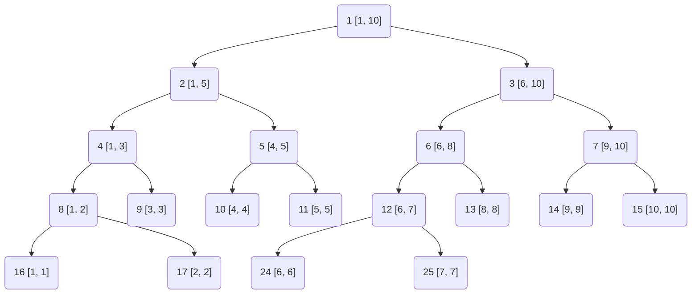

### 特点

#### 区间信息存储

线段树的每个节点都存储一个区间的信息, 如区间和、区间最小值或最大值等

#### 平衡性

线段树是平衡二叉树, 因此其高度为$O(log n)$, 其中n是数组的长度。这保证了线段树上的操作(如查询和更新)的时间复杂度都是$O(log n)$

#### 高效性

线段树能够在$O(log n)$时间复杂度内完成查询和更新操作, 适用于处理静态或动态数组中的区间问题

#### 灵活性

线段树不仅支持单点更新, 还可以扩展为区间的批量更新(通过懒标记优化)

同时, 线段树还可以处理更复杂的区间问题, 如二维线段树用于处理二维平面中的区间问题

### 操作

```c++
#include <iostream>
#include <vector>
#include <climits>

template<typename T>
class SegmentTree {
public:
    SegmentTree(const vector<T>& arr) {
        mSize = arr.size();
        // 线段树的大小是原数组大小4倍(最坏情况下满二叉树)
        mTree.resize(4 * mSize);
        Build(1, 0, mSize - 1);
    }

    ~SegmentTree() = default;

    // 区间查询
    T Query(int x, int y) {
        return QueryUtil(1, 0, mSize - 1, x, y);
    }

    // 单点更新
    void Update(int idx, T val) {
        // 这里的更新函数也是从1开始的, 与build函数保持一致
        // 计算差值
        int diff = val - arr[idx];
        arr[idx] = val; // 更新原数组
        // 更新线段树(递归)
        UpdateUtil(1, 0, n - 1, idx, diff);
    }

private:
    std::vector<T> mTree;
    int            mSize;

    // 构建线段树(递归)
    void Build(int node, int start, int end) {
        if (start == end) {
            // 叶节点, 直接存储数组元素
            mTree[node] = arr[start];
            return;
        }
        int mid = (start + end) / 2;
        // 递归构建左子树
        Build(2 * node, start, mid);
        // 递归构建右子树
        Build(2 * node + 1, mid + 1, end);
        // 内部节点存储子树和
        mTree[node] = mTree[2 * node] + mTree[2 * node + 1];
    }

    // 查询操作(递归)
    int QueryUtil(int node, int start, int end, int x, int y) {
        if (y < start || end < x) {
            // 查询区间与当前节点区间无交集
            return 0;
        }
        if (x <= start && end <= y) {
            // 查询区间完全包含当前节点区间
            return mTree[node];
        }
        // 查询区间与当前节点区间有交集, 但不完全包含
        int mid = (start + end) / 2;
        int leftSum = QueryUtil(2 * node, start, mid, x, y);
        int rightSum = QueryUtil(2 * node + 1, mid + 1, end, x, y);
        return leftSum + rightSum;
    }

    // 单点更新辅助函数
    void UpdateUtil(int node, int start, int end, int idx, T diff) {
        if (start == end) {
            // 叶节点, 直接更新
            mTree[node] += diff;
            return;
        }
        int mid = (start + end) / 2;
        if (idx <= mid) {
            // 更新左子树
            UpdateUtil(2 * node, start, mid, idx, diff);
        } else {
            // 更新右子树
            UpdateUtil(2 * node + 1, mid + 1, end, idx, diff);
        }
    }
};

int main() {
    std::vector<int> arr = {1, 3, 5, 7, 9, 11};
    SegmentTree segTree(arr);

    std::cout << "Sum of values in given range [1, 3] = " << segTree.query(1, 3) << std::endl;
    segTree.update(1, 10);
    std::cout << "Sum of values in given range [1, 3] after update = " << segTree.query(1, 3) << std::endl;

    return 0;
}
```

## AVL树

### 定义

AVL树是一种自平衡的二叉查找树

### 性质

在AVL树中, 任何节点的两个子树的高度最大差别为1, 因此也被称为高度平衡树

AVL树的左子树和右子树都是AVL树, 即它们都满足高度平衡的条件

平衡因子(bf)：节点右子树高度减去左子树高度(或左子树高度减去右子树高度取绝对值), 其绝对值不超过1(-1、0、1)

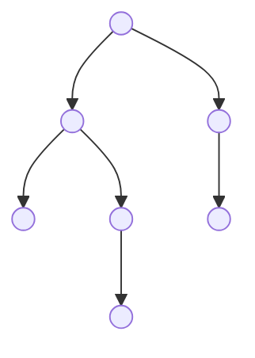

标记平衡因子

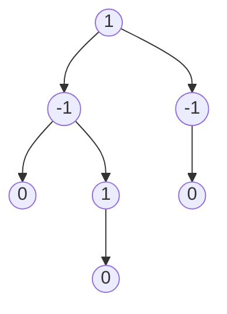

该树为$AVL$树

### 实现

#### 节点定义

```c++
template <typename T>
typedef struct AVLNode {
    T mValue;
    int mHeight;
    AVLNode<T> *mLeftSon;
    AVLNode<T> *mRightSon;
   
    AVLNode(T value, AVLNode<T> *leftSon, AVLNode<T> *rightSon, int height){
        this->mValue = value;
        this->mHeight = height;
        this->mLeftSon = leftSon;
        this->mRightSon = rightSon;
    }
} AVLNode, AVLNodeList;
```

#### 节点信息

##### 获取节点高度

```c++
template <typename T>
int GetHeight(AVLNode<T> *node) {
    if(node == nullptr) {
        return 0;
    }
    return node->mHeight;
}
```

##### 获取节点平衡因子

```c++
template <typename T>
int GetBalanceFactor(AVLNode<T> *node) {
    if(node == nullptr) {
        return 0;
    }
    return GetHeight(node->mLeftSon) - GetHeight(node->mRightSon);
}
```

##### 判断

```c++
// 判断是否平衡
template <typename T>
bool IsBalance(AVLNode<T> *node) {
    if(node == nullptr){
        return true;
    }

    if(abs(GetBalanceFactor(node)) > 1) {
        return false;
    }
    return IsBalance(node->mLeftSon) && IsBalance(node->mRightSon);
}
```

#### 左旋

- $AVL$ 树若在`右子树`插入右孩子导致失衡时, 单左旋调整

- 旋转围绕最小失衡子树根节点进行


原本平衡$AVL$树插入节点$7$后导致不平衡

最小失衡子树根节点为节点$5$

```c++
// 左旋, root为最小失衡子树根节点
template <typename T>
AVLNode<T> *LeftRotate(AVLNode<T> *root) {
    AVLNode<T> *p = root->mRightSon;

    root->mRightSon = p->mLeftSon;
    p->mLeftSon = root;

    // 改变指向后, 更新结点对应高度
    root->mHeight = max(GetHeight(root->mLeftSon), GetHeight(root->mRightSon)) + 1;
    p->mHeight = max(GetHeight(p->mLeftSon), GetHeight(p->mRightSon)) + 1;

    return p;
}
```

#### 右旋

- $AVL$ 树若在`左子树`插入`左孩子`导致失衡时, 单右旋调整

- 旋转围绕最小失衡子树根节点进行


```c++
template <typename T>
AVLNode<T>* RightRotate(AVLNode<T> *&root) {
    AVLNode<T> *p = root->mLeftSon;

    root->mLeftSon = p->mRightSon;
    p->mRightSon = root;

    root->mHeight = max(GetHeight(root->mLeftSon), GetHeight(root->mRightSon)) + 1;
    p->mHeight = max(GetHeight(p->mLeftSon), GetHeight(p->mRightSon)) + 1;
    return p;
}
```

#### 先右旋后左旋

- $AVL$ 树在 `右子树`上插入`左孩子`导致失衡时, 先右旋后左旋调整

```c++
template <typename T>
AVLNode<T>* RightAndLeftRotate(AVLNode<T> *&root) {
    root->mRightSon = RightRotate(root->mRightSon);
    return LeftRotate(root);
}
```


红色为插入节点;绿色为最小失衡子树根节点

#### 先左旋后右旋

- $AVL$ 树在`左子树`上插入`右孩子`导致失衡时, 先左旋后右旋调整

```c++
template <typename T>
AVLNode<T>* LeftAndRightRotate(AVLNode<T> *&root) {
    root->mLeftSon = LeftRotate(root->mLeftSon);
    return RightRotate(root);
}
```


红色为插入节点, 绿色为最小失衡子树根节点

## huffman树

哈夫曼树(huffman tree), 又称霍夫曼树或最优二叉树, 是一种特殊二叉树结构, 广泛应用于数据压缩和编码领域

### 定义

给定N个权值作为N个叶子结点, 构造一棵二叉树, 若该树带权路径长度(weighted path length, WPL)达到最小, 且权值较大结点离根较近, 则称这样二叉树为最优二叉树, 也称为哈夫曼树

#### 性质

##### 权重性质

哈夫曼树带权路径长度最短

##### 结构性质

哈夫曼树中, 权值越大的叶子节点越靠近根节点, 而权值较小的结点则离根结点较远

哈夫曼树中只有度为0(叶子节点)和度为2节点, 不存在度为1节点

##### 构造性质

哈夫曼树的构造过程通常采用自底向上的方法, 每次选取两个最小(或最大)权值的节点进行合并, 形成新的节点, 并更新节点的权值和高度

#### 应用性质

哈夫曼树在数据压缩、编码等领域有广泛应用

例如, 霍夫曼编码利用哈夫曼树的性质为不同频率的字符分配不同长度的编码, 从而实现高效的数据压缩

### 构建

每次从所有节点中选出最小权值节点与次小权值节点合并为新节点, 重复操作至所有节点合并为一棵树


(1) 选择节点$A、B$合并, 产生节点$36$

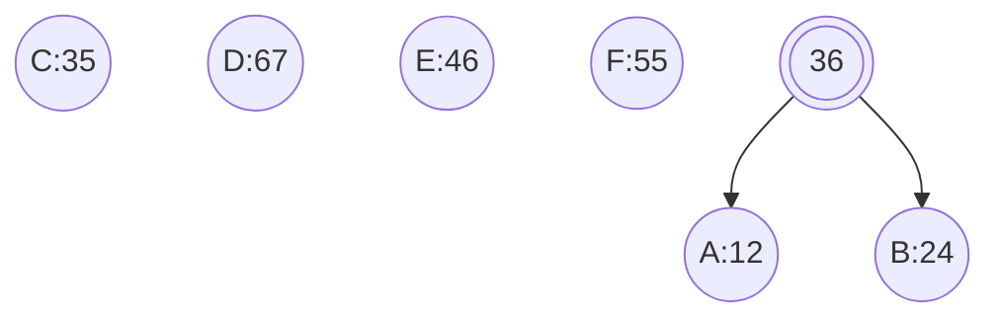

(2) 选择节点$C$与节点$36$合并, 产生节点$71$

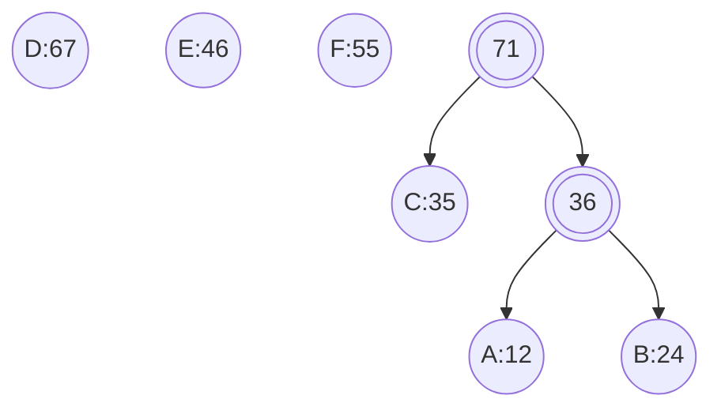

(3) 选择节点$E、F$合并, 产生节点$101$

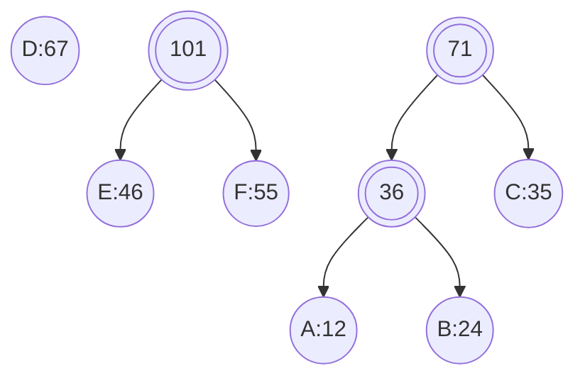

(4) 选择节点$D$与节点$71$合并, 产生节点$138$

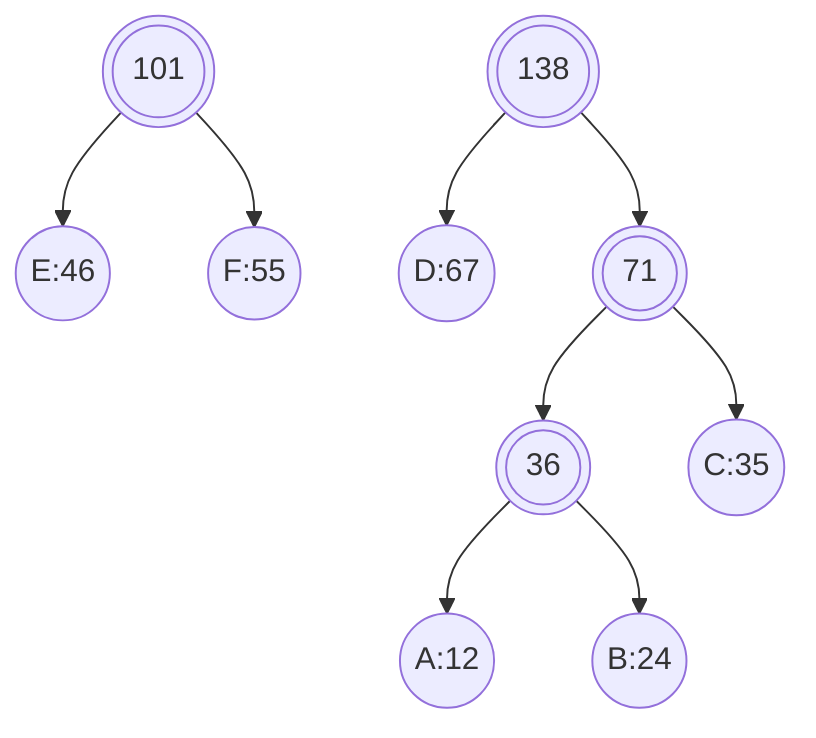

(5) 合并节点$101$与$138$, 完成构建

对建好哈夫曼树, 所有节点左儿子编为 $0$, 右儿子编为 $1$, 从根节点走到叶子节点实现编码

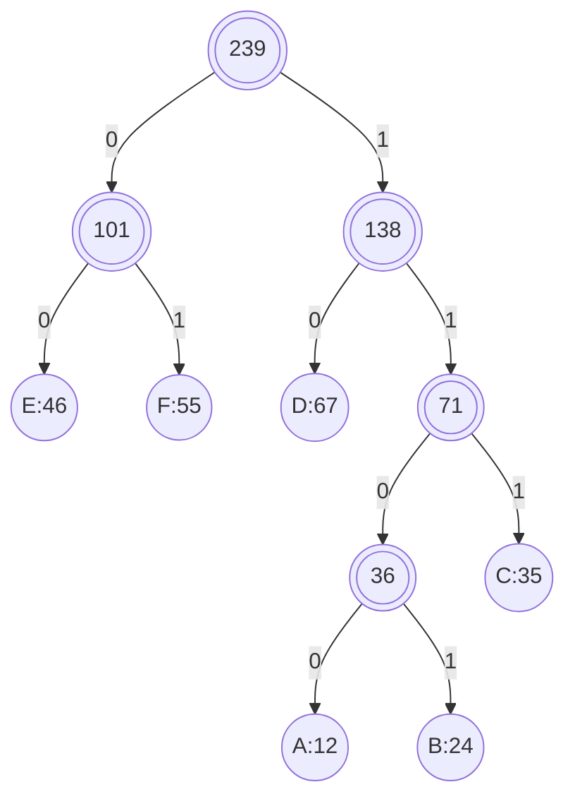

### 实现

```c++
#include <iostream>
#include <utility>
#include <vector>
#include <memory>
#include <queue>
#include <map>

template<typename NodeType, typename WeightType>
struct Node {
    NodeType              mName;
    WeightType            mFrequency;
    std::shared_ptr<Node> mLeftChild;
    std::shared_ptr<Node> mRightChild;

    Node(NodeType name, WeightType freq, std::shared_ptr<Node> left, std::shared_ptr<Node> right) :
        mName(name), mFrequency(freq), mLeftChild(std::move(left)), mRightChild(std::move(right)) {}
};


template<typename NodeType, typename WeightType>
class HuffmanTree {
public:
    using NodePtr = std::shared_ptr<Node<NodeType, WeightType>>;

    explicit HuffmanTree(std::map<NodeType, WeightType>& table) {
        auto Compare = [](NodePtr node1, NodePtr node2) {return node1->mFrequency > node2->mFrequency; };
        std::priority_queue<NodePtr, std::vector<NodePtr>, decltype(Compare)> minHeap(Compare);

        for (auto it = table.begin(); it != table.end(); ++it) {
            minHeap.push(std::make_shared<Node<NodeType, WeightType>>(it->first, it->second, nullptr, nullptr));
        }

        while (minHeap.size() > 1) {
            NodePtr left = minHeap.top();
            minHeap.pop();
            NodePtr right = minHeap.top();
            minHeap.pop();
            minHeap.push(std::make_shared<Node<NodeType, WeightType>>('\0', left->mFrequency + right->mFrequency, left, right));
        }
        NodePtr root = minHeap.top();
        BuildCodes(root, "");
    }

    ~HuffmanTree() = default;

    void BuildCodes(const NodePtr& node, const std::string& code) {
        if (!node) {
            return;
        }
        if (node->mLeftChild == nullptr && node->mRightChild == nullptr) {
            mCodeTable[node->mName] = code;
        }
        BuildCodes(node->mLeftChild, code + "0");
        BuildCodes(node->mRightChild, code + "1");
    }

    void PrintCodeTable() const {
        for (auto it = mCodeTable.begin(); it != mCodeTable.end(); ++it) {
            std::cout << it->first << ": " << it->second << std::endl;
        }
    }

private:
    std::map<NodeType, std::string> mCodeTable;
};

int main() {
    std::map<char, int> table = {
        {'A', 12}, {'B', 24}, {'C', 35},
        {'D', 67}, {'E', 46}, {'F', 55}
    };

    HuffmanTree<char, int> tree(table);
    tree.PrintCodeTable();
   
    return 0;
}
```

## 堆

### 定义

堆通常是一个可以被看做一棵树的数组对象, 堆总是一棵完全二叉树[^1]

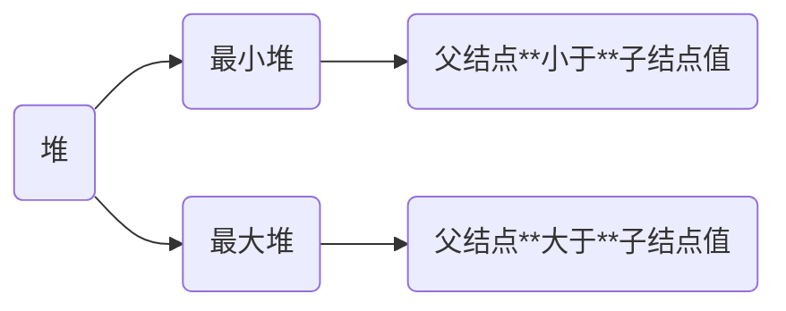

### 性质

```c
a[] = {61, 41, 30, 28, 16, 22, 13, 19, 17, 15}
```

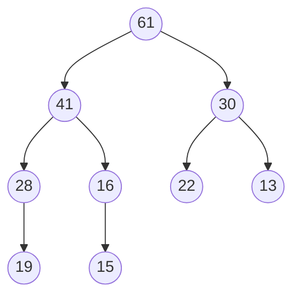

- 第 $i$ 个父节点下标为 $(i - 1)/2$

- 左儿子下标为 $2 * i + 1$

- 右儿子下标为 $2 * i + 2$

如父节点 $28$, 其下标为 $3$, 左儿子 $19$ 的下标为 $7$, 右儿子 $17$ 下标为 $8$

### 堆排序

```c++
// 调整为最小堆
// start, end表示待建堆区间
template<typename T>
void siftDown(std::vector<T> &v, const int start, const int end) {
    int parent = start;
    int child = 2 * parent + 1;
    // temp暂存子树根节点
    int temp = v[parent];
    // 若左儿子编号未到终点
    while (child < end) {
        // 若右儿子比左儿子小
        if (child + 1 < end && v[child] < v[child + 1]) {
            // child变为右儿子
            child++;
        }
        // 若根节点比儿子节点小, 则不需要调整
        if (temp >= v[child]) {
            break;
        }
        // 否则需调整儿子和双亲的位置
        v[parent] =  v[child];
        // 儿子上移变为双亲
        parent = child;
        child = 2 * child + 1;
    }
    v[parent] = temp;
}

// 堆排序函数
template<typename T>
void heapSort(vector<T> &v) {
    int size = v.size();
    for (int i =  (size - 2) / 2; i >= 0; i-- ) {
        // 建立一个小根堆
        siftDown(v, i, size);
    }
    for (int i = size - 1; i > 0; i--) {
        // 交换根和最后一个元素,
        std::swap(v[0], v[i]);
        siftDown(v, 0, i);
    }
}
```

[^1]: 若二叉树中除去最后一层节点为满二叉树, 且最后一层的结点依次从左到右分布, 则此二叉树被称为完全二叉树