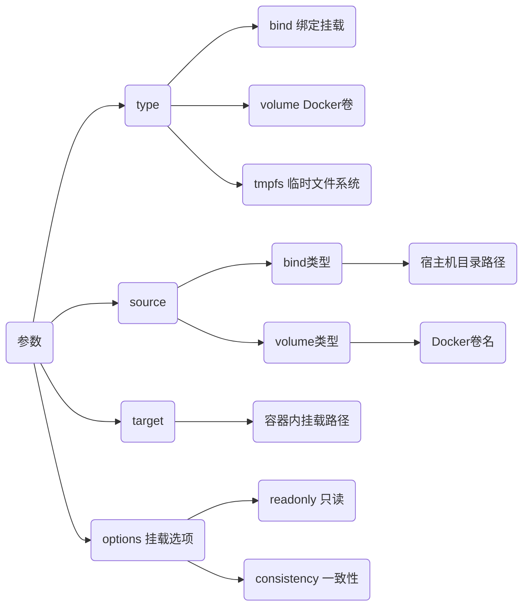
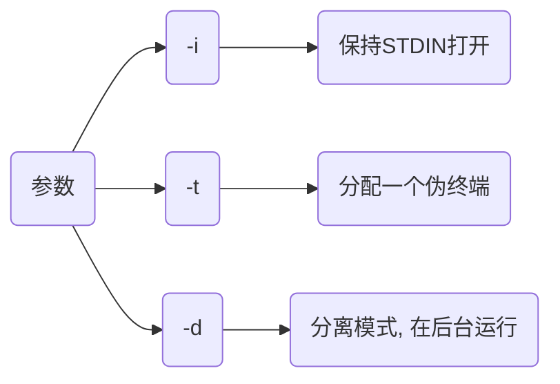

> 参考
>
> - [docker命令大全](https://www.runoob.com/docker/docker-command-manual.html)

## 生命周期管理

### run

创建并启动新容器, 可选择启动参数

```sh
docker run (启动参数) 镜像名
```

启动参数如下

#### -itd

| 参数 | 含义                         |
| ---- | ---------------------------- |
| `-i` | 以交互模式运行容器           |
| `-t` | 为容器重新分配一个伪输入终端 |
| `-d` | 后台运行并返回容器ID         |

- 示例, 交互模式启动容器, 分配终端后台运行

```sh
docker run -itd --rm alpine
```

示例输出

```sh
0d0be4d9d8......
```

#### --name

给容器命名

```sh
--name=容器名
```

- 示例, 命名新建容器box1

```sh
docker run -itd --rm --name=box1 busybox
```

使用`docker ps`查看, 示例输出

```sh
CONTAINER ID   IMAGE     COMMAND   CREATED        STATUS        PORTS   NAMES
c07bd71388a9   busybox   "sh"      3 seconds ago  Up 3 seconds          box1
```

#### -p/--publish

将容器内部端口映射到宿主机端口, 允许外部网络访问容器内部

````sh
-p 主机端口:容器端口
````

- 示例, 将主机9999端口映射至容器80端口

```sh
docker run -itd -p 7890:80 nginx
```

#### --net

指定容器网络连接类型

```sh
--net 网络类型
```

支持 `bridge`(默认), `host`, `none`, `container` 四种类型

#### -e/--env

设置容器环境变量

```sh
-e 名称=值
```

- 示例, 设置mysql用户密码

```sh
docker run -it --rm -e MYSQL_ROOT_PASSWORD=123 mysql:5.6
```

- 示例, 设置容器中环境变量值

```sh
docker run -it --rm -e TEST_VEN=abcdefg busybox
```

执行后容器内就存在该环境变量

#### -v(--volume)

挂载本地目录或卷到容器内, 指定路径不存在时docker会自动创建

```sh
-v 宿主机目录路径:容器目录路径:(可选挂载选项, ro为只读, 默认rw读写权限)
```

- 示例, 挂载本地code目录到容器/master/code

```sh
docker run -it --rm -v ./code:/master/code busybox
```

#### --mount

挂载本地绝对路径目录到容器中, docker 17.06 版本引入

需指定挂载类型(如 `bind`、`volume`、`tmpfs`)

```sh
--mount type=挂载类型,source=挂载源,target=容器内挂载路径,(options)
```



- 示例, 将本地${HOME}/code/挂载到容器/code目录下, 权限为只读

```sh
docker run -it --rm --mount type=bind,source="${HOME}/code/",target="/code/",readonly busybox
```

若在容器内删除code/, 则报错

```sh
rm: can't remove .... Read-only file system
```

#### --restart

设置容器重启策略

`-restart=always` 使得容器在退出时总是重启

#### --privileged

给予容器内进程几乎与宿主机root用户等同的权限

#### --rm

容器退出后自动删除容器和其中文件系统

- 示例, 创建容器, 退出后自动删除

```sh
docker -it --rm busybox
```

### start/stop/restart

启动、停止和重启容器

#### start

```sh
docker start 容器名/ID
```

#### stop

```sh
docker stop 容器名/ID
```

### kill

立即终止一或多个正在运行容器

```sh
docker kill 容器名/ID
```

### rm

删除一或多个已经停止容器

#### 正常删除

```sh
docker rm 容器名/ID
```

##### 强制删除

```sh
docker rm -f 容器名/ID
```

#### 批量删除

##### 删除所有容器

```sh
docker rm $(docker ps -aq)
```

##### 先停用删除

```sh
docker stop $(docker ps -aq) && docker rm $(docker ps -aq)
```

##### 删除异常容器

```sh
docker rm $(docker ps -a | grep Exited | awk '{print $1}')
```

### pause/unpause

暂停和恢复容器中所有进程

### exec

在运行中容器内执行命令

```sh
docker exec (参数) 镜名/ID 命令
```



- 示例, busybox创建的容器中创建self_test/, 再使用ls -la查看

```sh
docker run -itd --name=box busybox

docker exec -it box mkdir self_test

docker exec -it box ls -la
```

宿主机终端类似有如下输出

```sh
total 52
drwxr-xr-x    1 root     root          4096 Feb  5 01:25 .
drwxr-xr-x    1 root     root          4096 Feb  5 01:25 ..
......
drwxr-xr-x    2 root     root          4096 Feb  5 01:25 self_test
dr-xr-xr-x   13 root     root             0 Feb  5 01:25 sys
......
```

#### 进入容器

```sh
docker exec -it 容器名/ID shell解释器
```

#### 执行多指令

```sh
docker exec (参数) 容器名/ID shell解释器 -c '命令1 && 命令2'
```

- 示例, ubuntu安装mysql-clinet

```sh
docker run -itd --name=ubuntu_test ubuntu:18.04

docker exec -it ubuntu_test bash -c 'apt-get update && apt-get install -y mysql-client'
```

### rename

重命名容器

```sh
docker rename 原名称 新名称
```

## 操作

### ps

列出容器

```sh
docker ps (-a, 所有容器)
```

终端输出如下类似格式内容, 第一列哈希值表示容器ID

```sh
CONTAINER ID   IMAGE     COMMAND   CREATED              STATUS              PORTS     NAMES
9cdec889bc9e   busybox   "sh"      About a minute ago   Up About a minute             box
```

### inspect

获取docker对象(容器、镜像、卷、网络等)详细信息

#### IP地址

```sh
docker inspect 容器名/ID | grep IPAddress
```

#### 获取容器ID

```sh
$(docker ps | grep "容器名" | awk '{print $1}')

# 或者
$(docker ps -aqf "name=容器名")
```

| 参数 | 说明                   |
| ---- | ---------------------- |
| a    | 即使容器没运行也能获取 |
| q    | 仅输出容器ID           |
| f    | filter                 |

### export/import

#### 打包容器

```sh
docker export 容器名/ID:tag 压缩包
```

#### 加载容器

```sh
docker import 压缩包 容器名/ID:tag
```

## 文件系统

### cp

用于宿主机与容器之间文件拷贝

#### 宿主机拷贝到容器

```sh
docker cp 宿主机路径 容器名/ID:容器内路径
```

- 示例, 拷贝宿主机test/到容器5d6根目录下

```sh
docker cp test/ 5d6:/
```

#### 容器拷贝到宿主机

```sh
docker cp 容器名/ID:容器内路径 宿主机路径
```

- 示例, 拷贝容器5d6的dev/到宿主机当前路径下

```sh
docker cp 5d6:/dev .
```

### commit

将指定容器提交为镜像

```sh
docker commit -a (作者信息) -m (提交信息) 容器名/ID 目标镜像名:(tag)
```

- 示例, 将容器bdfb176f914a提交为镜像self_image:v0.1

```sh
docker commit bdfb176f914a self_image:v0.1
```

### diff

显示docker容器文件系统变更

## docker-compose

docker compose是一个工具, 用于定义和运行多容器docker应用程序

### 安装

下载对应docker-compose二进制文件, 移动到`/usr/local/bin/`

### 创建

- 示例, 创建docker-compose.yml

```yml
version: '3.8'
services:
    web:
        image: nginx:latest
        ports:
            - "80:80"
        volumes:
            - ./nginx.conf:/etc/nginx/nginx.conf
    app:
        image: node:12
        working_dir: /app
        volumes:
            - .:/app
        command: npm start
        depends_on:
            - web
```

web服务使用nginx镜像, 映射主机80端口到容器80端口, 挂载本地nginx.conf到容器中配置目录

app服务使用Node.js镜像, 设置工作目录/app, 挂载当前目录到容器中, 执行npm start

app服务依赖于web服务启动

### 命令

#### 启动应用程序

在docker-compose.yml文件当前目录执行

```sh
docker-compose up -d
```

以后台模式启动所有服务

#### 查看服务状态

```sh
docker-compose ps
```

#### 停止服务

```sh
docker-compose stop
```

#### 重启服务

```sh
docker-compose restart
```

#### 构建

使用自定义Dockerfile构建镜像

```sh
docker-compose build
```

#### 删除应用程序

```sh
docker-compose rm
```

#### 查看日志

```sh
docker-compose logs
```

#### 服务执行命令

```sh
docker-compose exec 服务名称 命令
```

#### 删除

停止移除所有容器、网络和卷

```sh
docker-compose down
```
