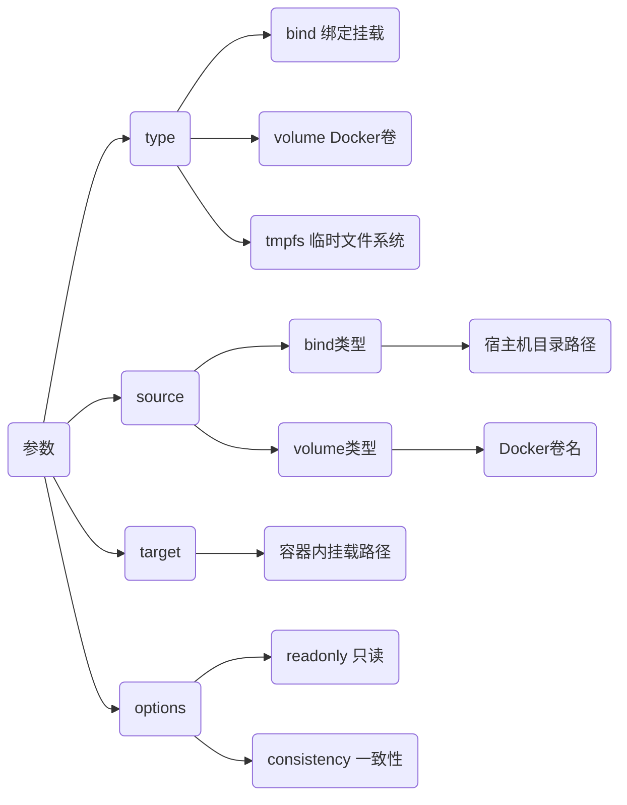
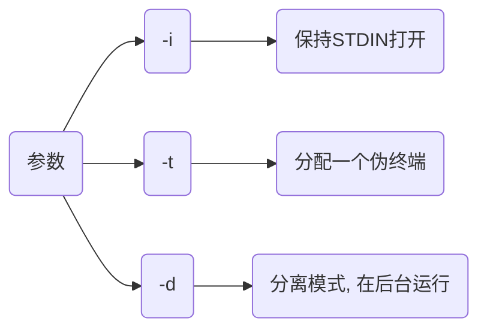

> 参考文献
>
> - [docker命令大全](https://www.runoob.com/docker/docker-command-manual.html)

## 容器生命周期管理

### run

创建并启动新容器, 可选择启动参数

```sh
docker run (启动参数) 镜像名 [COMMAND] [ARG...]
```

#### 核心运行模式

| 参数 | 含义                                  | 适用场景
| ---- | ------------------------------------ |---------------------------------------
| `-i` | 保持标准输入(STDIN)打开              | 需要与容器进行交互输入
| `-t` | 分配一个伪终端(TTY)                  | 需要终端界面(如进入 shell)
| `-d` | 后台运行(Detached mode), 返回容器 ID | 运行 Web 服务、数据库等长期驻留后台的服务
|`--rm`| 容器退出后自动删除容器及其匿名卷        | 运行一次性任务、测试命令, 避免产生垃圾容器

> 💡 提示
> -it 通常组合使用于前台交互(如 docker run -it ubuntu bash)
> -d 用于后台运行, 尽量避免 -itd 混用, 除非你明确需要在后台保留 TTY 分配

- 示例, 交互模式启动容器, 分配终端后台运行

```sh
docker run -itd --rm alpine
```

示例输出

```sh
0d0be4d9d8......
```

#### 基础配置参数

- `--name` 为容器指定一个自定义名称(不指定则随机生成)

```sh
docker run -d --name my-nginx nginx
```

使用`docker ps`查看, 示例输出

```sh
CONTAINER ID   IMAGE     COMMAND   CREATED        STATUS        PORTS   NAMES
c07bd71388a9   nginx     "sh"      3 seconds ago  Up 3 seconds          my-nginx
```

- `-e`/`--env` 设置环境变量, 支持直接赋值或从文件读取

```sh
# 直接赋值
docker run -d -e MYSQL_ROOT_PASSWORD=secret mysql:8.0
# 从文件读取 (新增)
docker run -d --env-file ./env.list my-app
```

- `--restart`

设置容器重启策略

`-restart=always` 使得容器在退出时总是重启

- `--privileged`

给予容器内进程几乎与宿主机`root`用户等同的权限

#### 网络与端口映射

- `-p`/`--publish`

将容器内部端口映射到宿主机端口, 允许外部网络访问容器内部

````sh
-p 主机端口:容器端口
````

示例, 将主机9999端口映射至容器80端口

```sh
docker run -itd -p 9999:80 nginx
```

- `--net` / `--network` 指定容器连接的网络(如 bridge, host, none 或自定义网络)

#### 数据持久化(挂载)

- `-v`(`--volume`)

挂载本地目录或卷到容器内, 指定路径不存在时docker会自动创建, 用于日常开发、简单的目录映射

```sh
-v 宿主机目录路径:容器目录路径:(可选挂载选项, ro为只读, 默认rw读写权限)
```

示例, 挂载本地`code/`到容器`/master/code`

```sh
docker run -it --rm -v ./code:/master/code busybox
```

- `--mount`

挂载本地绝对路径目录到容器中, 需指定挂载类型(如 `bind`、`volume`、`tmpfs`), 不会自动创建不存在的宿主机目录, 用于生产环境、需要严格控制权限和类型的场景

```sh
--mount type=挂载类型,source=挂载源,target=容器内挂载路径,(options)
```


```mermaid
graph LR;
    P(参数)

    P-->Type(type)
        Type-->Type1(bind 绑定挂载)
        Type-->Type2(volume Docker卷)
        Type--> Type3(tmpfs 临时文件系统)

    P-->Source(source)
        Source-->Source1(bind类型)-->Source11(宿主机目录路径)
        Source-->Source2(volume类型)-->Source21(Docker卷名)

    P-->Target(target)-->Target1(容器内挂载路径)
    
    P-->Options(options)
        Options-->Options1(readonly 只读)
        Options-->Options2(consistency 一致性)
```

将本地`${HOME}/code/`挂载到容器`/code`下, 权限为只读

```sh
docker run -it --rm --mount type=bind,source="${HOME}/code/",target="/code/",readonly busybox
```

若在容器内删除`/code`, 则报错

```sh
rm: can't remove .... Read-only file system
```

#### 资源限制 (新增补充)

- `--memory` / `-m`

限制内存使用量(如 512m, 1g)

- `--cpus`

限制 CPU 使用核数(如 1.5 表示 1.5 个核心)

```sh
docker run -d -m 512m --cpus 1.0 my-app
```

## 状态控制

### start/stop/restart

启动、停止和重启容器

#### start

```sh
docker start 容器名/ID
```

#### stop

优雅停止容器(发送 SIGTERM, 超时后 SIGKILL)

```sh
docker stop 容器名/ID
```

### kill

立即终止一或多个正在运行容器

```sh
docker kill 容器名/ID
```

### pause/unpause

暂停和恢复容器中所有进程

### rename

重命名容器

```sh
docker rename 原名称 新名称
```

## 删除与清理 

### rm

删除一或多个已经停止容器

#### 正常删除

```sh
docker rm 容器名/ID
```

- 强制删除

```sh
docker rm -f 容器名/ID
```

#### 批量删除

- 删除所有容器

```sh
docker rm $(docker ps -aq)
```

- 先停用删除

```sh
docker stop $(docker ps -aq) && docker rm $(docker ps -aq)
```

- 删除异常容器

```sh
docker rm $(docker ps -a | grep Exited | awk '{print $1}')
```

## 日常操作与监控

### ps

列出容器运行状态

```sh
docker ps (-a, 所有容器)
```

终端输出如下类似格式内容, 第一列哈希值表示容器ID

```sh
CONTAINER ID   IMAGE     COMMAND   CREATED              STATUS              PORTS     NAMES
9cdec889bc9e   busybox   "sh"      About a minute ago   Up About a minute             box
```

### logs

查看日志, 排查容器问题的最重要命令

```sh
# 查看完整日志
docker logs my-nginx

# 实时追踪日志输出 (类似 tail -f)
docker logs -f my-nginx

# 查看最后 100 行日志, 并显示时间戳
docker logs --tail 100 -t my-nginx
```

### exec

在正在运行的容器内执行命令, 强烈推荐使用 exec, 因为 exec 退出时不会导致容器停止

```sh
docker exec (参数) 镜名/ID 命令
```


```mermaid
graph LR;
    P(参数)
    P-->I("-i")-->I1(保持STDIN打开)
    P-->T("-t")-->T1(分配一个伪终端)
    P-->D("-d")-->D1(分离模式, 在后台运行)
```

在busybox创建容器中创建`self_test/`, 再使用`ls -la`查看

```sh
docker run -itd --name=box busybox

docker exec -it box mkdir self_test

docker exec -it box ls -la
```

宿主机终端类似有如下输出

```sh
total 52
drwxr-xr-x    1 root     root          4096 Feb  5 01:25 .
drwxr-xr-x    1 root     root          4096 Feb  5 01:25 ..
......
drwxr-xr-x    2 root     root          4096 Feb  5 01:25 self_test
dr-xr-xr-x   13 root     root             0 Feb  5 01:25 sys
......
```

#### 进入容器

```sh
docker exec -it 容器名/ID shell解释器
```

#### 执行多指令

```sh
docker exec (参数) 容器名/ID shell解释器 -c '命令1 && 命令2'
```

- 示例, ubuntu安装mysql-clinet

```sh
docker run -itd --name=ubuntu_test ubuntu:18.04

docker exec -it ubuntu_test bash -c 'apt-get update && apt-get install -y mysql-client'
```

### inspect

获取docker对象(容器、镜像、卷、网络等)详细信息

#### IP地址

```sh
docker inspect 容器名/ID | grep IPAddress
```

#### 获取容器ID

```sh
$(docker ps | grep "容器名" | awk '{print $1}')

# 或者
$(docker ps -aqf "name=容器名")
```

| 参数 | 说明                  |
| ---- | -------------------- |
| `a`  | 即使容器没运行也能获取 |
| `q`  | 仅输出容器ID          |
| `f`  | filter               |

### export/import

#### 打包容器

```sh
docker export 容器名/ID:tag 压缩包
```

#### 加载容器

```sh
docker import 压缩包 容器名/ID:tag
```

## 文件系统

### cp

用于宿主机与容器之间文件拷贝

#### 宿主机拷贝到容器

```sh
docker cp 宿主机路径 容器名/ID:容器内路径
```

- 示例, 拷贝宿主机`test/`到容器5d6根目录下

```sh
docker cp test/ 5d6:/
```

#### 容器拷贝到宿主机

```sh
docker cp 容器名/ID:容器内路径 宿主机路径
```

- 示例, 拷贝容器5d6的`dev/`到宿主机当前路径下

```sh
docker cp 5d6:/dev .
```

### commit

将指定容器提交为镜像

```sh
docker commit -a (作者信息) -m (提交信息) 容器名/ID 目标镜像名:(tag)
```

- 示例, 将容器bdfb176f914a提交为镜像self_image:v0.1

```sh
docker commit bdfb176f914a self_image:v0.1
```

### diff

显示`docker`容器文件系统变更

## docker-compose 多容器编排

`docker compose`是一个工具, 用于定义和运行多容器docker应用程序

### 安装

下载对应`docker-compose`二进制文件, 移动到`/usr/local/bin/`

- 示例, 创建`docker-compose.yml`

```yml
version: "3.8" # V2 中 version 字段已可选, 但保留以兼容旧习惯
services:
  web:
    image: nginx:latest
    ports:
      - "8080:80"
    volumes:
      - ./nginx.conf:/etc/nginx/nginx.conf:ro
    restart: always
    depends_on:
      - app

  app:
    image: node:18-alpine
    working_dir: /app
    volumes:
      - .:/app
    command: sh -c "npm install && npm start"
    environment:
      - NODE_ENV=production
```

`web`服务使用`nginx`镜像, 映射主机80端口到容器80端口, 挂载本地`nginx.conf`到容器中配置目录

`app`服务使用`node.js`镜像, 设置工作目录`/app`, 挂载当前目录到容器中, 执行`npm start`

`app`服务依赖于`web`服务启动

### 命令

#### 启动应用程序

在`docker-compose.yml`文件当前目录执行

```sh
docker-compose up -d
```

以后台模式启动所有服务

#### 查看服务状态

```sh
docker-compose ps
```

#### 停止服务

```sh
docker-compose stop
```

#### 重启服务

```sh
docker-compose restart
```

#### 构建

使用自定义`Dockerfile`构建镜像

```sh
docker-compose build
```

#### 删除应用程序

```sh
docker-compose rm
```

#### 查看日志

```sh
docker-compose logs
```

#### 服务执行命令

```sh
docker-compose exec 服务名称 命令
```

#### 删除

停止移除所有容器、网络和卷

```sh
docker-compose down
```
