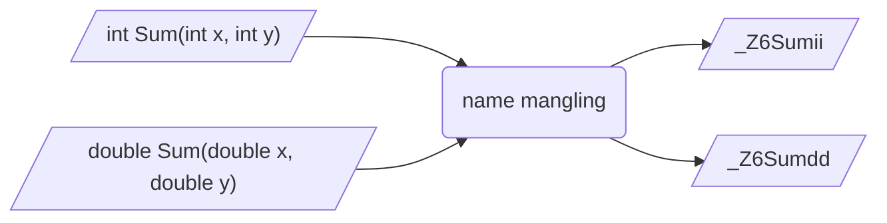

## 概念

C++为支持函数重载、命名空间、类、模板等特性, 存在`name mangling`(命名修饰)机制

例如对于函数重载, C++编译器会在编译阶段通过添加参数类型、参数个数等额外信息对函数重命名, 生成唯一符号, 以区分同名函数

- 示例, C++中同名函数经过C++`name mangling`后生成唯一修饰名



## 符号处理

函数和变量在本质上都是地址助记符, 在链接过程中称为`symbol`(符号)

链接阶段, 链接器会按照符号名来解析不同目标文件和库文件中所引用符号, 以正确区分和链接函数

### C语言

C语言无`name mangling`机制, 每个函数名称必须唯一, 链接器可直接使用名称解析符号

- 示例, C语言生成目标文件

```c
// c_module.h
#include <stdio.h>

int AddNum(int x, int y);
void PrintValue(double num);
```

```c
// c_module.c
#include "c_module.h"

int AddNum(int x, int y) {
    return x + y;
}

void PrintValue(double num) {
    printf("res = %f\n", num);
}
```

符号表中函数符号名称与源代码中一致


#### 错误情况

- 示例, 函数同名情况

```c
#include <stdio.h>

int Add(int x) {
    return x + 1;
}

double Add(double x) {
    return x + 0.1;
}
```

编译时报错定义类型冲突


C语言编译器不会对函数名增加任何处理, 因此函数名必须唯一

### C++

#### 普通函数

- 示例, C++源文件中存在普通函数

```c
// test.hpp
#include <iostream>

void Test();

int Sub(int x, int y);
```

```c
// test.cpp
#include "test.hpp"

void Test() {
    std::cout << "Test" << std::endl;
}

int Sub(int x, int y) {
    return x - y;
}
```

C++编译器会对cpp文件中所有函数都进行`name mangling`


#### 函数重载(overload)

- 示例, C++源文件中存在同名函数

```c
// cpp_module.hpp
#include <iostream>

int AddNum(int x, int y);
double AddNum(double x, double y);

void PrintValue(int num);
void PrintValue(double num);
```

```c
// cpp_module.cpp
#include "cpp_module.hpp"

int AddNum(int x, int y) {
    return x + y;
}

double AddNum(double x, double y) {
    return x + y;
}

void PrintValue(int num) {
    printf("int = %d\n", num);
}

void PrintValue(double num) {
    printf("double = %f\n", num);
}
```

符号表中函数符号被完全修改变为唯一名称与函数名不同


C++编译器通过`name mangling`机制, 对于同名函数, 只要参数类型、参数个数或返回值类型不一致也可通过编译

### C/C++混合

#### 同步编译

- 示例, 使用C++编译器同步编译.c、.cpp

```c
// c_test.h
#include <stdio.h>

void Test();

int Sub(int x, int y);
```

```c
// c_test.c
#include "c_test.h"

void Test() {
    printf("Test\n");
}

int Sub(int x, int y) {
    return x - y;
}
```

```c
// main.cpp
#include "c_test.h"
#include <iostream>

int main() {
    Test();
    return 0;
}
```

由下图可知, 只要使用C++编译器, 对源文件内函数名都会执行`name mangling`


#### 模块链接

C语言模块与C++模块链接过程中可能会出现符号未定义错误

- 示例, C语言模块与C++模块链接

```c
// math_module.h
#include <stdio.h>

int Add(int x, int y);
double GetSquareArea(double length);
```

```c
// math_module.c
#include "math_module.h"

int Add(int x, int y) {
    return x + y;
}

double GetSquareArea(double length) {
    return length * length;
}
```

```cpp
// main.cpp
#include "math_module.h"
#include <iostream>

int main() {
    int res = Add(1, 2);
    double area = GetSquareArea(3.74);
    std::cout << "Add = " << res << std::endl;
    std::cout << "SquareArea = " << area << std::endl;
    return 0;
}
```

#### 未定义错误

(1) 用C语言编译器将math_module.c生成 `math_module.o`

(2) 使用C++编译器将main.cpp生成目标文件 `main.o`

(3) 链接 `math_module.o`、`main.o` 为可执行文件, 出现符号未定义错误

(4) 符号表中发现同函数名出现两个不同符号


##### 原因分析

(1) main.cpp 预处理时, 内容展开

```diff
+ #include <stdio.h>
+ int Add(int x, int y);
+ double GetSquareArea(double length);

#include<iostream>

int main() {
    int res = Add(1, 2);
    double area = GetSquareArea(3.74);
    std::cout << "Add = " << res << std::endl;
    std::cout << "SquareArea = " << area << std::endl;
    return 0;
}
```

生成main.o时, C++编译器对main.cpp中两个原本C语言函数名`Add`、`GetSquareArea`进行`name mangling`, 生成新名`_Z3Addii`、`_Z13GetSquareAread`

(2) `math_module.o` 由C编译器编译生成, 没有`name mangling`机制, 函数名未改变

(3) 链接时`main.o`按`_Z3Addii` 符号名到各模块查找函数引用, 结果`math_module.o`里符号名是`Add`、`GetSquareArea`, 无法匹配, 自然出现函数未定义错误

这种情况需通过`extern "C"`处理

## extern "C"

C++编译器中提供 `extern "C"`/ `extern "C" {}` 机制, 表示其后续或作用域内函数屏蔽`name mangling`机制, 按C语言风格处理, 保持原本名称

通常用于C++代码中调用C语言动态库, 以及C语言调用C++动态库时处理

### 语法

#### 作用函数

函数名前添加`extern "C"`, 表示使用C++编译器时该函数均按C语言规则编译, 不进行`name mangling`

```c
extern "C" 函数声明
```

#### 作用代码块

`extern "C" {}`表示代码块内所有函数均调用`extern "C"`

```c
extern "C" {
    void Func1();
    void Func2();
    ...
}
```

#### 仅C++编译时使用

预处理宏`__cplusplus`仅在C++编译器中定义, 可通过该宏判断代码是否被C++编译器编译

- 示例, 仅在代码被C++编译器编译时, 对函数添加`extern "C"`

```c++
#if __cplusplus
extern "C" {
#endif
    void Func1();
    void Func2();
#if __cplusplus
}
#endif
```

### 特点

#### 作用对象

`extern "C"` 只能用于函数和全局变量声明, 不能用于类成员或模板

#### 特性

`extern "C"` 修饰函数内不能出现C++所有特性

### 应用

#### C++调用C语言动态库

- 示例, 处理模块链接错误

修改main.cpp, 对于所引用C语言头文件使用`extern "C" {}`包裹

```c++
extern "C" {
    #include "math_module.h"
}

#include <iostream>

int main() {
    int res = Add(1, 2);
    double area = GetSquareArea(3.74);
    std::cout << "Add = " << res << std::endl;
    std::cout << "SquareArea = " << area << std::endl;
    return 0;
}
```

main.cpp预处理时展开

```c++
extern "C" {
    #include <stdio.h>

    int Add(int x, int y);
    double GetSquareArea(double length);
}

#include <iostream>

int main() {
    int res = Add(1, 2);
    double area = GetSquareArea(3.74);
    std::cout << "Add = " << res << std::endl;
    std::cout << "SquareArea = " << area << std::endl;
    return 0;
}
```

因`extren C ""`机制, main.cpp中两个函数名编译时不受`name mangling`影响, 依然保持原名称, 和math_module.o中符号一致


链接错误问题解决

#### C语言调用C++动态库

C++动态库若要被C语言调用, 需要在导出函数名前添加`extern "C"` 或用 `extern "C" {}`包裹, 否则C语言无法识别`name mangling`后函数名