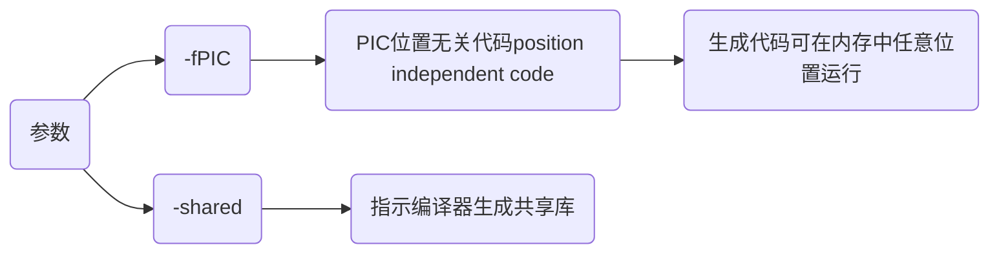
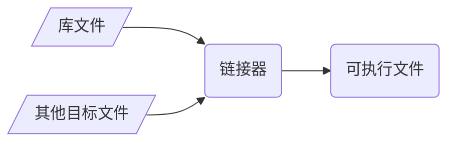

## 概念

动态库(`dynamic library`)是一种库文件, 包含可以多个程序同时所使用代码和数据, 在程序运行时被加载到内存中

动态库在windows与类unix操作系统中分别以动态库链接库(`dynamic link library`, 简称`DLL`)与共享对象文件(`shared object file`)两种方式实现

### 对比

动态链接库和共享对象文件概念上相似, 都是用于实现代码和数据共享, 允许程序在运行时加载, 而不是在编译时静态地链接到库

两者分别属于不同操作系统平台, 具体实现和文件格式有所不同, 在概念上等价

#### 动态链接库

动态链接库(`DLL`)是windows操作系统中动态库实现方式, 库文件以`.dll`作为扩展名

当程序加载`DLL`时, 并不会将DLL整个内容复制到地址空间中, 而是仅在需要时引用DLL中函数或数据

#### 共享对象文件

共享对象文件是类unix操作系统(如linux、macOS等)中动态库实现方式, 以`.so`作为扩展名

### 特点

#### 运行时加载(runtime loading)

程序使用动态库中时, 编译阶段只会生成对库中函数引用信息, 不会将函数实现包含在程序中

链接阶段, 链接器会将引用信息解析为动态库中符号, 不会将动态库内容复制到程序中

程序执行, 到需要使用动态库中函数时, 操作系统会根据程序中引用信息和动态库路径信息, 将动态库加载到内存中

加载过程中, 操作系统会解析动态库中符号表, 并将程序中引用信息与动态库中的函数实现进行链接, 加载完成后程序就可以像调用静态库中函数一样调用动态库中函数

#### 共享性

多程序可共享同个动态库, 共享内存中相同代码, 减少资源占用

#### 版本控制

动态库可单独更新, 若功能更改只需替换库文件, 而不必重新编译所有相关程序

#### 支持多语言

动态库通常可被多种编程语言调用, 可在不同开发环境中灵活使用

## 开发

### 特性

在创建C和C++动态库时有一些关键特性

#### name mangling(命名修饰)

##### 概念

C++编译器为支持函数重载, 存在`name mangling`(命名修饰)机制, 编译时会对所有函数名进行修改生成唯一函数名

C语言并无命名修饰机制, 编译时函数名不变

##### 问题

如果C程序直接调用C++所生成动态库会导致连接器无法找到正确符号, 产生链接错误

```c++
extern "C" {
    void Func();
}
```

C++提供`extern "C"`/`extern "C" {}`接口, 规定其后续或范围内函数名编译时屏蔽`name mangling`, 按照C语言规则生成函数名

##### 特点

`extern "C"` 只能用于函数和全局变量声明, 不能用于类成员或模板

`extern "C"` 修饰函数内不能出现C++所有特性

#### export symbol(导出符号)

为将函数从动态库中导出被其他程序调用, 需在函数前添加导出符号

若没有正确导出符号, 动态库中函数、变量或对象将无法被其他程序或库调用, 引发链接错误

```c++
#if defined(_WIN32)
    #define __EXPORT __declspec(dllexport)
#elif defined(__linux__)
    #define __EXPORT __attribute__((visibility("default")))
#endif

// 添加导出符号
__EXPORT void Hello();
```

### 编写

将`.c/.cpp`文件按规则编译成`.so/.dll`格式库文件


- 示例, 将生成动态库, 提供接口函数`Add`、`Print`

```c++
// test_api.h
#ifndef __INCLUDE_TEST_API_H__
#define __INCLUDE_TEST_API_H__

#include <stdio.h>

// 定义导出符号
#if defined(_WIN32)
    #define __EXPORT __declspec(dllexport)
#elif defined(__linux__)
    #define __EXPORT __attribute__((visibility("default")))
#endif

// 导出接口函数
__EXPORT int Add(int x, int y);
__EXPORT void Print();

#endif // __INCLUDE_TEST_API_H__
```

```c++
// test_api.c
#include "test_api.h"

int Add(int x, int y) {
    return x + y;
}

void Print() {
    printf("Hello World\n");
}
```

#### 生成

##### 编译器

调用编译器指令生成动态库

```sh
clang 源文件 -fPIC -shared -o 库文件名
```



- 示例, 生成库libtest_api.so

```sh
clang test_api.c -fPIC -shared -o libtest_api.so
```


##### cmake

使用cmake等构建工具生成动态库

- 示例, 使用cmake生成

```cmake
# CMakeLists.txt
cmake_minimum_required(VERSION 3.16)
project(test_api)

add_library(${PROJECT_NAME} SHARED "")
target_sources(${PROJECT_NAME} PUBLIC ${CMAKE_SOURCE_DIR}/test_api.c)
```


##### xmake

- 示例, 使用xmake生成

```lua
-- xmake.lua
add_rules("mode.debug", "mode.release")

target("test_api")
    set_kind("shared")
    add_files("test_api.c")
```


#### VS2022

创建项目`test_project`、动态库项目`test_dll`, 在test_project中调用test_dll所生成动态库


#### 编写

##### 新建

```c++
// test_dll/test_dll.h
#ifndef __TEST_DLL__
#define __TEST_DLL__

#include <windows.h>
#include <iostream>

#define __EXPORT __declspec(dllexport)

#ifdef __cplusplus
extern "C" {
#endif
    __EXPORT void PrintAPI();
    __EXPORT int AddAPI(int x, int y);
#ifdef __cplusplus
}
#endif

#endif
```

```c++
// test_dll/test_dll.cpp
#include "test_dll.h"

void PrintAPI() {
    std::cout << "Hello World" << std::endl;
}

int AddAPI(int x, int y) {
    return x + y;
}
```

##### 修改dllmain.cpp


##### 修改属性


##### 生成

生成动态库`test_dll.dll`与动态库导入库`test_dll.lib`


导入库文件包含了DLL中导出函数符号信息, 用于链接时解析函数引用

- 导入库(import library)

动态库导入库是一个中间文件, 包含DLL中导出函数地址信息, 用于链接可执行文件与动态链接库(DLL)之间的函数调用关系

编译器将DLL导出函数信息提取生成导入库

#### 手动调用

可手动将动态库、导入库、头文件复制到所使用项目中


将test_dll.h 与`test_dll.dll`、`test_dll.lib`拷贝到test_project项目中


修改test_project .cpp

```c++
// test_project .cpp
#include "test_dll.h"

int main() {
    PrintAPI();

    std::cout << AddAPI(1, 2) << std::endl;
    return 0;
}
```

添加`test_dll.lib`路径, 导入动态库


#### 自动调用

设置库路径


设置头文件路径


配置链接器


设置运行时依赖


运行


## 调用

链接阶段, 链接器将动态库与目标文件链接生成可执行文件

执行阶段, 可执行文件通过隐式或显式加载动态库调用



### 隐式调用

编译阶段, 编译器会将动态库符号和导入函数信息写入所生成中可执行文件特定区段

程序加载时, 操作系统会自动查找并加载所需动态库, 并根据动态库导出表与程序中导入表相配对以确定程序使用动态库中代码位置

#### 过程

(1) 调用文件包含库头文件

(2) 编译时使用`-L`指定库所在目录, 使用`-l`指定库名称(不包括前缀`lib`和后缀`.so`)

链接器ld默认库搜索路径是`/lib`和`/usr/lib`, 若库位于其他路径, 需通过设置环境变量`LD_LIBRARY_PATH`或修改`/etc/ld.so.conf`指定库搜索路径

(3) 运行程序前, 确保动态链接库可被找到, 使用`ldd`命令可以查看程序所依赖动态链接库

(4) 应用程序启动时, 操作系统会自动加载并链接动态库, 然后可调用库中所导出函数

#### 使用

- 示例, 隐式调用动态库

```c++
// main.cpp
extern "C" {
    #include "test_api.h"
}

#include <iostream>

int main(void) {
    // 调用库
    std::cout << Add(0xFF, 0xAB) << std::endl;
    Print();
    return 0;
}
```

##### 编译器

```sh
clang++ 源文件 库文件 -o 可执行文件
```

- 路径错误

linux下调用.so文件时, 可能会出现`cannot open shared object file: No such file or directory`问题

例如调用上面libtest_api.so时, 发现报错, 使用`ldd `查看可执行文件依赖, 发现libtest_api.so库未找到, 可通过三种方法解决


(1) 临时使用`export LD_LIBRARY_PATH=$LD_LIBRARY_PATH:路径`, 增加动态库路径, 例如⑤

(2) 也可将`LD_LIBRARY_PATH=$LD_LIBRARY_PATH:路径` 添加到`~/.bashrc`

(3) 也可将动态库文件移动到`/usr/lib`下

##### cmake

```cmake
# CMakeLists.txt
cmake_minimum_required(VERSION 3.16)
project(main)

add_executable(${PROJECT_NAME} "")

target_sources(${PROJECT_NAME} PRIVATE ${CMAKE_SOURCE_DIR}/main.cpp)
target_link_libraries(${PROJECT_NAME} ${CMAKE_SOURCE_DIR}/libtest_api.so)
```

### 显式调用

运行时由程序代码主动使用API加载动态库到进程地址空间中, 再使用API获取库中函数地址进行调用, 允许程序在需要时才加载特定库

#### 流程


#### 使用

- 示例, 显式链接动态库

```c++
// main.cpp
#include <iostream>

#if defined(_WIN32) || defined(_WIN64)
    #include <windows.h>
#elif defined(__linux__)
    #include <dlfcn.h>
#endif

typedef void(*VoidFunc)();

int main() {
    // 加载
#if defined(_WIN32) || defined(_WIN64)
    HMODULE handle = LoadLibrary("libtest_api.dll");
    if (!handle) {
        std::cerr << "can not load library: " << GetLastError() << std::endl;
    }

    VoidFunc PrintFunc = (VoidFunc)GetProcAddress(handle, "Print");
    if (PrintFunc == nullptr) {
        std::cerr << "can not find func: " << GetLastError() << std::endl;
        FreeLibrary(handle);
    }

#elif defined(__linux__)
    void* handle = dlopen("libtest_api.so", RTLD_LAZY | RTLD_LOCAL);
    if (!handle) {
        std::cerr << "can not load library: " << dlerror() << std::endl;
    }

    VoidFunc PrintFunc = (VoidFunc)dlsym(handle, "Print");
    if (PrintFunc == nullptr) {
        std::cerr << "can not find func: " << dlerror() << std::endl;
        dlclose(handle);
    }
#endif

    // 调用
    PrintFunc();

    // 卸载
#if defined(_WIN32) || defined(_WIN64)
    FreeLibrary(handle);
#elif defined (__linux__)
    dlclose(handle);
#endif

    return 0;
}
```

##### 编译器

linux下需额外链接加载器库`libdl`

```sh
clang++ main.cpp -o main (-ldl)
```


##### cmake

```cmake
# CMakeLists.txt
cmake_minimum_required(VERSION 3.16)
project(main)

add_executable(${PROJECT_NAME} "")
target_sources(${PROJECT_NAME} PRIVATE ${CMAKE_SOURCE_DIR}/main.cpp)
if(CMAKE_HOST_SYSTEM_NAME MATCHES "Linux")
    target_link_libraries(${PROJECT_NAME} dl)
endif()
```


##### xmake

```lua
-- xmake.lua
add_rules("mode.debug", "mode.release")

target("main")
    set_kind("binary")
    add_files("main.cpp")
    add_links("test_api")
    add_linkdirs(".")
    if is_os("linux") then
        add_syslinks("dl")
    end
```

### 其他语言

#### python

> [python ctypes(数据类型详细踩坑指南)](https://zhuanlan.zhihu.com/p/145165873)

python通过`ctypes`库可调用C/C++动态库, 但动态库函数声明中不能出现C++语言特性

- 示例, 生成动态库并通过python调用

```c++
// py_api.hpp
#include <iostream>

#if defined(_WIN32)
    #define __EXPORT __declspec(dllexport)
#elif defined(__linux__)
    #define __EXPORT __attribute__((visibility("default")))
#endif

#ifdef __cplusplus
extern "C" {
#endif
    __EXPORT int Add(int x, int y);
    __EXPORT void Hello();
    __EXPORT int GetArraySum(int a[], int len);
    __EXPORT void SwapValue(int *x, int *y);
#ifdef __cplusplus
}
#endif
```

```c++
// py_api.cpp
#include "py_api.hpp"

int Add(int x, int y) {
    return x + y;
}

void Hello() {
    printf("Hello World\n");
}

int GetArraySum(int a[], int len) {
    int sum = 0;
    for (int i = 0; i < len; i++) {
        sum += a[i];
    }
    return sum;
}

void SwapValue(int *x, int *y) {
    int temp = *x;
    *x = *y;
    *y = temp;
}
```

生成动态库

```sh
clang++ py_api.cpp -fPIC -shared -o libpy_api.so
```

##### 加载

```py
from ctypes import *

dll = cdll.LoadLibrary('./libpy_api.so')
```

##### 函数

```py
# 加载dll
x, y = 1, 2
res = dll.Add(x, y)
print(res)

dll.Hello()
```

##### 数组

```py
# 加载dll
a = [1, 2, 3, 4, 5]
array = (c_int * 5)(*a)
res = dll.GetArraySum(array, c_int(5))
print(res)
```

##### 指针

```py
x = pointer(c_int(0x1))
y = pointer(c_int(0xFF))

dll.SwapValue(x, y)
print(x.contents)
print(y.contents)
```

## 规则

### C语言动态库

C语言生成动态库可供C/C++调用

- 示例, 生成libc_api.so

```c
// c_api.h
#include <stdio.h>

int AddNum(int x, int y);
```

```c
// c_api.c
#include "c_api.h"

int AddNum(int x, int y) {
    return x + y;
}
```

```sh
clang c_api.c -fPIC -shared -o libc_api.so
```

生成库时, 因C语言编译器没有`name mangling`机制, 所生成函数符号名仍然为`AddNum`


#### 含有全局变量

动态库中含有全局变量时, 需在头文件中使用`extern`声明全局变量(注意不要和C++`extern "C"`混淆), 并在源文件中定义

`extern` 关键字用于声明一个变量或函数是在另一个文件或另一个编译单元中定义

对于全局变量, `extern`声明通常出现在头文件中, 以便在多个源文件中共享同一个全局变量

- 示例, 使用动态库中全局变量

```c++
// var_api.h
#ifndef __VAR_API_H__
#define __VAR_API_H__

#include <stdio.h>

// extern表示变量在其他位置定义
extern int gVersion;
extern char* gName;

#endif // __VAR_API_H__
```

```c
// var_api.c
#include "var_api.h"

int gVersion = 0xABCD;

char *gName = "abcd";
```

编译成动态库, 调用

```sh
clang var_api.c -fPIC -shared -o libvar_api.so
```

```c++
// main.cpp
#include <iostream>
#include "var_api.h"

int main() {
    std::cout << gVersion << std::endl;
    std::cout << gName << std::endl;
    return 0;
}
```


#### C++调用

C++调用C语言动态库时, 需用`extern "C" {}` 包裹动态库头文件, 防止`name mangling`机制修改函数名

- 示例, C++调用libc_api.so

(1) 设未使用`extern "C" {}`

```c++
// main.cpp
#include "c_api.h"
#include <iostream>

int main() {
    std::cout << AddNum(1, 2) << std::endl;
    return 0;
}
```

预处理时, main.cpp展开

```diff
+ #include <stdio.h>
+ int AddNum(int x, int y);
#include <iostream>
int main() {
    std::cout << AddNum(1, 2) << std::endl;
    return 0;
}
```

因C++编译器存在`name mangling`机制, 函数符号`AddNum`会修改为`_Z6AddNumii`

链接时会出现同函数名符号不同问题, 导致链接失败


(2) 修改main.cpp, 增加`extern "C" {}`

```c++
// main.cpp
extern "C" {
    #include "c_api.h"
}

#include <iostream>
int main() {
    std::cout << AddNum(1, 2) << std::endl;
    return 0;
}
```

预处理时, main.cpp展开

```diff
+ extern "C" {
+     #include <stdio.h>
+     int AddNum(int x, int y);
+ }
#include <iostream>
int main() {
    std::cout << AddNum(1, 2) << std::endl;
    return 0;
}
```

`extern "C"`会屏蔽`name mangling`机制, 使C++编译器处理后函数名不变, 与libc_api.so中符号一致, 避免链接问题


#### C语言调用

C语言对函数名没有特殊处理, 可直接调用C语言所生成动态库

### C++动态库

#### 动态库含类

若动态库含类, 生成动态库时需额外处理

- 示例, 生成含类动态库

```c++
// class_demo.hpp
#ifndef __INCLUDE_CLASS_DEMO_HPP__
#define __INCLUDE_CLASS_DEMO_HPP__

#include <iostream>

namespace CPP_API {
class ClassDemo {
    public:
        ClassDemo() = default;
        ~ClassDemo() = default;
        
        void SetValue(const int val);
        void Print() const;
    private:
        int mValue;
};
} // CPP_API
#endif // __INCLUDE_CLASS_API_HPP__
```

```c++
// class_demo.cpp
#include "class_demo.hpp"

namespace CPP_API {
void ClassDemo::SetValue(const int val) {
    this->mValue = val;
}

void ClassDemo::Print() const {
    std::cout << "mValue = " << mValue << std::endl;
}
}
```

##### 通过类调用

以类进行调用时需在类名前增加`export symbol`, 同时所生成库仅支持C++调用

- 示例, 通过类调用动态库

修改class_demo.hpp, 增加导出符号

```c++
#ifndef __INCLUDE_CLASS_DEMO_HPP__
#define __INCLUDE_CLASS_DEMO_HPP__

#include <iostream>

#if defined(_WIN32)
    #define __EXPORT __declspec(dllexport)
#elif defined(__linux__)
    #define __EXPORT __attribute__((visibility("default")))
#endif

namespace CPP_API {
class __EXPORT ClassDemo {
public:
    ClassDemo() = default;
    ~ClassDemo() = default;
    void SetValue(const int val);
    void Print() const;
private:
    int mValue;
};
}
#endif // __INCLUDE_CLASS_API_HPP__
```

生成动态库

```sh
clang++ class_demo.cpp -fPIC -shared -o libclass_demo.so
```

调用

```c++
// main.cpp
#include "class_demo.hpp"

int main() {
    CPP_API::ClassDemo obj;
    obj.SetValue(0xFFFF);
    obj.Print();
    return 0;
}
```


##### 函数式调用

若要支持C/C++调用, 需再封装一层C适配层, 并使用`extern "C" {}`包裹函数声明

- 示例, 通过接口调用含类动态库

新增接口文件, 封装类所有操作

```c++
// c_module_api.hpp
#ifndef __INCLUDE_C_MODULE_API_H__
#define __INCLUDE_C_MODULE_API_H__

#include "class_demo.hpp"
#include <iostream>

#if defined(_WIN32)
    #define __EXPORT __declspec(dllexport)
#elif defined(__linux__)
    #define __EXPORT __attribute__((visibility("default")))
#endif

extern "C" {
    __EXPORT void* ClassDemoCreate();
    __EXPORT void  ClassDemoDestroy(void* handle);
    __EXPORT void  ClassDemoSetValue(void* handle, int val);
    __EXPORT void  ClassDemoPrint(void* handle);
}
#endif // __INCLUDE_C_MODULE_API_H__
```

```c++
// c_module_api.cpp
#include "c_module_api.hpp"

__EXPORT void* ClassDemoCreate() {
    std::cout << "create ClassDemo" << std::endl;
    return new CPP_API::ClassDemo();
}

__EXPORT void ClassDemoDestroy(void* handle) {
    std::cout << "destroy ClassDemo" << std::endl;
    delete static_cast<CPP_API::ClassDemo*>(handle);
}

__EXPORT void ClassDemoSetValue(void* handle, int val) {
    CPP_API::ClassDemo* obj = static_cast<CPP_API::ClassDemo*>(handle);
    obj->SetValue(val);
}

__EXPORT void ClassDemoPrint(void* handle) {
    CPP_API::ClassDemo* obj = static_cast<CPP_API::ClassDemo*>(handle);
    obj->Print();
}
```

生成动态库

```sh
clang++ class_demo.cpp c_module_api.cpp -fPIC -shared -o libc_module_api.so
```

通过C语言调用

```c++
// main.c
#include <stdio.h>
#include "c_module_api.hpp"

int main() {
    void* handle = ClassDemoCreate();
    ClassDemoSetValue(handle, 0xFFFF);
    ClassDemoPrint(handle);
    ClassDemoDestroy(handle);
    return 0;
}
```


#### 动态库含模板

含模板源文件生成动态库时, 需先模板实例化, 并添加`export symbol`

- 示例, 生成含模板动态库

```c++
// template_api.hpp
#ifndef __INCLUDE_TEMPLATE_API_HPP__
#define __INCLUDE_TEMPLATE_API_HPP__

#include <iostream>
#if defined(_WIN32)
    #define __EXPORT __declspec(dllexport)
#elif defined(__linux__)
    #define __EXPORT __attribute__((visibility("default")))
#endif

// 模板函数
template<typename T>
T Sub(T x, T y);

// 模板类
template<typename T>
class TemplateAPI {
public:
    TemplateAPI() = default;
    ~TemplateAPI() = default;
    static T Add(T x, T y);
};
#endif // __INCLUDE_TEMPLATE_API_HPP__
```

```c++
// template_api.cpp
#include "template_api.hpp"

template<typename T>
T Sub(T x, T y) {
    return T(x - y);
}

template<typename T>
T TemplateAPI<T>::Add(T x, T y) {
    return T(x + y);
}

// 1. 实例化模板函数, 添加导出符号
template __EXPORT int Sub<int>(int, int);
template __EXPORT double Sub<double>(double, double);

// 2. 实例化类模板, 添加导出符号
template class __EXPORT TemplateAPI<int>;
template class __EXPORT TemplateAPI<double>;
template class __EXPORT TemplateAPI<std::string>;
```

调用

```c++
// main.cpp
#include <iostream>
#include "template_api.hpp"

int main() {
    std::cout << Sub<int>(0xA, 0xB) << std::endl;
    std::cout << Sub<double>(1.234, 9.876) << std::endl;
    std::cout << TemplateAPI<int>::Add(0xA, 0xB) << std::endl;
    std::cout << TemplateAPI<double>::Add(1.234, 9.876) << std::endl;
    std::cout << TemplateAPI<std::string>::Add("Hello", "World") << std::endl;
    return 0;
}
```


#### C语言调用

C语言若想调用C++动态库, 则库文件需要在导出函数名前添加`extern "C"` 或用 `extern "C" {}`包裹, 且函数声明中不能出现任何C++特性

### 版本管理

动态库的版本管理是指对动态链接库或共享对象文件进行版本控制, 以确保不同程序或组件可以正确地链接和使用正确的库版本

动态库的文件名中通常包含版本号信息, 以区分不同的库版本

- 示例, 动态库文件名为libtest.so.1.2.3

其中1是主版本号, 2是次版本号

#### 命令规则

##### real name

动态库本身文件名

- 示例, 设动态库格式为`libc_api.so.x.y.z`

`lib`是库约定前缀, `c_api`是动态库名, `so`是库约定后缀(windows下为dll),

`x`是主版本号(major version number), `y`是小版本号(minor build version), `z`是编译版本号(build version)

##### so name

动态库的别名, so name只关注到主版本号, 当库主版本号或次版本号发生变化时, SONAME也会相应地更新, 以反映新兼容性级别

客户端程序在链接时, 会指定所需SONAME而非具体库文件名, 即使系统上存在多版本库, 客户端程序也能正确地链接到所需版本

- 示例, 设动态库格式为`libc_api.so.x.y.z`

其so name为`libc_api.so.x`

##### link name

链接阶段所使用文件名, 其格式通常为`libc_api.so.x.y.z`, 它将so name和real name关联起来

#### 使用

- 示例, 创建动态库libtest.so, 设置soname并创建符号链接

```sh
clang++ test.o -shared -Wl,-soname,libtest.so.1 -o libtest.so.1.0
```

(1) -Wl,-soname,libtest.so.1

-Wl前缀告诉编译器将后面选项传递给链接器

-soname 选项设置库SONAME, 即库在运行时所链接逻辑名称

(2) -o libtest.so.1.0

指定输出文件名称, 这里是libtest.so.1.0, 包含完整版本号

```sh
ln -s libtest.so.1.0 libtest.so.1
```

创建名为`libtest.so.1`符号链接, 指向`libtest.so.1.0`

该链接对应于库SONAME, 允许客户端程序在链接时找到正确库版本, 即使系统上存在多个版本库

```sh
ln -s libtest.so.1 libtest.so
```

创建名为`libtest.so`符号链接, 指向`libtest.so.1`, 该链接是通用名称, 用于简化库引用