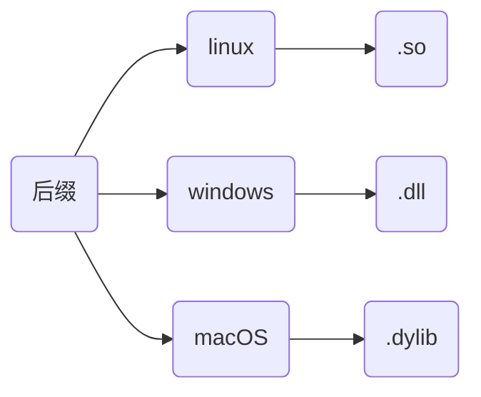
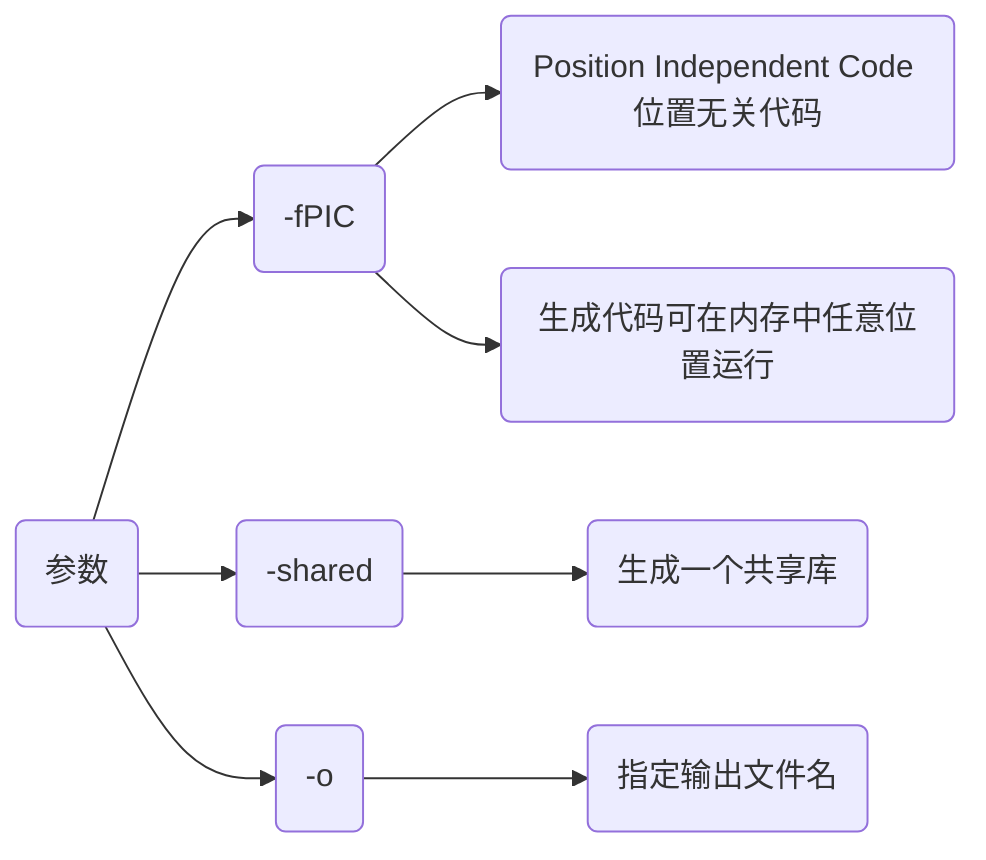
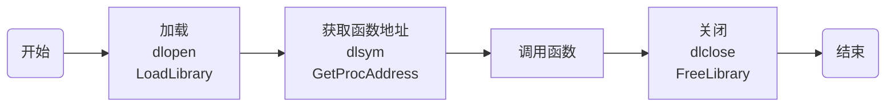

## 概念

动态库, 又称动态链接库($dynamic$ $link$ $library$, $dll$), 是包含程序代码和数据的可执行文件, 在运行时被程序加载和链接

动态库通过将功能封装, 实现代码模块化, 使程序更加灵活和易于维护, 还有助于共享数据和资源, 以减少内存占用, 并提高程序运行效率

其与静态库主要区别在于动态库代码并不在程序编译时直接包含, 而是在程序执行时根据需要动态加载



### 特点

#### 运行时加载

运行时才被加载到内存, 而非编译时就包含在可执行文件中, 可节省内存

#### 共享性

多程序可共享同个动态库, 共享内存中相同代码, 减少资源占用

#### 版本控制

动态库可单独更新, 若功能更改只需替换库文件, 而不必重新编译所有相关程序

#### 支持多语言

动态库通常可被多种编程语言调用, 可在不同开发环境中灵活使用

## 开发

### 特性

在创建C和C++动态库时有一些关键差异特性

#### name mangling(命名修饰)

##### 概念

C++编译器为支持函数重载, 存在`name mangling`(命名修饰)机制, 编译时会对所有函数名进行修改生成唯一函数名

C语言并无命名修饰机制, 编译时函数名不变

##### 问题

如果C程序直接调用C++所生成动态库会导致连接器无法找到正确符号, 产生链接错误

```c++
extern "C" {
    void Func();
}
```

C++提供`extern "C"`/`extern "C" {}`接口, 规定其后续或范围内函数名编译时屏蔽`name mangling`, 按照C语言规则生成函数名

通过在C++中使用`extern "C"`便可解决`name mangling`所导致问题

##### 特点

`extern "C"`只能用于函数和全局变量声明, 不能用于类成员或模板

`extern "C"`修饰函数内不能出现C++所有特性

#### export symbol(导出符号)

为将函数从动态库中导出被其他程序调用, 需在函数前添加导出符号

若没有正确导出符号, 动态库中函数、变量或对象将无法被其他程序或库调用, 引发链接错误

```c++
#if defined(_WIN32)
    #define __EXPORT __declspec(dllexport)
#elif defined(__linux__)
    #define __EXPORT __attribute__((visibility("default")))
#endif

// 添加导出符号
__EXPORT void Hello();
```

### 生成

- 示例, 将test_api.c编译成动态库

```c++
// test_api.h
#ifndef __INCLUDE_TEST_API_H__
#define __INCLUDE_TEST_API_H__

#include <stdio.h>

// 定义导出符号
#if defined(_WIN32)
    #define __EXPORT __declspec(dllexport)
#elif defined(__linux__)
    #define __EXPORT __attribute__((visibility("default")))
#endif

__EXPORT int Add(int x, int y);
__EXPORT void Print();

#endif // __INCLUDE_TEST_API_H__
```

```c++
// test_api.c
#include "test_api.h"

int Add(int x, int y) {
    return x + y;
}

void Print() {
    printf("Hello World\n");
}
```

#### 命令行

```sh
clang 源文件 -fPIC -shared -o 库文件
```



- 示例, 命令行编译动态库


#### cmake

- 示例, cmake编译动态库

```cmake
# CMakeLists.txt
cmake_minimum_required(VERSION 3.16)
project(test_api)

add_library(${PROJECT_NAME} SHARED "")
target_sources(${PROJECT_NAME} PUBLIC ${CMAKE_SOURCE_DIR}/test_api.c)
```


#### xmake

```lua
-- xmake.lua
add_rules("mode.debug", "mode.release")

target("test_api")
    set_kind("shared")
    add_files("test_api.c")
```

- 示例, xmake编译


## 链接

链接阶段, 链接器将动态库与目标文件链接生成可执行文件

### 隐式链接

编译器在链接过程将动态库链接到可执行文件中, 运行时自动加载

- 示例, 隐式调用上面test_api动态库

```c++
// main.cpp
extern "C" {
    #include "test_api.h"
}

#include <iostream>

int main(void) {
    std::cout << Add(0xFF, 0xAB) << std::endl;
    Print();
    return 0;
}
```

#### 命令行

```sh
clang++ 源文件 库文件 -o 可执行文件
```


#### cmake

```cmake
# CMakeLists.txt
cmake_minimum_required(VERSION 3.16)
project(main)

add_executable(${PROJECT_NAME} "")

target_sources(${PROJECT_NAME} PRIVATE ${CMAKE_SOURCE_DIR}/main.cpp)
target_link_libraries(${PROJECT_NAME} ${CMAKE_SOURCE_DIR}/libtest_api.so)
```


### 显式链接

通过接口函数显式加载动态库并直接调用库中函数



- 示例, 显式链接test_api动态库

linux下显式链接时需额外链接加载器库`dl`

```c++
// main.cpp
#include <iostream>
#if defined(_WIN32) || defined(_WIN64)
    #include<windows.h>
#elif defined(__linux__)
    #include <dlfcn.h>
#endif

typedef void(*VoidFunc)();

int main() {
    // 加载
#if defined(_WIN32) || defined(_WIN64)
    HMODULE handle = LoadLibrary("libtest_api.dll");
    if (!handle) {
        std::cerr << "无法加载动态库: " << GetLastError() << std::endl;
    }
    VoidFunc helloFunc = (VoidFunc)GetProcAddress(handle, "Print");
    if (helloFunc == nullptr) {
        std::cerr << "无法找到函数: " << GetLastError() << std::endl;
FreeLibrary(handle);
    }
#elif defined(__linux__)
    void* handle = dlopen("libtest_api.so", RTLD_LAZY | RTLD_LOCAL);
    if (!handle) {
        std::cerr << "无法加载动态库: " << dlerror() << std::endl;
    }
    VoidFunc helloFunc = (VoidFunc)dlsym(handle, "Print");
    if (helloFunc == nullptr) {
        std::cerr << "无法找到函数: " << dlerror() << std::endl;
        dlclose(handle);
    }
#endif
    // 调用
    helloFunc();
    // 卸载
#if defined(_WIN32) || defined(_WIN64)
    FreeLibrary(handle);
#elif defined (__linux__)
    dlclose(handle);
#endif
    return 0;
}
```

#### 命令行

```sh
clang++ main.cpp -o main (-ldl)
```

#### cmake

```cmake
# CMakeLists.txt
cmake_minimum_required(VERSION 3.16)
project(main)

add_executable(${PROJECT_NAME} "")
target_sources(${PROJECT_NAME} PRIVATE ${CMAKE_SOURCE_DIR}/main.cpp)
if(CMAKE_HOST_SYSTEM_NAME MATCHES "Linux")
    target_link_libraries(${PROJECT_NAME} dl)
endif()
```


#### xmake

```lua
-- xmake.lua
add_rules("mode.debug", "mode.release")

target("main")
    set_kind("binary")
    add_files("main.cpp")
    add_links("test_api")
    add_linkdirs(".")
    if is_os("linux") then
        add_syslinks("dl")
    end
```


## 调用

#### 路径问题

linux下调用.so文件时, 可能会出现cannot open shared object file: No such file or directory问题

- 示例, 调用上面libtest_api.so

```c
// main.c
#include "test_api.h"

int main() {
    printf("Add(1, 2) = %d\n", Add(1, 2));
    Print();
    return 0;
}
```


调用时发现报错, 使用`ldd `查看可执行文件依赖, 发现是libtest_api.so库未找到问题

可通过三种方法解决, 

(1) 临时使用`export LD_LIBRARY_PATH=$LD_LIBRARY_PATH:路径`, 增加动态库路径

(2) 也可将`LD_LIBRARY_PATH=$LD_LIBRARY_PATH:路径` 添加到`~/.bashrc`

(3) 也可将动态库文件移动到/usr/lib下

### C语言动态库

生成动态库可供C/C++项目调用

- 示例, 生成C语言动态库libc_api.so

```c
// c_api.h
#include <stdio.h>

int AddNum(int x, int y);
```

```c
// c_api.c
#include "c_api.h"

int AddNum(int x, int y) {
    return x + y;
}
```

#### C++调用C语言动态库

C++调用C语言动态库时, 需用`extern "C" {}` 包裹动态库头文件

- 示例1, main.cpp调用libc_api.so

(1) 生成动态库时, 因C语言没有`name mangling`机制, 生成函数符号名仍然为`AddNum`


(2) main.cpp调用

```c++
// main.cpp
#include "c_api.h"
#include <iostream>

int main() {
    std::cout << AddNum(1, 2) << std::endl;
    return 0;
}
```

预处理时, main.cpp展开

```diff
+ #include <stdio.h>
+ int AddNum(int x, int y);
#include <iostream>
int main() {
    std::cout << AddNum(1, 2) << std::endl;
    return 0;
}
```

C++编译器存在`name mangling`机制, 原本C语言中函数符号`AddNum`会修改为`_Z6AddNumii`

链接时会出现同函数名符号不同问题, 导致链接失败


(3) 修改main.cpp

```c++
// main.cpp
extern "C" {
    #include "c_api.h"
}

#include <iostream>
int main() {
    std::cout << AddNum(1, 2) << std::endl;
    return 0;
}
```

预处理时, main.cpp展开

```diff
+ extern "C" {
+     #include <stdio.h>
+     int AddNum(int x, int y);
+ }
#include <iostream>
int main() {
    std::cout << AddNum(1, 2) << std::endl;
    return 0;
}
```

`extern "C"`屏蔽`name mangling`机制, 使C++编译器处理后函数名AddNum不变, 与libc_aou.so动态库中符号一致, 避免链接问题


#### C语言调用C语言动态库

C语言对函数名没有特殊处理, 直接调用即可

### C++动态库

#### 源文件含类

若源文件含类, 生成动态库时需额外处理

- 示例, 将class_api.cpp生成动态库

```c++
// class_api.hpp
#ifndef __INCLUDE_CLASS_API_HPP__
#define __INCLUDE_CLASS_API_HPP__
#include <iostream>

class ClassAPI {
public:
    ClassAPI() = default;
    ~ClassAPI() = default;
    void SetValue(const int val);
    void Print() const;
private:
    int mValue;
};
#endif // __INCLUDE_CLASS_API_HPP__
```

```c++
// class_api.cpp
#include "class_api.hpp"

void ClassAPI::SetValue(const int val) {
    this->mValue = val;
}

void ClassAPI::Print() const {
    std::cout << "mValue = " << mValue << std::endl;
}
```
##### 类调用(仅支持C++)

以类调用时需在类名前增加导出符号

- 示例, 通过cmake编译为动态库, main.cpp调用

修改class_api.hpp

```c++
#ifndef __INCLUDE_CLASS_API_HPP__
#define __INCLUDE_CLASS_API_HPP__
#include <iostream>

#if defined(_WIN32)
    #define __EXPORT __declspec(dllexport)
#elif defined(__linux__)
    #define __EXPORT __attribute__((visibility("default")))
#endif

class __EXPORT ClassAPI {
public:
    ClassAPI() = default;
    ~ClassAPI() = default;
    void SetValue(const int val);
    void Print() const;
private:
    int mValue;
};
#endif // __INCLUDE_CLASS_API_HPP__
```

```c++
// main.cpp
#include "class_api.hpp"

int main() {
    ClassAPI api;
    api.SetValue(0xFFFF);
    api.Print();
    return 0;
}
```


##### 函数式调用(可支持C/C++)

若要支持C语言调用, 需在类外再封装一层接口, 并使用`extern "C"`

- 示例, C/C++通用动态库

新增c_class_api.hpp、c_class_api.c文件

```c++
// c_class_api.hpp
#ifndef __INCLUDE_C_CLASS_API_H__
#define __INCLUDE_C_CLASS_API_H__

#include "class_api.hpp"

#ifdef _WIN32
    #define __EXPORT __declspec(dllexport)
#else
    #define __EXPORT __attribute__((visibility("default")))
#endif

#ifdef __cplusplus
extern "C" {
#endif
    __EXPORT void* ClassAPICreate();
    __EXPORT void  ClassAPIDestroy(void* handle);
    __EXPORT void  ClassAPISetValue(void* handle, int val);
    __EXPORT void  ClassAPIPrint(void* handle);  
#ifdef __cplusplus
}
#endif 
#endif // __INCLUDE_C_CLASS_API_H__
```

```c++
// c_class_api.cpp
#include "c_class_api.hpp"

__EXPORT void* ClassAPICreate() {
    return new ClassAPI();
}

__EXPORT void ClassAPIDestroy(void* handle) {
    delete static_cast<ClassAPI*>(handle);
}

__EXPORT void ClassAPISetValue(void* handle, int val) {
    ClassAPI* obj = static_cast<ClassAPI*>(handle);
    obj->SetValue(val);
}

__EXPORT void ClassAPIPrint(void* handle) {
    ClassAPI* obj = static_cast<ClassAPI*>(handle);
    obj->Print();
}
```

编译动态库, 调用

```c++
// main.c
#include "c_class_api.hpp"

int main() {
    void* handle = ClassAPICreate();
    ClassAPISetValue(handle, 0xFFFF);
    ClassAPIPrint(handle);
    ClassAPIDestroy(handle);
    return 0;
}
```


#### 源文件含有模板

含模板源文件生成动态库时, 需先模板实例化同时添加导出呼号

若不通过`extern C`进行二次封装, 则生成动态库仅能由C++调用

- 示例, 含模板源文件生成动态库, 通过C++调用

```c++
// template_api.hpp
#ifndef __INCLUDE_TEMPLATE_API_HPP__
#define __INCLUDE_TEMPLATE_API_HPP__

#include <iostream>
#ifdef _WIN32
    #define __EXPORT __declspec(dllexport)
#else
    #define __EXPORT __attribute__((visibility("default")))
#endif

// 模板函数
template<typename T>
T Sub(T x, T y);

// 模板类
template<typename T>
class TemplateAPI {
public:
    TemplateAPI() = default;
    ~TemplateAPI() = default;
    static T Add(T x, T y);
};
#endif // __INCLUDE_TEMPLATE_API_HPP__
```

```c++
// template_api.cpp
#include "template_api.hpp"

template<typename T>
T Sub(T x, T y) {
    return T(x - y);
}

template<typename T>
T TemplateAPI<T>::Add(T x, T y) {
    return T(x + y);
}

// 1. 实例化模板函数, 添加导出符号
template __EXPORT int Sub<int>(int, int);
template __EXPORT double Sub<double>(double, double);

// 2. 实例化类模板, 添加导出符号
template class __EXPORT TemplateAPI<int>;
template class __EXPORT TemplateAPI<double>;
template class __EXPORT TemplateAPI<std::string>;
```

```c++
// main.cpp
#include "template_api.hpp"

int main() {
    std::cout << Sub<int>(0xA, 0xB) << std::endl;
    std::cout << Sub<double>(1.234, 9.876) << std::endl;
    std::cout << TemplateAPI<int>::Add(0xA, 0xB) << std::endl;
    std::cout << TemplateAPI<double>::Add(1.234, 9.876) << std::endl;
    std::cout << TemplateAPI<std::string>::Add("Hello", "World") << std::endl;
    return 0;
}
```


#### C语言调用C++动态库

C++动态库需要在导出函数名前添加`extern "C"` 或用 `extern "C" {}`包裹, 否则C语言无法调用

## IDE开发

### VS2022

创建解决方案Project与动态链接库项目DllTest, 在Project项目中调用DllTest中所生成动态库


#### 编写

DllTest/pch.h

```c++
#include <iostream>
#define __EXPORT __declspec(dllexport)

#ifdef __cplusplus
extern "C" {
#endif
    __EXPORT void PrintInfo();
    __EXPORT int Add(int x, int y);
#ifdef __cplusplus
}
#endif
```

DllTest/pch.cpp

```c++
void PrintInfo() {
    std::cout << "Hello World" << std::endl;
}

int Add(int x, int y) {
    return x + y;
}
```


生成动态库DllTest.dll与动态库导入库DllTest.lib


#### 使用

```c++
// main.cpp
#include "pch.h"

int main() {
    PrintInfo();
    std::cout << Add(1, 2) << std::endl;
    return 0;
}
```
将pch.h 与DllTest.dll、DllTest.liub拷贝到Project项目中


添加DllTest.lib路径, 用于导入动态库


