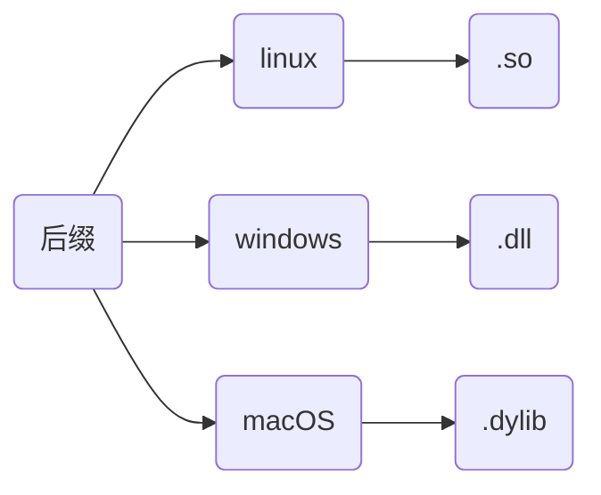
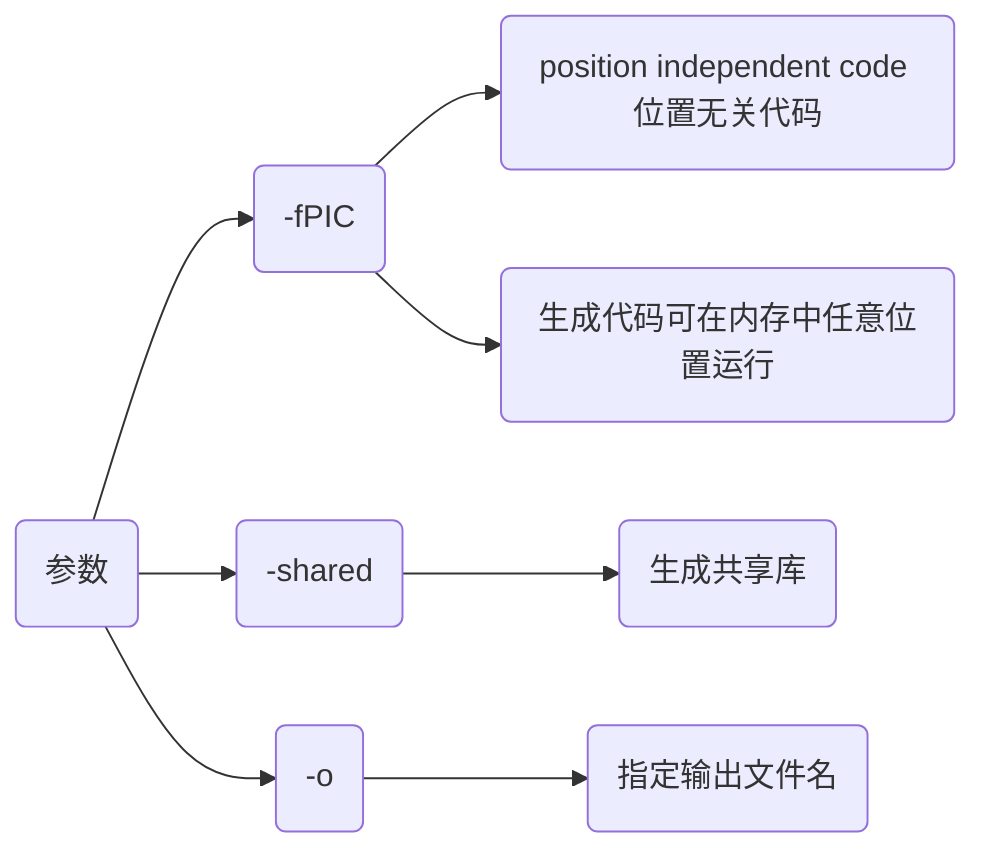
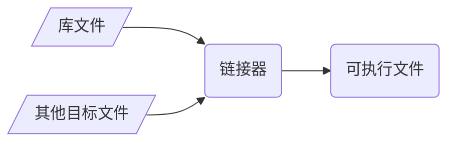
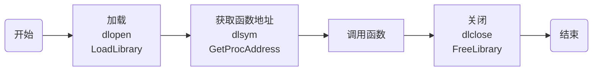

## 概念

动态库, 又称动态链接库, 是包含程序代码和数据的可执行文件, 在运行时被程序加载和链接

动态库通过将功能封装, 实现代码模块化, 使程序更加灵活和易于维护, 还有助于共享数据和资源, 以减少内存占用, 并提高程序运行效率

其与静态库主要区别在于动态库代码并不在程序编译时直接包含, 而是在程序执行时根据需要动态加载



### 特点

#### 运行时加载

运行时才被加载到内存, 而非编译时就包含在可执行文件中, 可节省内存

#### 共享性

多程序可共享同个动态库, 共享内存中相同代码, 减少资源占用

#### 版本控制

动态库可单独更新, 若功能更改只需替换库文件, 而不必重新编译所有相关程序

#### 支持多语言

动态库通常可被多种编程语言调用, 可在不同开发环境中灵活使用

## 开发

### 特性

在创建C和C++动态库时有一些关键特性

#### name mangling(命名修饰)

##### 概念

C++编译器为支持函数重载, 存在`name mangling`(命名修饰)机制, 编译时会对所有函数名进行修改生成唯一函数名

C语言并无命名修饰机制, 编译时函数名不变

##### 问题

如果C程序直接调用C++所生成动态库会导致连接器无法找到正确符号, 产生链接错误

```c++
extern "C" {
    void Func();
}
```

C++提供`extern "C"`/`extern "C" {}`接口, 规定其后续或范围内函数名编译时屏蔽`name mangling`, 按照C语言规则生成函数名

通过在C++中使用`extern "C"`便可解决`name mangling`所导致问题

##### 特点

`extern "C"`只能用于函数和全局变量声明, 不能用于类成员或模板

`extern "C"`修饰函数内不能出现C++所有特性

#### export symbol(导出符号)

为将函数从动态库中导出被其他程序调用, 需在函数前添加导出符号

若没有正确导出符号, 动态库中函数、变量或对象将无法被其他程序或库调用, 引发链接错误

```c++
#if defined(_WIN32)
    #define __EXPORT __declspec(dllexport)
#elif defined(__linux__)
    #define __EXPORT __attribute__((visibility("default")))
#endif

// 添加导出符号
__EXPORT void Hello();
```

### 编写

将若干.c/.cpp文件按规则编译成.so/.dll格式库文件, 供其他文件链接调用


- 示例, 将test_api.c编译成动态库, 提供接口函数`Add`、`Print`

```c++
// test_api.h
#ifndef __INCLUDE_TEST_API_H__
#define __INCLUDE_TEST_API_H__

#include <stdio.h>

// 定义导出符号
#if defined(_WIN32)
    #define __EXPORT __declspec(dllexport)
#elif defined(__linux__)
    #define __EXPORT __attribute__((visibility("default")))
#endif

// 导出接口函数
__EXPORT int Add(int x, int y);
__EXPORT void Print();

#endif // __INCLUDE_TEST_API_H__
```

```c++
// test_api.c
#include "test_api.h"

int Add(int x, int y) {
    return x + y;
}

void Print() {
    printf("Hello World\n");
}
```

#### 生成

##### 编译器

调用编译器指令生成动态库

- 示例, 使用clang编译

```sh
clang 源文件 -fPIC -shared -o 库文件
```




##### cmake

可使用cmake等构建工具生成动态库

- 示例, 使用cmake编译

```cmake
# CMakeLists.txt
cmake_minimum_required(VERSION 3.16)
project(test_api)

add_library(${PROJECT_NAME} SHARED "")
target_sources(${PROJECT_NAME} PUBLIC ${CMAKE_SOURCE_DIR}/test_api.c)
```


##### xmake

- 示例, 使用xmake编译

```lua
-- xmake.lua
add_rules("mode.debug", "mode.release")

target("test_api")
    set_kind("shared")
    add_files("test_api.c")
```


### IDE开发

#### VS2022

创建项目test_project、动态库项目test_dll, 在test_project中调用test_dll所生成动态库


##### 编写动态库

(1) 新建test_dll.h

```c++
// test_dll/test_dll.h
#ifndef __TEST_DLL__
#define __TEST_DLL__
#include <windows.h>
#include <iostream>
#define __EXPORT __declspec(dllexport)

#ifdef __cplusplus
extern "C" {
#endif
    __EXPORT void PrintAPI();
    __EXPORT int AddAPI(int x, int y);
#ifdef __cplusplus
}
#endif

#endif
```

(2) 新建test_dll.cpp

```c++
// test_dll/test_dll.cpp
#include "test_dll.h"

void PrintAPI() {
    std::cout << "Hello World" << std::endl;
}

int AddAPI(int x, int y) {
    return x + y;
}
```

(3) 修改dllmain.cpp


(4) 修改属性


(5) 生成动态库`test_dll.dll`与动态库导入库`test_dll.lib`


##### 方式1 手动复制

可手动将动态库、导入库、头文件复制到所使用项目中


将test_dll.h 与`test_dll.dll`、`test_dll.lib`拷贝到test_project项目中


修改test_project .cpp

```c++
// test_project .cpp
#include "test_dll.h"

int main() {
    PrintAPI();

    std::cout << AddAPI(1, 2) << std::endl;
    return 0;
}
```

添加`test_dll.lib`路径, 导入动态库


##### 方式2 自动链接

设置库路径


设置头文件路径


配置链接器


设置运行时依赖


运行


## 链接

链接阶段, 链接器将动态库与目标文件链接生成可执行文件



### 隐式链接

编译器在链接过程将动态库链接到可执行文件中, 运行时自动加载

- 示例, 隐式调用test_api动态库

```c++
// main.cpp
extern "C" {
    #include "test_api.h"
}

#include <iostream>

int main(void) {
    std::cout << Add(0xFF, 0xAB) << std::endl;
    Print();
    return 0;
}
```

#### 生成

##### 编译器

- 示例, 使用编译器链接

```sh
clang++ 源文件 库文件 -o 可执行文件
```


##### 工具

- 使用cmake等工具链接

```cmake
# CMakeLists.txt
cmake_minimum_required(VERSION 3.16)
project(main)

add_executable(${PROJECT_NAME} "")

target_sources(${PROJECT_NAME} PRIVATE ${CMAKE_SOURCE_DIR}/main.cpp)
target_link_libraries(${PROJECT_NAME} ${CMAKE_SOURCE_DIR}/libtest_api.so)
```


### 显式链接

通过接口函数显式加载动态库并直接调用库中函数



- 示例, 显式链接test_api动态库

linux下显式链接时需额外链接加载器库`dl`

```c++
// main.cpp
#include <iostream>
#if defined(_WIN32) || defined(_WIN64)
    #include<windows.h>
#elif defined(__linux__)
    #include <dlfcn.h>
#endif

typedef void(*VoidFunc)();

int main() {
    // 加载
#if defined(_WIN32) || defined(_WIN64)
    HMODULE handle = LoadLibrary("libtest_api.dll");
    if (!handle) {
        std::cerr << "无法加载动态库: " << GetLastError() << std::endl;
    }
    VoidFunc helloFunc = (VoidFunc)GetProcAddress(handle, "Print");
    if (helloFunc == nullptr) {
        std::cerr << "无法找到函数: " << GetLastError() << std::endl;
FreeLibrary(handle);
    }
#elif defined(__linux__)
    void* handle = dlopen("libtest_api.so", RTLD_LAZY | RTLD_LOCAL);
    if (!handle) {
        std::cerr << "无法加载动态库: " << dlerror() << std::endl;
    }
    VoidFunc helloFunc = (VoidFunc)dlsym(handle, "Print");
    if (helloFunc == nullptr) {
        std::cerr << "无法找到函数: " << dlerror() << std::endl;
        dlclose(handle);
    }
#endif
    // 调用
    helloFunc();
    // 卸载
#if defined(_WIN32) || defined(_WIN64)
    FreeLibrary(handle);
#elif defined (__linux__)
    dlclose(handle);
#endif
    return 0;
}
```

#### 生成

##### 编译器

```sh
clang++ main.cpp -o main (-ldl)
```

##### cmake

```cmake
# CMakeLists.txt
cmake_minimum_required(VERSION 3.16)
project(main)

add_executable(${PROJECT_NAME} "")
target_sources(${PROJECT_NAME} PRIVATE ${CMAKE_SOURCE_DIR}/main.cpp)
if(CMAKE_HOST_SYSTEM_NAME MATCHES "Linux")
    target_link_libraries(${PROJECT_NAME} dl)
endif()
```


##### xmake

```lua
-- xmake.lua
add_rules("mode.debug", "mode.release")

target("main")
    set_kind("binary")
    add_files("main.cpp")
    add_links("test_api")
    add_linkdirs(".")
    if is_os("linux") then
        add_syslinks("dl")
    end
```


## 调用

### 问题

#### 路径错误

linux下调用.so文件时, 可能会出现`cannot open shared object file: No such file or directory`问题

- 示例, 调用上面libtest_api.so

```c
// main.c
#include "test_api.h"

int main() {
    printf("Add(1, 2) = %d\n", Add(1, 2));
    Print();
    return 0;
}
```

调用时发现报错


使用`ldd `查看可执行文件依赖, 发现libtest_api.so库未找到, 可通过三种方法解决,

(1) 临时使用`export LD_LIBRARY_PATH=$LD_LIBRARY_PATH:路径`, 增加动态库路径, 例如⑤

(2) 也可将`LD_LIBRARY_PATH=$LD_LIBRARY_PATH:路径` 添加到`~/.bashrc`

(3) 也可将动态库文件移动到/usr/lib下

### C语言动态库

C语言生成动态库可供C/C++项目调用

- 示例, 生成libc_api.so

```c
// c_api.h
#include <stdio.h>

int AddNum(int x, int y);
```

```c
// c_api.c
#include "c_api.h"

int AddNum(int x, int y) {
    return x + y;
}
```

#### C++调用C语言动态库

C++调用C语言动态库时, 需用`extern "C" {}` 包裹库头文件, 防止`name mangling`机制修改函数名

- 示例1, main.cpp调用libc_api.so

(1) 生成libc_api.so库时, 因C语言没有`name mangling`机制, 生成函数符号名仍然为`AddNum`


(2) 设main.cpp调用时未使用`extern "C" {}`

```c++
// main.cpp
#include "c_api.h"
#include <iostream>

int main() {
    std::cout << AddNum(1, 2) << std::endl;
    return 0;
}
```

预处理时, main.cpp展开

```diff
+ #include <stdio.h>
+ int AddNum(int x, int y);
#include <iostream>
int main() {
    std::cout << AddNum(1, 2) << std::endl;
    return 0;
}
```

C++编译器存在`name mangling`机制, 函数符号`AddNum`会修改为`_Z6AddNumii`

链接时会出现同函数名符号不同问题, 导致链接失败


(3) 修改main.cpp, 增加`extern "C" {}`

```c++
// main.cpp
extern "C" {
    #include "c_api.h"
}

#include <iostream>
int main() {
    std::cout << AddNum(1, 2) << std::endl;
    return 0;
}
```

预处理时, main.cpp展开

```diff
+ extern "C" {
+     #include <stdio.h>
+     int AddNum(int x, int y);
+ }
#include <iostream>
int main() {
    std::cout << AddNum(1, 2) << std::endl;
    return 0;
}
```

`extern "C"`会屏蔽`name mangling`机制, 使C++编译器处理后函数名AddNum不变, 与libc_api.so动态库中符号一致, 避免链接问题


#### C语言调用C语言动态库

C语言对函数名没有特殊处理, 直接调用

### C++动态库

#### 源文件含类

若源文件含类, 生成动态库时需额外处理

- 示例, 将class_api.cpp生成动态库

```c++
// class_api.hpp
#ifndef __INCLUDE_CLASS_API_HPP__
#define __INCLUDE_CLASS_API_HPP__
#include <iostream>

class ClassAPI {
public:
    ClassAPI() = default;
    ~ClassAPI() = default;
    void SetValue(const int val);
    void Print() const;
private:
    int mValue;
};

#endif // __INCLUDE_CLASS_API_HPP__
```

```c++
// class_api.cpp
#include "class_api.hpp"

void ClassAPI::SetValue(const int val) {
    this->mValue = val;
}

void ClassAPI::Print() const {
    std::cout << "mValue = " << mValue << std::endl;
}
```

##### 通过类调用

以类进行调用时需在类名前增加`export symbol`, 同时所生成库仅支持C++调用

- 示例, 通过cmake编译为动态库, main.cpp调用

修改class_api.hpp

```diff
+ class __EXPORT ClassAPI {
```

```c++
// main.cpp
#include "class_api.hpp"

int main() {
    ClassAPI api;
    api.SetValue(0xFFFF);
    api.Print();
    return 0;
}
```


##### 函数式调用

若要支持C/C++调用, 需在类外再封装一层接口, 并使用`extern "C" {}`包裹函数声明

- 示例, 创建C/C++通用动态库

新增c_class_api.hpp、c_class_api.c文件

```c++
// c_class_api.hpp
#ifndef __INCLUDE_C_CLASS_API_H__
#define __INCLUDE_C_CLASS_API_H__

#include "class_api.hpp"

#ifdef _WIN32
    #define __EXPORT __declspec(dllexport)
#else
    #define __EXPORT __attribute__((visibility("default")))
#endif

extern "C" {
    __EXPORT void* ClassAPICreate();
    __EXPORT void  ClassAPIDestroy(void* handle);
    __EXPORT void  ClassAPISetValue(void* handle, int val);
    __EXPORT void  ClassAPIPrint(void* handle); 
}
#endif // __INCLUDE_C_CLASS_API_H__
```

```c++
// c_class_api.cpp
#include "c_class_api.hpp"

__EXPORT void* ClassAPICreate() {
    return new ClassAPI();
}

__EXPORT void ClassAPIDestroy(void* handle) {
    delete static_cast<ClassAPI*>(handle);
}

__EXPORT void ClassAPISetValue(void* handle, int val) {
    ClassAPI* obj = static_cast<ClassAPI*>(handle);
    obj->SetValue(val);
}

__EXPORT void ClassAPIPrint(void* handle) {
    ClassAPI* obj = static_cast<ClassAPI*>(handle);
    obj->Print();
}
```

```c++
// main.c
#include "c_class_api.hpp"

int main() {
    void* handle = ClassAPICreate();
    ClassAPISetValue(handle, 0xFFFF);
    ClassAPIPrint(handle);
    ClassAPIDestroy(handle);
    return 0;
}
```


#### 源文件含有模板

含模板源文件生成动态库时, 需先模板实例化, 并添加`export symbol`

- 示例, 含模板源文件生成动态库

```c++
// template_api.hpp
#ifndef __INCLUDE_TEMPLATE_API_HPP__
#define __INCLUDE_TEMPLATE_API_HPP__

#include <iostream>
#ifdef _WIN32
    #define __EXPORT __declspec(dllexport)
#else
    #define __EXPORT __attribute__((visibility("default")))
#endif

// 模板函数
template<typename T>
T Sub(T x, T y);

// 模板类
template<typename T>
class TemplateAPI {
public:
    TemplateAPI() = default;
    ~TemplateAPI() = default;
    static T Add(T x, T y);
};
#endif // __INCLUDE_TEMPLATE_API_HPP__
```

```c++
// template_api.cpp
#include "template_api.hpp"

template<typename T>
T Sub(T x, T y) {
    return T(x - y);
}

template<typename T>
T TemplateAPI<T>::Add(T x, T y) {
    return T(x + y);
}

// 1. 实例化模板函数, 添加导出符号
template __EXPORT int Sub<int>(int, int);
template __EXPORT double Sub<double>(double, double);

// 2. 实例化类模板, 添加导出符号
template class __EXPORT TemplateAPI<int>;
template class __EXPORT TemplateAPI<double>;
template class __EXPORT TemplateAPI<std::string>;
```

```c++
// main.cpp
#include "template_api.hpp"

int main() {
    std::cout << Sub<int>(0xA, 0xB) << std::endl;
    std::cout << Sub<double>(1.234, 9.876) << std::endl;
    std::cout << TemplateAPI<int>::Add(0xA, 0xB) << std::endl;
    std::cout << TemplateAPI<double>::Add(1.234, 9.876) << std::endl;
    std::cout << TemplateAPI<std::string>::Add("Hello", "World") << std::endl;
    return 0;
}
```


#### C语言调用C++动态库

C++动态库需要在导出函数名前添加`extern "C"` 或用 `extern "C" {}`包裹, 否则C语言无法调用

### python调用

> [Python--ctypes(数据类型详细踩坑指南)](https://zhuanlan.zhihu.com/p/145165873)

python通过`ctypes`库可调用C/C++动态库, 同时动态库函数声明中不能出现C++语言特性

#### 功能

##### 加载

```py
from ctypes import *

dll = cdll.LoadLibrary('动态库路径')
```

#### 语法

```c++
// c_api.cpp
#include <iostream>

#ifdef _WIN32
    #define __EXPORT __declspec(dllexport)
#else
    #define __EXPORT __attribute__((visibility("default")))
#endif

#ifdef __cplusplus
extern "C" {
#endif
    __EXPORT int Add(int x, int y) {
        return x + y;
    }
#ifdef __cplusplus
}
#endif
```

##### 函数

- 示例, 调用libc_api.so中函数

```c++
// c_api.cpp
#include <iostream>

#ifdef _WIN32
    #define __EXPORT __declspec(dllexport)
#else
    #define __EXPORT __attribute__((visibility("default")))
#endif

extern "C" {
    __EXPORT int Add(int x, int y) {
        return x + y;
    }

    __EXPORT void Hello() {
        printf("Hello World\n");
    }

    __EXPORT int GetArraySum(int a[], int len) {
        int sum = 0;
        for (int i = 0; i < len; i++) {
            sum += a[i];
        }
        return sum;
    }

    __EXPORT void SwapValue(int *x, int *y) {
        int temp = *x;
        *x = *y;
        *y = temp;
    }
}
```

```py
# main.py
from ctypes import *

dll = cdll.LoadLibrary('./libc_api.so')

x, y = 1, 2
res = dll.Add(x, y)
print(res)

dll.Hello()
```

##### 数组

```py
dll = cdll.LoadLibrary('./libc_api.so')

a = [1, 2, 3, 4, 5]

array = (c_int * 5)(*a)
res = dll.GetArraySum(array, c_int(5))
print(res)
```

##### 指针

```py
dll = cdll.LoadLibrary('./libc_api.so')

x = pointer(c_int(0x1))
y = pointer(c_int(0xFF))

dll.SwapValue(x, y)

print(x.contents)
print(y.contents)
```