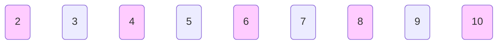
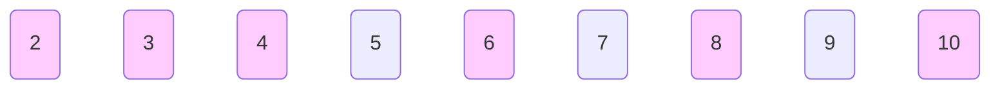

## 质数

### 朴素算法

#### c++
  
```c++
bool is_prime(int n) {
    if (n & 1 == 0) {
        return false;
    }

    for (int i = 2; i * i < n; i++) {
        if (n % i == 0) {
            return false;
        }
    }
    return true;
}
```

#### python

```py
def is_prime(n: int)-> bool:
    if n & 1 == 0 :
        return False
    if n <= 1 :
        return False
    if n == 2 :
        return True
    for i in range(2, n):
        if n % i == 0:
            return False
    return True
```

### 埃拉托斯特尼筛法

从$2$ 开始, 将每个质数的倍数都标记成合数

$2$ 为素数, 则其倍数 $4, 6, 8 \cdots$ 均不是素数



$3$ 为素数, 则其倍数 $6, 9, 12 \cdots$ 均不是素数



$\cdots$

$2~n$ 需要判断 $n-1$ 次

#### c++

```c
// 求2-n之间的所有素数
const int n = 100;

// 标记所有数为素数
bool is_prime[n + 1] = { true };

// 存储素数
int prime[n];

int index = 0;

// 所有大于2的偶数均不是素数
for (int i = 4; i <= n; i += 2) {
    is_prime[i] = false;
}

for (int i = 2; i <= n; i++) {
    // 某个奇数为素数
    if (is_prime[i]) {
        prime[index++] = i;
        // 则它的倍数均不是素数
        for (int j = 2 * i; j < n; j += i) {
            is_prime[j] = false;
        }
    }
}
```

#### python

```py
n = 100

is_prime = [True] * (n + 1)

prime = []

for i in range(4, n + 1, 2):
    is_prime[i] = False

for i in range(2, n + 1):
    if is_prime[i]:
        prime.append(i)
        for j in range(2 * i, n, i):
            is_prime[j] = False
```

### 欧拉筛

> 用最小质因子来筛选, 确保每个合数只被筛选一次


(1) $i = 2$,

$j = 0, prime[0] = 2, i * prime[0] = 4$

(2) $i = 3$, 

$j = 0, prime[0] = 2, i * prime[0] = 6$

$j = 1, prime[1] = 3, i * prime[1] = 9$

(3) $i = 4$, 

$j = 0, prime[0] = 2, i * prime[0] = 8$

(4) $i = 5$, 

$j = 0, prime[0] = 2, i * prime[0] = 10$

(5) $i = 6, i = 7$

```c++
// 求2-n之间的所有素数
const int n = 100;

bool is_prime[n + 1] = {true};

int prime[n];

int index = 0;

for(int i = 2; i <= n; i++) {
    // 某个数为素数
    if(is_prime[i]){
        prime[index++] = i;
    }
    for(int j = 0; j <= index && i * prime[j] <= n; j++) {
        is_prime[i * prime[j]] = false;
        // 若i是prime[j]的倍数, 当i = k * prime[j+1]时会重复
        if (i % prime[j] == 0) {
            break;
        }
    }
}
```

## 因数

### 分解

若 $a$ 为 $n$ 的因子, 则 $n/a$ 也为 $n$ 的因子

此法可将时间复杂度压缩到 $O(\sqrt N)$

#### c

```c++
const int n = 100;

std::vector<int> v;
for(int i = 2; i * i <= n; i++) {
    if(n % i == 0) {
        v.push_back(i);
        if(i != n / i) {
            v.push_back(n / i);
        }
    }
}
```

#### python

```py
import math

v = []
for i in range(2, math.sqrt(x)):
    if n % i == 0:
        v.append(i)
        if i != (n / i):
            v.append(v)
```

### 最大公约数 gcd

```c++
typedef long long ll;

ll gcd(ll a, ll b){
    return b == 0 ? a : gcd(b, a % b);
}
```

c++ algorithm 库, 内置有`__gcd(a, b)`函数求最大共约数

#### 积性函数

$f(mn) = f(m) \times f(n), \forall gcd(m, n) = 1$

### 最小公倍数 lcm

$lcm(a, b) = \frac{a*b}{gcd(a, b)}$

```c
typedef long long ll;

// 先除再乘避免溢出
ll lcm(ll a, ll b){
    return a / gcd(a, b) * m;
}
```
