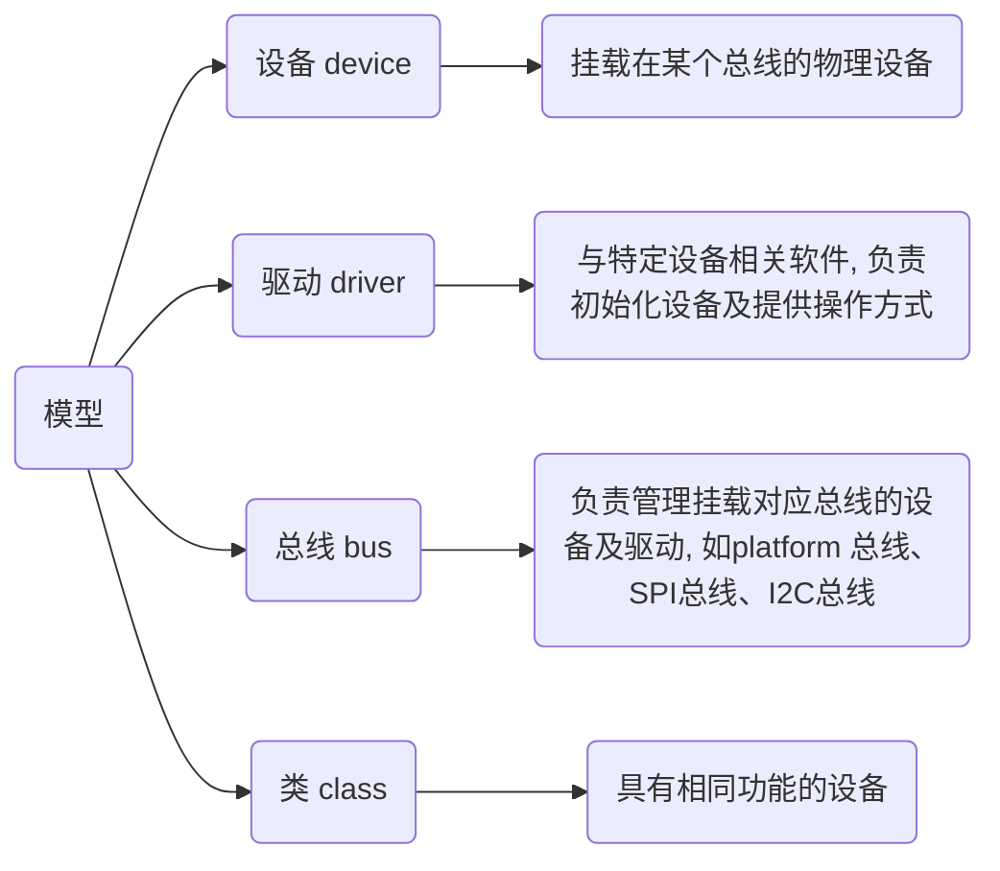

## 设备种类



### 字符设备

字符设备只能逐字节读写, 面向流, 不能随机读取设备内存中某一数据, 读取数据需要按照先后数据

常见字符设备有鼠标、键盘、串口、控制台、LED设备等

### 块设备

块设备可从设备任意位置读取一定长度数据, 常见块设备包括电脑硬盘、SD卡、U盘、光盘等

### 网络设备

网络事务都经过一个网络接口形成, 即一个能够和其他主机交换数据的设备

访问网络接口方法仍然是给它们分配一个唯一名字(如eth0), 但这个名字在文件系统中不存在对应节点

常见网络设备包括网卡设备、蓝牙设备等

## 设备管理

linux用户程序通过设备文件(或称设备节点)来使用驱动程序操作字符设备和块设备

各种硬件设备以文件形式存放于/dev下, 使用`ls /dev`查看

```sh
autofs           i2c-8             nvram     tty27  tty62      uhid
block            initctl           port      tty28  tty63      uinput
btrfs-control    input             ppp       tty29  tty7       urandom
bus              kmsg              psaux     tty3   tty8       usb
char             kvm               ptmx      tty30  tty9       userfaultfd
console          log               pts       tty31  ttyprintk  userio
core             loop0             random    tty32  ttyS0      vcs
cpu              loop1             rfkill    tty33  ttyS1      vcs1
cpu_dma_latency  loop10            rtc       tty34  ttyS10     vcs2
cuse             loop11            rtc0      tty35  ttyS11     vcs3
disk             loop12            shm       tty36  ttyS12     vcs4
dma_heap         loop13            snapshot  tty37  ttyS13     vcs5
dri              loop14            snd       tty38  ttyS14     vcs6
ecryptfs         loop2             stderr    tty39  ttyS15     vcsa
fb0              loop3             stdin     tty4   ttyS16     vcsa1
fd               loop4             stdout    tty40  ttyS17     vcsa2
full             loop5             tpm0      tty41  ttyS18     vcsa3
fuse             loop6             tpmrm0    tty42  ttyS19     vcsa4
gpiochip0        loop7             tty       tty43  ttyS2      vcsa5
gpiochip1        loop8             tty0      tty44  ttyS20     vcsa6
hidraw0          loop9             tty1      tty45  ttyS21     vcsu
hidraw1          loop-control      tty10     tty46  ttyS22     vcsu1
hidraw2          mapper            tty11     tty47  ttyS23     vcsu2
hidraw3          mcelog            tty12     tty48  ttyS24     vcsu3
hidraw4          mem               tty13     tty49  ttyS25     vcsu4
hidraw5          mqueue            tty14     tty5   ttyS26     vcsu5
hidraw6          net               tty15     tty50  ttyS27     vcsu6
hidraw7          ng0n1             tty16     tty51  ttyS28     vfio
hpet             null              tty17     tty52  ttyS29     vga_arbiter
hugepages        nvidia0           tty18     tty53  ttyS3      vhci
hwrng            nvidia-caps       tty19     tty54  ttyS30     vhost-net
i2c-0            nvidiactl         tty2      tty55  ttyS31     vhost-vsock
i2c-1            nvidia-modeset    tty20     tty56  ttyS4      zero
i2c-2            nvidia-uvm        tty21     tty57  ttyS5      zfs
i2c-3            nvidia-uvm-tools  tty22     tty58  ttyS6
i2c-4            nvme0             tty23     tty59  ttyS7
i2c-5            nvme0n1           tty24     tty6   ttyS8
i2c-6            nvme0n1p1         tty25     tty60  ttyS9
i2c-7            nvme0n1p2         tty26     tty61  udmabuf
```

linux把对硬件操作全部抽象成对文件操作

在设备管理中, 除了设备类型外, 内核还需要一对被称为主从设备号参数, 才能唯一标识一个设备

### 主设备号

用于标识驱动程序, 相同主设备号使用相同驱动程序, 例如: S3C2440 有串口、LCD、触摸屏三种设备, 其主设备号各不相同

### 从设备号

用于标识同一驱动程序下不同硬件

例IDE设备, 主设备号用于标识该硬盘, 从设备号用于标识每个分区, 2440有三个串口, 每个串口主设备号相同, 从设备号用于区分具体属于那一个串口

## /dev

- /dev/null

空设备, 也称为位桶($bit bucket$)、回收站、无底洞, 向它输出任何数据都会被`抛弃`

若不想让消息以标准输出显示或写入文件, 那么可以将消息重定向到位桶

- /dev/zero

输入设备, 可用于向设备或文件无限写入字符串0, 初始化文件
