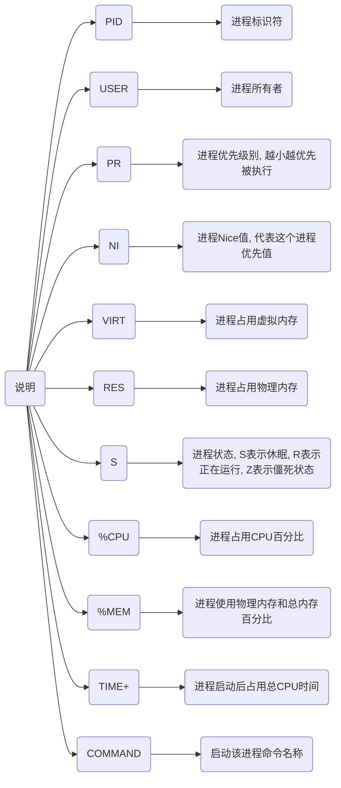
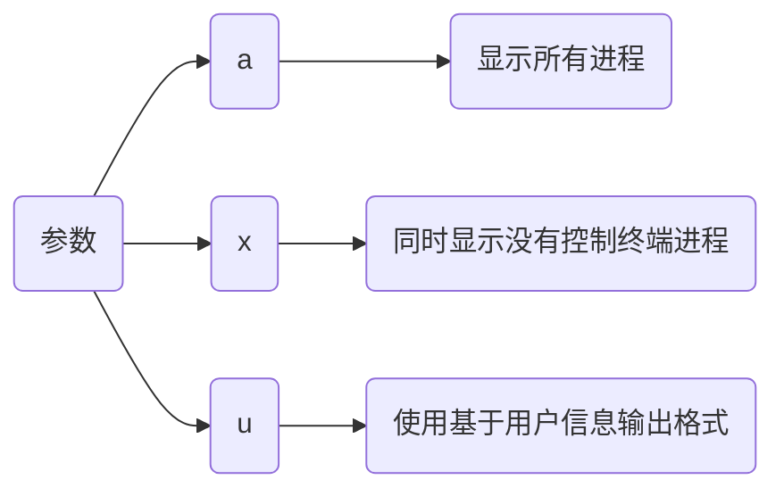
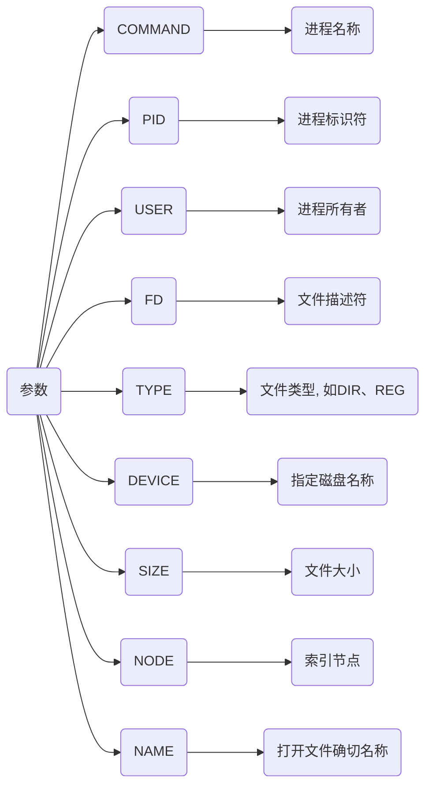
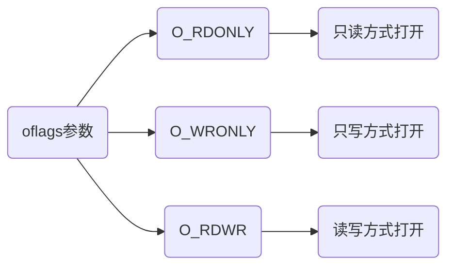

## 系统指令

### 内存指令

#### top

输出

```sh
top - 11:52:40 up  1:05,  3 users,  load average: 0.37, 0.49, 0.59
Tasks: 408 total,   1 running, 407 sleeping,   0 stopped,   0 zombie
%Cpu(s):  0.3 us,  0.3 sy,  0.0 ni, 99.4 id,  0.0 wa,  0.0 hi,  0.0 si,  0.0 st
MiB Mem :  32018.0 total,  11803.9 free,   7612.4 used,  13485.5 buff/cache
MiB Swap:   8192.0 total,   8192.0 free,      0.0 used.  24405.6 avail Mem

 PID USER      PR  NI    VIRT    RES    SHR    %CPU  %MEM     TIME+ COMMAND
   2820 dmjcb     20   0 4870856 588192 209664 S   2.3   1.8   2:35.84 gnome-s+
   8882 dmjcb     20   0 1394.3g 608912 227444 S   2.3   1.9   3:37.19 chrome
  14741 dmjcb     20   0   49.2g 285616 252092 S   1.3   0.9   0:49.04 chrome
    712 root      20   0       0      0      0 S   0.7   0.0   0:33.58 nvidia-+
......
```



#### free

```sh
free 参数
```

| 参数 | 含义               |
| ---- | ------------------ |
| 空   | 用KB为单位展示数据 |
| -m   | 用MB为单位展示数据 |
| -g   | 用GB为单位展示数据 |

| 结果       | 含义                 |
| ---------- | -------------------- |
| total      | 总计物理内存大小     |
| used       | 已使用内存大小       |
| free       | 可用内存大小         |
| shared     | 多个进程共享内存总额 |
| buff/cache | 磁盘缓存大小         |
| available  | 可用内存大小         |

##### 清理内存

```sh
sudo sh -c "echo 参数 > /proc/sys/vm/drop_caches"
```

| 参数 | 含义                                     |
| ---- | ---------------------------------------- |
| 0    | 系统默认值, 表示不释放内存, 由OS自动管理 |
| 1    | 释放页缓存                               |
| 2    | 释放dentries和inodes                     |
| 3    | 释放所有缓存                             |

- 示例, 释放所有缓存

```sh
sudo sh -c "echo 3 > /proc/sys/vm/drop_caches"
```

### 进程指令

#### ps

```sh
ps -aux
```



终端类似输出

```sh
USER         PID %CPU %MEM    VSZ   RSS TTY      STAT START   TIME COMMAND
root           1  0.0  0.0  23684 14948 ?        Ss   08:54   0:01 /sbin/init splash
root           2  0.0  0.0      0     0 ?        S    08:54   0:00 [kthreadd]
root           3  0.0  0.0      0     0 ?        S    08:54   0:00 [pool_workqueue_release]
root           4  0.0  0.0      0     0 ?        I<   08:54   0:00 [kworker/R-rcu_gp]
......
```
##### 查看指定进程pid

```sh
ps -aux | grep 进程名
```

其中带中括号命令(如 `[kthreadd]`)并不是真正命令而是内核线程

##### 查看指定端口

```sh
ps -ef | grep 端口号
```

### lsof

根据端口号查询进程信息

```sh
lsof -i:端口号
```

- 示例, 查看7897端口进程

```sh
lsof -i 7897
```




#### nohup

no hang up(不挂起), 用于在系统后台不挂断地运行命令, 退出终端不会影响程序运行

默认情况(非重定向)时, 会输出nohup.out到当前目录, 若当前目录nohup.out文件不可写, 则输出重定向到${HOME}/nohup.out文件

```sh
nohup command [arg...] &
```

| 参数    | 含义                         |
| ------- | ---------------------------- |
| command | 要执行命令                   |
| arg     | 一些参数, 可以指定输出文件   |
| &       | 命令在后台或终端退出后仍执行 |

### 网络命令

#### 查看

```sh
ifconfig
```

#### 启动

```sh
ip link set 网卡名 up
```

#### 关闭

```sh
ip link set 网卡名 down
```

#### 获取IP

```sh
dhclient
```

### 用户指令

#### 查看用户

```sh
cat /etc/passwd
```

- 示例, 输出登录、未关闭用户信息

```sh
cat /etc/passwd | grep -v nologin | grep -v halt | grep -v shutdown | awk -F":" '{ print $1"|"$3"|"$4 }'|more
```

终端输出

```sh
root|0|0
sync|4|65534
dhcpcd|100|65534
tss|105|105
whoopsie|107|109
speech-dispatcher|111|29
hplip|116|7
gnome-initial-setup|119|65534
gdm|120|121
dmjcb|1000|1000
swtpm|123|125
```

#### 查看组

```sh
cat /etc/group
```

#### 新建用户

```sh
sudo adduser 用户名

sudo passwd 用户名
```

#### 修改主机名

```sh
# 编辑/etc/hostname文件
新主机名
```

重启

## 系统调用

### IO

#### write

write把缓冲区buf前nbytes个字节写入到与文件描述符fd关联文件中, 返回实际写入字节数

```c
size_t write(int fildes, const void *buf, size_t nbytes)
```

| 状态       | 返回值         |
| ---------- | -------------- |
| 正常写入   | 实际写入字节数 |
| 未写入数据 | 0              |
| 调用错误   | -1             |

```c
#include <stdio.h>
#include <stdlib.h>
#include <unistd.h>

int main(void) {
	const size_t WRITE_INFO_LEN = 18;
    const size_t ERR_INFO_LEN   = 46;
    const char* WEITE_INFO = "Here is some data\n";
    const char* ERR_INFO   = "A write error has occurred on file descriptor 1 \n";
    // 向fd1(屏幕)写入
    if (write(STDOUT_FILENO, WEITE_INFO, WRITE_INFO_LEN) != WRITE_INFO_LEN) {
        write(STDERR_FILENO, ERR_INFO, ERR_INFO_LEN);
    }
    return 0;
}
```

编译执行后终端输出

```sh
Here is some data
```

#### read

```c
#include <unistd.h>

size_t read(int fildes, void *buf, size_t nbytes)
```

从文件描述符fildes相关联文件里读入nbytes个字节数据, 并放到数据区buf中

| 情况                       | 返回值         |
| -------------------------- | -------------- |
| 正常写入                   | 实际读入字节数 |
| 未读入数据, 已经到达文件尾 | 0              |
| 调用错误                   | -1             |

- 示例, 读取键盘输入显示在屏幕

```c
#include <stdio.h>
#include <stdlib.h>
#include <unistd.h>

int main(void) {
	const int READ_INFO_LEN      = 128;
	const int READ_ERR_INFO_LEN  = 26;
	const int WRITE_ERR_INFO_LEN = 27;
    char buffer[READ_INFO_LEN];

    // 从fd0(键盘)中读入
    int read_res = read(STDIN_FILENO, buffer, READ_INFO_LEN);
    if (read_res == -1) {
        write(STDERR_FILENO, "A read error has occurred\n", READ_ERR_INFO_LEN);
    }
    // 向fd1(屏幕)写入
    int write_res = write(STDOUT_FILENO, buffer, read_res);
    if (write_res != read_res) {
        write(STDERR_FILENO, "A write error has occurred\n", WRITE_ERR_INFO_LEN);
    }
    return 0;
}
```

执行后终端会显示用户输入的信息

#### open

```c
#include <fcntl.h>
#include <sys/types.h>
#include <sys/stat.h>

int open(const char *path, int oflags);
int open(const char *path, int oflags, mode_t mode);
```

创建新文件描述符, 调用成功后返回可以被read, write和其他系统调用那个所使用文件描述符



```c
#include <unistd.h>
#include <sys/stat.h>
#include <fcntl.h>
#include <stdlib.h>

int main(void) {
    char block[1024];
    int nread;

    int in  = open("file.in", O_RDONLY);
    int out = open("file.out", O_WRONLY|O_CREAT, S_IRUSR|S_IWUSR);
    while((nread = read(in, block, sizeof(block))) > 0) {
        write(out, block, nread);
    }
    return 0;
}
```

### FILE

```c++
#ifndef _FILE_DEFINED
struct _iobuf {
    // 文件输入下一个位置
    char *_ptr;
    // 当前缓冲区相对位置
    int _cnt;
    // 文件起始位置
    char *_base;
    // 文件标志
    int _flag;
    // 文件描述符id
    int _file;
    // 检查缓冲区状况,若无缓冲区则不读取
    int _charbuf;
    // 文件缓冲区大小
    int _bufsiz;
    // 临时文件名
    char *_tmpfname;
};

typedef struct _iobuf FILE;

#define _FILE_DEFINED
#endif
```

FILE结构是间接地操作系统文件控制块(FCB)来实现对文件操作

#### 接口

##### fopen

```c
// 读文件到内存,返回文件信息结构指针
FILE *fopen(char *file, char *open_mode)
```

信号是软件中断, 提供一种处理异步事件方法

## 信号

```c
void (*signal (int sig, void (*func)(int)))(int);

signal(registered signal, signal handler)
```

第一个参数是一个整数, 代表了信号编号

第二个参数是一个指向信号处理函数指针

```c
// signal.c
#include <signal.h>
#include <unistd.h>
#include <stdlib.h>
#include <string.h>

static void sig_usr(int signo) {
    if(signo == SIGUSR1) {
        write(STDOUT_FILENO, "received SIGUSR1\n", 17);
    } else if (signo == SIGUSR2) {
        write(STDOUT_FILENO, "received SIGUSR2\n", 17);
    } else {
        printf("received signal %d\n", signo);
    }
}

int main(int argc, char *argv[]) {
    struct sigaction sa;
    sa.sa_handler = sig_usr;
    sigemptyset(&sa.sa_mask);
    sa.sa_flags = 0;

    if(sigaction(SIGUSR1, &sa, NULL) == -1) {
        perror("sigaction SIGUSR1");
        exit(1);
    }
    if(sigaction(SIGUSR2, &sa, NULL) == -1) {
        perror("sigaction SIGUSR2");
        exit(1);
    }

    // 等待信号
    for(;;) {
        pause();
    }

    return 0;
}
```

捕捉SIGUSR1与SIGUSR2信号, 当收到信号时打印不同的提示信息

编译后运行, 并在另一个终端执行, 可看到相应提示

```sh
kill -USR1 [pid值]

kill -USR2 [pid值]
```

### raise

```c
int raise (signal sig);
```

sig 是要发送信号编号, 信号包括:

SIGINT, SIGABRT, SIGFPE, IGILL, SIGSEGV, SIGTERM, SIGHUP

```c
#include <stdio.h>
#include <signal.h>
#include <unistd.h>

void signalHandler(int signum){
    printf("interrupt signal %d received\n", signum);
    // 清理并关闭
    exit(signum);
}

int main(void){
    // 注册信号 SIGINT 和信号处理程序
    signal(SIGINT, signalHandler);

    for(int i = 0; i < 5; i++){
        printf("going to sleep...\n");
        if(i == 3){
           raise(SIGINT);
        }
        sleep(1);
    }
    return 0;
}
```

## 系统结构

### 系统启动

#### /boot

存放启动linux一些核心文件, 包括连接文件及镜像文件

#### /lib

lib(library)库, 存放着系统最基本动态连接共享库, 作用类似于 windows 里 dll

#### /sys

linux2.6 内核中新出现文件系统sysfs就安装于该目录下

sysfs 文件系统集成, 针对进程信息proc 文件系统、针对设备devfs 文件系统以及针对伪终端devpts 文件系统信息

该文件系统直观反映内核设备树, 当一个内核对象被创建候, 对应文件和目录也在内核对象子系统中被创建

### 指令合集

#### /bin

bin(Binaries)二进制文件, 存放着最常使用命令

#### /sbin

Superuser Binaries (超级用户二进制文件), 存放系统管理员所使用系统管理程序

### 外部文件管理

#### /etc

存放所有系统管理所需配置文件和子目录

#### /dev

dev(Device)设备, 存放linux外部设备, 访问设备与访问文件方式相同

#### /media

该目录用于挂载识别设备(如U盘、光驱)

#### /mnt

该目录用于临时挂载其他文件系统

### 临时文件

#### /run

临时文件系统, 存储系统启动以来信息, 当系统重启时, 该目录下文件应该被删掉或清除

#### /lost+found

一般情况下为空, 系统非法关机后, 这里将生成文件

#### /tmp

tmp(temporary)存放临时文件

### 账户

#### /root

该目录为系统管理(超级权限者)用户主目录

#### /home

用户主目录, 每个用户都有一个

#### /usr

`usr`(unix shared resources), 用户很多应用程序和文件都放在这个目录下, 类似于 Windows program files 目录

| 子目录      | 作用                                 |
| ----------- | ------------------------------------ |
| `/usr/bin`  | 系统用户所使用应用程序               |
| `/usr/sbin` | 超级用户所使用管理程序和系统守护程序 |
| `/usr/src`  | 内核源代码默认放置目录               |

### 运行过程中使用

#### /var

var(variable), 存放常修改数据, 如日志(var/log)

#### /proc

proc(Processes), /proc 是虚拟文件系统, 存储当前内核运行状态等一系列特殊文件, 是系统内存映射, 内容在内存里, 可通过直接访问此目录来获取系统信息

### 拓展

#### /opt

该目录用于给主机额外安装软件

#### /srv

该目录存放一些服务启动之后需要被提取数据
