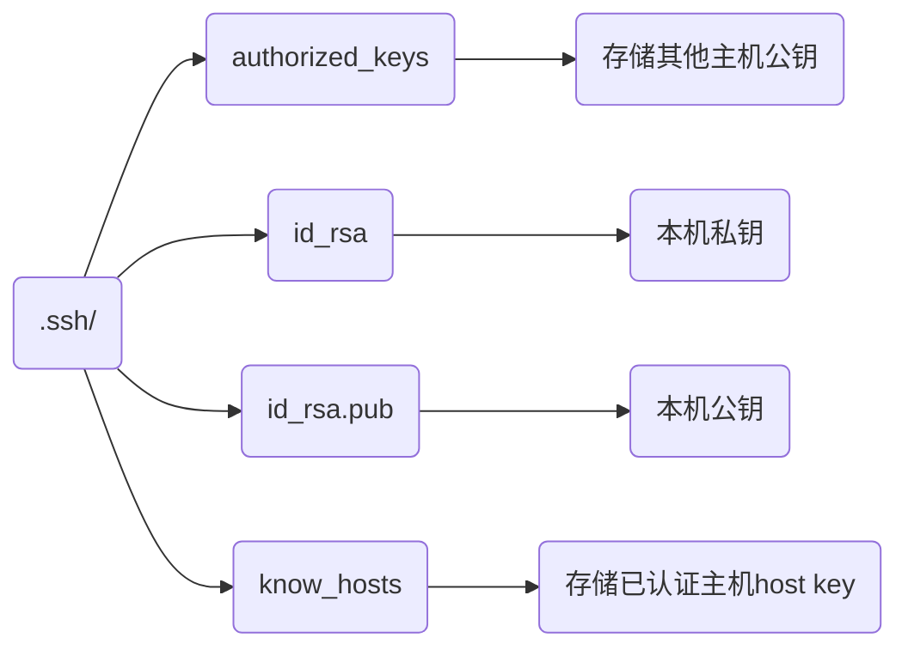

> 参考
>
> - [SSH 穿越多个跳板机连接方法](https://murphypei.github.io/blog/2021/12/ssh-proxyjump.html)
> - [win10 ssh 上传密钥过程, 出现 无法将"ssh-copy-id"项识别](https://blog.csdn.net/Defiler_Lee/article/details/116278442)

SSH(Secure Shell)是一种**加密的远程登录协议**, 常用于服务器运维、远程命令执行、文件传输及端口转发

## 配置

### 安装

```sh
# Debian / Ubuntu
sudo apt install openssh-server

# Alpine Linux
sudo apk add openssh
```

### 服务管理

#### 开启服务

```sh
sudo service ssh start

sudo service ssh enable
```

#### 停止服务

```sh
sudo service ssh stop
```

#### 重启服务

```sh
sudo service ssh restart

# 或
sudo systemctl restart sshd
```

### 密钥

SSH 密钥认证是一种非对称加密认证方式, 由两部分组成:

- 私钥(id_rsa): 仅保存在本地主机

- 公钥(id_rsa.pub): 放在远程主机

登录时:

客户端用私钥签名

服务端用公钥验证

验证成功即可登录, 无需密码

#### 生成密钥

```sh
ssh-keygen -t rsa -b 4096 -C "邮箱"
```

- 示例, 为dmjcb@proton.me生成密钥, 默认无密码

```sh
ssh-keygen -t rsa -b 4096 -C "dmjcb@proton.me"
```

终端有类似显示

```sh
Generating public/private rsa key pair.
Enter file in which to save the key (/home/dmjcb/.ssh/id_rsa):
Enter passphrase (empty for no passphrase):
Enter same passphrase again:
Your identification has been saved in /home/dmjcb/.ssh/id_rsa
Your public key has been saved in /home/dmjcb/.ssh/id_rsa.pub
The key fingerprint is:
SHA256:krLr7tw3dLvwQLeDmyEhyYTQqVmVals6x/HBpZQPoWs dmjcb@proton.me
The key's randomart image is:
+---[RSA 4096]----+
|.. o...o         |
| .+...+ .        |
| +..oo =         |
|o oooo+..        |
| . =Eo+.S .      |
|  +.o+.+.o..     |
|   o. ..=.o.     |
|   . o .oB..     |
|   +* ..o.o.     |
+----[SHA256]-----+
```

提示输入文件保存位置(默认是`~/.ssh/id_rsa`)和密钥密码(可选), 执行后在$HOME/下生成.ssh/



#### 清除密钥

当远程主机重装系统时, 可能出现 host key mismatch

```sh
ssh-keygen -R 远程主机IP
```

### 配置文件

路径`/etc/ssh/sshd_config`

#### 禁用密码登陆(可选)

> 在禁用密码前, 请务必确认: 1. 密钥已成功配置; 2. 可以正常使用密钥登录; 否则可能被锁在服务器外

仅允许密钥登录, 可有效防止暴力破解

修改配置项如下

```sh
# 禁用密码认证
PasswordAuthentication no

# 启用公钥认证(通常是默认启用)
PubkeyAuthentication yes

# 允许挑战响应认证(如果不需要也可以禁用)
ChallengeResponseAuthentication no

# 还可考虑禁用GSSAPI认证(如果不需要)
GSSAPIAuthentication no
```

## 操作

### 连接

#### 密码登录

##### 默认端口

默认端口22

```sh
ssh 用户名@远程主机IP
```

- 示例, 连接dmjcb用户, 地址192.168.3.3, 默认22端口

```
ssh dmjcb@192.168.3.3
```

##### 指定端口

```sh
ssh 用户名@远程主机IP -p 端口
```

- 示例, 连接dmjcb用户, 地址192.168.3.3, 指定9999端口

```
ssh dmjcb@192.168.3.3 -p 9999
```

#### 密钥登录

##### 手动复制

将本地`id_rsa.pub` 追加到远程 `.ssh/authorized_keys`里

##### ssh-copy-id

若是windows系统, 需先于powershell中执行,

```powershell
function ssh-copy-id([string]$userAtMachine, $args){
    $publicKey = "$ENV:USERPROFILE" + "/.ssh/id_rsa.pub"
    if (!(Test-Path "$publicKey")){
        Write-Error "ERROR: failed to open ID file '$publicKey': No such file"
    } else {
        & cat "$publicKey" | ssh $args $userAtMachine "umask 077; test -d .ssh || mkdir .ssh ; cat >> .ssh/authorized_keys || exit 1"
    }
}
```

之后执行

```sh
ssh-copy-id -i 公钥路径(一般是.ssh/id_rsa.pub) 用户名@远程主机IP
```

- 示例, 设置密钥, 连接dmjcb用户, 主机192.168.3.3

```sh
ssh-copy-id -i ~/.ssh/id_rsa.pub dmjcb@192.168.3.3
```

#### 保持 SSH 长连接

##### 服务端设置(推荐)

修改配置文件如下表

```sh
.....
# server每隔60秒发送一次请求给client, 然后client响应, 从而保持连接
ClientAliveInterval 60

# server发出请求后, 客户端没有响应得次数达到3, 就自动断开连接, 正常情况下, client不会不响应
ClientAliveCountMax 3
......
```

##### 客户端参数

连接时添加`ServerAliveInterval`

```sh
ssh -o ServerAliveInterval=60 用户名@远程主机IP
```

### 远程操作

#### 执行指令

```sh
ssh 用户名@远程主机IP '命令'
```

- 示例, 远程执行`ls -la`

```sh
ssh dmjcb@192.168.3.3 'ls -la'
```

#### 文件传输(SCP)

SCP(Secure Copy)是SSH一个内置命令, 用于本地和远程机器之间传输文件

##### 上传

```sh
scp 本地路径 (-r, 表示目录) 用户名@远程主机IP:远程路径
```

- 示例, 上传本地self_assets/到远程home/ubuntu/Documents/下

```sh
scp -r .self_assets/ dmjcb@192.168.1.128:/home/ubuntu/Documents
```

##### 下载

```sh
scp 用户名@远程主机IP:远程路径 本地路径
```

- 示例, 下载远程主机/home/ubuntu/a.txt

```sh
scp dmjcb@192.168.1.128:/home/ubuntu/a.txt
```

### 端口转发

通过SSH可以进行端口转发, 将本地机器上端口映射到远程机器上, 或者将远程机器上端口映射到本地机器上

#### 本地端口转发

```sh
ssh -L本地端口:目标地址:目标端口 用户名@远程主机IP
```

#### 远程端口转发

```sh
ssh -R远程端口:目标地址:目标端口 用户名@远程主机IP
```

#### 动态端口转发

```sh
ssh -D本地端口 用户名@远程主机IP
```

#### X11转发

SSH支持X11转发, 可在远程机器上运行图形化程序, 并在本地机器上显示

```sh
ssh -X 用户名@远程主机IP
```
