> 参考
>
> - [廖雪峰git教程](https://liaoxuefeng.com/books/git/introduction/index.html)
> - [Git 如何移除一个子模块](https://geek-docs.com/git/git-questions/26_git_how_do_i_remove_a_submodule.html)

## 概念

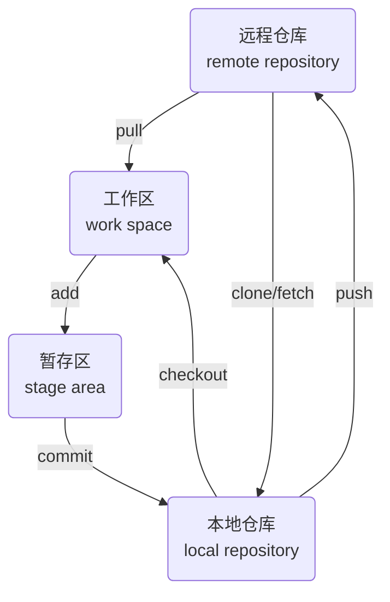

### 工作区

`work space`(工作区)是本地文件系统中存储库目录, 用于存放源代码

开发者在工作区内进行代码编辑、修改和删除等操作, 所有的文件更改都会反映在工作区

#### 状态

- `modified`(已修改), 文件已修改, 还未添加到暂存区

- `staged`(已暂存), 文件已修改, 并且已添加到暂存区, 准备提交到版本库

- `committed`(已提交), 文件已提交到版本库

### 暂存区

`stage area`(暂存区)是.git目录下index 文件, 本质是数据库

暂存区充当缓冲, 将工作区的修改先保存到暂存区, 再提交到本地仓库

### 本地仓库

本地仓库位于开发者的计算机中, 包含所有的项目提交历史修改后文件提交到本地仓库, 成为版本历史的一部分

### 远程仓库

远程仓库存储在远程服务器上(如 GitHub、GitLab 等), 用于备份、共享和协作工作

远程仓库允许开发者推送本地更改或拉取他人更改

#### 远程仓库操作

- `clone`: 克隆远程仓库到本地

- `push`: 将本地更改推送到远程仓库

- `pull`: 将远程更改拉取到本地

## 版本管理

### 初始化

将当前目录初始化为本地仓库, 执行命令后自动创建`.git`目录, 用于管理版本库

.git/是隐藏目录, 位于git版本控制的仓库的根目录下, 包含了git仓库所有元数据和信息, 用于跟踪和管理版本控制

```sh
git init
```

初始化后当前目录及其子目录和文件都处于**工作区**

- 示例, 将git_test/初始化为本地仓库

```sh
git init
```

终端显示

```sh
Initialized empty Git repository in /home/dmjcb/Documents/code/git_test/.git/
```

#### 状态

查看工作区文件状态

```sh
git status
```

##### 未添加文件

未添加文件时状态

```sh
On branch master

No commits yet

nothing to commit (create/copy files and use "git add" to tarck)
```

#### 修改

新增文件, 状态为`untracked files`, 终端里显示为红色, 表示还未添加到暂存区

#### 撤销

##### 撤销工作区内文件修改

将文件恢复到上一次提交状态

```sh
git restore 文件名
```

##### 撤销工作区内所删除文件

从上一次提交中恢复被删除文件到工作区

```sh
git checkout -- 文件名
```

### 添加

将文件从工作区添加至暂存区, 指令中参数为`.`时表示全部文件

```sh
git add 文件名
```

#### 撤回

将已添加至暂存区文件撤回至工作区

```sh
git rm --cached 文件名
```

### 提交

将暂存区文件提交至本地仓库

```sh
git commit (-m "commit信息")
```

- 示例, 提交main.cpp

(1) 若未设置邮箱用户名, 需先设置

```sh
git config --global user.email "邮箱"
git config --global user.name "用户名"
```

(2) 设置完成后正常提交

#### 查看记录

查看每次提交记录, 包含`commit ID`、作者、提交时间信息

```sh
git log
```

- 示例, 查看git_test仓库提交记录


#### 修改commit内容

假设需在commit后修改内容提交内容

##### 修改最近一次commit

```sh
git commit --amend
```

### 回退

设原始test.txt

```c++
origin origin origin origin origin
```

设修改后test.txt

```c++
modify modify modify modify modify
```

#### 未暂存回退

用于已修改未添加至暂存区(未执行`git add`)回退, 指令中文件名为`.`时表示全部文件

文件会恢复至修改前状态

```sh
git checkout -- 文件名
```

#### 已暂存回退

用于已修改并添加到暂存区(已执行`git add`)回退

注意!, `git reset`只撤回添加操作, 不会撤回文件修改

```sh
# 回退指定文件
git reset HEAD 文件名

# 回退所有修改
git reset
```

执行后文件被撤回到工作区, 但修改后内容不变

#### 已commit退回

用于已修改并已commit回退, 分三种情况

git中`HEAD` 表示当前提交, 上版本表示为`HEAD^`, 前100个版本表示为`HEAD~100`

##### reset --hard

删除工作空间改动, 撤销`git commit`, 撤销`git add .`

```sh
# 回退到上次commit
git reset --hard HEAD^

# 回退到任意版本
git reset --hard 某次commit_id
```

##### reset --soft

不删除工作空间改动, 撤销`git commit`, 不撤销`git add .`

```sh
git reset --soft HEAD^
```

回退后, 被修改文件会在**暂存区**, 且文件自上次修改后内容不会删除

##### reset --mixed

不删除工作空间改动, 撤销`git commit`, 并撤销`git add .`

```sh
git reset --mixed HEAD^
```

回退后, 修改后文件会在**工作区**, 且文件自上次修改后内容不会删除

## 分支

git分支允许在代码库中创建多个开发线

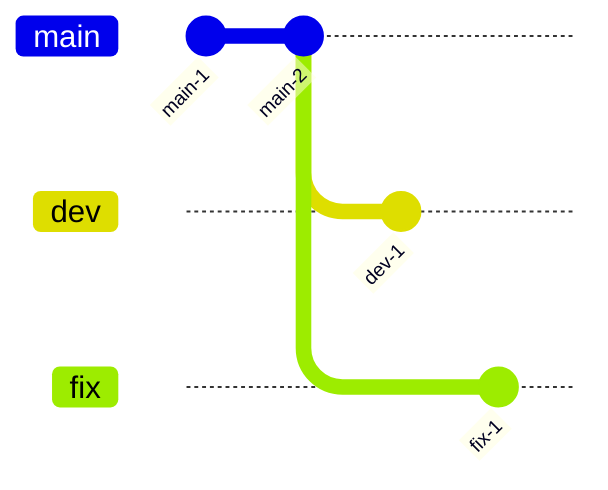

每个分支本质上都是代码库一个快照, 可在不影响其他分支情况下独立进行开发和修改

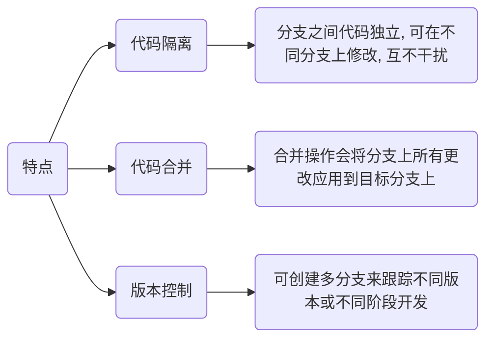

### 查看

#### 查看当前分支

初始化仓库时默认创建master(main)分支

```sh
git branch (-a, 表示所有分支)
```

- 示例, 查看仓库所有分支

```sh
git branch
```

#### 查看远程分支

```sh
git branch -r
```

### 创建

#### 仅创建分支

```sh
git branch 分支名
```

#### 创建分支并切换

```sh
git switch -c 分支名
```

- 示例, 创建dev分支并切换

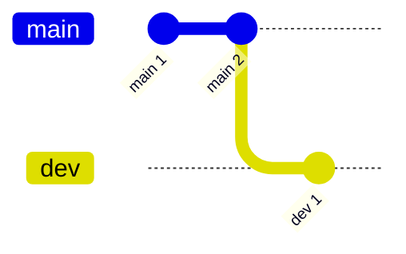

```sh
git switch -c dev
```

### 修改

#### 切换分支

```sh
git switch 分支名
```

- 示例, 切换回master分支

```sh
git switch master
```

#### 重命名

重命名当前分支

```sh
git branch -M 新分支名
```

### 删除

```sh
git branch -d 分支名
```

- 示例, 删除dev分支

```sh
git branch -d dev
```

示例输出

```sh
Deleted branch dev (was .....)
```

## 合并

合并代码时分两种情况,

(1) 完全合并, 需要另一个分支所有变动, 使用 `git merge`

(2) 选择合并, 只需要部分变动(某几次提交), 使用 `git cherry-pick`

### 完全合并

```sh
git merge 待合并分支名
```

#### 正常合并

```sh
git switch B分支

git merge A分支
```

- 示例, 将dev分支合并到master分支

master分支上提交

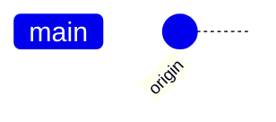

新建dev分支并切换, 进行两次提交

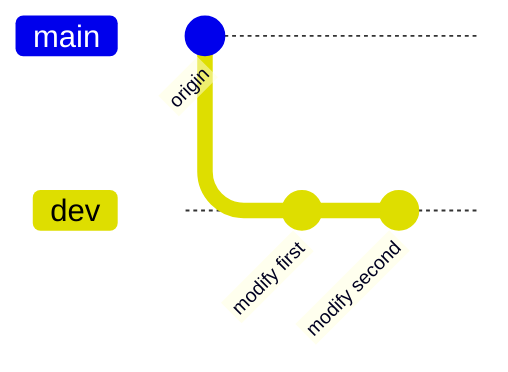

切换回master分支, 合并dev分支所有提交

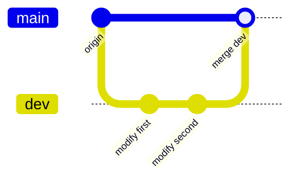

#### 冲突情况

两个分支合并时可能会出现冲突错误

- 示例, 两分支修改同文件同位置, 导致合并冲突

master分支上创建 test.txt, 并提交

```c
// test.txt
master master master master master
```

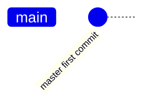

创建dev分支, 修改 test.txt, 并提交

```c
// test.txt
dev dev dev dev dev
```

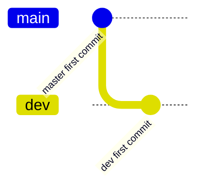

切回master分支, 再修改test.txt 提交

```c
// test.txt
[master] upate upate upate upate upate
```

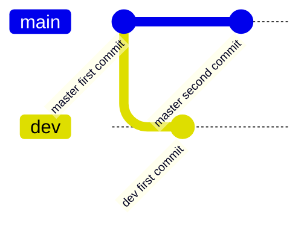

将dev分支合并到master分支

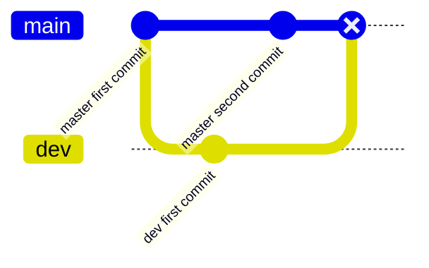

提示冲突, 因两个分支都修改文件同一位置所导致, test.txt 内容如下

```sh
<<<<<<< HEAD
[master] upate upate upate upate upate
=======
dev dev dev dev dev
>>>>>>> dev
```

`<<<<<<<` 表示当前修改

`>>>>>>>` 表示传入修改

假如保留双方更改, 需手动修改冲突文件, 提交

```c
// test.txt
[master] upate upate upate upate upate
dev dev dev dev dev
```

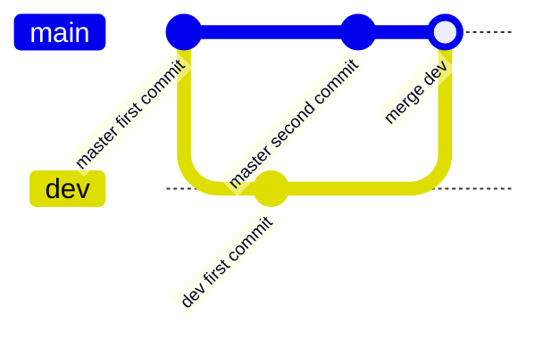

### 选择合并

`git cherry-pick` 可选择其他分支单次/多次提交, 并作为新提交引入到当前分支

```sh
git cherry-pick 某次commit_id
```

- 示例, 将pick分支上某次提交合并到main分支

master分支上创建test.txt, 并提交

```c++
master master master master master
```

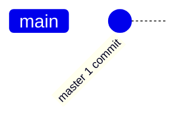

切换到pick分支, 对test.txt进行三次修改并提交

第一次修改

```diff
master master master master master
+ [pick] fix 1
```

第二次修改

```diff
master create origin
[pick] fix 1
+ [pick] fix 2
```

第三次修改

```diff
master create origin
[pick] fix 1
[pick] fix 2
+ [pick] fix 3
```

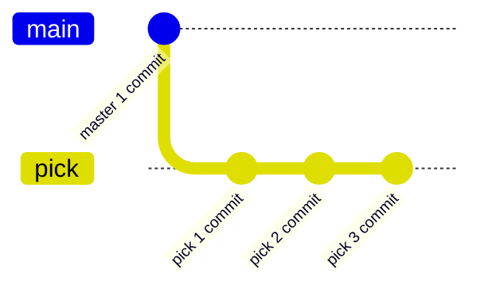

(3) 选择合并

将pick分支 commit "pick 2 commit"提交合并到master分支

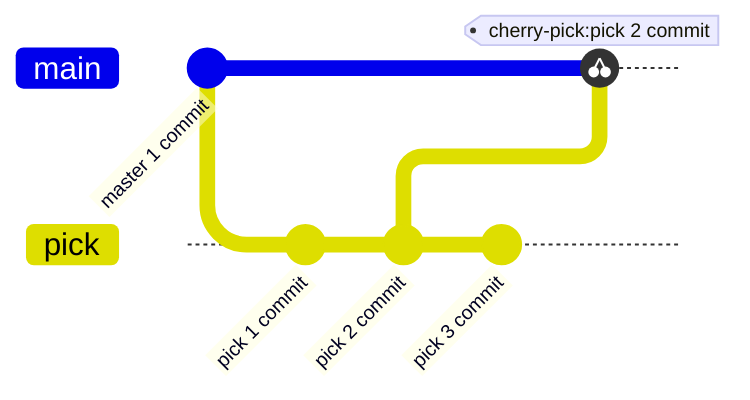

如果有冲突, 需手动解决

后续可用`git cherry-pick --continue` 继续合并其他提交, 或用`git cherry-pick --abort` 放弃合并

#### 应用多提交

按顺序逐一应用提交到当前分支上

```sh
git cherry-pick commit1 commit2...
```

#### 应用范围提交

可指定提交范围应用

```sh
git cherry-pick 开始commit^结束commit
```

## 标签

`tag`(标签)标记特定`commit`, 用于记录项目开发过程中重要里程碑或发布版本

### 创建

#### 指定commit

```sh
git tag 标签名 (某次commit_id, 为空表示最新commit)
```

- 示例, 使用最新commit作标签

```sh
git tag v1.0
```

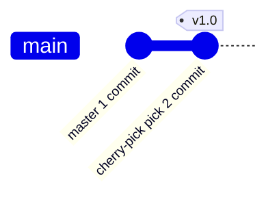

- 示例, 使用commit 52e3a21e149837607fffe8126...作标签v0.9

```sh
git tag v0.9 52e3a21e149837607fffe8126
```

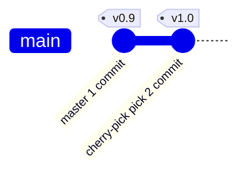

#### 添加描述信息

```sh
git tag -a 标签名 -m 描述信息 某次commit_id
```

### 删除

#### 删除本地tag

```sh
git tag -d 标签名
```

#### 删除远程tag

```sh
git push origin :refs/tags/标签名
```

### 查看

```sh
git tag
```

- 示例, 创建标签后查看, 终端显示

```sh
v0.9
v1.0
```

## 远程仓库

远程仓库通常位于远程服务器, 如GitHub、GitLab、Bitbucket或Gitee等代码托管平台

### 克隆

通过克隆可将远程仓库内容复制到本地, 创建一个与之相同本地仓库

#### 完全克隆

克隆远程仓库所有提交记录

```sh
git clone 仓库地址 (存放路径)
```

#### 拉取最近记录

```sh
git clone --depth 提交次数 参数地址
```

### 查看

#### 远程仓库地址

```sh
git remote -v
```

### 删除

#### 按名称删除

```sh
git remote rm 远程主机名
```

- 示例, 删除远程仓库origin

```sh
git remote rm origin
```

#### 按URL删除

```sh
git remote set-url --delete origin 远程仓库地址
```

### 添加

```sh
git remote add 远程主机名 远程仓库地址
```

### 拉取

从远程仓库获取更新, 使本地仓库保持同步

```sh
git pull 远程主机名 远程分支名:本地分支名
```

若远程分支是与当前分支合并, 可简写为`git pull`

#### 手动合并

`git pull` 过程可分解为,

(1) 通过`git fetch` 从远程主机将远程最新内容拉到本地, 用户可决定是否合并到本地分支中

```sh
git fetch 远程主机名 远程分支名
```

取回更新后, 会返回`FETCH_HEAD`, 指某个分支在服务器上最新状态

通过`git log -p FETCH_HEAD` 查看更新文件名、作者和时间、代码, 可以通过这些信息来判断是否产生冲突

(2) 通过`git merge` 将拉取下来最新内容合并到当前所在分支中, 若提示冲突, 需手动解冲突后提交

```sh
git merge FETCH_HEAD
```

### 推送

`git push` 将本地分支更改上传到远程仓库

```sh
git push 远程主机名 本地分支名:远程分支名
```

设存在远程仓库`http://192.168.1.128:3000/test_user/demo.git`

#### 推送已创建仓库

```sh
git remote add origin 仓库地址

git push origin 分支
```

#### 推送本地分支

```sh
git push 远程主机名 本地分支名:远程分支名
```

若本地分支与远程分支一致, 则可简写为`git push`

##### 设置跟踪关系(可选)

为在以后推送中不再每次指定远程分支名, 可使用-u(或--set-upstream)标志来设置跟踪关系

```sh
git push -u 远程仓库名 本地分支名
```

设置跟踪关系后, 后续只需调用`git push`即可将更改推送到所关联远程分支

##### 同时推送到多仓库

添加多个远程仓库地址, 就可同步`push`到多个库

```sh
git remote set-url --add origin 远程仓库地址
```

#### 推送本地标签

```sh
git push origin 分支名 --tags
```

## 子模块

git子模块(`git submodules`)允许将一个git仓库作为另一个git仓库子目录

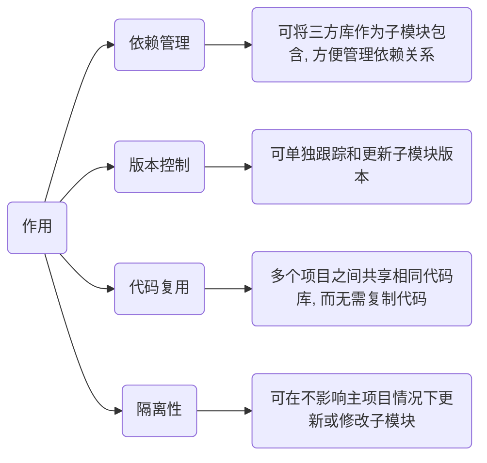

### 初始化

#### 自动拉取

使用`--recursive`在克隆项目同时拉取子模块

```sh
git clone --recursive 项目地址
```

#### 手动拉取

若克隆项目时未拉取子模块, 可在主项目根目录手动拉取

```sh
git submodule init

git submodule update --recursive
```

### 查看

```sh
git submodule
```

### 添加

```sh
git submodule add 子模块仓库地址 (子模块路径)
```

### 修改

#### 更新

更新子模块以获取最新改动

```sh
git submodule update --remote
```

#### 提交

子模块修改后, 与普通项目提交方式一致

### 删除

#### 移除子模块

```sh
git submodule deinit -f 子模块本地路径
```

#### 删除子模块目录

```sh
git rm 子模块本地路径
```

## 配置

### 下载

[Git客户端官网下载](https://git-scm.com/downloads)

### 查看

#### 系统配置

```sh
git config --system --list
```

#### 用户配置

```sh
git config --global --list
```

### 修改

#### 用户信息

##### 配置用户名(必须)

```sh
git config --global user.name "用户名"
```

##### 配置邮箱(必须)

```sh
git config --global user.email "邮箱"
```

#### 设置

##### 配置编辑器

```sh
git config --global core.editor "code -w"
```

##### 防止中文乱码

```sh
git config --global core.quotepath false
```

##### 启用文件大小写敏感

```sh
git config --global core.ignorecase false
```

##### 设置代理

```sh
git config --global http.proxy 代理地址
```

##### 取消代理

```sh
git config --global --unset http.proxy
```

## 使用

### 本地使用

- 示例, 本地新建项目git_demo, 进入git_demo/后执行

```sh
git init
```

git_demo/目录中会出现.git/隐藏目录

新建hello.md文件

```md
# Hello World
```

提交

```sh
git add .
```

```sh
git commmit -m "初次提交"
```

### github使用

#### 设置

注册github账号

##### 配置公钥

github设置公钥后, 上传下载即可免输入密码

复制本地用户.ssh目录公钥id_rsa.pub值, 添加到github settings中SSH and GPG keys中

#### 上传

本地项目上传到github仓库上

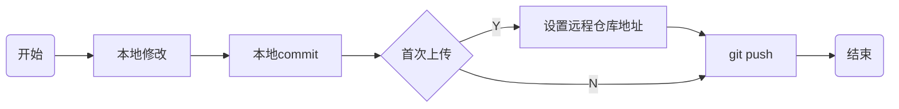

##### 首次上传

设是首次上传本地项目

```sh
# 修改分支名为min
git branch -M main

# 添加远程仓库
git remote add origin git@github.com:[替换实际仓库]/git_demo.git

# 首次上传
git push -u origin main
```

后续提交可直接使用`git push`推送

#### 下载

将github上项目下载(更新)到本地

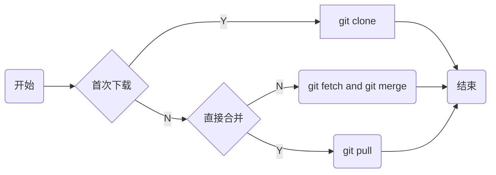

##### 克隆

首次将项目下载到本地

```sh
git clone 仓库地址
```

#### PR

`PR`(Pull Request)功能允许个人向其他项目贡献代码, 通常用于团队协作和开源项目贡献中

当开发者修改了他人代码后, 可以通过Pull Request将修改告知给代码原作者, 请求他合并这些修改

```mermaid
graph LR;
    A[fork仓库]
    B[创建分支]
    C[修改推送]
    D[创建RP]
    A-->B-->C-->D
```

fork仓库

建立本地分支dmjcb_fix, 修改部分内容, 推送本地分支dmjcb_fix到远程分支

提交PR

## git工具

### repo

```sh
mkdir -p ~/repo
cd ~/repo
git clone https://mirrors.tuna.tsinghua.edu.cn/git/git-repo

cd ~/repo/git-repo
sudo chmod +x ./repo

sudo cp ./repo /usr/bin/
```

#### 设置环境变量

变量`~/.bashrc`, 追加

```sh
export REPO_URL='https://mirrors.tuna.tsinghua.edu.cn/git/git-repo/'
```

```sh
source ~/.bashrc
```
